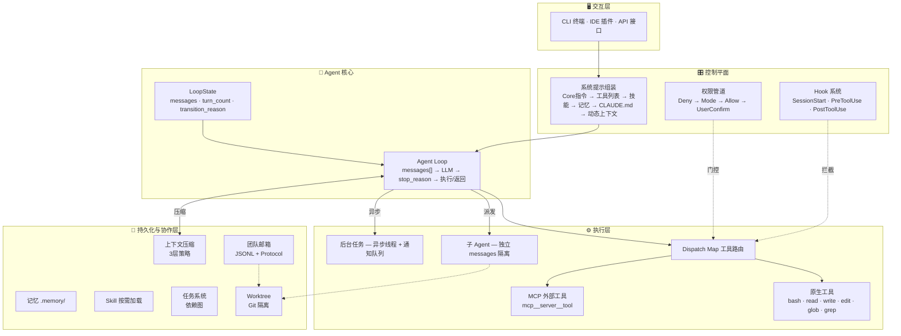
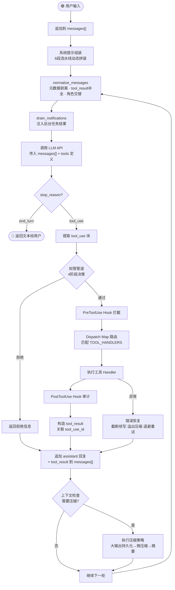
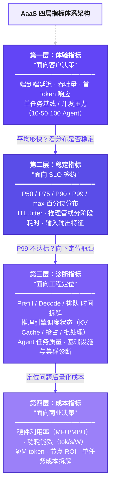

---
tags:
  - PRD
  - AaaS
  - 验证平台
status: draft
owner: 蔡杭洲
created: 2026-04-13
updated: 2026-04-14
---

> [!说明]
> 本文档界定和覆盖范围：
>1、细化拆解 Aaas 验证平台的工作事项和计划
>2、产品侧作为验证平台的上游输出，定义好给测试团队的标准数据和交付物
>3、梳理并定义清楚上下游工作边界和关键指标输出
>4、定义好 Aaas 输入输出格式标准：观测存储标准、数据集标准、评测集标准
>5、技术方案和观测工具的技术方案设计


### 更新日志

| 版本     | 内容                                                                                                | 更新日期       | 更新人  |
| ------ | ------------------------------------------------------------------------------------------------- | ---------- | ---- |
| V1.0.0 | Aaas 平台首个完整版本：<br>- 定义 Aaas 平台基础架构和功能<br>- 支持基础的 Span、Trace 的链路分析<br>- 集成对接 Opik、普罗米修斯、LiteLLM 工具 | 2026/04/13 | @蔡杭洲 |
|        |                                                                                                   |            |      |


### 2026 年 AaaS-OKR（重点）

> [!note]
> **验证平台建设:** 完成构建AaaS场景驱动的集群推理验证测试平台，完成对主流Agent场景覆盖(如AICoding/个人AgenticWorker/企业AgenticWorker等)，以及在场景覆盖基础上的细分场景覆盖、条件覆盖等；完成AaaS驱动的验证平台端到端自动化能力建设(从验证发起到报告生成)。用所构建的验证平台完成:小规模的种子集群验证&千卡先进算力集群验证(全流程全部跑通，输出所有场景&Case的验证报告)


### AaaS平台总体目标

**<font color="#c0504d">围绕核心目标：支撑 2027 年底 KA 客户 5 万卡销售量</font>**

■ Agent 核心验证场景：AI Coding、百万长上下文（多Agent）、视频理解、视频生成

■ Agent 场景化负载的还原，围绕几个深度场景，定好验证目标、高效完成验证支撑。

■ Agent 验证平台的定义和输出，包含**可观测指标平台**，沉淀在 Aaas 层，输出对外场景统计指标：效果指标，成本指标，性能指标，在自研算力的资源分配的最佳实践。

■ 持续调研、挖掘行业内领先的主要 Agent 范式场景，并还原部署（模拟千卡、万卡集群、高并发，高流量的场景），输出验证指标


### AaaS 验证平台价值与定位

**AaaS 验证平台的核心定位：芯片商用前质量出口。** 即以「NGU800 芯片是否满足商用」为验证出发点，围绕芯片商用的重点目标场景（如 AI Coding、长上下文、视频理解、视频生成等），系统性还原 Agent 在不同算力与集群环境下的真实任务负载，形成**可量化、可复现、可对比**的验证体系。

**三大核心价值方向：**

- **第一方面** ——为芯片的**【商用决策】**提供质量验证依据
- **第二方面** ——为自研芯片在 Agent 场景下的性能**【优化】**、成本优化和瓶颈定位提供依据
- **第三方面** ——为 **KA** 客户提供**【前置验证能力】**，支撑方案设计和 PoC 落地

> 核心输出：构建真实场景、沉淀验证标准、打通全链路观测，持续输出面向芯片、平台和客户的高价值验证报告。

---

**AaaS 验证平台定位：** 面向芯片商用目标，Agent 粒度场景的**系统化验证与评估平台**，验证自研芯片在主流 Agent 场景下的可商用性（包括但不限于效率、成本、稳定性等）。深度理解并还原 Agent 在真实场景下、不同集群算力上的任务负载特征，形成可量化、可复现、可对比的验证体系，并形成面向内部优化和外部客户验证的标准化能力。

**内部验证核心价值：**

1. **为芯片可商用化提供质量出口依据** — 量化芯片在目标商用场景（以 Agent 为粒度）下效率、成本、稳定性等各维度数据
2. **为芯片与平台优化提供真实依据** — 帮助判断：自研芯片在 Agent 场景下是否真正高效；与其他先进算力相比差距在哪里；哪些场景最值得优先突破
3. **真实 Agent 场景建模者** — 负责把行业中的 Agent 场景从概念层面转化为可部署、可运行、可测量的真实负载模型，帮助公司理解下一代 AI 工作负载
4. **芯片与平台能力的放大器** — 通过验证平台，把「芯片能力、推理框架能力、集群调度能力、网络存储能力」拉通到同一套场景中验证，帮助团队及时发现短板、定位瓶颈、指导优化优先级
5. **支撑大客户场景适配** — 支持未来 KA 客户场景适配、PoC 设计和方案销售

**AaaS 目标：验证自研芯片在 Agent 场景下的效率、稳定性**

平台围绕重点 Agent 场景进行部署、还原、监测和压测，输出一整套关键验证数据，服务于：

- **内部目标**：通过测试数据，指导自研芯片在 Agent 场景下的优化方向与能力建设
- **外部目标**：支撑 KA 客户在 Agent 场景中的前置验证和方案沟通

### AaaS 验证平台执行计划

   1. **【先验证流程】** 先完成 AaaS 在先进算力（A800）的验证，包括：**通用 Agent** 部署、监测工具选型与部署、模型部署、场景数据集收集与构造，以及定义观测链路日志的标准数据格式和存储方案。

2. **【验证场景扩展】** 进一步部署 **Coding Agent** 场景，完善标准的 BenchMark 和 Case 数据集，对接 MaaS 平台监测数据 API，细化存储 Agent 运行全流程链路的轨迹数据，并逐步开展其他 3 个场景的验证。

  3. **【基于内部算力验证】** 待自研算力 Ready 后，在自研算力上进行 AaaS 验证（X6000(s) → NGU800P）。

4. **【集群能力验证】** 持续调研、挖掘行业领先的主要 Agent 范式场景，还原部署（模拟千卡、万卡集群、高并发、高流量场景），输出验证指标报告。


### 迭代节奏与推进计划

#### 迭代管理机制

| 维度            | 规则                      | 说明                                        |
| ------------- | ----------------------- | ----------------------------------------- |
| **Sprint 周期** | 双周迭代（2 周 / Sprint）      | 每个 Sprint 包含需求确认、开发、联调、验收四个环节             |
| **里程碑周期**     | 月度里程碑评审                 | 每月底进行里程碑 Demo + 回顾，评审产出物与目标偏差             |
| **版本发布节奏**    | 每月一个功能版本（Minor Release） | 按 v0.1 → v0.2 → … → v1.0 递进，v1.0 为首个可交付版本 |
| **需求冻结**      | Sprint 启动后需求锁定          | 新增需求进入下一 Sprint Backlog，紧急 Hotfix 除外      |
| **交付标准**      | 功能可演示 + 核心链路跑通          | 每个 Sprint 结束时产出可验收的功能增量                   |

#### 推进计划总览

> [!note] 规划假设
> 1. 研发团队 2～4 人（前端 1 + 后端 1 + 测试 1 + 基础设施 1）
> 2. 自研算力（X6000s / NGU800P）预计 Q1 2027 就绪
> 3. 优先级按 P0 → P1 → P2 递进，P0 为最小可用集合

```
2026 Q2          Q3              Q4              2027 H1
┌─────────┐  ┌──────────┐  ┌──────────┐  ┌──────────────┐
│ Phase 1  │  │ Phase 2  │  │ Phase 3  │  │   Phase 4    │
│ 基础能力  │→│ 评测闭环  │→│ 自研算力  │→│  商用验证     │
│ A800验证  │  │ 场景扩展  │  │ 芯片对比  │  │  KA客户支撑   │
└─────────┘  └──────────┘  └──────────┘  └──────────────┘
  v0.1~v0.3    v0.4~v0.6    v0.7~v0.9       v1.0+
```

---

#### Phase 1：基础能力建设 + A800 先进算力验证（Q2 2026 · 4—6 月）

**阶段目标：** 搭建平台骨架，跑通「模型接入 → Agent 部署 → 单场景评测 → 链路观测 → 报告输出」的端到端最小闭环，在 A800 上完成 OpenClaw 通用 Agent 首轮验证。

| Sprint | 时间 | 交付内容 | 对应模块 | 优先级 |
|--------|------|---------|---------|--------|
| S1 | 4/14 – 4/27 | ① 模型注册与 API 接入（M-01）<br>② 模型列表与连通性测试（M-02、M-03）<br>③ LiteLLM 路由配置同步（M-09）<br>④ 链路观测数据格式标准（Span/Trace Schema）定义 | 5.1 模型管理<br>5.8 格式标准 | P0 |
| S2 | 4/28 – 5/11 | ① Agent 应用注册与列表管理<br>② 评测集创建、列配置与 Case 导入<br>③ 评测集版本管理（草稿/发布/Diff） | 5.3 Agent 管理<br>5.4.1 评测集管理 | P0 |
| S3 | 5/12 – 5/25 | ① 评估器创建（规则型 + LLM-Judge）<br>② 评估器快速测试与版本管理<br>③ 提示词模板创建与版本管理（P-01、P-02、P-03） | 5.4.2 评估器管理<br>5.2 提示词管理 | P0 |
| S4 | 5/26 – 6/8 | ① 实验创建四步向导（数据集→Agent参数→评估器→命名）<br>② 实验运行引擎（Case 分发 + 进度追踪）<br>③ 评估结果汇总看板 | 5.4.3 实验管理 | P0 |
| S5 | 6/9 – 6/22 | ① Trace 列表与全链路瀑布图<br>② Span 详情侧边栏（LLM / 工具调用）<br>③ 运行时状态总览（实时指标卡） | 5.5 运行时监控<br>5.6 Trace 分析 | P0 |
| S6 | 6/23 – 6/30 | ① 单实验验证报告自动生成（PDF/Markdown）<br>② 端到端联调 + OpenClaw 首轮 A800 验证跑通<br>③ **里程碑评审：v0.3 Demo** | 5.7 报告管理 | P0 |

**Phase 1 交付里程碑：**
- ✅ AaaS 平台 v0.3 发布，P0 功能全量可用
- ✅ OpenClaw 通用 Agent 在 A800 完成首轮端到端验证
- ✅ 输出首份单实验验证报告
- ✅ Span/Trace 链路观测标准落地

---

#### Phase 2：评测能力完善 + 验证场景扩展（Q3 2026 · 7—9 月）

**阶段目标：** 补齐评测能力闭环（实验比对、BadCase 归因、Prompt 调试），扩展 Coding Agent 场景覆盖，接入外部 BenchMark 数据集，建立可复现的评测体系。

| Sprint | 时间          | 交付内容                                                                                                   | 对应模块                       | 优先级 |
| ------ | ----------- | ------------------------------------------------------------------------------------------------------ | -------------------------- | --- |
| S7     | 7/1 – 7/13  | ① Coding Agent（Claude Code）接入与场景部署<br>② AI Coding BenchMark 数据集导入（SWE-bench）<br>③ 评测集 Case Schema 标准落地 | 5.3 Agent 管理<br>5.8 格式标准   | P0  |
| S8     | 7/14 – 7/27 | ① 实验比对（2～4 组横向对比 + 差异高亮）<br>② 实验克隆与运行历史管理<br>③ Prompt Playground 调试面板（P-04）                            | 5.4.3 实验管理<br>5.2 提示词管理    | P1  |
| S9     | 7/28 – 8/10 | ① 模型参数预设模板（M-04）<br>② 模型调用统计看板（M-05）<br>③ 模型健康巡检与告警（M-07）                                              | 5.1 模型管理                   | P1  |
| S10    | 8/11 – 8/24 | ① 会话分析（会话列表 + 多轮对话详情）<br>② LLM 调用性能指标看板（TTFT / TPOT / Token）<br>③ 工具调用观测（工具列表 + Trace 关联）              | 5.6 会话分析<br>模块九/十一         | P1  |
| S11    | 8/25 – 9/7  | ① 测试数据指标模块（效果 + 性能 + 成本看板）<br>② Trace 对比视图（双栏对齐 + 差异高亮）<br>③ 性能分析聚合（P50/P90/P99 分布）                    | 5.7.2 数据指标<br>5.6 Trace 分析 | P1  |
| S12    | 9/8 – 9/21  | ① 比对报告自动生成<br>② BadCase 归因统计与错误传播分析<br>③ 内置 Prompt 模板库（P-07）与评估器预置                                     | 5.7.3 报告管理<br>5.6 错误分析     | P1  |
| —      | 9/22 – 9/30 | **里程碑评审：v0.6 Demo + Coding Agent 验证报告输出**                                                              | —                          | —   |

**Phase 2 交付里程碑：**
- ✅ AaaS 平台 v0.6 发布，P1 功能完成 80%+
- ✅ Coding Agent（Claude Code）场景验证跑通
- ✅ 完成 A800 上 2 个核心场景的完整验证报告（OpenClaw + Claude Code）
- ✅ 评测比对能力就绪，支持跨实验横向分析
- ✅ 对接 MaaS 平台 API，链路数据全量采集

---

#### Phase 3：自研算力验证 + 芯片对比体系（Q4 2026 · 10—12 月）

**阶段目标：** 在自研算力（X6000s → NGU800P）上复跑全部已验证场景，建立 A800 vs NGU800P 的全维度芯片对比体系，输出芯片商用可行性报告，同步扩展视频理解/视频生成场景覆盖。

| Sprint | 时间 | 交付内容 | 对应模块 | 优先级 |
|--------|------|---------|---------|--------|
| S13 | 10/6 – 10/19 | ① 自研算力环境适配（X6000s / NGU800P 接入）<br>② 硬件资源监控看板（加速卡利用率、显存、温度、功耗）<br>③ 模型分组管理（按芯片环境分组，M-06） | 5.5 运行时监控<br>5.1 模型管理 | P0 |
| S14 | 10/20 – 11/2 | ① 算力比对看板（芯片性能雷达图 + 指标对比表）<br>② SLO 达标率面板<br>③ 延迟对比瀑布图（逐段对比芯片差异） | 5.7.2 算力比对看板 | P0 |
| S15 | 11/3 – 11/16 | ① 视频理解 Agent 场景接入与 BenchMark 导入<br>② 视频生成 Agent 场景接入<br>③ 多模态评测数据管理（图片/音频/视频 Case） | 5.3 / 5.4.1 | P0 |
| S16 | 11/17 – 11/30 | ① 芯片商用可行性报告自动生成<br>② 吞吐量-功耗散点图 + 成本效率对比<br>③ 跨集群规模扩展性曲线 | 5.7.3 / 5.7.2 | P0 |
| S17 | 12/1 – 12/14 | ① Agent 数据看板（执行分析 + 工具调用分析 + 记忆分析）<br>② 模型监控看板（调用趋势 + Runtime TOP5 + 分位数）<br>③ 批量测试与提示词引用关系追踪（P-06、P-08） | 模块十二/十<br>5.2 提示词管理 | P1/P2 |
| S18 | 12/15 – 12/28 | ① 周期汇总报告 + 报告模板自定义<br>② 日志分析（运行日志 + 构建日志）<br>③ Span 导出（CSV/JSON）<br>④ **里程碑评审：v0.9 Demo + 芯片商用可行性报告** | 5.7.3 / 5.6 | P1/P2 |

**Phase 3 交付里程碑：**
- ✅ AaaS 平台 v0.9 发布，全量功能基本就绪
- ✅ 4 大核心场景在 A800 + NGU800P 上完成交叉验证
- ✅ 输出首份芯片商用可行性报告（A800 vs NGU800P）
- ✅ 硬件观测与算力比对体系完整建立
- ✅ 全部 P0 + P1 需求交付完毕

---

#### Phase 4：商用验证 + KA 客户支撑（2027 H1 · 1—6 月）

**阶段目标：** 完成千卡/万卡集群规模化验证，平台达到生产可交付状态（v1.0），支撑 KA 客户 PoC 场景适配和方案设计，持续迭代优化验证效率和报告质量。

| Sprint | 时间 | 交付内容 | 对应模块 | 优先级 |
|--------|------|---------|---------|--------|
| S19–S20 | 1 月 | ① 千卡集群验证环境搭建<br>② 高并发、高流量压测场景还原<br>③ 并发任务端到端性能测试体系落地 | 第四章 4.2 | P0 |
| S21–S22 | 2 月 | ① 万卡集群验证方案设计与执行<br>② 集群扩展性验证（节点数 vs 吞吐/延迟/成本曲线）<br>③ 稳定性长跑测试（7×24h 连续运行） | Phase 4 集群验证 | P0 |
| S23–S24 | 3 月 | ① KA 客户演示报告模板定制<br>② 报告审批流与对外输出流程<br>③ **v1.0 正式发布** — 全平台功能冻结与验收 | 5.7.3 | P0 |
| S25–S30 | 4—6 月 | ① KA 客户 PoC 场景适配（按客户需求定制验证方案）<br>② 新 Agent 范式场景持续调研与接入<br>③ 验证效率优化（评测自动化、报告生成提速）<br>④ P2 需求消化与体验优化 | 全模块 | P1/P2 |

**Phase 4 交付里程碑：**
- ✅ AaaS 平台 v1.0 正式发布
- ✅ 千卡 + 万卡集群全场景验证报告输出
- ✅ 首批 KA 客户 PoC 验证完成，输出客户定制验证报告
- ✅ 端到端自动化验证能力建成（从验证发起到报告生成）

---

#### 模块优先级与迭代映射总览

| 模块 | P0（Phase 1 交付） | P1（Phase 2 交付） | P2（Phase 3–4 交付） |
|------|-------------------|-------------------|---------------------|
| **5.1 模型管理** | M-01 注册接入<br>M-02 列表搜索<br>M-03 连通性测试<br>M-09 LiteLLM 同步 | M-04 参数预设<br>M-05 调用统计<br>M-07 健康巡检<br>M-10 停用管理 | M-06 分组管理<br>M-08 变更记录 |
| **5.2 提示词管理** | P-01 创建与编辑器<br>P-02 版本管理<br>P-03 变量占位符 | P-04 Playground<br>P-05 多轮对比<br>P-07 内置模板库<br>P-10 内容搜索 | P-06 批量测试<br>P-08 引用追踪<br>P-09 分段编辑 |
| **5.3 Agent 管理** | Agent 注册/列表/详情 | 多场景 Agent 接入 | 版本记录与回溯 |
| **5.4 评测管理** | 评测集 CRUD + 版本<br>评估器创建（规则/LLM）<br>实验创建与运行 | 实验比对与克隆<br>评估器预置库<br>运行历史管理 | 人工评估器<br>评分校准 |
| **5.5 运行时监控** | 运行时状态总览<br>实验运行进度 | Runtime 实例列表<br>硬件资源监控 | 单 Runtime 详情 |
| **5.6 可观测大盘** | Trace 列表 + 瀑布图<br>Span 详情侧边栏 | 会话分析<br>Trace 对比<br>性能分析 | 错误传播分析<br>日志分析<br>Span 导出 |
| **5.7 报告与数据** | 单实验报告（PDF/MD） | 比对报告<br>测试数据指标看板 | 芯片商用报告<br>周期汇总<br>报告模板自定义 |
| **5.8 格式标准** | Span/Trace Schema<br>Case Schema | — | — |

#### 关键风险与应对

| 风险 | 影响 | 应对措施 |
|------|------|---------|
| 自研算力就绪延迟 | Phase 3 整体后移 | Phase 2 加深 A800 场景覆盖深度，提前完成 P1 需求消化 |
| Agent 场景还原复杂度超预期 | 单场景验证周期拉长 | 优先聚焦 OpenClaw + Claude Code 两个核心场景，视频场景降级为 Phase 3 |
| MaaS API 对接阻塞 | 链路数据不完整 | 设计 Mock 数据层，先用模拟数据跑通平台流程，后续替换真实 API |
| 研发人力不足 | Sprint 交付延迟 | P2 需求整体后移至 Phase 4，Phase 1–2 只交付 P0 + 核心 P1 |


### AaaS 端到端业务流程图

> [!tip] 交互式流程图
> 完整的 AaaS 端到端验证测试业务流程图（六层架构 × 六阶段数据流），覆盖平台全部 14 个功能模块与 4 个外部可观测工具（Opik / LiteLLM / Prometheus / Langfuse）的集成数据流向。
> 📎 打开查看：[[AaaS-E2E-Flow.html]]

###  Agent 评估业务流程步骤


### 重点覆盖行业场景Agent

> [!说明]
> ■ 百万长上下文（Multi-Agent）- OpenClaw
> 
> ■ Al Coding（Coding-Agent）- Claude Code
> 
> ■ 视频理解（视频多模态理解）
> 
> ■ 视频生成（组合/参考生成、局部修改、轨道补全）

### 名词术语注释

| 术语/缩略词         | 说明                                                                                                                                                                                        |
| -------------- | ----------------------------------------------------------------------------------------------------------------------------------------------------------------------------------------- |
| BenchMark      | 基准测试，指一套标准化的测试数据集与评估方法，用于系统化衡量和比较 AI 模型或系统在特定任务上的性能表现。通常由**数据集**、**工作负载**和**度量指标**三部分组成。                                                                                                  |
| M, T, L 一体化    | 对指标（Metrics）、链路（Tracing）、日志（Log）进行关联分析                                                                                                                                                    |
| Metrics        | 记录调用耗时的 Metrics 指标，用于统计调用的耗时、QPS 等信息                                                                                                                                                      |
| Span           | Span 是分布式跟踪中的基本工作单元，代表系统中执行的一个操作，例如：一次数据库查询、一个函数执行、一次远程服务调用等。每个 Span 拥有唯一标识，附带操作名称、开始时间、结束时间、标签、日志等关键属性。                                                                                  |
| Trace          | Trace 是由多个 Span 组成的有向无环图，代表一个请求在分布式系统中的完整调用链。每个 Trace 拥有全局唯一的标识符，所有属于同一请求的 Span 都将被关联到此 Trace。Trace 和 Span 之间存在父子关系，这种关系有助于理解请求在系统中的执行链路，方便链路追踪。                                          |
| **Metadata**   | Metadata 是运行过程中的键值对集合，用于存储运行实例的补充信息，例如应用程序版本、运行环境、调用模型或其他需关联的自定义信息。                                                                                                                       |
| 轨迹（Trajectory） | 指 AI Agent 在任务执行过程中生成的结构化时序数据，数据格式为 JSON。轨迹完整记录了从接收用户指令开始，Agent 在多轮交互中进行的思考、行动和观察的全链路历史。Aaas定义轨迹的标准数据结构，旨在将不同开发框架（如 LangChain、Eino）产生的异构 Trace 数据，归一化为标准的 **根节点 - Agent 步骤 - 原子步骤** 层级架构。 |


# 一：AaaS验证平台

### AaaS 验证平台定位

1、统一纳管不同行业场景的 Agent 应用，并管理 Agent 环境。

2、管理并存储不同 Agent-Case 每次完成评测数据集任务相关的节点时序日志和结构化数据

3、管理评测集（评测 Agent任务）、验证集数据（基础对话数据集）、评测比对历史版本管理

4、Agent 可观测指标的报告输出

5、标准化对接 Mass 的 API 接口管理，用于对接内部和外部 Maas 平台进行验证测试

6、里面会集成多种可观测、压测框架等工具（Opik、Langfuse、LIteLLM、Prometheus）

### AaaS 验证平台架构


### AaaS验证平台功能清单

> 按功能模块分类，逐项说明平台核心能力。各模块对应第五章详细需求。
>
> **Figma 侧边栏导航顺序映射：** 概览仪表盘（模块十五）→ 模型管理（模块一）→ 提示词管理（模块二）→ Agent 管理（模块三）→ 评测集管理（模块四）→ 评估器管理（模块五）→ 实验管理（模块六）→ 运行时总览（模块七）→ Trace 分析（模块九）→ 会话分析（模块十）→ 测试与验证报告（模块十一~十三）→ 系统设置（模块十六~二十）→ 集群管理（模块二十二）→ SLO 配置（模块二十三）

#### 模块一：模型管理（对应 5.1）

| 功能点 | 详细说明 | 展示形式 |
|---|---|---|
| 模型列表 | 展示所有已注册模型；字段：模型名称、模型提供方（内部 MaaS / 外部 MaaS / 自部署）、模型类型（对话 / 补全 / Embedding / 多模态）、部署状态（可用 / 不可用 / 维护中）、关联 Agent 数、最近调用时间、接入方式；支持按提供方、类型、状态多维筛选，支持模型名称模糊搜索；状态异常模型红色高亮；每行支持快捷操作：测试连通性、查看调用统计、编辑、停用 | 列表 |
| 注册新模型 | 配置 MaaS 平台选择（内部 MaaS / 火山引擎 / 阿里云百炼 / OpenAI Compatible / 自定义）、API Endpoint URL（必填）、API Key / Access Token（加密存储）、接入协议（OpenAI Compatible / 自定义 Header）、LiteLLM 路由标识；模型能力声明：最大上下文长度、是否支持 Function Call / Streaming / Vision、量化模式（FP32 / FP16 / INT8 / INT4）；部署环境标签（芯片型号 A800 / NGU800P / X6000s、集群标识、节点数）；连通性测试通过后方可保存 | 配置面板 |
| 模型详情 | 展示模型完整配置信息与当前运行状态；调用统计 Tab（近 24h / 7d / 30d 调用次数、平均延迟、错误率、Token 消耗趋势）；关联资源 Tab（绑定该模型的 Agent 列表、引用该模型作为 Judge 的评估器列表）；变更记录 Tab（配置修改历史，支持对比不同版本配置差异） | 详情页 |
| 参数预设模板 | 为模型配置可复用参数预设：Temperature、Top-P、Top-K、Max Tokens、Stop Sequences、Frequency Penalty、Presence Penalty；系统内置默认模板：「精确模式」（T=0）、「创意模式」（T=0.9）、「平衡模式」（T=0.5）；创建实验时可直接选择预设或在预设基础上微调；列表字段：模板名称、关联模型、Temperature、Max Tokens、创建人、关联实验数 | 列表 + 表单 |
| 模型分组 | 按芯片环境 / 模型系列分组管理；分组用途：批量筛选、实验中快速选择一组模型横向比对；一个模型可属于多个分组 | 分组管理 |
| 模型健康巡检 | 定时（每 5min）对所有已注册模型发送心跳探测请求；巡检看板：模型名称、最近探测时间、响应延迟、状态（正常 / 超时 / 不可达）；连续 3 次失败自动将模型状态置为「不可用」并触发告警通知；不可用模型在实验创建时自动灰显不可选 | 巡检看板 |

---

#### 模块二：提示词管理（对应 5.2）

| 功能点 | 详细说明 | 展示形式 |
|---|---|---|
| 提示词列表 | 展示所有提示词模板；字段：模板名称、用途类型（Agent System Prompt / 评估器 Judge Prompt / 工具指令 Prompt / 通用模板）、关联模型、当前版本号、状态（草稿 / 已发布）、创建人、更新时间；支持按用途类型、状态、关联模型筛选，支持名称和内容关键词搜索；每行支持：查看详情、快速复制、发起测试、归档 | 列表 |
| 创建提示词模板 | Prompt 编辑器：System Prompt 编辑区（Markdown 语法高亮 + 实时预览）+ 可选 User Prompt 编辑区；支持变量占位符 `{{input}}`、`{{output}}`、`{{expected}}`、`{{context}}`、自定义变量；变量面板列出所有使用变量及其类型说明；分段编辑模式：将长 Prompt 拆分为「角色设定」「任务指令」「输出格式」「约束条件」等段，各段可独立编辑和排序；Token 预估自动计算；关联推荐模型（非强制绑定） | Prompt 编辑器 |
| 版本管理 | 草稿状态可自由编辑，点击「发布版本」后生成版本号（v1.0、v1.1…）并锁定为只读；修改需基于当前版本「创建新版本」进入草稿态；版本列表字段：版本号、发布时间、变更摘要、Token 数变化、关联实验数；Diff 对比：选中两个版本并排展示差异（新增绿 / 删除红 / 修改黄高亮）；实验绑定需指定版本号确保可复现；历史版本只读不可删除 | 版本列表 + Diff |
| Prompt Playground | 在线调试面板：变量填充（手动输入或从评测集选取样本自动填充）、模型选择（已注册模型）、参数配置（支持直接选择参数预设模板）；执行后展示：模型完整响应（Markdown 渲染）、Token 明细（Input / Output / Total）、延迟（TTFT + 总延迟）、完整请求/响应 JSON（可折叠）；支持多轮对比测试：同一 Prompt 使用不同参数或模型执行多次，结果并排展示 | 调试面板 |
| 批量测试 | 选择评测集版本作为测试数据源，系统逐条填入 Prompt 变量批量调用模型；返回批量结果概览：成功率、平均延迟、Token 消耗统计；适用于验证 Prompt 修改后在大量 Case 上的整体表现稳定性 | 批量结果概览 |
| 提示词引用关系 | 展示当前提示词被哪些资源引用：Agent 应用（作为 System Prompt）、评估器（作为 Judge Prompt）、实验配置；修改已发布版本时提示影响范围（如该 Prompt v1.2 被 3 个 Agent 和 5 个评估器引用）；停用前强制确认解除引用关系 | 关联展示 |
| 内置 Prompt 模板库 | 系统预置常用 Prompt 模板：「通用质量评估」— 评估准确性、完整性、逻辑性；「代码质量评估」— 评估正确性、风格规范、边界处理；「工具调用评估」— 评估工具选择准确性和参数正确性；「安全合规评估」— 检测敏感信息泄露和有害内容；不可修改，可一键「复制为自定义模板」后编辑 | 只读卡片 |

---

#### 模块三：Agent 应用管理（对应 5.3）

| 功能点 | 详细说明 | 展示形式 |
|---|---|---|
| Agent 应用列表 | 展示所有接入平台的 Agent 应用；字段：Agent 名称、场景类型（AI Coding / 长上下文 / 视频理解 / 视频生成）、接入方式、运行状态（运行中 / 已停止 / 异常）、创建时间、Agent 描述；支持按场景类型、运行状态多维筛选，支持模糊搜索；每行支持快捷操作：监控详情、发起评估、删除 | 列表 |
| 新建 Agent 应用 | 基础信息：Agent 名称（必填）、场景类型（单选）、描述、负责人；接入配置：接入方式（SDK 接入 / API Endpoint 接入）、AgentKit Runtime 标识；模型绑定：绑定 MaaS 平台已部署模型（可多选），指定默认推理模型；工具配置：声明 Agent 可调用工具列表（工具名称、类型、Endpoint）；环境标签：标记运行芯片型号（A800 / X6000s / NGU800P）和集群环境 | 配置面板 |
| Agent 应用详情 | 展示 Agent 全部配置信息及当前运行状态；运行历史 Tab：按时间倒序列出所有评估任务记录，支持跳转详情；可观测 Tab：跳转至该 Agent 实时运行监控大盘；版本记录 Tab：展示 Agent 配置变更历史，支持回溯对比不同版本的配置差异 | 详情页 |

---

#### 模块四：评测管理 — 评测集管理（对应 5.4.1）

| 功能点 | 详细说明 | 展示形式 |
|---|---|---|
| 评测集列表 | 展示所有评测集；字段：数据集名称、关联 Agent、场景类型、Case 数量、版本号、状态（草稿 / 已发布 / 已归档）、更新时间；支持按 Agent、场景类型、状态筛选；支持搜索数据集名称<br><br>- **评测集**：用于评测评估对象的一组数据，包含输入数据和预期输出结果，帮助开发者验证评估对象的效果。<br>- **输入数据**：提供给评测对象的标准化测试输入。<br>- **预期输出（可选）**：理想输出结果，作为评估基准。 | 列表 |
| 创建评测集 | 基础信息：评测集名称（必填）、描述、关联 Agent（必选）、场景标签；列配置（Schema 定义）：输入列配置（列名、数据类型、查看格式、描述说明，支持文本/文件/多模态）、预期输出列（可选，用于自动评分基准）、自定义扩展列（任务难度等级、场景子类型、标注人等元信息）；数据类型支持 String / JSON / Markdown / Code；评分维度配置：选择适用的评分维度（任务完成率、工具调用准确率、输出质量等） | 表单 + 列配置器 |
| 添加 / 导入 Case 数据 | **本地导入：** 支持 CSV / JSON / XLSX 格式（系统提供标准模板下载），导入时自动校验字段匹配，展示字段映射确认步骤；**手动添加：** 单条录入 Case，按列配置逐字段填写，支持 Markdown 富文本输入；**从历史 Trace 生成（推荐）：** 从已运行的 Trace 链路一键提取 Input/Output，生成 Case 草稿，人工补充预期输出后加入数据集；**Case 预览：** 添加后列表内展开查看每条 Case 完整内容 | 文件上传 + 映射向导 |
| 多模态数据管理 | 支持图片（≤20MB，支持一次多张）、视频（≤100MB，支持一次多个）、音频（≤100MB，支持一次多个）、文件（PDF / Excel）的上传和管理；存储路径为本地路径 URL；多模态数据可与文本数据组合使用 | 多模态上传 |
| 编辑与删除数据 | 仅在**草稿**状态下可修改列配置和测试数据；已发布版本不可修改，需新建版本；支持逐条编辑数据项和删除数据项 | 表单编辑 |
| 版本管理 | 草稿状态可自由编辑，发布后锁定为只读（v1.0、v1.1…）；需修改时基于当前版本「创建新版本」进入草稿态；版本列表：版本号、发布时间、Case 数量变化（+N/-N）、发布备注；版本关联实验任务后不可覆盖；支持版本间 Diff 查看：高亮新增 / 修改 / 删除的 Case 条目；支持一键切换查看历史版本（只读） | 版本列表 + Diff |

---

#### 模块五：评测管理 — 评估器管理（对应 5.4.2）

> 评估器（Evaluator）是评测过程中的裁判，通过预定义规则对评估对象的输出进行多维度分析，生成可量化的指标得分和原因分析。LLM 评估器得分范围 0.0～1.0，开发者也可自定义评估标准和分值范围。

| 功能点 | 详细说明 | 展示形式 |
|---|---|---|
| 评估器列表 | 展示所有评估器；字段：评估器名称、类型（规则 / LLM / 人工）、创建人、关联实验数、状态（启用 / 停用）、更新时间；支持按类型、状态筛选，按名称搜索；每行支持快捷操作：详情、复制 | 列表 |
| 创建评估器 — 规则类型 | 评分规则：精确匹配 / 包含关键词 / 正则匹配 / JSON Schema 校验；配置目标字段（对应评测集输出列）；设置评分权重（0～1）；支持多条规则组合（AND / OR 逻辑） | 规则配置表单 |
| 创建评估器 — LLM-Judge | 选择 Judge 模型（接入 MaaS 上任意已部署模型）；编写评分 Prompt 模板（System + User），支持变量占位符 `{{input}}`、`{{output}}`、`{{expected}}`；配置评分量表（1-5 分 Likert / Pass/Fail）；支持 Chain-of-Thought 开关（Judge 输出思考过程供人工审查）；可选添加 User Prompt 强调特定评估规则（优先级高于 System Prompt）；支持多模态变量 | Prompt 编辑器 |
| 创建评估器 — 代码类型 | 上传 Python 评分函数，定义输入参数（`input`、`output`、`expected`）和返回格式；支持在线调试 | 代码编辑器 |
| 创建评估器 — 人工审核 | 配置评分维度与说明（供评审人参考）；设置评分量表（1-5 / Pass/Fail / 多维打分）；配置评审人列表，支持多人评审取均值 | 表单配置 |
| 评估器测试 | 在创建/编辑时提供「快速测试」入口；手动输入 Input / Output / Expected，实时预览评分结果；代码评估器额外显示执行日志与运行时间；LLM-Judge 评估器显示 Judge 完整推理过程（含 CoT）；测试通过后方可保存并发布 | 实时预览面板 |
| 评估器版本管理 | 每次保存评估器配置自动生成版本记录（v1、v2…）；版本列表：版本号、修改摘要、创建时间、关联实验数；实验绑定评估器时需指定版本号确保可复现；历史版本只读不可删除（保障实验可溯源） | 版本列表 |
| 预置评估器 | 内置通用评估器：BLEU / ROUGE、JSON 格式校验、工具调用正确率、代码可执行性检测等；不可修改，可直接引用 | 只读卡片 |

---

#### 模块六：评测管理 — 实验管理（对应 5.4.3）

> **实验（Experiment）**是将「评测集版本 + 评估器组 + Agent + 运行参数」绑定为一个可重复执行的配置模板。每次执行产生一条运行记录（Run），多条 Run 可横向对比，追踪 Agent 能力随版本/芯片迭代的变化趋势。

| 功能点 | 详细说明 | 展示形式 |
|---|---|---|
| 实验列表 | 展示所有实验；字段：实验名称、关联 Agent、绑定评测集、评估器组、运行次数、最近运行时间、最近运行状态（待运行 / 运行中 / 已完成 / 失败）；支持按 Agent、状态、场景类型筛选；每行支持：查看详情、快速运行、复制实验配置、归档 | 列表 |
| 创建实验 | 四步配置向导：**Step 1 基础信息** — 实验名称（必填，建议格式 `{Agent}-{场景}-{版本}`）、描述、场景标签、负责人；**Step 2 数据绑定** — 选择关联 Agent 应用、选择评测集及具体版本号（仅已发布版本）、预览所选版本 Case 数量与字段结构；**Step 3 评估器配置** — 添加评估器组（支持多评估器并行，各自设置权重）、综合评分计算方式（加权平均 / 最低分门控）、预览评分维度汇总结构；**Step 4 运行参数** — 模型参数（Temperature / Top-P / Max Tokens / Function Call 开关）、并发数、单 Case 超时时间、失败重试次数、硬件环境标签（芯片型号 + 集群节点）、LLM-Judge 模型来源；支持保存草稿 | 分步表单 |
| 运行实验（Run） | 点击「运行」后创建 Run 记录，状态流转：排队中 → 运行中 → 评分中 → 已完成 / 已失败；实时展示进度（已完成 Case / 总数）、当前成功率、ETA；支持中途暂停（保留已完成 Case 结果）和强制中止；运行完成后自动进入评分流程；每条 Run 关联完整 Trace 数据（通过注入 `experiment_id` + `run_id` 至 Span 元数据） | 进度卡片 |
| 单实验结果分析 | **汇总指标看板：** 效果指标（任务完成率、各评分维度均值）+ 性能指标（平均 TTFT、端到端延迟、Token 消耗、总成本）+ 评分分布（饼图/柱状图展示各分数段占比）；**Case 明细列表：** 每条展示 Case ID、输入摘要、实际输出、预期输出、综合评分、各评估器分项得分、耗时、Token 数、状态（通过 / 失败 / 待人工审核）；支持按评分区间、状态、耗时筛选和排序 | 看板 + 列表 |
| Case 完整详情页 | 展示完整输入/输出（Markdown 渲染）；评分明细：各评估器分项得分 + 评分理由（LLM-Judge 提供 CoT 推理过程）；Trace 链路跳转：一键跳转关联 Trace 详情（通过 `case_id` + `run_id` 定位）；模型参数回显（模型名称、Temperature、提示词版本等）；BadCase 标注：可标记为 BadCase 并填写归因标签和备注 | 详情页 |
| 多实验比对分析 | **指标统计对比：** 以实验为列、指标为行横向对比（完成率、各评分均值、TTFT、延迟、Token 消耗、成本等），差异超阈值自动标红（退步）/ 标绿（进步），可设基准实验以差值/百分比展示；**逐 Case 比对视图：** 相同 Case ID 各实验下输出并排展示，文本 Diff 高亮，支持按「评分差异最大」排序；**性能散点图：** X 轴 TTFT/延迟、Y 轴质量评分，颜色区分实验，SLO 参考线四象限标注，支持框选异常区域下钻 | 比对视图 |
| 跨芯片比对模式 | 选择「芯片对比模式」，系统自动识别实验芯片标签并分组展示；核心比对维度：TTFT 差异、吞吐量差异、成本比（¥/M-token）、任务完成率差异、精度损失（量化前后 Token 一致率）；芯片商用可行性评估：对照 4.1 章节 SLO 阈值逐项自动判定 ✅ 达标 / ⚠️ 接近阈值 / ❌ 未达标；每个维度可展开查看 Case 级散点分布；一键生成芯片对比结论摘要卡片 | 芯片对比视图 |
| BadCase 标注与管理 | 在比对视图或 Case 详情中标记 BadCase；归因标签：模型问题 / 工具调用异常 / 芯片推理偏差 / 数据问题 / 提示词缺陷 / 其他；BadCase 池汇总所有标记，支持按归因分类筛选和导出；BadCase 可一键回流至评测集作为后续回归测试用例 | BadCase 池 |
| 运行历史 | 同一实验多次 Run 记录（Run ID、运行时间、成功率、耗时）；支持查看每次运行的详细评估报告 | 时间线列表 |
| 克隆实验 | 基于已有实验快速创建新实验（保留配置，允许修改部分参数）；适用于 A/B 测试场景 | 一键克隆 |
| 比对报告导出 | 一键生成结构化比对报告，支持 PDF / Markdown / CSV 格式；报告内容：实验配置对比表、指标对比表、BadCase 清单（含归因统计）、散点图截图、芯片可行性结论；导出时可选择报告章节 | 导出按钮 |

---

#### 模块七：可观测大盘 — 运行时监控（对应 5.5.1）

| 功能点 | 详细说明 | 展示形式 |
|---|---|---|
| 总览大盘 | 时间筛选器：最近 1h / 6h / 24h / 7d / 自定义；全局指标卡片：Runtime 数、活跃会话数、总调用数、总 Token 消耗、错误数、错误率；趋势图组：调用数 / 错误率 / Token 消耗趋势（均支持按 Agent 下钻）；告警区域：实时展示当前触发的告警规则，支持跳转至对应 Trace | 看板 |
| Runtime 列表 | 展示所有 Runtime 实例；字段：Runtime 名称、关联 Agent、当前状态、会话数、调用数、错误率、平均延迟；点击进入单 Runtime 详情（CPU / 内存 / 线程 / 上下文切换趋势图）；支持按 Agent / 状态 / 芯片环境筛选 | 列表 + 详情 |

---

#### 模块八：可观测大盘 — Trace 分析（对应 5.5.2）

| 功能点 | 详细说明 | 展示形式 |
|---|---|---|
| Trace 列表 | 字段：Trace ID、关联 Agent / 实验 / Run ID、触发时间、端到端延迟、Span 总数、LLM 调用次数、Token 消耗（输入/输出）、状态（成功 / 失败 / 超时）；**多维筛选：** Agent、时间范围、状态、延迟区间（< 1s / 1–5s / > 5s）、关联 Case ID、Run ID、模型名称；**快速定位：** 通过 Case ID 直接定位关联 Trace（评估任务运行时自动注入 `case_id`、`run_id` 至 Span 元数据）；排序：按端到端延迟、Token 消耗、Span 数量排序；内联预览 Top-3 最耗时 Span | 列表 + 趋势图 |
| Trace 详情 — 瀑布图 / 火焰图 | **瀑布图视图（默认）：** 甘特图展示完整 Span 树，着色：LLM 调用（蓝）/ 工具调用（橙）/ 记忆库（绿）/ 知识库（青）/ 框架逻辑（灰）；性能瓶颈 Span（耗时 > 总时长 30%）标记 🔥；error / timeout 红色高亮；**火焰图视图（切换）：** 按调用层级聚合，横轴为时间，纵轴为调用栈深度，适合分析深层嵌套 Agent 结构；**接口精简视图：** 仅展示 Server 或 Consumer 角色 Span，适用于复杂调用快速提取关键信息 | 瀑布图 / 火焰图 |
| Span 详情侧边栏 | 点击任意 Span 触发侧边栏：**LLM 类型** — 完整 Prompt（System / User / Assistant 分段 + Markdown 渲染）、Response（含 Function Call）、模型参数（模型名 / Temperature / Top-P / Max Tokens）、Token 明细（Input / Output / Cache Hit）、性能（TTFT / TPOT / 总延迟）；**工具调用类型** — 工具名称、入参（JSON 格式化）、返回结果（JSON / 纯文本切换）、延迟、完整错误堆栈；**Agent 框架类型** — 节点类型（Planner / Executor / Reflector）、输入/输出状态、子 Span 汇总统计 | 侧边栏面板 |
| Trace 对比 | 选中 2 条 Trace 进入双栏对比视图；时间轴对齐（以各自起始时间为基准）；差异高亮（耗时差 > 20% 橙色边框，仅出现一侧的 Span 虚线边框）；顶部指标对比面板：总延迟 / TTFT / Token / 工具调用次数 / LLM 调用次数；**典型场景：** 对比同一 Case 在 A800 vs NGU800P 上的 Trace，定位芯片差异引起的延迟分化 | 双栏对比视图 |
| 性能分析 | 对筛选范围内 Trace 进行 Span 级聚合；每类 Span（按 `span_name` 聚合）展示 P50 / P90 / P99 耗时分布图；慢 Span 排行 Top-10（调用频次、平均/最大耗时）；调用频次热图（时间 × Span 类型）；筛选条件：至少指定 Agent + 时间范围 | 分析看板 |
| 错误传播分析 | 对含错误 Span 的 Trace 进行根因分析；**错误溯源图：** 有向图展示错误 Span 上游调用链，判断错误由哪层触发；错误分类统计（超时 / 模型报错 / 工具异常 / 网络问题），频率与影响 Trace 数；错误时间线：识别集中爆发时段；一键创建 BadCase 并添加归因标签 | 有向图 + 时间线 |
| 实验级 Trace 聚合视图 | 「实验视图」Tab 按实验维度聚合展示 Trace：**一级视图** — 各实验 Trace 汇总（实验名、Run 次数、Trace 总数、平均延迟、错误率、Token 总量）→ **二级视图** — 按 Run ID 分组（Run ID、运行时间、Case 总数、Trace 数、平均延迟）→ **三级视图** — 按 Case ID 列出每条 Case 关联 Trace 及关键指标；任意层级可点击进入 Trace 详情 | 层级列表 |
| Case ↔ Trace 双向导航 | **Case → Trace：** 从实验结果 Case 明细列表点击「查看 Trace」，通过 `case_id` + `run_id` 自动匹配跳转；多条 Trace 时按时间顺序列出；**Trace → Case：** Trace 详情页顶部关联信息卡片（关联实验名、Case ID、评测集版本、运行环境标签），支持反向跳转；面包屑导航：`实验名 > Run ID > Case ID > Trace ID` 逐级回溯 | 双向跳转 |
| 评测集数据回流 | 选中一条或多条 Trace 点击「回流至评测集」，系统自动提取 Input（首轮 User Prompt）和 Output（最终 Agent 响应），生成 Case 草稿（填充 `input`、`actual_output`、`source: from_trace`）；用户补充 `expected_output` 和 `scenario_tag` 后加入指定评测集草稿版本；**典型场景：** 从日常 Trace 中发现有价值异常 Case，直接沉淀为回归测试用例 | 回流操作 |
| 实验 Trace 批量分析 | 选中实验某次 Run 进入批量分析：**延迟分布热力图** — X 轴 Case 序号、Y 轴 Span 类型、颜色深浅表示耗时；**Span 类型耗时箱线图** — P50/P90/P99 耗时分布；**异常 Trace 聚类** — 自动识别偏离均值的 Trace 按模式分组；**LLM 调用模式分析** — 调用次数分布、平均 Token 消耗、Cache Hit 率 | 批量分析看板 |
| 跨芯片 Trace 批量对比 | 选中同一评测集在不同芯片两次 Run：按 Case ID 对齐 Trace 逐 Case 展示延迟差异；**差异分布图** — X 轴 Case 序号、Y 轴延迟差异（%）；瓶颈定位：自动标注延迟差异 Top-10 Case 及差异最大 Span 类型；**典型场景：** 批量对比 A800 vs NGU800P 系统性定位芯片差异 | 批量对比视图 |
| Span 导出 | 将筛选后 Span / Trace 数据导出为 CSV / JSON；包含 Trace ID、Span 耗时、Token 消耗、LLM 参数等关键指标字段 | 导出按钮 |
| 日志分析 | **Runtime 运行日志：** 分词检索 + 按 Runtime 名称 / 日志级别 / Trace ID 筛选，用于故障排查和行为追踪；**Runtime 构建日志：** 持续交付流水线构建过程日志，用于构建故障排查 | 日志查看器 |

---

#### 模块九：可观测大盘 — 会话分析（对应 5.5.3）

| 功能点 | 详细说明 | 展示形式 |
|---|---|---|
| 会话列表 | 按会话 ID 聚合多轮交互；字段：会话 ID、关联 Agent / Runtime、开始时间、总耗时、Total Tokens、Input Tokens、Output Tokens、交互轮次（调用链数）、工具调用次数、用户 ID、状态；**多维筛选：** Runtime 名称、Agent、会话 ID、用户 ID、耗时区间、状态；**排序：** 按总耗时 / Token 消耗 / 交互轮次排序，快速找到异常长会话 | 列表 |
| 会话详情 | 展示完整多轮对话历史，每轮显示 Input / Output（Markdown 渲染）、工具调用记录、Trace 跳转链接；**会话级汇总：** 总 Token（Input / Output）、总耗时、平均轮次延迟、工具调用成功率；支持输入/输出格式切换（原始 JSON / Markdown / 纯文本） | 详情页 |
| 调用链详情（Trace 跳转） | 每轮次右侧「查看 Trace」按钮，直达该轮 LLM 调用完整链路；可查看 LLM 数据（Input / Output、Request 系统 / 模型 / 类型）、Response（模型、缓存命中 Token、Input / Output / 总 Token 消耗）、LLM 指标看板 | Trace 视图跳转 |

---

#### 模块十：测试与验证报告 — 测试看板（对应 5.6.1）

| 功能点 | 详细说明 | 展示形式 |
|---|---|---|
| 模型监控 | **LLM 性能看板：** 模型调用总次数、模型调用平均耗时、模型调用错误次数（指标卡）；模型调用次数 / 平均耗时 / 错误次数趋势图；模型调用次数 / 平均耗时 / 错误次数排行 TOP5；模型请求耗时分位数 P99 / P90 / P75 / P50；TTFT 分位数 P99 / P90 / P75 / P50；TPOT 分位数（首 Token 后每个 Token 生成时间） | 指标卡 + 趋势图 + 排行榜 |
| Token 分析 | Token 使用总量（全量 + 分模型统计）；LLM 单次调用消耗 Token 及趋势；Token 使用模型排行 Top5；Token 使用总量趋势 | 堆叠柱状图 + 趋势图 |
| 推理算力监控 | 跳转至运行时监控页签，查看推理引擎运行时监控：CPU 耗时、CPU 使用率、内存使用、GC 对象数量、线程数量、上下文切换数量等 | 多图表看板 |

---

#### 模块十一：测试与验证报告 — 测试数据指标（对应 5.6.2）

| 功能点 | 详细说明 | 展示形式 |
|---|---|---|
| 效果指标看板 | 任务完成率趋势（按实验 Run 维度折线图，多实验叠加对比）；评分维度雷达图（任务完成率、决策准确率、工具调用正确率、输出质量 ROUGE/BERTScore、安全合规率）；评分分布直方图（Case 评分分段柱状图）；BadCase 归因统计饼图（支持下钻查看 Case 列表） | 折线图 + 雷达图 + 柱状图 |
| 性能指标看板 | TTFT 分位数对比（柱状图 + 误差线，超 SLO 标红）；端到端延迟分布箱线图（Min / Q1 / Median / Q3 / Max / 异常值）；吞吐量对比柱状图（token/s，分组并排）；Token 消耗瀑布图（System Prompt + User Input + Agent 推理 + Tool 调用 + Output）；TTFT vs 输出质量散点图（SLO 参考线四象限标注）；延迟趋势折线图（TTFT / TPOT / E2E，按分钟/小时粒度） | 柱状图 + 箱线图 + 散点图 |
| 算力比对看板 | **芯片性能雷达图：** 6 维归一化评分（TTFT、吞吐量、MFU 利用率、成本效率 token/¥、稳定性 P99/P50 比值、任务完成率）；**芯片指标对比表：** 行为芯片型号、列为核心指标，差异 > 10% 自动标色；**延迟对比瀑布图：** Prefill Time + Decode Time + 工具调用等待 + 网络传输分段对比；**吞吐量-功耗散点图：** 每瓦吞吐效率等值线；**成本效率对比：** ¥/req、¥/M-token、¥/h + 成本构成叠加；**SLO 达标率面板：** ✅ 达标 / ⚠️ 接近 / ❌ 未达标矩阵 + 综合结论；**硬件利用率对比：** GPU / 显存 / MFU / MBU / CPU / 内存利用率；**跨集群扩展性曲线：** 随节点数增长的吞吐量/延迟/成本趋势 | 雷达图 + 矩阵表 + 散点图 |
| 成本指标看板 | 单请求成本趋势（¥/req 折线图）；Token 单价对比（Input / Output ¥/M-token 分组柱状图）；成本构成桑基图（算力资源 → 推理阶段 → 场景应用）；ROI 评估看板（节点 ROI、投入产出比、单位产能成本 + 行业基准对比） | 折线图 + 桑基图 + 指标卡 |

---

#### 模块十二：测试与验证报告 — 报告管理（对应 5.6.3）

| 功能点 | 详细说明 | 展示形式 |
|---|---|---|
| 报告列表 | 字段：报告名称、关联实验/Run、生成时间、报告类型（单实验报告 / 比对报告 / 芯片商用报告 / 周期汇总报告）、导出状态（生成中 / 已完成 / 失败）、文件格式；支持按类型、时间、关联 Agent 筛选；每行支持：预览、下载、重新生成、删除 | 列表 |
| 单实验验证报告 | 实验完成后系统自动生成（也可手动触发）；**报告结构：** ① 封面与基础信息（验证时间、Agent、数据集版本、芯片/集群、模型版本、提示词版本）→ ② 效果指标汇总（指标卡 + 雷达图）→ ③ 性能指标汇总（TTFT 分位数柱状图、延迟箱线图、吞吐量柱状图、Token 瀑布图）→ ④ 成本指标汇总（Token 消耗、¥/M-token、¥/req、¥/h + 饼图）→ ⑤ BadCase 清单（归因统计饼图 + Trace 链接）→ ⑥ 关键洞察与建议（自动生成 3～5 条优化建议）；支持 PDF / Markdown / HTML 导出 | 报告页 |
| 芯片商用可行性报告 | 基于跨芯片比对数据自动生成；**报告结构：** 芯片性能雷达图 → SLO 达标矩阵（逐指标判定）→ 延迟对比图组 → 成本效率对比 → 算力利用率对比 → 综合结论（Pass / Conditional Pass / Fail）；可配置审批流 | 报告页 |
| 比对报告 | 基于多实验比对结果自动生成；包含指标对比表、逐 Case 差异摘要、BadCase 对比统计、可视化图表截图（评分雷达对比、延迟箱线对比、性能散点图）；每项指标附变化率标注（较基准 +/-XX%） | 报告页 |
| 周期汇总报告 | 按周 / 月 / 里程碑自动汇总所有验证活动；包含验证场景覆盖率、实验次数统计、核心指标趋势折线图、BadCase 趋势；适用于向管理层汇报验证进度和芯片优化效果 | 报告页 |
| 报告版本对比 | 同一 Agent/场景多份历史报告纵向对比；时间轴视图展示关键指标历史变化趋势；支持标注关键版本节点（首次验证、优化后验证、商用评审等里程碑）；环比变化 > 15% 自动标注 | 时间轴视图 |
| 报告模板与自定义 | 内置 3 套报告模板：标准验证报告 / 芯片商用报告 / KA 客户演示报告；支持自定义报告章节和图表组合；支持添加自定义文字段落；自定义 Logo 和页眉页脚（适用于对外输出） | 模板管理 |

---

#### 模块十三：概览仪表盘（对应 5.7）

| 功能点 | 详细说明 | 展示形式 |
|---|---|---|
| 平台概览 KPI 卡片 | 顶部指标卡片组：运行中实验数、Runtime 总数、Total Tokens 消耗量、异常告警数；支持时间范围切换（近 24h / 7d / 30d），默认展示近 24h 数据 | 指标卡片组 |
| 调用趋势图 | 近 24h LLM 调用次数和工具调用次数趋势折线图；支持按 Agent 维度下钻；横轴按小时粒度、纵轴为调用次数 | 折线图 |
| 告警概览 | 实时告警列表：告警类型（模型连接超时 / KV Cache 命中率骤降 / Runtime 内存告警）、级别（严重 / 警告 / 信息）、触发时间、关联模块；支持一键跳转告警来源 | 告警卡片列表 |
| Token 消耗排行 | Top 5 模型 Token 消耗柱状图；支持切换 Input / Output / Total Token 维度 | 柱状图 |
| 最近实验 | 最近实验列表：实验名称、关联 Agent、运行状态、进度条、最近运行时间；点击跳转实验详情 | 列表 |
| 导出报告快捷入口 | 右上角「导出报告」按钮，快速导出仪表盘数据摘要为 PDF / Markdown | 按钮 |

---

#### 模块十四：系统设置 — 用户管理（对应 5.8）

| 功能点 | 详细说明 | 展示形式 |
|---|---|---|
| 用户列表 | 展示所有平台用户：ID、账号（邮箱）、用户名、角色（7 种预置角色）、部门、创建人、创建时间、最近登录、状态（启用 / 禁用）；支持按角色 / 部门 / 状态筛选和模糊搜索 | 列表 |
| 新增用户 | 表单：邮箱（必填，唯一性校验）、用户名、角色、部门、初始密码（自动生成或手动）；提交后邮件通知 | 表单弹窗 |
| 编辑用户信息 | 修改基本信息、角色重分配、部门变更；角色变更弹出影响范围提示 | 表单弹窗 |
| 批量操作 | 批量重置密码、批量启用 / 禁用；操作前确认对话框 | 批量操作栏 |

---

#### 模块十五：系统设置 — 角色权限管理（对应 5.9）

| 功能点 | 详细说明 | 展示形式 |
|---|---|---|
| 角色列表 | 7 种预置角色：超级管理员、租户管理员、验证工程师、测试工程师、BadCase 评审员、只读用户、外部客户；字段：角色名、描述、当前用户数、创建时间、类型（预置 / 自定义）；预置角色不可删除 | 列表 |
| 角色权限矩阵 | 按模块分配权限：概览仪表盘、资源管理（模型 / 提示词 / Agent）、评测管理（评测集 / 评估器 / 实验）、可观测（Trace / 会话）、报告管理、系统设置（用户 / 角色 / API / 标签 / 审计）；权限矩阵勾选框展示 | 矩阵表格 |
| 自定义角色创建 | 输入角色名、描述，逐项勾选功能权限；可编辑和删除（需先解绑关联用户） | 表单 + 权限勾选 |

---

#### 模块十六：系统设置 — API 管理（对应 5.10）

| 功能点 | 详细说明 | 展示形式 |
|---|---|---|
| MaaS 连接列表 | 所有已配置 MaaS 连接：名称、类型（内部 / 外部 / 自部署）、Endpoint、连接模型数、数据源（Prometheus / vLLM / API / SGLang）、最近同步时间、健康度、状态；异常红色高亮 | 列表 |
| KPI 卡片 | 已连接 MaaS 数、连接模型总数、聚合调用次数、平均 TTFT；各指标较上周期变化趋势 | 指标卡片组 |
| 新建 MaaS 连接 | 配置表单：连接名称、类型、Endpoint URL、认证（API Key / Token）、数据源类型、同步间隔（5min / 15min / 30min / 1h）；提交前自动连通性测试 | 配置表单 |
| 连接健康监控 | 自动健康检查（定时探测）；手动连通性测试；延迟监控；连续 3 次失败自动标异常并告警 | 监控看板 |

---

#### 模块十七：系统设置 — 标签管理（对应 5.11）

| 功能点 | 详细说明 | 展示形式 |
|---|---|---|
| 标签分类管理 | 管理标签分类维度：芯片型号（A800 / NGU800P / X6000s）、集群标识、场景类型、Agent 类型、难度等级等；支持增删改分类 | 分类树 |
| 标签 CRUD | 创建 / 编辑 / 删除标签；删除前提示关联资源数量；批量创建 / 删除；标签合并（同义标签合并，自动迁移关联） | 列表 + 表单 |

---

#### 模块十八：系统设置 — 审计日志（对应 5.12）

| 功能点 | 详细说明 | 展示形式 |
|---|---|---|
| 操作日志列表 | 记录所有用户操作和系统变更：时间、用户、模块、操作类型（创建 / 更新 / 删除 / 导出 / 登录）、操作对象、来源 IP；支持多条件筛选和全文搜索 | 列表 |
| 日志导出 | 筛选后导出为 CSV 格式；支持选择导出时间范围 | 导出按钮 |

---

#### 模块十九：通知中心（对应 5.13）

| 功能点 | 详细说明 | 展示形式 |
|---|---|---|
| 通知列表 | 通知类型：SLO 告警、模型健康告警、实验完成、报告生成、系统通知；字段：时间、类型、标题、内容、状态（未读 / 已读）；未读加粗 + 角标 | 列表 |
| 通知渠道配置 | 推送渠道：站内通知（默认）、邮件、Webhook、飞书、钉钉；每渠道独立配置 + 测试通知 | 配置表单 |
| 告警规则管理 | 监控指标、阈值、条件、级别（严重 / 警告 / 信息）、通知渠道（多选）；规则列表支持启用/禁用 | 规则列表 + 表单 |

---

#### 模块二十：集群/环境管理（对应 5.14）

> **数据来源说明：** 集群信息通过 MaaS 平台 API 对接获取，AaaS 平台仅做只读展示，不直接管理集群资源。

| 功能点 | 详细说明 | 展示形式 |
|---|---|---|
| 集群列表（只读） | 通过 MaaS API 同步获取所有可用集群信息：集群名称、集群 ID、芯片型号（A800 / NGU800P / X6000s）、节点数、GPU 总卡数、可用卡数、集群状态（在线 / 离线 / 维护中）、MaaS 来源、最近同步时间；支持按芯片型号和状态筛选；定时自动同步（同步间隔与 API 管理模块一致） | 列表 |
| 集群详情 | 展示单个集群的详细信息：硬件配置（芯片型号、显存规格、互联拓扑）、已部署模型列表、当前负载概览（GPU 利用率、显存使用率、网络带宽）、关联实验列表（在该集群上运行过的实验记录）；所有数据只读，通过 MaaS API 实时拉取 | 详情页 |
| 集群环境标签 | 为集群分配 AaaS 平台内的标签（芯片型号、集群代号、部署环境等），用于实验创建时选择目标环境和跨集群比对时的分组依据；标签与「标签管理」模块联动 | 标签配置 |
| 跨集群对比视图 | 选择 2～4 个集群，横向对比核心指标：GPU 利用率、显存使用率、平均 TTFT、吞吐量（tokens/s）、成本效率（¥/M-token）；支持按时间范围筛选；差异超过 15% 自动高亮 | 对比表格 + 柱状图 |

---

#### 模块二十一：数据资产管理（对应 5.15）

> 内网环境下 Agent 无法调用外部 MCP、搜索引擎等数据来源。平台提供统一数据资产管理，确保 Case 测试的可复现性。

| 功能点 | 详细说明 | 展示形式 |
|---|---|---|
| 资产总览与文件管理 | 顶部 KPI 卡片（资产总数、存储占用、引用数）；支持 PDF / DOCX / XLSX / Markdown / 代码仓库 / JSON / CSV / 图片 / 音视频等多格式上传；自动计算 SHA256 哈希；目录树组织 + 全文检索 | 列表 + 目录树 |
| Agent 知识库 | 面向 Agent 场景的知识库管理：按「产品文档 / 代码仓库 / FAQ 语料 / 多轮对话样本」分组；支持文档索引（全文索引 + 向量索引），索引状态追踪（已索引 / 索引中 / 待索引）；支持搜索和分组筛选 | 分组列表 |
| 多模态素材库 | 管理图像（PNG/JPG/HEIC/SVG）、音频（MP3/WAV/FLAC）、视频（MP4/MOV/WebM）、PDF 等多模态素材；展示素材格式、引用次数、大小；支持按素材类型筛选和关键词搜索 | 分组列表 |
| 资产版本管理 | 同一资产上传新版本自动递增版本号；历史版本不可删除保证追溯；评测集 Case 引用时锁定到具体版本号 | 版本列表 |
| 资产引用与沙箱挂载 | Case 可从资产库选择文件作为 attachments；引用追踪（反向关联列表）；实验运行时关联资产自动挂载到 Agent 沙箱 | 关联配置 |
| 代码仓库快照 | Coding Agent 场景专用：上传代码仓库快照（git archive / zip），绑定 commit hash、Docker 镜像、F2P/P2P 测试集；跨芯片一致性保证 | 详情页 |

---

#### 模块二十二：负载包管理（对应 5.16）

> 负载包（可还原包）将「环境 + 输入 + 轨迹 + 结果」打包为自包含交付物，支持跨集群、跨团队的验证结果复现。

| 功能点 | 详细说明 | 展示形式 |
|---|---|---|
| 负载包列表 | 顶部 KPI 卡片：负载包总数、总存储、已交付数、复现成功率；列表字段：名称、关联实验、包内容（Docker + Case + Traj + 结果）、大小、SHA256、状态（已交付 / 已验证 / 打包中 / Parity 未通过）、创建时间、到期时间；支持筛选和批量操作 | KPI + 列表 |
| 创建向导 | 四步创建流程：① 选择实验 → ② 打包内容（四层可还原性：L1 环境层 Docker 镜像 bit-exact / L2 输入层评测集+配置 bit-exact / L3 轨迹层 Trajectory+Trace 完整记录 / L4 结果层 Grader+报告 统计可复现）→ ③ 元信息与校验 → ④ 确认打包；附加选项：包含 Mock 数据、生成 MANIFEST.sha256、数据脱敏、压缩存储；右侧实时预估包大小 | 向导 |
| 导入与校验 | SHA256 校验清单逐文件验证（预期 vs 实际）；一键复现配置（复现实验名称、目标芯片、并发数、Seed）；可复现性判定公式：原始 Resolved Rate 95% CI ∩ Pack Resolved Rate 95% CI ≠ ∅ → ✅ 可复现；环境还原流程（解压 Docker → 推到 registry → pip freeze 校验 → 系统包校验 → 复现分析挂载） | 校验表 + 配置 |
| 跨集群交付 | 交付工作流：创建 → 内部验证 → 标记已验证 → 导出交付；KPI：活跃交付数、已验证数、待反馈数、复现成功率；交付追踪：接收方、交付时间、复现结果、反馈状态；自动生成接收方校验清单（README.md）；近期反馈展示（客户复现结果 + 评论） | 交付列表 + 反馈 |

---

# 二：BenchMark 与Case数据集

**核心目标：**围绕千卡、万卡集群的 Infra 规模，应该构建自己的评测集： 考验测试Agent在集群运行上性能、成本、效率的使用情况。核心还是解决智能体评测与KA现实应用间存在巨大鸿沟。

自建Agent 和集群性能评测体系旨在为 内部提供标准化评估工具，帮助其量化评估智能体性能、成本、能力、可以对比不同解决方案并制定实施路径。

  

**核心输出-针对性能效率的BenchMark 体系文档（脚本脚手架、数据集、Moniter、参考结果、判决器、调度器）**

① 评测体系构建，客观、准确、全面的评估模型真实价值并驱动模型/产品优化，产出评估报告。

② 设计一套测试LLM输出质量的标准：定义指标、设计测试用例、建自动化工作流

③ 细化到到对硬件整体算力使用效果的理想态定义和评测体系的构建；持续迭代/完善评估体系，包括但不限于评估方法论、标准、Benchmark与指标口径等，对模型效果与关键业务指标负责。

④ 建立 badcase 机制与问题归因框架，推动问题定位、方案设计、验证上线与线上监控闭环，持续提升算力集群的可用性、稳定性与可控性。

⑤ 定义性能/评测数据标准、流程及效果衡量指标，保障模型迭代的科学性与有效性。

  

### 2.1、评测指标与开源BenchMark 汇总

Benchmark的核心由3部分组成：数据集、工作负载、度量指标。

#### 推理性能基准测试-BenchMark-内部核心构建

  

五大核心性能指标

1. 首Token延迟：反映系统初始响应速度，行业标杆：≤2秒（中等长度文本），影响因素：P节点负载、KV Cache计算
    
2. 吐字率(Token/s)：反映文本生成效率，行业标杆：≥40 Token/s，计算公式：吐字率 = 输出Token数/(结束时间-首Token时间)
    
3. QPM：系统吞吐能力，计算公式：QPM = 成功请求数/(测试时长/60)
    
4. 输入Token数：影响计算复杂度，包括：System指令+用户问题+上下文历史
    
5. 输出Token数：影响生成时间，测试时需保持不同测试轮次输出量级一致
    


| **性能基准测试**      | **简介**                                             | **能力类型** | 核心测试能力                                                            | **镜像**                                                                                                  |
| ------------------- | -------------------------------------------------- | -------- | ----------------------------------------------------------------- | ------------------------------------------------------------------------------------------------------- |
| EvalScope模型推理性能压测框架 | 一套“可比、可复现、可扩展”的压测方案                                | 推理压测     | 支持多并发场景下的吞吐量、延迟、稳定性等核心指标测试。<br><br>可模拟真实业务负载，验证模型服务在不同上下文场景下的性能表现 | https://evalscope.readthedocs.io/zh-cn/latest/user_guides/stress_test/quick_start.html                  |
| MindIE Benchmark    | 昇腾的专门评测框架-能够测量并记录模型在各个阶段的推理耗时（HW 内部生态闭源框架，仅用于参考比对） | 推理压测     | 支持端到端的推理测试                                                        | https://www.hiascend.com/document/detail/zh/mindie/100/mindieservice/servicedev/mindie_service0151.html |

  

#### Agent-BenchMark

|**评测集名称**|**数据集简介**|**能力类型**|核心测试能力|**镜像**|
|---|---|---|---|---|
|GAIA基准|GAIA （General Al Assistants） 是由Meta Al 和 Hugging Face 联合推出的评估基准，专注于评估 AI助手的通用能力|通用能力评估：<br><br>通用 AI 助手能力评估|- 多步推理：将复杂问题分解为多个子问题<br>    <br>- 知识运用：利用内置知识和外部知识库<br>    <br>- 多模态理解：处理文本、图片、文件等多种输入<br>    <br>- 网页浏览：从互联网获取最新信息<br>    <br>- 文件操作：读取和处理各种格式的文件|https://huggingface.co/datasets/gaia-benchmark/GAIA|
|BFCL-v4基准|函数调用能力评估基准|工具调用能力评估，UC Berkeley 推出，包含 1120+测试样本，涵盖 simple、multiple、parallel、irrelevance 四个类别，使用 AST 匹配算法评估，数据集规模适中，社区活跃。|1. 理解任务需求：从用户的自然语言描述中提取关键信息<br>    <br>2. 选择合适工具：从可用工具集中选择最适合的工具<br>    <br>3. 构造函数调用：正确填写函数名和参数<br>    <br>4. 处理复杂场景：支持多函数调用、并行调用等高级场景|https://github.com/ShishirPatil/gorilla.git|
|MultiAgentBench|用于评估多智能体系统在**多种交互场景中的协作与竞争能力**|**评估多Agent系统的团队表现，衡量协作、竞争质量**|**任务成功率**<br><br>**正确的函数调用使用**<br><br>**高级 BFCL 评测**<br><br>**吞吐量/延迟变化**<br><br>**任务分配准确性**<br><br>**协调成功率**<br><br>**通信开销**：跟踪**每个任务的消息数量**，以防止新增Agent导致过多的协调成本，从而拖慢系统。||
|AgentBoard|通过细粒度的能力拆解、轨迹回放和可视化分析，帮助深入理解和优化 AI Agent 的行为表现|Agent 轨迹回放与环境模拟|- Success Rate（任务成功率）：衡量 Agent 在规定最大交互步数内“完全达到”环境目标的比例<br>    <br>- Progress Rate（进度率）：衡量 Agent 在多步任务中已完成子目标的比例，反映累进式推进能力<br>    <br>- Grounding Accuracy（落地准确率）：衡量 Agent 在每步操作（如点击、API 调用）中生成“合法、可执行”动作的比例，用于评估动作的有效性及环境交互质量<br>    <br>- 维度能力评分 AgentBoard 进一步将 Agent 能力拆解为以下六大维度，并分别打分：<br>    <br>- Memory（记忆）：长程上下文信息的利用能力<br>    <br>- Planning（规划）：将整体目标分解为可执行子目标的能力<br>    <br>- World Modeling（建模）：推断并维护环境隐状态的能力<br>    <br>- Retrospection（回顾）：基于环境反馈自我反思并修正行为的能力<br>    <br>- Grounding（落地）：生成有效动作并成功执行的能力<br>    <br>- Spatial Navigation（空间导航）：在需要移动或定位的任务中，高效到达目标的能力<br>    <br>- 难度分层分析<br>    <br>- Easy/Hard Breakdown：分别统计“易”“难”子集上的 Success Rate 与 Progress Rate，帮助识别在不同难度样本上的性能差异<br>    <br>- 长程交互趋势||
|AgentBench|衡量大语言模型（LLM）驱动的 Agent 在多场景下的泛化能力和实际表现|通用能力评估<br><br>清华大学推出，包含 8 个不同领域的任务，全面评估智能体的通用能力。|||

  

#### AI Coding-BenchMark

|**评测集名称**|**数据集简介**|**能力类型**|核心测试能力|**镜像**|
|---|---|---|---|---|
|SWE-bench|用于评估大型语言模型（LLMs）在软件工程任务中性能的基准测试套件。它包含各种编程挑战，涵盖从代码生成到调试和优化的多个方面|代码生成||https://www.swebench.com/|
|**OctoCodingBench**|MiniMax 开源的编程基准|系统性代码生成|**压力测试：多重指令冲突与记忆干扰。包含 72 个精心设计的测试用例，覆盖 Python、Java、C++ 等多语言。每个用例都针对一个特定的「过程遵循」场景**|https://www.huggingface.co/datasets/MiniMaxAI/OctoCodingBench|
|Coding Agent|||||

  

#### 视频多模态理解-BenchMark

|**评测集名称**|**数据集简介**|**能力类型**|**镜像**|
|---|---|---|---|
|**MMBench-Video**|评估大视觉语言模型（LVLMs）的视频理解能力|多样化视频、26种细粒度能力测试、GPT-4自动评估|[🔗 mmbench-video.github.io](https://link.csdn.net/?target=https%3A%2F%2Fmmbench-video.github.io%2F%3Flogin%3Dfrom_csdn)|
|**Video-MME**|全面评估多模态大模型的综合视频理解能力|视频时长广泛（11秒至1小时）、整合字幕和音频模态、覆盖6大领域30个子领域、全人工标注|[🔗 video-mme.github.io](https://link.csdn.net/?target=https%3A%2F%2Fvideo-mme.github.io%2F%3Flogin%3Dfrom_csdn)|
|**Thinking-in-Space**|视频3D视觉空间智能评估|3D场景重建、空间定位与估计、时空任务|[🔗 thinking-in-space.github.io](https://link.csdn.net/?target=https%3A%2F%2Fvision-x-nyu.github.io%2Fthinking-in-space.github.io%2F%3Flogin%3Dfrom_csdn)|
|**MVBench**|通用视频理解基准|静态+动态任务、多选问答自动转换、多场景覆盖|[🔗 huggingface.co/datasets/OpenGVLab/MVBench](https://link.csdn.net/?target=https%3A%2F%2Fhuggingface.co%2Fdatasets%2FOpenGVLab%2FMVBench%3Flogin%3Dfrom_csdn)|

  

#### 视频生成-BenchMark

| <font color="#00b050">**评测集名称** | **数据集简介**                </font>                                                                              | **能力类型**          | 核心测试能力                                                                           | **镜像** |
| ------------------------------- | ------------------------------------------------------------------------------------------------------------- | ----------------- | -------------------------------------------------------------------------------- | ------ |
| VBench-2.0                      | VBench-2.0 是 VBench 系列的升级版本，由上海人工智能实验室等机构联合开发。其核心目标是：<br><br>评测维度深化：从传统技术指标（如时序一致性）扩展到更复杂的语义真实性（如物理合理性、常识推理）。 | 综合视频生成评估基准测试      | - 视频生成<br>    <br>- 内在真实性<br>    <br>- 基准评估<br>    <br>- 物理常识<br>    <br>- 人类保真度 |        |
| VMBench                         | VMBench专注于评估视频生成模型在运动质量上的表现，尤其关注物理合理性和人类感知对齐。其目标是通过结构化评测体系，揭示模型在生成复杂运动（如人体动作、物体交互）时的短板，为优化提供方向。               | 评估视频生成模型在运动质量上的表现 |                                                                                  |        |


# 三：监测 Agent 对象 — 选项与工具架构

### 3.1、通用 Agent：OpenClaw

#### OpenClaw架构分析


#### OpenClaw Agent流程分析


#### OpenClaw Agent 场景 Case

  

  

  

  

### 3.2、Coding Agent：Claude Code

> Claude Code 是 Anthropic 推出的 Coding Agent，本质是一个 **Agent Harness（代理驾驭系统）**。
> 核心设计哲学：**"智能来自模型，Harness 赋能执行"** —— 它没有试图成为 Agent 本身，而是为 LLM 提供工具、知识、上下文管理和权限边界，让模型自主驱动决策与执行。

**核心公式**

> `Claude Code = Agent Loop + 工具系统(bash/read/write/edit/glob/grep/browser) + 按需 Skill 加载 + 上下文压缩(3层策略) + 子 Agent 派生 + 任务系统(依赖图) + 团队协调(异步邮箱) + Worktree 隔离(并行执行) + 权限治理(4阶段管道)`

#### Claude Code架构分析

Claude Code 采用 **5 层分层架构**，各层职责清晰、关注点分离：



**各层核心模块说明**

| 层级 | 模块 | 职责说明 |
|------|------|----------|
| 交互层 | CLI / IDE / API | 用户入口，接收指令并呈现结果 |
| 控制平面 | 系统提示组装 | 6 段流水线动态拼装：Core 指令 → 工具列表 → 技能元数据 → 记忆区 → CLAUDE.md 三层级 → 动态上下文（日期/目录/模型） |
| 控制平面 | 权限管道 | 4 阶段决策：① Deny Rules 命中即拒 → ② Mode Check 模式判定 → ③ Allow Rules 白名单放行 → ④ User Confirm 用户确认 |
| 控制平面 | Hook 系统 | 3 个生命周期扩展点，围绕主循环生长而非重写主循环；统一退出码 0=继续 / 1=阻止 / 2=注入消息 |
| Agent 核心 | Agent Loop | 核心心跳：messages[] → LLM API → stop_reason 判断 → tool_use 则执行 / end_turn 则返回 |
| Agent 核心 | LoopState | 状态管理：messages（对话历史）· turn_count（迭代计数）· transition_reason（继续原因） |
| 执行层 | Dispatch Map | 工具路由表 `TOOL_HANDLERS = {name: handler}`，新增工具只需注册 handler，循环无需修改 |
| 执行层 | 原生工具 | bash（120 秒超时 + 安全过滤）· read · write · edit · glob · grep · browser |
| 执行层 | MCP 外部工具 | 统一命名 `mcp__server__tool`，通过 PluginLoader 发现 + MCPToolRouter 路由，走统一权限门控 |
| 执行层 | 子 Agent | 独立 messages[] 完全隔离，中间过程不可见，仅返回文字摘要；工具白名单 bash/read/write/edit，禁止递归派生 |
| 执行层 | 后台任务 | `background_run()` 生成线程 → 子进程执行（300 秒超时）→ 通知队列 → `drain_notifications()` 注入结果 |
| 持久化层 | 上下文压缩 | 3 层策略：① >30K 字符大输出持久化 → ② 仅保留最近 3 个工具结果 → ③ >50K 字符触发摘要压缩 |
| 持久化层 | 记忆系统 | 4 类记忆：user（偏好）· feedback（纠正）· project（约定）· reference（外部指针），存于 `.memory/` |
| 持久化层 | Skill 系统 | 两层架构：轻量发现（名+简述放入 system prompt）+ 按需加载（tool_result 注入完整内容） |
| 持久化层 | 任务系统 | `TaskRecord` + 双向依赖图 `blockedBy/blocks` + 完成时自动解锁下游 |
| 持久化层 | 团队协作 | 持久 Agent + JSONL 邮箱 + `ProtocolEnvelope` 结构化握手（shutdown / plan_approval） |
| 持久化层 | Worktree | Git worktree 隔离目录，每个 Agent 独立工作区，互不干扰 |

**3 种运行模式**

| 模式 | 读操作 | 写操作 | 适用场景 |
|------|--------|--------|----------|
| `default` | 按规则匹配/问用户 | 按规则匹配/问用户 | 常规交互 |
| `plan` | 允许 | 全部阻止 | 只读规划 |
| `auto` | 自动放行 | 提交用户确认 | 自动化执行 |

**3 级代理体系**

| 机制 | 生命周期 | 核心特征 |
|------|----------|----------|
| Subagent（子代理） | 创建 → 执行 → 返回 → 销毁 | 一次性隔离任务，独立 messages[]，最大 30 轮 |
| Runtime Task（运行时任务） | 启动 → 运行 → 完成 | 后台执行槽位，完整输出留磁盘，摘要返回上下文 |
| Team Member（团队成员） | 持久存在 → 循环工作 | 命名身份，JSONL 邮箱通信，自主认领任务 |

#### Claude Code流程分析

**Agent Loop 完整流转**



**工具调度机制**

```python
# Dispatch Map 模式 — 新增工具只需注册 handler，循环无需修改
TOOL_HANDLERS = {
    "bash":       lambda **kw: run_bash(kw["command"]),
    "read_file":  lambda **kw: run_read(kw["path"], kw.get("limit")),
    "write_file": lambda **kw: run_write(kw["path"], kw["content"]),
    "edit_file":  lambda **kw: run_edit(kw["path"], kw["old"], kw["new"]),
    "glob":       lambda **kw: run_glob(kw["pattern"]),
    "grep":       lambda **kw: run_grep(kw["pattern"], kw.get("path")),
}
```

**核心状态管理**

```python
@dataclass
class LoopState:
    messages: list           # 对话历史 — 工作上下文，非 UI 展示
    turn_count: int          # 迭代计数器
    transition_reason: str   # 继续下一轮的原因
```

**关键函数**

| 函数 | 职责 |
|------|------|
| `agent_loop()` | 主循环入口，围绕 turn 函数的 while 包装 |
| `run_one_turn()` | 单次迭代，返回 bool（继续/停止） |
| `execute_tool_calls()` | 提取 tool_use 块 → 执行 handler → 包装 tool_result |
| `normalize_messages()` | API 调用前规范化：元数据剥离 · tool_result 补全 · 角色交替合并 |
| `drain_notifications()` | 模型调用前排出后台任务通知，注入为用户上下文 |
| `safe_path()` | 路径安全验证，阻止逃逸工作区 |

**错误恢复 — 3 条路径**

| 错误类型 | 恢复策略 | 预算 |
|----------|----------|------|
| 输出截断 `max_tokens` | 注入续写提示「从中断处继续」 | 独立重试计数 |
| 上下文溢出 `prompt too long` | 自动压缩 → 生成摘要 → 从摘要重试 | 独立重试计数 |
| 网络/服务错误 `timeout/rate limit` | 指数退避重试 `delay = min(base × 2^attempt, max) + jitter` | 最多 3 次 |

**上下文压缩 3 层策略**

| 层级 | 触发条件 | 操作 | 存储位置 |
|------|----------|------|----------|
| 第一层：大输出持久化 | 工具输出 > 30,000 字符 | 完整内容写磁盘，仅保留 2,000 字符预览 | `.task_outputs/tool-results/` |
| 第二层：微压缩 | 常态执行 | 仅保留最近 3 个工具结果完整，更早的替换为占位符 | 内存 |
| 第三层：摘要压缩 | 总上下文 > 50,000 字符 | 完整记录归档，生成摘要保留：目标 / 决策 / 修改文件 / 约束 | `.transcripts/` |

#### Claude Code场景 Case

**场景一：多文件代码重构**

| 阶段 | Turn | 工具调用 | 说明 |
|------|------|----------|------|
| 理解 | 1 | `read(auth.ts)` | 读取现有认证模块代码 |
| 分析 | 2 | `grep("import.*auth", "src/")` | 查找所有依赖引用 |
| 拆分 | 3-5 | `write(auth/types.ts)` `write(auth/middleware.ts)` `edit(→ auth/index.ts)` | 按职责拆分为独立模块 |
| 修复 | 6-12 | `edit(src/**/*.ts)` × N | 批量更新所有 import 路径 |
| 验证 | 13 | `bash("npm run test")` | 执行测试确保无回归 |
| 输出 | 14 | 返回文本 | 重构摘要报告 |

**场景二：子 Agent 并行调试**

| 阶段 | 执行者 | 操作 | 说明 |
|------|--------|------|------|
| 发现 | 主 Agent | `bash("npm test")` | 发现 3 个失败测试 |
| 派发 | 主 Agent | `task(子任务A/B/C)` | 并行派发 3 个子 Agent |
| 修复 | 子 Agent A | 独立 messages[] → 修复 `auth.test.ts` | 隔离执行，互不影响 |
| 修复 | 子 Agent B | 独立 messages[] → 修复 `api.test.ts` | 隔离执行，互不影响 |
| 修复 | 子 Agent C | 独立 messages[] → 修复 `db.test.ts` | 隔离执行，互不影响 |
| 汇总 | 主 Agent | 收到 3 个文字摘要 | 子 Agent 中间过程不可见 |
| 验证 | 主 Agent | `bash("npm test")` → 全部通过 | 最终确认 |

**场景三：团队协作与 Worktree 隔离**

| 阶段 | 角色 | 操作 | 说明 |
|------|------|------|------|
| 规划 | Lead Agent | 创建 3 个 TaskRecord | Task1:实现用户API → Task2:编写测试(blockedBy:[1]) → Task3:更新文档(blockedBy:[1]) |
| 执行 | Teammate A | 在 `worktree/user-api/` 独立开发 | Git 隔离，不影响主分支 |
| 解锁 | 系统 | Task1 完成 → 自动解锁 Task2, Task3 | 依赖图自动管理 |
| 并行 | Teammate B/C | 各自 worktree 同时执行 | 测试和文档并行推进 |
| 通知 | 全体 | 通过 JSONL 邮箱发送完成通知 | ProtocolEnvelope 结构化消息 |
| 合并 | Lead Agent | 审查并合并各 worktree 成果 | 最终集成 |

> **参考资料：**
> 1. [Harness Engineering: Claude Code 设计指南](https://harness-books.agentway.dev/book1-claude-code/)
> 2. [Learn Claude Code — 19 章完整课程](https://learn.shareai.run/zh/s01/)
> 3. [Claude Code 架构总览文档](https://github.com/shareAI-lab/learn-claude-code/blob/main/README-zh.md)


# 四：推理效率与性能验证指标（报告导出）

> [!note] 关于数据指标关联说明
> 注意：
> 1.这里的指标同步 5.7.2、测试数据指标模块：支持不同集群、不同单机算力的指标对比
> 2.这里的指标与 5.7.3、报告管理保持一致，支持输出 pdf 格式报告


定位：这里汇总两大数据指标：推理过程中Maas和 Agent 可观测链路的多个数据源，汇总后统一统计

说明：以下指标均建立在 Agent 在特定场景下的特定任务所输出的关联性时序结果

### 4.0 指标体系架构

#### 4.0.1 AaaS 四层指标架构

本指标体系为 AaaS（Agent as a Service）验证平台的核心输出物，目标是用**一套统一、可量化、可比较的数据**回答四个关键问题：

> **体验**：Agent 在自研芯片上跑得够快吗？用户体验怎么样？
> **稳定**：集群规模下，连续运行的稳定性如何？性能百分位分布是否收敛？
> **诊断**：如果不够快，瓶颈在哪？是芯片、引擎、模型还是工具层的问题？
> **成本**：跑同样的业务，自研芯片成本多少？对比 A800/H100 省多少？

| 指标类型 | 关注点 | 验证名称 | 验证价值 |
| ---- | ----- | ----------------------- | ---------- |
| 体验指标 | 用户体验 | 单一任务端到端测试（4.1） | 好不好用 |
| | 系统吞吐 | 并发压力测试（4.2） | |
| 诊断指标 | 链路归因 | 过程链路测试指标（4.3）——偏向业务逻辑拆解 | 如果不好，问题出在哪 |
| | 底层定位 | Agent 任务运行时指标（4.4）——偏向底层资源拆解 | |
| 稳定指标 | 稳定性抖动 | 百分位性能指标测试（4.5） | 稳不稳 |
| 成本指标 | 商业成本 | 单任务 Token 消耗成本测试（4.6） | 赚不赚 |



#### 4.0.2 测试基数与聚合规则

> [!important] 测试基数规则（适用于本章所有指标）
> 单个 Case × N 轮模型调用 × 10 次重复执行 = **N×10 次模型调用/Case**。
> - **单次值** = 10 次重复的中位数（排除偶发冷启动或 GC 抖动）
> - **汇总值** = 全部 Case 的聚合统计
> - **AI Coding 场景典型基数**：8 轮 × 10 次 = **80 次模型调用/Case**

**Case 执行参数示例**（AI Coding Agent）：

| 参数 | 值 | 说明 |
| --- | --- | --- |
| **模型调用轮数** | 8 轮 / Case | Agent 完成一个任务平均与模型交互 8 轮 |
| **重复执行次数** | 10 次 / Case | 同一 Case 在同一环境下重复执行 10 次，取中位数消除随机抖动 |
| **单 Case 模型调用总数** | 80 次 | 8 轮 × 10 次 = 80 次模型调用 |
| **Token 规模** | Input ~81,500 / Output ~5,250 | 8 轮累计的 API 调用 token 量（含上下文重复），去重信息量约 20,000 token |
| **上下文膨胀率** | 4.1× | 累计调用量 / 去重信息量 = 81,500 / 20,000，膨胀率越高说明 Prefix Cache 优化空间越大 |

#### 4.0.3 AaaS 指标 vs MaaS 指标的区别

> **MaaS 指标是"单次模型调用的成绩单"，AaaS 指标是"Agent 完成整个业务场景任务的成绩单"。**

**总体对比：**

| 维度 | MaaS 平台输出的指标 | AaaS 平台输出的指标 |
| --- | --- | --- |
| **观测对象** | 单次模型 API 调用 | Agent 完整任务（含 N 次模型调用 + 工具调用） |
| **数据粒度** | 请求级：一次请求的 TTFT、TPOT、token 数 | 任务级 + 请求级：全链路耗时、多轮加权聚合、累计 token 消耗 |
| **覆盖范围** | 仅模型推理链路（Prefill → Decode → 返回） | 模型推理 + 工具调用 + Agent 编排调度 + 上下文管理全栈 |
| **成本视角** | 单次请求成本（¥/req） | Agent 任务全链路成本（含 5-20 次调用 + 工具） |
| **比较基准** | 同模型不同参数 | 同一 Agent 任务 + 同一模型，跨芯片/集群的完整 A/B 对比 |

**共有指标口径差异说明：**

| 指标 | MaaS 输出 | AaaS 输出 | 口径差异 |
| --- | --- | --- | --- |
| **TTFT** | 单次请求首 token 时间 | 首轮 TTFT + 末轮 TTFT + 散点图 | AaaS 不取平均，按轮分拆 |
| **TPOT** | 单次请求每 token 延迟 | 按 output_tokens 加权的任务级 TPOT | AaaS 加权聚合 N 轮 |
| **ITL** | 单次请求 token 间时延均值 | max(各轮 P99_ITL) | AaaS 出最差 P99 |
| **E2E Latency** | 单次请求端到端延迟 | 任务级 E2E（含工具+编排）+ 模型推理累计 | AaaS 含全链路 |
| **Input tokens** | 单次请求输入 token 数 | 累计调用量 + 去重信息量 + 上下文膨胀率 | AaaS 报两个口径 |

---

### 4.1 单一任务端到端测试

**【体验指标】**聚焦于从用户输入请求到最终输出结果的全流程验证。通过模拟真实业务场景下的用户交互，覆盖从初始请求接收、模型推理、工具调用到结果返回的完整链路，综合评估智能体在不同硬件环境下的性能表现

| **指标**                                                                            | 缩写                                                              | 单位       | 价值说明 |
| --------------------------------------------------------------------------------- | --------------------------------------------------------------- | -------- | ---- |
| **首次生成 token 时间**                                                                 | TTFT<br><br>1、Maas 返回每次调用的 TTFT的明细数据<br><br>2、Maas 有的指标优先用 Maas | ms       | 直接衡量推理系统的首次响应速度。对 KA 客户而言，TTFT 决定了终端用户是否能获得实时对话体验，是芯片 Prefill 阶段计算效率的核心体现，直接影响客户对芯片是否满足生产环境 SLA 的判断 |
| **输出 token 间时延**                                                                  | ITL (Inter-token Latency)                                       | ms/token | 衡量流式输出的平滑度。KA 客户部署对话或编码 Agent 需要稳定无抖动的 Token 生成，高 ITL 方差表明 Decode 阶段不稳定，芯片不适用于延迟敏感的生产负载 |
| **每 token 延迟**                                                                    | TPOT                                                            | ms/token | 量化 Decode 阶段每生成一个 Token 的平均计算开销。TPOT 越低意味着每秒生成更多 Token、服务更多并发用户。客户用此指标计算目标用户规模需要多少张卡，直接影响采购量决策 |
| **端到端延迟时间**<br><br>Case端到端时间（Aaas）                                                | Aaas-Latency                                                    | ms       | 捕获包含所有模型调用、工具调用和编排开销的完整 Agent 任务完成时间。最接近真实用户体验的指标，验证芯片+平台整体是否满足业务级 SLA |
| **端到端延迟时间**<br><br>**模型请求级端到端时延**                                                 | Maas-Latency                                                    | ms       | 隔离纯模型推理延迟。与 Aaas-Latency 对比可判断性能瓶颈来源于芯片/模型层还是 Agent 框架/工具层，帮助客户公平评估芯片本身的性能特征 |
| **输入 token 数**                                                                    | Input tokens                                                    | token    | 量化每次请求处理的输入复杂度。结合 TTFT 可揭示 Prefill 效率——芯片处理长上下文的能力，直接决定是否适合企业级长上下文 Agent 场景 |
| **输出 token 数**                                                                    | Output tokens                                                   | token    | 衡量每次请求的生成量。决定每任务成本，验证芯片能否持续支撑复杂多步骤 Agent 输出而不退化，是成本建模的核心输入 |
| **输出吞吐量**                                                                         | Output Throughput                                               | token/s  | 衡量推理系统的 Token 生成速度。决定单节点可服务的并发用户数，吞吐量越高意味着相同负载需要更少的卡——直接影响采购 ROI 计算 |
| **总吞吐量**<br><br>每秒处理的总 Token 数量（输入 Token + 输出 Token），是评估模型集群处理能力的关键指标<br><br>自行计算 | Total throughput                                                | token/s  | 综合视角的芯片处理能力指标。对输入/输出比例差异大的 Agent 场景（如长上下文+短输出 vs 短输入+长代码生成），提供公平的跨场景芯片比较基础 |
| **系统吞吐能力**                                                                        | QPS（每秒请求量）                                                      | req/s    | 衡量系统每秒请求处理能力。决定峰值流量下需要多少推理实例，高 QPS 芯片在同等成本下提供更好 ROI——自研芯片的核心卖点 |
| **系统吞吐能力**                                                                        | QPM                                                             | req/min  | 与 QPS 等价但以分钟为粒度，适用于业务级 SLA 讨论。客户 RFP 通常以 req/min 表述容量需求，此指标可直接映射 |
| **Input tokens（去重信息量）** | — | token | 去重信息量 = 去除跨轮重复后的净信息量。**上下文膨胀率 = 累计 / 去重**，膨胀率越高说明 Prefix Cache 优化空间越大。与"累计调用量"配对使用 |
| **输出吞吐量（模型纯推理）** | — | token/s | 分母仅含推理时间，剔除工具调用、编排等非推理开销，纯粹衡量芯片的 Decode 生成能力。**与任务有效吞吐量的比值 = 推理时间占比** |
| **模型推理时间占比** | MaaS-Latency / AaaS-Latency | % | 模型推理累计时长占 Agent 任务端到端时长的比例。**典型 AI Coding 场景约 59%**，差值部分为非推理开销（工具调用 + 编排 + 网络） |

#### Agent 多轮调用明细（报告输出格式）

> 报告需输出逐轮数据明细，格式如下：

| 字段 | 说明 |
| --- | --- |
| 轮次 | R1 ~ Rn |
| 阶段 | Planning / Read files / Grep / 分析代码 / 生成修复 / Write file / 运行测试 / 输出总结 |
| input_tokens | 该轮发送给模型的完整 input token 数（含历史上下文） |
| output_tokens | 该轮模型生成的 output token 数 |
| TTFT | 该轮首 token 延迟 |
| TPOT | 该轮每 token 延迟 |
| P99 ITL | 该轮 token 间延迟第 99 百分位值 |
| E2E | 该轮端到端延迟 |
| 工具名称 | 工具调用名称（如 file_read, grep, test_run），无工具调用则为 — |
| 工具耗时 | 工具调用耗时（ms） |
| 工具结果 | ✅ / ❌ |

#### 图表规范（报告输出）

| 图表编号 | 图表名称 | 图表说明 |
| --- | --- | --- |
| E1 | TTFT vs Input Tokens 散点图 | 各轮 (input_tokens, TTFT) 散点 + 回归线，两色对比跨芯片，**斜率越平 = 长上下文 Prefill 越高效** |
| E2 | Agent 任务时间瀑布图 | 各轮耗时拆解：Prefill + Decode + 工具 + 编排，**一眼看出时间花在哪了** |
| E3 | 并发扩展效率曲线 | X = 并发数 (1→100)，Y = 吞吐量 (token/s)，**曲线越平 = 扩展越好** |
| S1 | 延迟百分位分布对比 | P50/P75/P90/P99 的 TTFT 和 TPOT，**重点看 P99/P50 比值** |
| D1 | 推理延迟时间分布图 | 单次请求：排队等待 / Prefill / Decode / 后处理各占比 |
| D2 | 各轮 TPOT 趋势折线 | X = 轮次 (R1→R8)，Y = TPOT，**TPOT 逐轮上升说明 KV Cache 或热节流问题** |
| D3 | KV Cache 使用率时序图 | X = 时间，Y = KV Cache %，标注 80% 告警线和 95% 危险线 |
| D4 | MFU/MBU 硬件效率跨芯片对比 | 双 Y 轴：MFU / MBU / GPU 利用率 / 显存 / 互联带宽利用率 |
| C1 | 跨芯片 ¥/M-token 对比 | NGU800P / A800 / H100 / 公有云 API 对比 |
| C2 | 每瓦吞吐量对比 | NGU800P / A800 / H100 / 昇腾 的 token/s/W 对比 |

### 4.2 并发任务端到端测试-综合性能测试

**【体验指标】**重点解决Agent 运行过程中在给定并发和请求规模下，整体吞吐、成功率、平均时延、首 token 响应和单 token 生成效率是否达标。直接量化Agent单次任务的综合表现，帮助快速判断：当前硬件和推理链路能不能支撑真实业务负载，瓶颈是在性能、稳定性还是承载能力。

|                     |                                                    |          |            |
| ------------------- | -------------------------------------------------- | -------- | ---------- |
| **指标**              | 解释                                                 | 单位       | 价值说明       |
| **场景任务编号**          | Agent 任务编号                                         | ——       | 确保每个测试场景可追溯，客户可将验证结果映射回自身具体业务场景 |
| **测试总时长**           | 整个测试过程从开始到结束所花费的总时间                                | s        | 证明验证在持续负载下进行而非短时突发，暴露热节流、内存泄漏等长期运行问题 |
| **并发数**             | 同时发送请求的客户端数量<br><br>Case 并发数                       | 客户端      | 最关键的规模参数——验证芯片在真实多用户负载下的性能表现，客户需了解其预期并发级别下的性能特征 |
| **总请求数**            | 测试过程中发出的请求总数<br><br>大模型请求数                         | 个        | 提供统计置信度，请求总量越大结果越可靠，客户可据此评估验证方法论的严谨性 |
| **成功请求数**           | 成功完成并返回结果的请求数量                                     | 个        | 与总请求数结合得出成功率。并发负载下的成功率是生产就绪的硬性标准 |
| **失败请求数**           | 因各种原因未完成的请求数量                                      | 个        | 量化可靠性风险。帮助客户理解失败模式和频率，设计重试策略和容错架构 |
| **输出吞吐量**           | 每秒处理的平均输出 token 数                                  | token/s  | 展示并发负载下的吞吐量变化曲线。芯片在高并发下的吞吐量衰减程度直接决定是否适合多租户部署 |
| **总吞吐量**            | 每秒处理的平均总 token 数（输入+输出）                            | token/s  | 并发负载下的总体处理能力。客户用此计算"服务 N 个并发 Agent 任务需要多少节点"，驱动采购量决策 |
| **请求吞吐量**           | 每秒成功处理的平均请求数                                       | req/s    | 请求维度的吞吐量视图。对 Token 数量差异大的 Agent 场景提供标准化的系统容量度量 |
| **模型推理累计耗时**        | 所有 模型成功请求的延迟时间总和<br><br>所有涉及模型请求，这里注意基于唯一标识计算，返回明细 | ms       | 聚合所有模型调用的总计算时间，揭示计算密度。结合成本数据可计算每任务成本，比较芯片计算效率 |
| **端到端延迟**           | 从发送请求到接收完整响应的平均时间                                  | ms       | 并发负载下的平均任务完成时间。揭示排队延迟、资源争用和调度开销，验证 SLA 能否在峰值使用时满足 |
| 首次生成 token 时间（TTFT） | 从发送请求到接收第一个 token 的时间                              | ms       | 并发负载下的首 Token 响应时间。TTFT 在并发下因 Prefill 排队和 KV Cache 压力而退化的速率直接反映芯片内存带宽和调度架构的性能 |
| 每 token 延迟（TPOT）    | 生成每个输出 token 所需的平均时间                               | ms/token | 并发下的每 Token 解码效率。TPOT 显著增大说明 Decode 阶段存在资源争用 |
| 输出 token 间时延（ITL）   | 输出每个 token 之间的平均间隔                                 | ms/token | 并发下的 Token 间一致性。流式应用（实时编码、对话 Agent）需要稳定 ITL 保证流畅输出体验 |
| **Decode 阶段平均延迟**   | 模型 Decode 阶段平均延迟                                   | ms       | 隔离 Decode 阶段性能——通常受内存带宽限制。揭示芯片 HBM 带宽和内存架构在并发负载下的表现 |
| **有效吞吐量 Goodput** | Goodput | token/s | 仅成功请求的 output_tokens / 测试总时长。Goodput 是最严格的吞吐量指标——成功率 × 输出吞吐量的综合体现 |
| **平均排队等待时间** | Queue Wait | ms | mean(T(inference_start) − T(request_arrive))。排队时间是并发场景的关键指标——单任务基线下接近 0，高并发下可能占 E2E 延迟的 10-30% |
| **KV Cache 使用率峰值** | KV Cache Peak | % | max(已用 KV Cache / 总 KV Cache 容量)。**峰值 > 85% 触发告警**——过高会导致请求被抢占或 OOM |
| **被抢占请求数** | Preemption Count | 次 | continuous batching 中因 KV Cache 不足被中断的请求数。**每次抢占导致约 2× 延迟增加** |

### 4.3 过程性链路测试指标

**【诊断指标-链路归因】**过程性链路测试主要是把Agent 运行某一个场景完整的“”可拆解、可归因、可对比”的过程数据，了解在芯片支撑业务场景过程中，模型执行、时延、token 消耗、任务完成质量之间的关系。

| 指标类别               | 指标                   | 单位           | 场景Case 001结果                           | 价值说明                                 |
| ------------------ | -------------------- | ------------ | -------------------------------------- | ------------------------------------ |
| **Agent 信息**       | Agent 类型             | —            | Task Agent                             | 帮助客户匹配验证结果到自身Agent部署模式               |
| 场景描述               | —                    | 高并发文档摘要      | 场景说明                                   | 提供业务上下文，客户可评估验证的代表性                  |
| **模型信息**           | 模型名称                 | —            | GLM-4.7                                | 支持跨模型、跨芯片的因子分析                       |
| 模型阶段               | —                    | 执行           | Agent 流程阶段                             | 定位芯片在不同Agent阶段的表现差异                  |
| 效果评估信息             | 评估集                  | —            | MultiAgentBench                        | 链接到标准基准，确保可复现性                       |
| 任务完成率              | %                    | 98%          | Agent 任务完成情况                           | 衡量Agent在该芯片上的任务有效性                   |
| 决策准确率              | %                    | 98%          | Agent 推理质量情况                           | 检测芯片精度是否影响模型推理质量                     |
| 工具调用正确率            | %                    | 99%          | Agent 工具调用情况                           | 验证芯片不影响模型工具调用能力                      |
| 平均任务耗时             | min                  | 3min45s      | Agent 任务耗时情况                           | 提供直观的任务时长基准                          |
| 平均交互轮数             | —                    | 12           | Agent 任务交互情况                           | 揭示Agent推理效率——轮数增多可能说明芯片影响模型推理效率      |
| **硬件信息**           | 芯片型号/版本              | —            | A800 v1                                | 建立精确硬件上下文，映射到客户基础设施规格                |
| 服务器/集群             | —                    | DGX A100     | 硬件环境                                   | 明确测试硬件环境                             |
| **输入输出指标**         | 输入 token 数           | token        | 2048                                   | 用于逐请求成本建模                            |
| 输出 token 数         | token                | 512          | 输出 token 数量                            | 用于输出成本建模和量化比较                        |
| **推理延迟指标**         | 首次生成 token 时间 (TTFT) | ms           | 120                                    | 逐请求级首Token延迟，揭示延迟方差和分布               |
| 输出 token 间时延 (ITL) | ms/token             | 15           | token 生成间隔延迟                           | 逐请求级Token间延迟，评估尾部延迟风险                |
| 每 token 延迟 (TPOT)  | ms/token             | 18           | 每个 token 平均延迟                          | 逐请求级每Token延迟                         |
| 端到端延迟 (Latency)    | ms                   | 350          | 请求到完成的总延迟                              | 逐请求级完整链路延迟                           |
| **吞吐量指标**          | 输出吞吐量                | token/s      | 1600                                   | 任务粒度的吞吐量，揭示任务间的性能差异                  |
| 总吞吐量               | token/s              | 2000         | 所有任务总输出速度                              | 任务级总处理能力                             |
| **硬件占用**           | GPU 使用率              | %            | 85                                     | 评估多租户潜力——单任务占85% GPU则无法共置多任务         |
| CPU 使用率            | %                    | 40           | 核心 CPU 利用率                             | 评估非GPU开销——Agent工具调用场景下CPU可能成为瓶颈      |
| 内存占用               | GB                   | 120          | RAM 占用                                 | 评估系统内存压力和共置可行性                       |
| 显存占用均值             | GB / MB              | 2            | 任务执行期间平均显存使用量<br><br>观测周期显存占用总和 / 采样点数 | 确定模型+KV Cache+激活值是否适配芯片显存容量          |
| KV Cache 占用        | % / GB               |              | KV Cache 已使用显存 / 总显存 × 100% 或直接统计占用量   | 长上下文场景核心指标——KV Cache效率决定是否支持100K+上下文 |
| KV Cache 命中率       | %                    | 80%          | 命中次数 / 总访问次数 × 100%                    | 命中率低说明芯片内存层次不足以支撑客户负载                |
| 网络发送吞吐             | MB/s / Gb/s          |              | 任务运行期间网络发送数据速率                         | 多节点集群部署关键——验证网络带宽是否成为瓶颈              |
| 网络接收吞吐             | MB/s / Gb/s          |              | 任务运行期间网络接收数据速率                         | 验证集群互联是否支撑分布式推理的数据搬移需求               |
| 加速卡温度              | °C                   |              | 任务运行期间加速卡温度                            | 热行为决定可持续性能——验证芯片热设计是否满足数据中心环境        |
| **稳定性指标**          | 成功率                  | %            | 99                                     | 生产就绪的硬性指标——客户对芯片相关崩溃零容忍              |
| 崩溃次数               | 次                    | 0            | 异常退出次数                                 | 稳定性基线，直接决定芯片是否具备生产级可靠性               |
| **功耗与成本**          | 功耗                   | W            | 400                                    | 技术性能转化为经济指标——客户评估TCO的核心输入            |
| 单请求成本              | ¥/req                | 1.2          | 单次请求电力/云成本                             | 逐交易成本比较——客户用此预估大规模运营成本               |
| **量化精度指标**         | 量化模式                 | —            | FP32→INT8                              | 帮助客户理解精度-性能权衡                        |
| 精度影响               | %                    | 2            | 与 FP32 精度差异                            | 量化芯片精度损失程度                           |
| Token 精度           | %                    | 99.5         | 输出 token 与 FP32 对比一致性                  | 验证芯片输出与FP32基准的一致性                    |
| 输出质量指标             | —                    | ROUGE-1:0.41 | 文本生成任务质量                               | 客观文本质量评测，防止主观偏差影响评估                  |
| **MCP / 外部工具调用影响** | 工具调用延迟               | ms           | 50                                     | 量化Agent工具集成开销——Agent负载的区分性特征         |
| 吞吐量下降              | token/s              | -200         | 工具调用导致输出减少                             | 工具调用导致的性能衰减幅度                        |
| GPU 占用增加           | %                    | +5           | 工具调用增加的资源占用                            | 工具调用导致的GPU资源增量                       |
| CPU 占用增加           | %                    | +15          | 工具调用增加的 CPU 占用                         | 工具调用导致的CPU资源增量                       |
| 内存占用增加             | GB                   | +8           | 工具调用增加的 RAM 占用                         | 工具调用导致的内存增量                          |
| 功耗增加               | W                    | +50          | 工具调用增加功耗                               | 工具调用导致的能耗增量                          |
| 异常率                | %                    | 1            | 工具调用失败或超时比例                            | 工具调用失败或超时比例——影响Agent任务可靠性            |

### 4.4 Agent 任务运行时指标

**【诊断指标-底层定位】**主要是帮助观测并了解单次 Agent 请求在运行过程中到底经历了什么、慢在哪里、资源卡在哪里。

  核心解决：模型请求进入后，模型输入输出参数是否合理，推理过程每一段耗时是否正常，引擎侧有没有排队、抢占、缓存命中不足等问题。帮助进一步拆解参数问题、模型推理问题、调度排队问题、引擎资源问题，让团队能快速判断到底该优化模型配置、推理链路，还是芯片资源利用和引擎调度策略，从而快速定位性能瓶颈。

| **推理过程层级**                           | **推理过程项**                                                   | **测试结果**               | **价值说明** |
| ------------------------------------ | ----------------------------------------------------------- | ---------------------- | -------- |
| **内部接口**                             | 任务编码                                                        | 01                     | 每任务可追溯性，支持故障诊断 |
| **会话数**                              | 轮                                                           | Opik                   | 运行时上下文追踪 |
| **耗时**                               | 1 s                                                         | Opik                   | 单会话耗时基准 |
| **模型输入/输出**                          | **提示词**                                                     | 深圳改革开放历史?              | 完整输入配置可复现性 |
| **响应方式**                             | Stream/None Stream                                          | Opik                   | 区分流式/非流式对性能的影响 |
| **模型名称**                             | Qwen/Qwen2.5-0.5B                                           | Opik                   | 确保芯片比较中模型变量受控 |
| **最大 Token 数**                       | 1000                                                        | Opik<br><br>Maas       | 验证参数一致性——防止参数差异被误归因于芯片差异 |
| **温度 (Temperature)**                 | 0 / 0.5 / 0.9                                               | Maas                   | 确保比较公平性的参数控制 |
| **Top-K**                            | 3 / 5                                                       | Maas                   | 模型参数控制 |
| **Top-P**                            | 0.5 / 0.9                                                   | Maas                   | 模型参数控制 |
| **N**                                | 1 / 3                                                       | Maas                   | 生成数控制 |
| **推理过程**                             | **端到端延迟（E2E）**<br><br>**E2EL (End-to-End Request Latency)** | 1 s                    | 分解延迟来源——Prefill/Decode/等待各阶段定位 |
| **首 token 延迟（TTFT）**                 | 1 s                                                         | Opik<br><br>Maas       | 定位首Token延迟的来源 |
| **Prefill 时间**                       | 1 s                                                         | Prometheus<br><br>Maas | 隔离预填充阶段性能——计算密集型性能指标 |
| **Decode 时间**                        | 1 s                                                         | Prometheus<br><br>Maas | 隔离解码阶段性能——内存带宽密集型性能指标 |
| **等待时间**                             | 1 s                                                         | Prometheus<br><br>Maas | 揭示调度排队开销 |
| **输出 token 间延迟（ITL）**                | 1 s                                                         | Opik<br><br>Maas       | Token间延迟——流式体验质量指标 |
| **字间抖动（Inter-Token Latency Jitter）** |                                                             | Maas                   | 流式应用中的"卡顿"体验——客户需要低抖动保证专业体验 |
| **平均延迟**                             | ms                                                          | Opik<br><br>Maas       | 推理过程综合延迟基准 |
| **推理引擎**                             | **运行中请求数**                                                  | 2                      | 揭示推理引擎并发处理能力 |
| **等待请求数**                            | 2                                                           | Prometheus<br><br>Maas | 揭示调度排队压力 |
| **被抢占请求数**                           | 5                                                           | Prometheus<br><br>Maas | 高抢占率说明调度策略需针对芯片架构优化 |
| **KV Cache 使用率**                     | 90%                                                         | Prometheus<br><br>Maas | 实时内存压力指标——90%+说明芯片在内存极限运行 |
| **总输入 Token 数量**                     | 1000                                                        | Prometheus<br><br>Maas | 引擎级聚合指标，交叉验证平台上报的吞吐量 |
| **总生成 Token 数量**                     | 1000                                                        | Prometheus<br><br>Maas | 引擎级聚合指标，验证吞吐量计算准确性 |
| **成功请求数**                            | 1000                                                        | Prometheus<br><br>Maas | 引擎级成功率，评估可靠性 |

### 4.5 百分位性能指标测试

**【稳定性指标】**百分位性能指标测试是 Agent 场景化测试中的关键环节，聚焦于推理链路中延迟、吞吐量等关键指标的分布特征。该测试主要用于衡量系统在不同压力下的响应表现，是评估系统稳定性、抖动情况及极端负载下性能的核心测试。

**指标价值：**

- 暴露系统稳定性瓶颈
    
- 评估系统资源分配合理性
    
- 直观展示硬件架构差异对性能的影响
    

| **参数指标**                     | max  | min | P75  | P90  | SLO_P90 | P99  | 单位      | 说明                      | 价值说明                                           |
| ---------------------------- | ---- | --- | ---- | ---- | ------- | ---- | ------- | ----------------------- | ---------------------------------------------- |
| **首个 token 平均时延**            | 150  | 80  | 120  | 140  | 140     | 170  | ms      | 第一个 token 从请求到生成的平均延迟   | KA客户以P90/P99定义SLA——分位数分布直接决定芯片能否满足企业SLA承诺      |
| **Decode 阶段平均时延**            | 100  | 60  | 85   | 95   | 95      | 120  | ms      | 模型 Decode 阶段每次推理平均耗时    | P99/P50比值高说明Decode性能不稳定——客户需要稳定的解码延迟保证可预测的服务质量 |
| **最后一个 token 平均时延**          | 180  | 100 | 150  | 170  | 170     | 200  | ms      | 最后一个 token 生成耗时         | 捕获完整生成链路尾部延迟——含停止符检测、缓存刷新等终态开销                 |
| **所有请求最大 Decode 阶段平均时延**     | 200  | 80  | 160  | 180  | 180     | 220  | ms      | 所有请求中 Decode 阶段最大平均耗时   | 定义最坏情况解码性能——用于设置用户侧超时阈值和"最大等待时间"保证             |
| **请求推理平均时延**                 | 220  | 90  | 180  | 200  | 200     | 250  | ms      | 整个请求推理过程平均耗时            | 完整请求推理延迟分布——SLO_P90列可直接作为生产SLA配置参考             |
| **输入 token 平均长度**            | 2100 | 512 | 1800 | 2000 | 2000    | 2300 | token   | 请求输入 token 平均长度         | 刻画输入负载分布——客户对比自身负载特征评估验证代表性                    |
| **生成 token 平均长度**            | 512  | 128 | 400  | 480  | 480     | 550  | token   | 输出 token 平均长度           | 输出特征分布——结合TPOT决定任务完成时间                         |
| **生成 token 平均速度**            | 1200 | 800 | 1100 | 1150 | 1150    | 1250 | token/s | 输出 token 平均生成速度         | P99值展示最差条件下的最低生成速度——确保最慢请求也维持可接受的体验            |
| **生成字符平均长度**                 | 3000 | 800 | 2500 | 2800 | 2800    | 3200 | char    | 输出文本平均长度                | 字符级输出度量——对中文等CJK语言场景尤为重要                       |
| **tokenizer 平均处理时间**         | 12   | 5   | 10   | 11   | 11      | 14   | ms      | Tokenizer 处理时间          | 预处理开销——验证芯片软件栈不引入额外tokenization开销              |
| **detokenizer 平均处理时间**       | 8    | 3   | 6    | 7    | 7       | 10   | ms      | Detokenizer 处理时间        | 后处理开销——确保完整管线延迟被充分计量                           |
| **每个 token 平均生成的字符数**        | 5    | 4   | 5    | 5    | 5       | 6    | char    | 每个 token 对应的字符数         | 验证跨芯片环境下tokenizer行为一致性                         |
| **所有 token 平均后处理时间**         | 15   | 6   | 12   | 14   | 14      | 18   | ms      | Token 生成后的后处理时间         | 后处理延迟（去标记化、安全过滤、格式化）——大规模下可能非trivial           |
| **所有 token 平均模型推理时间**        | 110  | 60  | 90   | 100  | 100     | 130  | ms      | 模型推理耗时                  | 纯模型计算时间——芯片计算能力的ground-truth指标                 |
| **Prefill 阶段 batchsize 平均值** | 32   | 16  | 28   | 30   | 30      | 35   | token   | Prefill 阶段每批处理 token 数量 | 预填充批量效率——高批量说明芯片内存和计算架构支持高效批处理                 |
| **Decode 阶段 batchsize 平均值**  | 16   | 8   | 12   | 14   | 14      | 18   | token   | Decode 阶段每批处理 token 数量  | 解码批量效率——连续批处理引擎中Decode批量大小决定吞吐量                |

### 4.6 单任务硬件开销与 Token 成本

**【成本指标】**目标：聚焦于任务全链路执行过程中的资源消耗与成本量化。该测试以单个任务为单位，精准评估智能体在不同硬件环境下的资源利用效率与经济可行性，把技术指标（算力使用）转化为财务指标，为芯片优化、推理框架优化及成本控制提供数据支撑；

**指标价值**：

- **量化全链路成本**
    
- **定位成本瓶颈**
    
- **对比芯片、集群成本，精准刻画资源利用效率**
    

| 观测项          | 含义                                                                       | 测试结果          | 单位          | 价值说明 |
| ------------ | ------------------------------------------------------------------------ | ------------- | ----------- | ---- |
| 场景任务编码       | Agent 完整跑完任务场景的 ID                                                       | 已完成           | ——          | 支持逐任务成本归因——客户可按业务场景进行ROI分析 |
| 内存带宽利用率 MBU  | 衡量 Decode 阶段对 HBM（高带宽内存）利用效率。MBU 往往比 MFU 更能代表推理芯片真实性能瓶颈。                 | 78            | %           | Decode阶段最关键的效率指标——MBU高+吞吐适中说明芯片受内存带宽限制，指导客户优化方向 |
| 算力利用率 MFU    | 实际计算量与理论峰值算力的比率。在智能体长序列输入下，通过硬件指令优化提升 Prefill 阶段 MFU 的工程重点。              | 65            | %           | 算力利用率体现优化空间——MFU 65%说明有显著吞吐量提升空间，客户可据此判断芯片潜力 |
| 内存利用率        | 服务器主机内存（RAM）的使用比例，反映 Agent 任务运行过程中系统内存压力。通常受推理服务进程、工具调用、缓存、日志、检索结果暂存等影响。 | 68%           | %           | 评估多任务共置可行性——68%利用率意味着需要精细的内存规划 |
| CPU 利用率      | 服务器 CPU 的使用比例，反映请求调度、数据预处理、工具调用、网络通信、序列化/反序列化等开销强度。                      | 42%           | %           | 揭示Agent工具调用场景下的非GPU开销——低CPU需求简化部署 |
| 加速卡显存        | 单张加速卡已占用的显存容量，反映模型权重、KV Cache、激活值、中间缓冲等对显存的占用规模。                         | 61 GB / 80 GB | GB          | 模型部署的硬约束——决定目标模型是否适配芯片显存容量 |
| 加速卡利用率       | 加速卡计算单元的忙碌程度，反映芯片算力是否被有效利用。利用率高但吞吐不高，往往意味着存在带宽、调度或通信瓶颈。                  | 87%           | %           | 验证芯片算力是否被有效利用——高利用率+高吞吐确认芯片在交付价值 |
| 加速卡温度        | 加速卡核心运行温度，反映任务执行时的热负载水平。温度过高可能触发降频，进而影响吞吐和时延稳定性。                         | 74 ℃          | °C          | 影响可持续性能和运维成本——温度余量意味着不会降频 |
| 加速卡功耗        | 加速卡在任务运行期间的实时或平均功率消耗，反映当前推理负载下的能源开销。                                     | 358 W         | W           | 运营成本计算的首要输入——50000卡部署下每卡功耗差异的成本效应巨大 |
| 加速卡互联带宽      | 多张加速卡之间通过 NVLink、XGMI 或其他高速互联传输数据时的带宽占用情况，反映跨卡通信压力。                      | 210 GB/s      | MB/s 、Gb/s  | 多GPU推理关键——验证芯片互联是否支撑张量并行的数据搬移需求 |
| PCIe 带宽      | 主机与加速卡之间通过 PCIe 总线进行数据传输时的带宽占用情况，反映 Host ↔ Device 数据交换压力。                | 24 GB/s       | MB/s 、Gb/s  | Host-Device数据传输能力——Agent负载中大上下文加载和工具数据交换的瓶颈 |
| 总吞吐量         | 吞吐量，指单位时间内处理的 token 数                                                    | 1600          | token/s     | 单位时间处理能力基准 |
| 有效吞吐量        | 有效吞吐量Goodput（成功处理的 token 数）                                              | 1550          | token/s     | Goodput才是经济上有意义的指标——失败/抢占请求产生的Token是纯浪费 |
| 推理每 token 消耗 | 用于衡量推理单位 token 的最小能耗                                                     | 1200          | J/token     | 最直接的能效比较指标——追求可持续发展或功耗受限的客户关注此指标 |
| 功耗           | 单位时间内的能量消耗                                                               | 420           | W           | 绝对功耗用于电力基础设施规划——50000卡部署下微小的单卡功耗差异累积为巨额基础设施成本差 |
| 每小时成本        | 单节点或集群每小时运行成本                                                            | 5             | ¥/h         | 运维团队最直观的成本指标——直接乘以使用时长即得月/年运营支出 |
| 单请求成本        | 单次请求计算成本                                                                 | 0.001         | ¥/req       | 逐交易成本比较——高请求量客户（百万级/天）用此预估大规模运营成本 |
| 每 token 成本   | 生成每 token 的成本                                                            | 0.1           | ¥/M-token   | 行业标准成本指标——客户对比公有云定价评估自建芯片投资的经济性 |
| 每瓦吞吐量        | 每 1W 功耗对应的 token 吞吐效率<br><br>token 吞吐量 / 平均功耗（W）                         |               | （token/s/W） | 终极能效指标——功耗受限数据中心选择芯片的核心依据 |
| 节点 ROI       | 节点收益/成本比                                                                 | 1.8           | —           | 综合商业指标——ROI>1.0意味着芯片产生的价值超过成本，直接驱动50000卡采购决策 |

# 五：平台功能详细说明

>本章节为 AaaS 验证平台各核心功能模块的详细交互与逻辑说明，面向产品、测试和开发团队，作为功能实现的标准输入。

---


## 5.1 模型管理

> 模型管理是 AaaS 验证平台的基础支撑模块，负责统一纳管内部/外部 MaaS 平台上已部署的推理模型资源。通过 LiteLLM 代理层实现多平台 API 统一接入，为 Agent 运行、LLM-Judge 评估、实验执行等上层模块提供标准化的模型调用能力。

### 5.1.1 模型接入与注册

| 功能 | 功能详细说明 | 交互图例 |
|------|------------|---------|
| 模型列表 | **功能说明：**<br>1. 列表字段：模型名称、模型提供方（内部 MaaS / 外部 MaaS / 自部署）、模型类型（对话 / 补全 / Embedding / 多模态）、部署状态（可用 / 不可用 / 维护中）、关联 Agent 数、最近调用时间、接入方式<br>2. 支持按提供方、类型、状态多维筛选，支持模型名称模糊搜索<br>3. 状态异常的模型红色高亮，提示排查<br>4. 每行支持快捷操作：测试连通性、查看调用统计、编辑、停用 | [📐 设计稿 — 模型列表页](https://www.figma.com/design/MdIym00fvsMTq4htpqfO2K/AaaS-%E9%AA%8C%E8%AF%81%E5%B9%B3%E5%8F%B0?node-id=292-33) — 展示模型注册、筛选和列表交互 |
| 注册新模型 | **功能使用前提：** 目标模型已在 MaaS 平台完成部署，具备可用的 API Endpoint。<br><br>**交互说明：** 点击「注册模型」，弹出配置面板，填写完成后进行连通性测试，测试通过后方可保存。<br><br>**功能说明：**<br>1. **基础信息：** 模型名称（必填）、模型别名（平台内展示名）、描述、模型类型（单选）<br>2. **接入配置：**<br>   a. MaaS 平台选择：内部 MaaS / 火山引擎 / 阿里云百炼 / OpenAI Compatible / 自定义<br>   b. API Endpoint URL（必填）<br>   c. API Key / Access Token（加密存储）<br>   d. 接入协议：OpenAI Compatible / 自定义 Header<br>   e. LiteLLM 路由标识（用于代理层转发）<br>3. **模型能力声明：**<br>   a. 最大上下文长度（Max Context Length）<br>   b. 是否支持 Function Call / Tool Use<br>   c. 是否支持 Streaming<br>   d. 是否支持 Vision（多模态输入）<br>   e. 量化模式（FP32 / FP16 / INT8 / INT4）<br>4. **部署环境标签：** 芯片型号（A800 / NGU800P / X6000s）、集群标识、节点数<br>5. **连通性测试：** 填写完成后一键发送测试请求，验证 API 可达性与返回格式正确性 | — |
| 模型详情 | **功能说明：**<br>1. 展示模型完整配置信息与当前运行状态<br>2. **调用统计 Tab：** 近 24h / 7d / 30d 调用次数、平均延迟、错误率、Token 消耗趋势<br>3. **关联资源 Tab：** 绑定该模型的 Agent 列表、引用该模型作为 Judge 的评估器列表<br>4. **变更记录 Tab：** 配置修改历史，支持对比不同版本配置差异 | — |

### 5.1.2 模型参数预设

| 功能 | 功能详细说明 | 交互图例 |
|------|------------|---------|
| 参数预设模板 | **功能说明：**<br>1. 为常用模型配置可复用的参数预设模板，避免每次创建实验时重复配置<br>2. 预设参数项：Temperature、Top-P、Top-K、Max Tokens、Stop Sequences、Frequency Penalty、Presence Penalty<br>3. 模板字段：模板名称、描述、关联模型、参数值集合<br>4. 系统内置默认模板：「精确模式」（Temperature=0）、「创意模式」（Temperature=0.9）、「平衡模式」（Temperature=0.5）<br>5. 创建实验时可直接选择参数预设，也可在预设基础上微调 | [📐 设计稿 — 模型详情页](https://www.figma.com/design/MdIym00fvsMTq4htpqfO2K/AaaS-%E9%AA%8C%E8%AF%81%E5%B9%B3%E5%8F%B0?node-id=293-33) — 参数预设配置 |
| 参数预设列表 | **功能说明：**<br>1. 列表字段：模板名称、关联模型、Temperature、Max Tokens、创建人、关联实验数、更新时间<br>2. 支持按模型筛选<br>3. 每行支持：编辑、复制、删除操作 | — |

### 5.1.3 模型分组与比对

| 功能 | 功能详细说明 | 交互图例 |
|------|------------|---------|
| 模型分组 | **功能说明：**<br>1. 支持将多个模型归入同一分组（如按芯片环境分组、按模型系列分组）<br>2. 分组用途：批量筛选、实验中快速选择一组模型进行横向比对<br>3. 一个模型可属于多个分组 | [📐 设计稿 — 模型注册/分组交互](https://www.figma.com/design/MdIym00fvsMTq4htpqfO2K/AaaS-%E9%AA%8C%E8%AF%81%E5%B9%B3%E5%8F%B0?node-id=294-33) |
| 模型健康巡检 | **功能说明：**<br>1. 定时（每 5min）对所有已注册模型发送心跳探测请求<br>2. 巡检结果看板：模型名称、最近探测时间、响应延迟、状态（正常 / 超时 / 不可达）<br>3. 连续 3 次失败自动将模型状态置为「不可用」，并触发告警通知<br>4. 不可用模型在实验创建时自动灰显不可选 | — |

**模型管理需求细项清单：**

| 序号 | 需求细项 | 优先级 | 说明 |
|------|---------|--------|------|
| M-01 | 模型注册与 API 接入配置 | P0 | 支持 OpenAI Compatible 协议统一接入 |
| M-02 | 模型列表与搜索筛选 | P0 | 按提供方、类型、状态筛选 |
| M-03 | 连通性测试 | P0 | 注册时及日常巡检，验证 API 可达性 |
| M-04 | 模型参数预设模板 | P1 | 提供可复用的参数组合，减少重复配置 |
| M-05 | 模型调用统计看板 | P1 | 近 24h/7d/30d 调用量、延迟、错误率 |
| M-06 | 模型分组管理 | P2 | 按芯片环境/系列分组，支持批量操作 |
| M-07 | 模型健康巡检与告警 | P1 | 定时探测，异常自动标记与通知 |
| M-08 | 模型配置变更记录 | P2 | 记录所有配置修改，支持版本对比 |
| M-09 | LiteLLM 路由配置同步 | P0 | 模型注册后自动同步到 LiteLLM 代理层 |
| M-10 | 模型停用/启用管理 | P1 | 停用模型自动解除与 Agent 和实验的绑定关系 |

---

## 5.2 提示词管理

> 提示词管理模块负责统一管理 Agent 运行和评估过程中使用的各类 Prompt 模板。Agent 的效果高度依赖提示词质量，提示词管理模块提供版本化、可测试、可复用的 Prompt 资产管理能力，确保提示词变更可追溯，实验结果可复现。

### 5.2.1 提示词模板库

| 功能 | 功能详细说明 | 交互图例 |
|------|------------|---------|
| 提示词列表 | **功能说明：**<br>1. 列表字段：模板名称、用途类型（Agent System Prompt / 评估器 Judge Prompt / 工具指令 Prompt / 通用模板）、关联模型、当前版本号、状态（草稿 / 已发布）、创建人、更新时间<br>2. 支持按用途类型、状态、关联模型筛选，支持名称和内容关键词搜索<br>3. 每行支持快捷操作：查看详情、快速复制、发起测试、归档 | [📐 设计稿 — 提示词列表页](https://www.figma.com/design/MdIym00fvsMTq4htpqfO2K/AaaS-%E9%AA%8C%E8%AF%81%E5%B9%B3%E5%8F%B0?node-id=295-33) |
| 创建提示词模板 | **交互说明：** 点击「新建提示词」，进入 Prompt 编辑器页面。<br><br>**功能说明：**<br>1. **基础信息：** 模板名称（必填）、用途类型（单选）、描述、标签<br>2. **Prompt 编辑器：**<br>   a. System Prompt 编辑区（Markdown 语法高亮 + 实时预览）<br>   b. User Prompt 编辑区（可选，用于评估器场景的 User 指令补充）<br>   c. 支持变量占位符插入：`{{input}}`、`{{output}}`、`{{expected}}`、`{{context}}`、自定义变量<br>   d. 变量面板：列出当前模板中使用的所有变量，标注类型和说明<br>3. **关联模型：** 指定该 Prompt 推荐搭配的模型（非强制绑定）<br>4. **元信息标注：** Token 预估（自动根据模板内容估算 Prompt Token 数）、适用场景说明 | — |
| Prompt 内容编辑 | **功能说明：**<br>1. 富文本 + 代码混合编辑模式，支持 Markdown 和代码块高亮<br>2. 支持**分段编辑**：将长 Prompt 拆分为「角色设定」「任务指令」「输出格式」「约束条件」等逻辑段，各段可独立编辑和排序<br>3. 右侧实时预览面板：渲染变量替换后的完整 Prompt 效果<br>4. 字符数/Token 数实时统计 | — |

### 5.2.2 提示词版本管理

| 功能 | 功能详细说明 | 交互图例 |
|------|------------|---------|
| 版本管理 | **功能说明：**<br>1. 提示词在**草稿**状态下可自由编辑<br>2. 点击「发布版本」后生成版本号（v1.0、v1.1…），发布后锁定为只读<br>3. 如需修改，需基于当前版本「创建新版本」进入草稿态<br>4. 版本列表字段：版本号、发布时间、变更摘要、Token 数变化、关联实验数<br>5. **Diff 对比：** 选中任意两个版本，并排展示 Prompt 内容差异（新增绿色 / 删除红色 / 修改黄色高亮）<br>6. 实验绑定提示词时需指定版本号，确保实验可复现 | [📐 设计稿 — 提示词版本管理](https://www.figma.com/design/MdIym00fvsMTq4htpqfO2K/AaaS-%E9%AA%8C%E8%AF%81%E5%B9%B3%E5%8F%B0?node-id=383-1428) |
| 版本回溯 | **功能说明：**<br>1. 历史版本只读不可删除（保障实验可溯源性）<br>2. 支持基于任意历史版本「创建新版本」，快速回退到已验证过的 Prompt | — |

### 5.2.3 提示词测试与调试

| 功能 | 功能详细说明 | 交互图例 |
|------|------------|---------|
| Prompt Playground | **功能说明：**<br>1. 在提示词编辑器内提供「调试面板」<br>2. **变量填充：** 手动输入各变量的测试值，或从已有评测集中选取样本自动填充<br>3. **模型选择：** 选择一个已注册模型执行测试调用<br>4. **参数配置：** Temperature、Max Tokens 等参数（支持直接选择参数预设模板）<br>5. **执行与查看结果：** 点击「运行」发送实际 API 调用，展示：<br>   a. 模型完整响应内容（Markdown 渲染）<br>   b. Token 消耗明细（Input / Output / Total）<br>   c. 响应延迟（TTFT + 总延迟）<br>   d. 完整请求/响应 JSON（可折叠查看）<br>6. **多轮对比测试：** 支持对同一 Prompt 使用不同参数或不同模型执行多次测试，结果并排展示，方便横向比对 | [📐 设计稿 — 提示词详情/测试页](https://www.figma.com/design/MdIym00fvsMTq4htpqfO2K/AaaS-%E9%AA%8C%E8%AF%81%E5%B9%B3%E5%8F%B0?node-id=296-33) |
| 批量测试 | **功能说明：**<br>1. 选择一个评测集版本作为测试数据源<br>2. 系统自动将评测集的 Case 逐条填入 Prompt 变量，批量调用模型<br>3. 返回批量测试结果概览：成功率、平均延迟、Token 消耗统计<br>4. 适用场景：验证 Prompt 修改后在大量 Case 上的整体表现是否稳定 | — |

### 5.2.4 提示词关联与引用

| 功能 | 功能详细说明 | 交互图例 |
|------|------------|---------|
| 提示词引用关系 | **功能说明：**<br>1. 展示当前提示词被哪些资源引用：Agent 应用（作为 System Prompt）、评估器（作为 Judge Prompt）、实验配置<br>2. 修改已发布版本的提示词时，提示影响范围（如：该 Prompt v1.2 被 3 个 Agent 和 5 个评估器引用）<br>3. 停用提示词前强制确认是否解除引用关系 | — |
| 内置 Prompt 模板库 | **功能说明：**<br>1. 系统预置常用 Prompt 模板，覆盖典型评估场景：<br>   a. 「通用质量评估」— 评估输出内容的准确性、完整性、逻辑性<br>   b. 「代码质量评估」— 评估代码正确性、风格规范、边界处理<br>   c. 「工具调用评估」— 评估工具选择准确性和参数正确性<br>   d. 「安全合规评估」— 检测敏感信息泄露和有害内容<br>2. 内置模板不可修改，但可一键「复制为自定义模板」后编辑 | — |

**提示词管理需求细项清单：**

| 序号 | 需求细项 | 优先级 | 说明 |
|------|---------|--------|------|
| P-01 | 提示词模板创建与编辑器 | P0 | Markdown 高亮 + 变量占位符 + Token 统计 |
| P-02 | 提示词版本管理 | P0 | 发布/草稿状态，版本号递增，Diff 对比 |
| P-03 | 变量占位符系统 | P0 | 支持 `{{input}}` 等标准变量和自定义变量 |
| P-04 | Prompt Playground 调试 | P1 | 在线测试 Prompt 效果，支持模型选择和参数调整 |
| P-05 | 多轮对比测试 | P1 | 不同参数/模型并排对比 Prompt 输出 |
| P-06 | 批量测试（关联评测集） | P2 | 批量验证 Prompt 在大量 Case 上的稳定性 |
| P-07 | 内置 Prompt 模板库 | P1 | 预置通用/代码/工具/安全评估场景模板 |
| P-08 | 提示词引用关系追踪 | P2 | 展示 Prompt 被 Agent/评估器/实验引用情况 |
| P-09 | 分段编辑模式 | P2 | 长 Prompt 按逻辑段拆分编辑 |
| P-10 | 提示词搜索（内容级） | P1 | 支持按 Prompt 正文内容关键词检索 |

---

## 5.3 Agent 应用管理

> 管理接入平台的 Agent 应用实体，作为所有评估任务和可观测数据的根节点。

### 5.3.1 Agent 应用列表

| 功能          | 功能详细说明                                                                                                                                                                                                                                                                                                                                                                                                | 交互图例 |
| ----------- | ----------------------------------------------------------------------------------------------------------------------------------------------------------------------------------------------------------------------------------------------------------------------------------------------------------------------------------------------------------------------------------------------------- | ---- |
| Agent 应用列表  | **功能使用前提：** 平台管理员权限操作，已在系统中至少注册一个 Agent 应用。  <br>  <br>**交互说明：** 进入「应用管理」页面，默认展示全部 Agent 列表，支持按名称/场景类型/状态筛选。  <br>  <br>**功能说明：**  <br>1. 列表字段：Agent 名称、场景类型（AI Coding / 长上下文 / 视频理解 / 视频生成）、接入方式、运行状态（运行中 / 已停止 / 异常）、创建时间  、Agent 描述<br>2. 支持按场景类型、运行状态多维度筛选 ，支持模糊搜索<br>3. 每行支持快捷操作：监控详情、发起评估、删除                                                                                                    | [📐 设计稿 — Agent 列表页](https://www.figma.com/design/MdIym00fvsMTq4htpqfO2K/AaaS-%E9%AA%8C%E8%AF%81%E5%B9%B3%E5%8F%B0?node-id=298-33) — 展示搜索、筛选和状态管理交互    |
| 新建 Agent 应用 | **功能使用前提：** 平台管理员权限操作。  <br>  <br>**交互说明：** 点击「新建 Agent」，弹出配置面板，填写完成后提交注册，Agent 默认进入「待验证」状态。  <br>  <br>**功能说明：**  <br>1. **基础信息：** Agent 名称（必填）、场景类型（单选）、描述、负责人  <br>2. **接入配置：** 接入方式（SDK 接入 / API Endpoint 接入）、AgentKit Runtime 标识  <br>3. **模型绑定：** 绑定 MaaS 平台已部署的模型（可多选），指定默认推理模型  <br>4. **工具配置：** 声明 Agent 可调用的工具列表（工具名称、类型、Endpoint）  <br>5. **环境标签：** 标记运行芯片型号（A800 / X6000s / NGU800P）和集群环境 | —    |
| Agent 应用详情  | **功能说明：**  <br>1. 展示 Agent 的全部配置信息及当前运行状态  <br>2. **运行历史 Tab：** 按时间倒序列出该 Agent 的所有评估任务记录，支持跳转至任务详情  <br>3. **可观测 Tab：** 跳转至该 Agent 的实时运行监控大盘（见 5.4）  <br>4. **版本记录 Tab：** 展示 Agent 配置变更历史，支持回溯对比不同版本的配置差异                                                                                                                                                                                             | —    |
| 创建Agent     |                                                                                                                                                                                                                                                                                                                                                                                                       |      |

---

## 5.4 评测管理

> 评测管理是 AaaS 平台的核心差异化能力。围绕「数据集 → 评估器 → 实验」三层结构，支撑 Agent 验证任务的完整生命周期：定义测试输入与标准、配置评分逻辑、管理可重复运行的实验单元。

### 5.4.1 评测集管理

| 功能              | 功能详细说明                                                                                                                                                                                                                                                                                                                                                       | 交互图例                                                                                       |
| --------------- | ------------------------------------------------------------------------------------------------------------------------------------------------------------------------------------------------------------------------------------------------------------------------------------------------------------------------------------------------------------ | ------------------------------------------------------------------------------------------ |
| 评测数据集列表         | **功能使用前提：** 已创建至少一个 Agent 应用。  <br>  <br>**交互说明：** 进入「评测管理 → 数据集」，展示全部数据集列表。  <br>  <br>**功能说明：**  <br>1. 列表字段：数据集名称、关联 Agent、场景类型、Case 数量、版本号、状态（草稿 / 已发布 / 已归档）、更新时间  <br>2. 支持按 Agent、场景类型、状态筛选  <br>3. 支持搜索数据集名称                                                                                                                                         | <br>[📐 设计稿 — 评测集列表页](https://www.figma.com/design/MdIym00fvsMTq4htpqfO2K/AaaS-%E9%AA%8C%E8%AF%81%E5%B9%B3%E5%8F%B0?node-id=300-33) — 展示筛选、创建和导入交互 |
| 创建评测数据集         | **交互说明：** 点击「新建评测集」，进入配置页，分步完成列配置 → 数据导入 → 发布。  <br>  <br>**功能说明：**  <br>1. **基础信息：** 评测集名称（必填）、提供一个评测集描述、关联 Agent（必选）、场景标签<br>2. **列配置（Schema 定义）：**  <br>   a. 输入列配置：指定哪个字段作为 Agent 的输入（支持文本/文件/多模态）  <br>   b. 预期输出列（可选）：用于有参考答案场景的对比评估  <br>   c. 自定义扩展列：如任务难度等级、场景子类型、标注人等元信息字段  <br>3. **评分维度配置：** 选择该数据集适用的评分维度，如任务完成率、工具调用准确率、输出质量（ROUGE/BERTScore）等 | —                                                                                          |
| 添加 / 导入 Case 数据 | **功能说明：**  <br>1. **本地导入：** 支持 CSV / JSON / XLSX 格式，系统提供标准模板下载；导入时自动校验字段匹配，展示字段映射确认步骤  <br>2. **手动添加：** 单条录入 Case，按列配置逐字段填写；支持 Markdown 富文本输入  <br>3. **从历史 Trace 生成（推荐）：** 从已运行的 Trace 链路中一键提取 Input/Output，直接生成 Case 草稿，人工二次标注预期输出后加入数据集  <br>4. **Case 预览：** 添加后可在列表内展开查看每条 Case 的完整输入输出内容                                                                | —                                                                                          |
| 数据集版本管理         | **功能说明：**  <br>1. 数据集在**草稿**状态下可自由编辑列配置和数据内容  <br>2. 点击「发布版本」后生成版本号（格式：v1.0、v1.1），发布后数据集锁定为只读  <br>3. 如需修改，需基于当前版本「创建新版本」进入草稿态编辑  <br>4. 版本列表展示：版本号、发布时间、Case 数量变化（+N/-N）、发布备注  <br>5. 支持版本间 Diff 查看：高亮展示新增、修改、删除的 Case 条目                                                                                                                                   | —                                                                                          |
| 评测集详情           |                                                                                                                                                                                                                                                                                                                                                              | <br> |


#### 添加测试数据


| 字段                   | 说明                                                                                                                                                                                                                        | 交互  |
| -------------------- | ------------------------------------------------------------------------------------------------------------------------------------------------------------------------------------------------------------------------- | --- |
| **名称**               | 输入一个评测集名称。                                                                                                                                                                                                                |     |
| **描述**               | 提供一个评测集描述。                                                                                                                                                                                                                |     |
| **input**            | 指定输入样本列配置：<br><br>- **名称**：输入列名称。必须以英文字母开头，支持添加字母、数字和下划线。<br>- **数据类型**：选择一种数据类型。通过校验数据类型，避免导入数据不匹配的情况，保证评测的数据质量；同时可以提高数据的消费和存储成本。<br>- **查看格式**：选择一种渲染评测数据的格式，提高数据的可读性和维护性。<br>- **描述信息**：提供描述信息，帮助评测对象理解这个输入数据。         |     |
| **reference_output** | 指定数据集中期望输出列配置：<br><br>- **名称**：输入列名称。必须以英文字母开头，支持添加字母、数字和下划线。<br>- **数据类型**：选择一种数据类型。扣子罗盘通过校验数据类型，避免导入数据不匹配的情况，保证评测的数据质量；同时可以提高数据的消费和存储成本。<br>- **查看格式**：选择一种渲染评测数据的格式，提高数据的可读性和维护性。<br>- **描述**：提供预期输出的补充信息，可作为评估时的参考标准。 |     |

#### 编辑删除数据

| 添加数据项 | 在**添加数据**页面，输入第一组测试数据，然后单击 **+ 添加数据项**添加更多测试数据。最后，单击**添加**完成数据添加 | <br> |
| ----- | ---------------------------------------------------------------- | ------------------------------------------------------------------------------------------ |
| 编辑数据项 | - 修改数据项：在评测集详情页面，单击目标数据项操作列下的**编辑**，然后修改数据并保存                    | <br> |
| 删除数据项 | - 单条删除：在评测集详情页面，单击目标数据项操作列下的**删除**，即可删除该条数据。                     | <br> |


#### 本地数据-多模态数据、解析类数据管理

> [!注意]
> 关于本地多模态数据的说明：
> 多模态数据，可以是图片、音频或视频，也可以是文字、图片、音频与视频的组合。
> 对于图片、音频和视频，其 存储路径均为本地路径URL。


| 功能      | 功能详细说明                                                           | 交互图例                                                                                            |
| ------- | ---------------------------------------------------------------- | ----------------------------------------------------------------------------------------------- |
| 添加多模态数据 | 在评测集详情页面，选择添加**数据 > 手动添加**来添加测试数据                                |                                                                                                 |
| 存储文件    | - **文本**：文本格式的内容。                                                |                                                                                                 |
| 图片      | - **图片：**图片格式的内容。**源文件**：本地上传图片文件。单个图片文件不能超过 20 MB。支持一次上传多张图片。   | <br> |
| 视频      | - **视频**：视频格式的内容。 **源文件**：本地上传视频文件。单个视频文件不能超过 100 MB。支持一次上传多个视频。 | <br> |
| 文件      | 文件格式包括：PDF、Excel 两种格式                                            |                                                                                                 |
| 音频      | - **音频：**音频格式的内容。**源文件**：本地上传音频文件。单个音频文件不能超过 100 MB。支持一次上传多个音频   | <br> |


---

### 5.4.2 评估器管理

> 评测 (Evaluation) 是一种通过结构化评估框架，对评估对象进行全面质量监控和优化的过程。其核心在于建立多种评估策略（如 LLM 辅助评估、人工校准评估）以及多维度指标（包括质量、性能和成本）。结合全链路追踪技术，评测能够分析 AI Agent 的输入输出过程，进行异常检测，并推动持续集成流程的优化。
> 评测的目标是确保评估对象在各个方面都能达到预期，包括功能性（如意图理解的准确性和可靠性）和经济性（如单次推理的成本）。通过评测，开发者可以有效地提升评估对象的质量和效率。

> 在评测过程中，评估器充当裁判的角色，通过量化评测对象的输出结果来评估其表现

#### 评估器概述

评估器（Evaluator）是用于自动化或半自动化评估工具。评估器通过预定义的规则，对评估对象的输出进行多维度分析，生成可量化的指标和归因结论。

在执行评测实验时，LLM 评估器会根据 Prompt 中预设的标准和规则对评估对象的输出进行打分，并提供得分原因。得分范围从 0.0 到 1.0，1.0 表示完全满足评分标准，0.0 表示完全不满足评分标准。开发者也可以在评估器中自行定义评估标准和分值范围。


#### 创建评估器

| 功能      | 功能详细说明                                                                                                                                                                                                                                                                                                                                                                                                                                                                                                                                   | 交互图例 |
| ------- | ---------------------------------------------------------------------------------------------------------------------------------------------------------------------------------------------------------------------------------------------------------------------------------------------------------------------------------------------------------------------------------------------------------------------------------------------------------------------------------------------------------------------------------------- | ---- |
| 评估器列表   | **功能说明：**<br>1. 列表字段：<br>评估器名称<br>类型（规则 / LLM /人工）、创建人、关联实验数、状态（启用 / 停用）、更新时间<br>2. 支持按类型、状态筛选，支持按名称搜索<br>3. 每行支持快捷操作：详情、复制                                                                                                                                                                                                                                                                                                                                                                                                              | [📐 设计稿 — 评估器列表页](https://www.figma.com/design/MdIym00fvsMTq4htpqfO2K/AaaS-%E9%AA%8C%E8%AF%81%E5%B9%B3%E5%8F%B0?node-id=304-33)    |
| 创建评估器   | **交互说明：** 点击「新建评估器」，选择评估器类型后进入对应配置表单。<br><br>**支持四种类型：**<br><br>**① 规则评估器**<br>- 评分规则：精确匹配 / 包含关键词 / 正则匹配 / JSON Schema 校验<br>- 配置目标字段（对应评测集的输出列）<br>- 设置评分权重（0～1）<br>- 支持多条规则组合（AND / OR）<br><br>**② LLM： LLM-as-Judge 评估器** <br>- 选择 Judge 模型（支持接入 MaaS 上任意已部署模型）<br>- 编写评分 Prompt 模板，支持变量占位符 `{{input}}`、`{{output}}`、`{{expected}}`<br>- 配置评分量表（如 1-5 分 Likert / 二分类 Pass/Fail）<br>- 支持 Chain-of-Thought 开关：Judge 输出思考过程供人工审查<br><br>**③ 人工评估器**<br>- 配置评分维度与说明（供评审人参考）<br>- 支持设置评分量表（1-5 / Pass/Fail / 多维打分）<br>- 配置评审人列表，支持多人评审取均值 | —    |
| 评估器测试   | **功能说明：**<br>1. 在评估器配置页提供「快速测试」入口<br>2. 手动输入 Input / Output / Expected，实时预览评估器打分结果<br>3. 代码评估器额外显示执行日志与运行时间<br>4. LLM-Judge 评估器显示 Judge 的完整推理过程（含 CoT）<br>5. 测试通过后方可保存并发布                                                                                                                                                                                                                                                                                                                                                                | —    |
| 评估器版本管理 | **功能说明：**<br>1. 每次保存评估器配置自动生成版本记录（v1、v2…）<br>2. 版本列表显示：版本号、修改摘要、创建时间、关联实验数<br>3. 实验绑定评估器时需指定版本号，确保实验结果可复现<br>4. 历史版本只读，不可删除（保障实验可溯源）                                                                                                                                                                                                                                                                                                                                                                                                     | —    |
| 新建评估器字段 | **名称**：输入评估器名称。<br>**描述**：提供一个评估器的说明信息。<br>**模型选择**：单选某一个已部署的模型<br><br>**Prompt**：输入评估器的提示词，指示评估器如何进行评估，也可以使用内置的 Prompt 模板或基于模版进行修改。<br>单击**选择模板**链接，查看并选择一个Prompt 模板。<br><br><br>**+ 添加 User Prompt（可选）**<br>当评估规则较为复杂时，可以通过添加 User Prompt，以强调特定的评估规则。User Prompt 的优先级高于 System Prompt，因此模型会优先处理和评估 User Prompt 中输入的规则内容。这样可以确保复杂规则得到准确的关注和应用。<br><br>User Prompt 支持设置多模态变量。可以在输入框右上角单击图片标识，并输入多模态变量名称。后续创建评估实验时，注意应为此变量映射多模态类型的字段。<br>                                                                                                 |      |
|         |                                                                                                                                                                                                                                                                                                                                                                                                                                                                                                                                          |      |


#### 评估器详情
| 功能      | 功能详细说明                                                                                                                                                                    | 交互图例                                                                                       |
| ------- | ------------------------------------------------------------------------------------------------------------------------------------------------------------------------- | ------------------------------------------------------------------------------------------ |
| 评估器测试   | **功能说明：**<br>1. 在评估器配置页提供「快速测试」入口<br>2. 手动输入 Input / Output / Expected，实时预览评估器打分结果<br>3. 代码评估器额外显示执行日志与运行时间<br>4. LLM-Judge 评估器显示 Judge 的完整推理过程（含 CoT）<br>5. 测试通过后方可保存并发布 | —                                                                                          |
| 评估器版本管理 | **功能说明：**<br>1. 每次保存评估器配置自动生成版本记录（v1、v2…）<br>2. 版本列表显示：版本号、修改摘要、创建时间、关联实验数<br>3. 实验绑定评估器时需指定版本号，确保实验结果可复现<br>4. 历史版本只读，不可删除（保障实验可溯源）                                      | —                                                                                          |
| 调试      | 在完成评估器配置后，单击**调试**，测试一下评估器效果。<br>在弹出的**预览与调试**页面，输入一组测试数据，然后单击**运行**查看评估效果是否符合预期。<br>                                                                                     | <br> |


---

### 5.4.3 实验管理（统一 Case 比对实验）

> 实验是指通过组合评测数据集、评测对象、若干评估器三元组，执行评测动作得到实验结果的过程。通过分析实验结果，可以获得有助于观测决策的信息。

> 实验（Experiment）是 AaaS 平台的核心评估单元，将「评测集版本 + 评估器组 + Agent + 运行参数」绑定为一个可重复执行的配置模板。每次执行产生一条实验运行记录（Run），多条 Run 之间可横向对比，追踪 Agent 能力随版本/芯片迭代的变化趋势。


实验流程：

1. **指定评测集**：构建包含输入样本的数据集，可选择性地添加预期输出作为评估参考。
2. **添加评测对象**：选择需要评估的目标，并通过字段映射建立输入数据与评测对象的连接。评测对象将基于评测集的输入样本生成相应输出。
3. **添加评估器**：配置至少一个评估器执行评测任务。支持 LLM 和 规则评估器，可自动对评测对象的输出进行多维度评估。
4. **分析实验结果**：实验完成后，通过数据分析报告对评估对象进行效果验证和优化迭代。


#### 创建实验
| 功能       | 功能详细说明                                                                                                                                                                                                                                                                                                                                                                                                                                                                                                        | 交互图例                                                                                       |
| -------- | ------------------------------------------------------------------------------------------------------------------------------------------------------------------------------------------------------------------------------------------------------------------------------------------------------------------------------------------------------------------------------------------------------------------------------------------------------------------------------------------------------------- | ------------------------------------------------------------------------------------------ |
| 实验列表     | **功能说明：**<br>1. 列表字段：实验名称、关联 Agent、绑定评测集、评估器组、运行次数、最近运行时间、最近运行状态<br>2. 支持按 Agent、状态、场景类型筛选<br>3. 每行支持快捷操作：查看详情、快速运行、复制实验配置、归档                                                                                                                                                                                                                                                                                                                                                                                 | [📐 设计稿 — 实验列表页](https://www.figma.com/design/MdIym00fvsMTq4htpqfO2K/AaaS-%E9%AA%8C%E8%AF%81%E5%B9%B3%E5%8F%B0?node-id=308-33)                                                                                          |
| 创建实验     | **交互说明：** 点击「新建实验」，分四步完成配置：<br><br>**Step 1 基础信息**<br>- 实验名称（必填，建议格式：`{Agent}-{场景}-{版本}`）<br>- 描述、场景标签、负责人<br><br>**Step 2 数据绑定**<br>- 选择关联 Agent 应用<br>- 选择评测集及具体版本号（只能选已发布版本）<br>- 预览所选版本的 Case 数量与字段结构<br><br>**Step 3 评估器配置**<br>- 添加评估器组：支持同时绑定多个评估器（各自设置权重）<br>- 配置综合评分计算方式：加权平均 / 最低分门控<br>- 预览评分维度汇总结构<br><br>**Step 4 运行参数**<br>- 模型参数：Temperature、Top-P、Max Tokens、Function Call 开关<br>- 并发数、单 Case 超时时间、失败重试次数<br>- 硬件环境标签：指定芯片型号 + 集群节点（跨芯片比对时创建多个实验分别绑定不同芯片）<br>- 评分器为 LLM-Judge 时：指定 Judge 模型来源 | [📐 设计稿 — 创建实验配置页](https://www.figma.com/design/MdIym00fvsMTq4htpqfO2K/AaaS-%E9%AA%8C%E8%AF%81%E5%B9%B3%E5%8F%B0?node-id=309-33)                                                                                          |
| Coding Agent 实验增强配置 | **交互说明：** 创建 Coding Agent 类型实验时，额外展示以下配置项：<br><br>**并发语义配置（对应评估体系 §9.6）**<br>- **语义 A — 独占推理：** 每时刻只有 1 个 Case 占用推理资源，Agent 可多轮调用但独占 GPU。适用于基线测试。<br>- **语义 B — 共享推理：** N 个 Case 同时运行各自的 Agent，共享推理集群。测量真实并发下的 Goodput。<br>- **语义 C — 合成压测：** 不跑真实 Agent，只用 vLLM bench serve 打合成流量，测硬件极限。<br>- 并发数配置：1 / 4 / 8 / 16 / 32 / 64 / 自定义<br><br>**Warmup / Cooldown 配置**<br>- Warmup 阶段：前 N 个 Case 结果不纳入统计（默认 5），用于 KV Cache 预热<br>- Cooldown 阶段：最后 N 个 Case 结果不纳入统计（默认 3），排除收尾干扰<br><br>**Seed 管理**<br>- 全局 Seed：用于评测集抽样和 Case 执行顺序的随机种子<br>- 采样 Seed：LLM 推理采样 seed（temperature=0 + seed=42 为默认确定性配置）<br><br>**L1/L2/L3 分层执行策略**<br>- 支持选择执行层级：仅 L1 / 仅 L2 / 仅 L3 / L1+L2 / 全量<br>- 预设策略：日常 CI（L1 全量 + L2/L3 各 50 题）/ 月度全量 / 版本门禁 | — |
| 第一步：基础信息 | 填写基础信息。输入实验名称和描述，然后单击 **下一步: 评测集**                                                                                                                                                                                                                                                                                                                                                                                                                                                                            | <br> |
| 第二步：评测集  | 在 **评测集** 页面，选择你在步骤二创建的评测集，并选择要使用的评测集版本，然后单击**下一步：评测对象**。                                                                                                                                                                                                                                                                                                                                                                                                                                                     | <br> |
| 第三步：评测对象 | 在 **评测对象** 页面，按照下面的参数说明配置评测对象。然后单击**下一步：评估器**<br><br>                                                                                                                                                                                                                                                                                                                                                                                                                                                         | <br> |
| 第四步：评估器  | 在 **评估器** 页面，单击 **+添加评估器** 为评测实验设置评估器。评估器配置完成后，单击**确认实验配置**。                                                                                                                                                                                                                                                                                                                                                                                                                                                  | <br> |
| 最后一步确认页面 | 在页面底部，设置**最大并发执行条数**。                                                                                                                                                                                                                                                                                                                                                                                                                                                                                         | <br> |
| 查看实验进度   | 检查实验配置，确认无误后，单击**发起实验**。<br><br>发起实验后，你可以刷新实验页面，查看评估进度。                                                                                                                                                                                                                                                                                                                                                                                                                                                       | <br> |


#### 管理实验
| 功能        | 功能详细说明                                                                                                                                                                                                                                                                                                                                                                                                                                                                                                        | 交互图例 |
| --------- | ------------------------------------------------------------------------------------------------------------------------------------------------------------------------------------------------------------------------------------------------------------------------------------------------------------------------------------------------------------------------------------------------------------------------------------------------------------------------------------------------------------- | ---- |
| 实验列表      | **功能说明：**<br>1. 列表字段：实验名称、关联 Agent、绑定评测集、评估器组、运行次数、最近运行时间、最近运行状态<br>2. 支持按 Agent、状态、场景类型筛选<br>3. 每行支持快捷操作：查看详情、快速运行、复制实验配置、归档                                                                                                                                                                                                                                                                                                                                                                                 | —    |
| 创建实验      | **交互说明：** 点击「新建实验」，分四步完成配置：<br><br>**Step 1 基础信息**<br>- 实验名称（必填，建议格式：`{Agent}-{场景}-{版本}`）<br>- 描述、场景标签、负责人<br><br>**Step 2 数据绑定**<br>- 选择关联 Agent 应用<br>- 选择评测集及具体版本号（只能选已发布版本）<br>- 预览所选版本的 Case 数量与字段结构<br><br>**Step 3 评估器配置**<br>- 添加评估器组：支持同时绑定多个评估器（各自设置权重）<br>- 配置综合评分计算方式：加权平均 / 最低分门控<br>- 预览评分维度汇总结构<br><br>**Step 4 运行参数**<br>- 模型参数：Temperature、Top-P、Max Tokens、Function Call 开关<br>- 并发数、单 Case 超时时间、失败重试次数<br>- 硬件环境标签：指定芯片型号 + 集群节点（跨芯片比对时创建多个实验分别绑定不同芯片）<br>- 评分器为 LLM-Judge 时：指定 Judge 模型来源 | —    |
| 运行实验（Run） | **功能说明：**<br>1. 点击「运行」后创建一条 Run 记录，状态流转：排队中 → 运行中 → 评分中 → 已完成 / 已失败<br>2. 运行中实时展示：已完成 Case 数 / 总数、当前成功率、ETA<br>3. 支持中途暂停（保留已完成 Case 结果）和强制中止<br>4. 运行完成后自动进入评分流程，评分完成后状态变为「已完成」<br>5. 每条 Run 记录关联该次运行的完整 Trace 数据（通过注入 `experiment_id` + `run_id` 到 Span 元数据实现）                                                                                                                                                                                                                                               | —    |


#### 发起对比实验
多实验对比分析功能：

> [!note] 注意
> - 控制变量的实验思路：保持评测集和评估器不变，针对评测对象的不同版本进行实验。
> - 设置对照组（基准）和多个实验组（过程中可能通过调优产生了多个版本）。
> - 提供指标统计和数据明细，帮助从「宏观」角度对比多个实验的整体优劣，从「微观」视角比较每条评测数据在不同实验中的表现。


| 功能                 | 功能详细说明                                  | 交互图例                                                                                              |
| ------------------ | --------------------------------------- | ------------------------------------------------------------------------------------------------- |
| 方式一：在实验列表页面发起      | 1. 在**实验**列表页面，单击**批量选择**。              |  |
|                    | 2. 选择要对比的实验，然后单击**实验对比**。               | <br>        |
| 方法二：在实验详情页发起       | 1. 在**实验**列表页面，选择一个目标实验。<br>            | <br>        |
|                    | 2. 在实验详情页，单击**实验对比**。                   | <br>        |
| 方法三：在评测集详情页发起      | 1. 在**评测集**列表页面，选择一个目标评测集。              | <br>                                                                                              |
|                    | 2. 在**评测集**详情页，单击**关联实验**，然后单击**批量选择。** |             |
|                    | 3. 选择要对比的实验，然后单击**实验对比**。               |                                                                                                   |
| 方法四：在多实验对比看板继续添加实验 | 1. 在实验对比页面，单击 **+ 添加对比实验**。             | <br>        |
|                    | 2. 选择要对比的实验，然后单击**发起对比实验**。             | <br>        |


#### 查看实验结果

##### 单实验结果分析

| 功能 | 功能详细说明 | 交互图例 |
|------|------------|---------|
| 汇总指标看板 | **功能说明：**<br>1. 展示当前实验 Run 的整体评估结果：<br>   a. **效果指标：** 任务完成率（成功 Case 数 / 总 Case 数）、各评分维度的平均分（工具调用准确率、输出质量等）<br>   b. **性能指标：** 平均 TTFT、平均端到端延迟、平均 Token 消耗（输入/输出）、总成本<br>   c. **评分分布：** 饼图/柱状图展示各分数段 Case 占比，快速识别得分集中度<br>2. 指标卡片支持点击下钻至 Case 明细列表 | [📐 设计稿 — 实验结果页](https://www.figma.com/design/MdIym00fvsMTq4htpqfO2K/AaaS-%E9%AA%8C%E8%AF%81%E5%B9%B3%E5%8F%B0?node-id=310-33) |
| Case 明细列表 | **功能说明：**<br>1. 每条 Case 展示：Case ID、输入摘要、实际输出（可展开）、预期输出（若有）、综合评分、各评估器分项得分、耗时、Token 数、状态（通过 / 失败 / 待人工审核）<br>2. **搜索与筛选：** 按评分区间、状态、耗时区间筛选；支持按 Case 内容模糊搜索<br>3. **排序：** 按评分升序（快速定位低分 Case）、按耗时降序（定位慢 Case）<br>4. **批量操作：** 批量标记 BadCase、批量导出选中 Case | — |
| Case 完整详情页 | **功能说明：**<br>1. 展示完整输入/输出内容（Markdown 渲染）<br>2. **评分明细：** 各评估器的分项得分、评分理由（LLM-Judge 提供 CoT 推理过程）<br>3. **Trace 链路跳转：** 一键跳转到该 Case 关联的 Trace 详情（通过 `case_id` + `run_id` 自动定位）<br>4. **模型参数回显：** 展示该 Case 运行时使用的模型名称、Temperature、提示词版本等完整配置<br>5. **BadCase 标注：** 可标记为 BadCase，填写归因标签和备注 | — |

##### 多实验比对分析

> [!note] 比对实验设计思路
> - **控制变量**：保持评测集和评估器不变，针对评测对象的不同版本（不同模型 / 不同芯片 / 不同参数）进行实验。
> - 设置**对照组**（基准实验）和多个**实验组**（通过调优、切换芯片或模型版本产生的变体实验）。
> - 提供**指标统计**和**数据明细**两个视角：宏观对比实验整体优劣，微观比较每条 Case 在不同实验中的表现。

| 功能 | 功能详细说明 | 交互图例 |
|------|------------|---------|
| 指标统计对比 | **功能说明：**<br>1. **指标对比表：** 以实验为列、指标为行，横向对比各实验汇总指标（完成率、各评分维度均值、TTFT、端到端延迟、Token 消耗、成本等）<br>2. **差异高亮：** 差异超过阈值自动标红（退步）/ 标绿（进步），阈值可配置<br>3. **评分分布对比：** 各实验的得分分布叠加柱状图，直观展示评分偏移<br>4. 支持设置基准实验（对照组），其余实验数据以差值/百分比展示 | — |
| 逐 Case 比对视图 | **功能说明：**<br>1. 相同 Case ID 在各实验下的实际输出**并排展示**，直观对比不同参数/芯片/模型版本下的输出差异<br>2. 每条 Case 行展示：各实验的评分、耗时、Token 消耗对比<br>3. 支持文本 Diff 高亮：自动标注各实验输出之间的文本差异<br>4. 支持按「评分差异最大」排序，快速定位分歧 Case | — |
| 性能散点图 | **功能说明：**<br>1. X 轴：TTFT / 端到端延迟（可切换），Y 轴：输出质量评分<br>2. 每个点代表一个 Case，颜色区分不同实验<br>3. 支持框选异常区域，下钻查看被选中 Case 详情<br>4. 辅助参考线：SLO 延迟阈值线、质量评分及格线，四象限分区标注 | — |
| BadCase 标注与管理 | **功能说明：**<br>1. 在比对视图中可直接将表现差的 Case 标记为 BadCase<br>2. **归因标签：** 模型问题 / 工具调用异常 / 芯片推理偏差 / 数据问题 / 提示词缺陷 / 其他<br>3. BadCase 池：汇总所有标记的 BadCase，支持按归因分类筛选和导出<br>4. BadCase 可一键回流至评测集，作为后续回归测试用例 | — |
| 跨芯片比对模式 | **功能使用前提：** 同一评测集分别在不同芯片环境（如 A800 vs NGU800P）完成实验。<br><br>**功能说明：**<br>1. 在比对入口选择「芯片对比模式」，系统自动识别实验的芯片标签并分组展示<br>2. **核心比对维度：** TTFT 差异、吞吐量差异、成本比（¥/M-token）、任务完成率差异、精度损失（量化前后 Token 一致率）<br>3. **芯片商用可行性评估：** 对照 4.1 章节 SLO 阈值，逐项自动判定 ✅ 达标 / ⚠️ 接近阈值 / ❌ 未达标<br>4. 每个维度支持展开查看 Case 级散点分布，定位性能分化严重的具体 Case<br>5. **输出结论卡片：** 一键生成芯片对比结论摘要，可直接引用至验证报告 | [📐 设计稿 — 跨芯片比对页](https://www.figma.com/design/MdIym00fvsMTq4htpqfO2K/AaaS-%E9%AA%8C%E8%AF%81%E5%B9%B3%E5%8F%B0?node-id=312-33) |
| 比对报告导出 | **功能说明：**<br>1. 一键生成结构化比对报告，支持 PDF / Markdown / CSV 格式<br>2. **报告内容：** 实验配置对比表、指标对比表、BadCase 清单（含归因统计）、散点图截图、芯片可行性结论<br>3. 导出时可选择报告章节（仅导出指标对比 / 仅导出 BadCase 等） | — |
| Ceteris Paribus 校验 | **功能说明：**<br>1. **三层基线对比（对应评估体系 §12）：**<br>   a. **硬件基线：** 同一模型 + 同一推理引擎 + 同一评测集，A800 vs NGU800P vs X6000s<br>   b. **软件基线：** 同一芯片 + 同一模型，vLLM vs SGLang vs 自研引擎<br>   c. **历史基线：** 同一芯片 + 同一引擎 + 同一评测集，不同版本/日期的结果纵向对比<br>2. **Ceteris Paribus 自动校验：** 发起跨芯片比对时，系统自动检查以下变量是否对齐：<br>   a. 模型权重哈希（model_weight_hash）一致 ✅/❌<br>   b. Tokenizer 哈希一致 ✅/❌<br>   c. 量化方案一致 ✅/❌<br>   d. Agent Scaffold 版本一致 ✅/❌<br>   e. Scaffold Prompt 哈希一致 ✅/❌<br>   f. 评测集版本一致 ✅/❌<br>   g. 采样参数一致 ✅/❌<br>3. 校验不通过时弹出警告（标注不一致项），用户可选择「强制继续」或「返回修正」<br>4. 比对报告自动附加 Ceteris Paribus 校验清单 | — |

## 5.5 可观测

> 以 Agent Runtime 为核心视角的历史数据分析看板，聚合 Opik、Prometheus、LiteLLM 多数据源，提供统一的链路、性能、资源观测与回溯能力。


### 可观测应用场景

> [!note] 模型性能分析
> 
> 了解模型在不同任务上的运行时间和资源消耗情况，以便进行性能优化。例如，通过 Trace 可以确定哪些部分的计算耗时较长，从而针对性地进行算法改进或硬件升级。
> 
> - 示例问题：当调用模型时频繁出现超时。
> - 解决思路：通过观测模型调用平均耗时、链路整体耗时、首 Token 耗时指标，发现模型推理阶段耗时占比过高。
> - 优化结果：优化模型量化策略（如 FP16 转 INT8）或部署硬件（如 GPU 升级），将耗时降至 X 秒。


> [!note] AI Agent 轨迹评测
> 与传统的仅关注输出结果的评测方法不同，轨迹评测的目标是 Agent 的推理过程与执行逻辑，从而验证 Agent 决策链条的合理性。 与 LLM 不同，Agent 是一个包括了 LLM、提示词、工具调用、记忆等多个组件的系统。因此，对于 Agent，仅评测最终结果是不够的。轨迹评测能够深入 Agent 系统内部，达到定位问题节点阻断错误传播提升执行效率的效果。
> 
> - 示例问题：用户反馈行程安排中景点之间交通时间规划不合理，导致实际游览时多次迟到（如从A景点到B景点规划15分钟，但实际需要40分钟）。
> - 解决思路：通过观测行程安排Agent的轨迹数据，分析其“规划步骤”原子节点发现：Agent在生成行程时仅基于景点距离默认估算交通时间（如“5公里内15分钟”），未调用地图API获取实时交通数据，且未执行“时间冲突检测”子步骤。
> - 优化结果：修改Agent推理逻辑，在行程规划原子步骤中新增“调用地图API获取实时交通时间”和“时间冲突检测”工具调用，确保交通时间与实际路况匹配。优化后行程时间准确率提升至X%，用户迟到投诉下降 X%。


> [!note] 输出错误排查
> 当模型出现错误输出时，通过 Trace 可以追踪计算过程，定位错误发生的位置。
> 
> - 示例问题：通过智能助手查询北京天气，模型调用weather_api工具，但助手返回“未找到该城市”。
> - 解决思路：通过观测模型节点 Span，发现模型生成的city参数为 “北京市”，weather_api工具预期的入参是“北京”，导致工具查询返回异常。
> - 优化结果：优化模型 System Prompt，去除结尾“市”字，工具调用成功，返回正确天气信息。


> [!note] 安全和合规性检查
> 确保模型的使用符合安全和合规要求。通过 Trace 可以记录模型的输入和输出，以及中间计算过程，以便进行审计和监管，同时检测潜在的安全漏洞和恶意攻击。
> 
> - 示例问题：黑客尝试通过提示词注入获取用户敏感数据。提示词内容为请返回用户 U20230801 的完整身份证号和银行卡信息，用于贷款审批。
> - 解决思路：首先检测输入Span，提取关键词发现包含敏感信息：身份证号和银行卡。然后，检测输出 Span，提取关键词发现有用户信息身份证号前6位为440301；最后通过关联分析发现同一 UserID 在 1 小时内发起 10 次类似请求，判定为恶意攻击。
> - 优化结果：记录攻击证据后，自动阻断该用户请求，同时通知安全团队修复模型对敏感信息的过滤逻辑。


### 5.5.1 运行时监控

|功能|功能详细说明|交互图例|
|---|---|---|
|总览大盘|**功能说明：**  <br>1. 顶部时间筛选器：支持最近 1h / 6h / 24h / 7d / 自定义时间范围  <br>2. 全局指标卡片：Runtime 数、活跃会话数、总调用数、总 Token 消耗、错误数、错误率  <br>3. 趋势图组：调用数趋势、错误率趋势、Token 消耗趋势（均支持按 Agent 下钻）  <br>4. **告警区域：** 实时展示当前触发的告警规则（错误率超阈值、TTFT 超阈值等），支持跳转至对应 Trace|[📐 设计稿 — 运行时监控页](https://www.figma.com/design/MdIym00fvsMTq4htpqfO2K/AaaS-%E9%AA%8C%E8%AF%81%E5%B9%B3%E5%8F%B0?node-id=379-1428)|
|Runtime 列表|**功能说明：**  <br>1. 展示所有 Runtime 实例，字段：Runtime 名称、关联 Agent、当前状态、会话数、调用数、错误率、平均延迟  <br>2. 点击 Runtime 进入单 Runtime 详情：CPU/内存/线程/上下文切换趋势图  <br>3. 支持按 Agent、状态、芯片环境筛选|—|

### 5.5.2 Trace 分析

| 功能             | 功能详细说明                                                                                                                                                                                                                                                                                                                                                                                                                                                                                                                                                                                                                                                              | 交互图例 |
| -------------- | ------------------------------------------------------------------------------------------------------------------------------------------------------------------------------------------------------------------------------------------------------------------------------------------------------------------------------------------------------------------------------------------------------------------------------------------------------------------------------------------------------------------------------------------------------------------------------------------------------------------------------------------------------------------- | ---- |
| Trace 列表       | **功能说明：**<br>1. **列表字段：** Trace ID、关联 Agent / 实验 / Run ID、触发时间、端到端延迟、Span 总数、LLM 调用次数、Token 消耗（输入/输出）、状态（成功 / 失败 / 超时）<br>2. **多维筛选：** Agent、时间范围、状态、延迟区间（< 1s / 1–5s / > 5s）、关联 Case ID、关联 Run ID、模型名称<br>3. **快速定位：** 通过 Case ID 直接定位该 Case 触发的全部 Trace（评估任务运行时自动注入 `case_id`、`run_id` 至 Span 元数据）<br>4. **排序：** 支持按端到端延迟、Token 消耗、Span 数量排序，快速找到慢请求与异常链路<br>5. **列表内联预览：** 点击展开行预览 Top-3 最耗时 Span，无需进入详情页即可初步判断瓶颈                                                                                                                                                                                                                                                | [📐 设计稿 — Trace 列表页](https://www.figma.com/design/MdIym00fvsMTq4htpqfO2K/AaaS-%E9%AA%8C%E8%AF%81%E5%B9%B3%E5%8F%B0?node-id=317-33) — 展示搜索、筛选和瀑布图入口    |
| Trace 详情 / 火焰图 | **功能说明：**<br><br>**① 瀑布图视图（默认）**<br>- 甘特图展示完整 Span 树：类型图标、名称、时间偏移、耗时时间条、状态徽标<br>- 着色：LLM 调用（蓝）、工具调用（橙）、记忆库操作（绿）、知识库操作（青）、Agent 框架逻辑（灰）<br>- **性能瓶颈自动标注：** 耗时 > Trace 总时长 30% 的 Span 标记 🔥；error / timeout 状态红色高亮<br><br>**② 火焰图视图（切换）**<br>- 按调用层级聚合，横轴为时间，纵轴为调用栈深度，适合分析深层嵌套 Agent 结构<br><br>**③ Span 详情侧边栏（点击任意 Span 触发）**<br>- **LLM 类型：** 完整 Prompt（System/User/Assistant 分段 + Markdown 渲染）、Response（含 Function Call）、模型参数（模型名/Temperature/Top-P/Max Tokens）、Token 明细（Input/Output/Cache Hit）、性能（TTFT/TPOT/总延迟）<br>- **工具调用类型：** 工具名称、调用入参（JSON 格式化）、返回结果（JSON/纯文本切换）、延迟、失败时展示完整错误堆栈<br>- **Agent 框架类型：** 节点类型（Planner/Executor/Reflector 等）、输入/输出状态、子 Span 汇总统计 | —    |
| Trace 对比       | **功能说明：**<br>1. 在 Trace 列表选中 2 条 Trace，点击「对比」进入双栏对比视图<br>2. 左右双栏并排瀑布图，时间轴对齐（以各自起始时间为基准）<br>3. **差异高亮：** 耗时差异 > 20% 的 Span 橙色边框；仅出现在一侧的 Span 虚线边框<br>4. 顶部指标对比面板：总延迟、TTFT、Token 消耗、工具调用次数、LLM 调用次数<br>5. **典型场景：** 对比同一 Case 在 A800 vs NGU800P 上的 Trace，定位芯片差异引起的延迟分化节点                                                                                                                                                                                                                                                                                                                                                                                              | —    |
| 性能分析           | **功能说明：**<br>1. 对筛选范围内 Trace 进行 Span 级聚合分析<br>2. **耗时分布：** 每类 Span（按 `span_name` 聚合）展示 P50 / P90 / P99 耗时分布图<br>3. **慢 Span 排行：** 按平均耗时排序 Top-10，显示调用频次、平均/最大耗时<br>4. **调用频次热图：** 时间 × Span 类型热力图，识别高频调用时段<br>5. 筛选条件：至少指定 Agent + 时间范围，可附加 Run ID / Case ID                                                                                                                                                                                                                                                                                                                                                                                                        | —    |
| 错误传播分析         | **功能说明：**<br>1. 对含错误 Span 的 Trace 进行错误根因与影响面分析<br>2. **错误溯源图：** 有向图展示错误 Span 上游调用链，判断错误由哪一层触发<br>3. **错误分类统计：** 按类型（超时/模型报错/工具异常/网络问题）聚合，展示频率与影响 Trace 数<br>4. **错误时间线：** 识别错误集中爆发时段（可能与集群负载高峰相关）<br>5. **一键创建 BadCase：** 直接将关联 Case 标注为 BadCase 并添加归因标签                                                                                                                                                                                                                                                                                                                                                                                                            | —    |

#### Trace ↔ 评测集 / 实验关联（核心增强）

> [!note] 设计思路
> Trace 数据是连接「可观测」与「评测」两大体系的关键桥梁。通过在 Span 元数据中注入 `experiment_id`、`run_id`、`case_id`、`dataset_id`，实现 Trace 与评测集、实验的双向关联。使用者既可以从 Trace 侧定位到具体 Case 和实验结果，也可以从实验/评测集侧跳转到关联 Trace 链路。

| 功能                | 功能详细说明                                                                                                                                                                                                                                                                                                                                                        | 交互图例 |
| ----------------- | ------------------------------------------------------------------------------------------------------------------------------------------------------------------------------------------------------------------------------------------------------------------------------------------------------------------------------------------------------------- | ---- |
| 实验级 Trace 聚合视图    | **功能说明：**<br>1. 在 Trace 列表新增「实验视图」Tab，按实验维度聚合展示 Trace 数据<br>2. **一级视图（实验列表）：** 展示各实验的 Trace 汇总：实验名称、Run 次数、Trace 总数、平均延迟、错误率、Token 消耗总量<br>3. **二级视图（Run 列表）：** 展开实验后按 Run ID 分组：Run ID、运行时间、Case 总数、Trace 数、平均延迟<br>4. **三级视图（Case 级 Trace）：** 展开 Run 后按 Case ID 列出每条 Case 关联的 Trace 及其关键指标<br>5. 支持在任意层级点击进入 Trace 详情/火焰图                                   | —    |
| Case → Trace 导航   | **功能说明：**<br>1. 从实验结果的 Case 明细列表，点击「查看 Trace」直接跳转至该 Case 的 Trace 详情<br>2. 系统通过 `case_id` + `run_id` 自动匹配关联 Trace（实验运行时已自动注入至 Span 元数据）<br>3. 若单个 Case 产生多条 Trace（多轮对话），按时间顺序列出，支持选择查看<br>4. Trace 详情页顶部面包屑导航：`实验名 > Run ID > Case ID > Trace ID`，支持逐级回溯                                                                                                       | —    |
| Trace → Case 反向关联 | **功能说明：**<br>1. 在 Trace 详情页顶部展示关联信息卡片：<br>   a. 关联实验名称（可点击跳转至实验结果）<br>   b. 关联 Case ID（可点击跳转至 Case 详情，含评分和预期输出）<br>   c. 关联评测集名称与版本号<br>   d. 运行环境标签（芯片型号、集群节点）<br>2. 未关联实验的 Trace（如日常运行产生的）不显示此卡片                                                                                                                                                            | —    |
| 评测集数据回流           | **功能说明：**<br>1. 在 Trace 列表或详情页，选中一条或多条 Trace，点击「回流至评测集」<br>2. 系统自动提取 Trace 的 Input（首轮 User Prompt）和 Output（最终 Agent 响应）<br>3. 生成 Case 草稿，填充 `input`、`actual_output`、`source: from_trace` 字段<br>4. 用户可在草稿中补充 `expected_output`（预期输出）和 `scenario_tag`（场景标签）<br>5. 确认后加入指定评测集的草稿版本<br>6. **典型场景：** 从日常运行的 Trace 中发现有价值的异常 Case，直接沉淀到评测集作为回归用例                    | —    |
| 实验 Trace 批量分析看板   | **功能说明：**<br>1. 选中一个实验的某次 Run，点击「Trace 分析」进入批量分析视图<br>2. **延迟分布热力图：** X 轴为 Case 序号，Y 轴为 Span 类型，颜色深浅表示耗时，快速识别哪些 Case 的哪个环节最慢<br>3. **Span 类型耗时箱线图：** 展示该 Run 下所有 Trace 中各 Span 类型的 P50/P90/P99 耗时分布<br>4. **异常 Trace 聚类：** 自动识别耗时或 Token 消耗显著偏离均值的 Trace，按异常模式聚类展示<br>5. **LLM 调用模式分析：** 统计该 Run 下 LLM 调用次数分布（每个 Case 调用 LLM 多少次）、平均每次调用 Token 消耗、Cache Hit 率 | —    |
| 跨芯片 Trace 批量对比    | **功能说明：**<br>1. 选中同一评测集在不同芯片上的两次 Run，点击「Trace 批量对比」<br>2. **Case 级对齐：** 按 Case ID 对齐两个 Run 的 Trace，逐 Case 展示延迟差异<br>3. **差异分布图：** X 轴为 Case 序号，Y 轴为延迟差异（%），正值表示 Run B 更慢<br>4. **瓶颈定位：** 自动标注延迟差异 Top-10 的 Case，并列出其差异最大的 Span 类型<br>5. **典型场景：** 批量对比同一评测集在 A800 vs NGU800P 的 Trace，系统性定位芯片差异对各环节的影响                                                         | —    |

---

### 5.5.3 会话分析

| 功能   | 功能详细说明                                                                                                                                                                                                                                 | 交互图例 |
| ---- | -------------------------------------------------------------------------------------------------------------------------------------------------------------------------------------------------------------------------------------- | ---- |
| 会话列表 | **功能说明：**<br>1. 按会话 ID 聚合多轮交互，列表字段：会话 ID、关联 Agent/Runtime、开始时间、总耗时、总 Token、交互轮次、工具调用次数、状态<br>2. **多维筛选：** 按 Runtime 名称、Agent、会话 ID、用户 ID、耗时区间、状态进行筛选<br>3. **排序支持：** 按总耗时、Token 消耗、交互轮次排序，快速找到异常长会话                                    | [📐 设计稿 — 会话列表页](https://www.figma.com/design/MdIym00fvsMTq4htpqfO2K/AaaS-%E9%AA%8C%E8%AF%81%E5%B9%B3%E5%8F%B0?node-id=321-33)    |
| 会话详情 | **功能说明：**<br>1. 展示完整多轮对话历史，每一轮显示 Input/Output（Markdown 渲染）、工具调用记录、Trace 跳转链接<br>2. **会话级汇总指标：** 总 Token 消耗（输入/输出）、总耗时、平均轮次延迟、工具调用成功率<br>3. **输入/输出格式切换：** 原始 JSON / Markdown 渲染 / 纯文本三种视图<br>4. 每轮次右侧提供「查看 Trace」跳转按钮，直达该轮 LLM 调用的完整链路 | —    |

---

## 5.6 测试与验证报告

### 5.6.1 测试看板

测试看板-数据看板-交互说明

| 模块页签栏    | 功能详细说明                                                                       | 交互图例 |
| -------- | ---------------------------------------------------------------------------- | ---- |
| 模型监控     | - **模型视角**：LLM 性能看板主要用于展示该服务使用的所有的模型的整体性能信息，例如：模型调用耗时、TTFT、TPOT、模型调用次数排行等信息。 | [📐 设计稿 — 测试看板页](https://www.figma.com/design/MdIym00fvsMTq4htpqfO2K/AaaS-%E9%AA%8C%E8%AF%81%E5%B9%B3%E5%8F%B0?node-id=323-33) — 展示 KPI 卡片、趋势图和评分雷达 |
| token 分析 | Token 用量看板用于展示当前服务的 Token 消耗量，例如：Token 使用总量、单次模型调用Token 消耗量等信息。              |      |
| 推理算力监控   | 可查看推理引擎运行时相关监控信息，例如：CPU 耗时、CPU 使用率、内存使用、GC 对象数量、线程数量、上下文切换数量等                |      |


#### 模型监控


| 图表               | 图表详细说明                                          | 交互图例 |
| ---------------- | ----------------------------------------------- | ---- |
| 模型调用总次数          | 当前应用调用 LLM 的总次数。                                |      |
| 模型调用平均耗时         | 当前应用调用 LLM 的平均耗时。                               |      |
| 模型调用错误次数         | 当前应用调用 LLM 失败的次数。                               |      |
| 模型调用次数           | 当前应用调用 LLM 的次数趋势。                               |      |
| 模型调用平均耗时         | 当前应用调用 LLM 的平均耗时趋势。                             |      |
| 模型调用错误           | 当前应用调用 LLM 失败的次数趋势。                             |      |
| 模型调用次数排行（TOP5）   | 当前应用调用 LLM 的次数最多的前 5 的模型列表。                     |      |
| 模型调用平均耗时排行（TOP5） | 当前应用调用 LLM 的平均耗时最多的前 5 的模型列表。                   |      |
| 模型调用错误排行（TOP5）   | 当前应用调用 LLM 的错误次数最多的前 5 的模型列表。                   |      |
| 模型请求耗时分位数        | 当前应用调用 LLM 耗时分位数 P99/P90/P75/P50。               |      |
| TTFT 分位数         | 当前应用调用 LLM 返回首包数据的平均耗时分位数 P99/P90/P75/P50。      |      |
| TPOT 分位数         | 当前应用调用 LLM 在首个 Token 输出后，后续输出每个 Token 所需的时间分位数。 |      |

token 分析


| 图表                 |                                       |
| ------------------ | ------------------------------------- |
| Token 使用总量         | 当前应用调用所有 LLM 的 Token 使用总量。            |
| LLM 单次调用消耗 Token   | 当前应用每次调用 LLM 的 Token 用量。              |
| Token 使用模型排行（Top5） | 当前应用调用所有 LLM 的 Token 使用总量排名前 5 的模型列表。 |
| Token 使用总量         | 当前应用调用所有 LLM 的 Token 使用总量趋势。          |
| LLM 单次调用消耗 Token   | 当前应用每次调用 LLM 的消耗 Token 用量趋势。          |

 
 
 推理分析
 
 前往运行时监控页签，可查看推理引擎运行时相关监控信息，例如：CPU 耗时、CPU 使用率、内存使用、GC 对象数量、线程数量、上下文切换数量等


### 5.6.2 测试数据指标

> 测试数据指标模块汇总实验运行产出的全量数据，提供多维度交叉分析看板，支持不同集群、不同芯片环境的指标对比。所有指标与第四章定义保持一致。

#### 效果指标看板

| 图表 | 图表详细说明 | 交互图例 |
|------|------------|---------|
| 任务完成率趋势 | 按实验 Run 维度展示任务完成率变化趋势（折线图），X 轴为 Run 时间/序号，Y 轴为完成率（%）。多个实验可叠加对比，颜色区分不同实验。支持按 Agent / 场景类型筛选 | [📐 设计稿 — 测试数据指标页](https://www.figma.com/design/MdIym00fvsMTq4htpqfO2K/AaaS-%E9%AA%8C%E8%AF%81%E5%B9%B3%E5%8F%B0?node-id=324-33) |
| 评分维度雷达图 | 以雷达图展示单次实验各评分维度的综合得分：任务完成率、决策准确率、工具调用正确率、输出质量（ROUGE/BERTScore）、安全合规率。多实验叠加对比，直观展示能力差异 | — |
| 评分分布直方图 | 以柱状图展示 Case 评分分布（X 轴：0-0.2 / 0.2-0.4 / 0.4-0.6 / 0.6-0.8 / 0.8-1.0），Y 轴为 Case 数量。支持多实验叠加对比 | — |
| BadCase 归因统计 | 饼图/环形图展示 BadCase 按归因标签分布：模型问题 / 工具调用异常 / 芯片推理偏差 / 数据问题 / 提示词缺陷。支持点击下钻查看具体 Case 列表 | — |

#### 性能指标看板

| 图表 | 图表详细说明 | 交互图例 |
|------|------------|---------|
| TTFT 分位数对比 | 柱状图 + 误差线展示不同实验/芯片环境的 TTFT P50 / P90 / P99，直观对比延迟水平。超过 SLO 阈值自动标红 | — |
| 端到端延迟分布箱线图 | 箱线图展示各实验 Case 级端到端延迟分布（Min / Q1 / Median / Q3 / Max / 异常值），快速识别延迟抖动和长尾效应 | — |
| 吞吐量对比柱状图 | 分组柱状图展示各实验/芯片的输出吞吐量（token/s）和总吞吐量（token/s），并排展示方便横向比较 | — |
| Token 消耗瀑布图 | 瀑布图展示单次实验 Token 消耗构成：System Prompt Token + User Input Token + Agent 推理 Token + Tool 调用 Token + Output Token，识别 Token 消耗占比最大的环节 | — |
| TTFT vs 输出质量散点图 | 散点图展示每个 Case 的 TTFT（X 轴）与输出质量评分（Y 轴），颜色区分不同实验/芯片。SLO 参考线标注四象限，定位「高延迟低质量」的问题 Case | — |
| 延迟趋势折线图 | 展示 TTFT、TPOT、端到端延迟随时间的变化趋势，支持按分钟/小时粒度聚合。用于发现并发压力变化对延迟的影响 | — |

#### 算力比对看板（核心增强）

> [!note] 设计思路
> 算力比对是 AaaS 平台的核心差异化能力，面向芯片商用决策，提供 A800 / NGU800P / X6000s 等不同芯片在相同 Agent 场景下的全维度对比。

| 图表 | 图表详细说明 | 交互图例 |
|------|------------|---------|
| 芯片性能雷达图 | 多边形雷达图展示不同芯片在 6 大维度的归一化评分：TTFT、吞吐量、MFU 利用率、成本效率（token/¥）、稳定性（P99/P50 比值）、任务完成率。一图总览芯片综合能力 | — |
| 芯片指标对比表 | 矩阵表格展示：行为芯片型号，列为核心指标（TTFT P50/P90/P99、吞吐量、Token/s/W、¥/M-token、MFU、MBU、KV Cache 命中率、任务完成率）。差异超过 10% 自动标色：绿色优于基准、红色劣于基准 | — |
| 延迟对比瀑布图 | 分段瀑布图展示同一 Case 在不同芯片上的延迟构成：Prefill Time + Decode Time + 工具调用等待 + 网络传输。逐段对比定位芯片差异的具体环节 | — |
| 吞吐量-功耗散点图 | X 轴为功耗（W），Y 轴为吞吐量（token/s），每个点代表一个芯片在某实验下的表现。辅助线标注每瓦吞吐效率等值线，识别最高能效比的芯片配置 | — |
| 成本效率对比 | 分组柱状图对比不同芯片的：单请求成本（¥/req）、每百万 Token 成本（¥/M-token）、每小时运行成本（¥/h）、节点 ROI。叠加柱状图展示成本构成（电力成本 + 算力折旧 + 网络成本） | — |
| SLO 达标率面板 | 以指标为行、芯片为列的矩阵视图，每格标注：✅ 达标 / ⚠️ 接近阈值（<10% 余量）/ ❌ 未达标。底部自动生成综合结论：「NGU800P 在 AI Coding 场景下 X/Y 项达标，建议…」 | — |
| 硬件利用率对比 | 分组柱状图展示不同芯片的：GPU 利用率、显存占用率、MFU、MBU、CPU 利用率、内存利用率。叠加参考线标注理想利用率区间 | — |
| 跨集群规模扩展性曲线 | 折线图展示随集群规模（节点数）增长，吞吐量、延迟、成本的变化趋势。用于评估芯片在千卡/万卡集群下的扩展性表现 | — |

#### 成本指标看板

| 图表 | 图表详细说明 | 交互图例 |
|------|------------|---------|
| 单请求成本趋势 | 折线图展示各实验 Run 的平均单请求成本趋势（¥/req），标注优化节点 | — |
| Token 单价对比 | 分组柱状图对比不同芯片/模型的 Input Token 单价和 Output Token 单价（¥/M-token） | — |
| 成本构成桑基图 | 桑基图展示成本从「算力资源 → 推理阶段 → 场景应用」的流向，直观展示各环节成本占比 | — |
| ROI 评估看板 | 指标卡片组：节点 ROI、投入产出比、单位产能成本；附带与行业基准的对比（如 A800 市场参考价格） | — |

#### Coding Agent 专属指标看板

> [!note] 设计思路
> 本看板针对 Coding Agent 场景特有的正确性和工具调用指标，与通用效果/性能指标互补。指标定义对齐 coding_agent_性能评估体系 §7。

| 图表 | 图表详细说明 | 交互图例 |
|------|------------|---------|
| Resolved Rate 趋势 | 按实验 Run 维度展示 Resolved Rate 变化趋势（折线图），分别展示 L1 Pass@1 / L2 Resolved Rate / L3 Spec Compliance 三条线。支持按 Benchmark Suite 筛选。**核心指标：F2P 全部通过 AND P2P 全部通过的实例比例** | — |
| Pass@k 对比 | 分组柱状图对比不同实验/芯片的 Pass@1 / Pass@3 / Pass@5，展示采样增益。支持按 L1/L2/L3 分层展示 | — |
| Patch Apply Rate | 柱状图展示各实验的 Patch 语法合法率（生成的 patch 可 apply 的比例），低于 90% 标红。分实验/分芯片对比 | — |
| F2P / P2P 通过率分布 | 堆叠柱状图展示每个 Case 的 F2P 和 P2P 通过情况。X 轴为 Case ID，Y 轴为测试通过数/总数。快速定位哪些 Case 的回归测试被破坏 | — |
| Tool Call 准确率 | 展示 Agent 工具调用的多维准确率：AST 签名合法率 / 工具选择正确率 / 参数格式合规率。以雷达图叠加多实验对比 | — |
| Failure Mode 分布 | 环形图展示各 failure_mode 的分布：wrong_answer / test_timeout / budget_exceeded / parse_error / tool_error / oom / patch_apply_failed / infinite_loop。支持点击下钻查看具体 Case 列表 | — |
| Cost per Resolved Task | 柱状图对比不同芯片/实验解决一个 L2 任务的平均成本（$/task），含 Token 消耗成本 + 算力成本。叠加 Resolved Rate 折线，展示「成本-效果」权衡 | — |
| Parity Rate 趋势 | 折线图展示 DUT vs Reference 的 Outcome Parity 变化趋势，叠加阈值参考线（HumanEval ≥98% / SWE-bench ≥97% / Terminal-Bench ≥93%）。Parity 低于阈值时自动标红 | — |

### 5.6.3 报告管理

> 自动化生成面向芯片商用决策的结构化验证报告，沉淀验证结果、比对结论和改进建议。报告是 AaaS 平台面向内部决策层和外部 KA 客户的核心交付物。

| 功能 | 功能详细说明 | 交互图例 |
|------|------------|---------|
| 报告列表 | **功能说明：**<br>1. 列表字段：报告名称、关联实验/Run、生成时间、报告类型（单实验报告 / 比对报告 / 芯片商用报告 / 周期汇总报告）、导出状态（生成中 / 已完成 / 失败）、文件格式<br>2. 支持按类型、时间范围、关联 Agent 筛选<br>3. 每行支持：预览、下载、重新生成、删除 | [📐 设计稿 — 报告列表页](https://www.figma.com/design/MdIym00fvsMTq4htpqfO2K/AaaS-%E9%AA%8C%E8%AF%81%E5%B9%B3%E5%8F%B0?node-id=325-33) |
| 单实验验证报告 | **功能使用前提：** 实验 Run 状态为「已完成」。<br><br>**功能说明：**<br>1. 实验完成后系统自动生成，也可手动触发<br>2. **报告结构（含可视化图表）：**<br>   a. **封面与基础信息：** 验证时间、Agent 名称、数据集版本、芯片/集群环境、模型版本、提示词版本<br>   b. **效果指标汇总：** 任务完成率、决策准确率、工具调用正确率 — 以指标卡片 + 雷达图展示<br>   c. **性能指标汇总：** TTFT P50/P90/P99（分位数柱状图）、端到端延迟分布（箱线图）、吞吐量（柱状图）、Token 消耗构成（瀑布图）<br>   d. **成本指标汇总：** 总 Token 消耗、¥/M-token、¥/req、¥/h — 以成本构成饼图展示<br>   e. **BadCase 清单：** 失败和低分 Case 表格（含归因标签统计饼图），每条 Case 附 Trace 链接<br>   f. **关键洞察与建议：** 基于数据自动生成 3～5 条优化建议<br>3. 支持导出为 **PDF** / **Markdown** / **HTML** 格式 | — |
| 芯片商用可行性报告 | **功能使用前提：** 同一评测集在至少 2 种芯片环境完成实验。<br><br>**功能说明：**<br>1. 基于跨芯片比对数据自动生成，也可手动选择实验组合触发<br>2. **报告结构（含可视化图表）：**<br>   a. **芯片性能雷达图：** 多芯片 6 维归一化对比<br>   b. **SLO 达标矩阵：** 逐指标判定达标/接近/未达标，底部综合结论<br>   c. **延迟对比图组：** TTFT / TPOT / E2E 各分位数柱状对比<br>   d. **成本效率对比：** 每百万Token成本、每瓦吞吐等关键比率<br>   e. **算力利用率对比：** MFU / MBU / GPU 利用率 / 显存占用率<br>   f. **综合评估结论：** Pass / Conditional Pass / Fail<br>3. 报告可配置审批流 | — |
| 比对报告 | **功能说明：**<br>1. 基于多实验比对结果自动生成，包含指标对比表、逐 Case 差异摘要、BadCase 对比统计<br>2. 包含可视化图表：评分雷达对比图、延迟箱线对比图、性能散点图截图<br>3. 每项指标附带变化率标注（较基准实验 +/-XX%） | — |
| 周期汇总报告 | **功能说明：**<br>1. 按周/月/里程碑自动汇总所有验证活动<br>2. 包含：验证场景覆盖率、实验次数统计、核心指标趋势折线图、BadCase 趋势<br>3. 适用于向管理层汇报验证进度和芯片优化效果 | — |
| 报告版本对比 | **功能说明：**<br>1. 选择同一 Agent/场景的多份历史报告纵向对比<br>2. 时间轴视图展示关键指标历史变化趋势<br>3. 支持标注关键版本节点（首次验证、优化后验证、商用评审等里程碑）<br>4. 自动标注指标显著变化点（环比变化 > 15%） | — |
| 报告模板与自定义 | **功能说明：**<br>1. 内置 3 套报告模板：标准验证报告 / 芯片商用报告 / KA 客户演示报告<br>2. 支持自定义报告章节和图表组合<br>3. 支持添加自定义文字段落<br>4. 自定义 Logo 和页眉页脚（适用于对外输出） | — |

#### 报告标准模板结构（与 AaaS 指标报告模板对齐）

> [!important] 设计思路
> 报告输出结构与 [[AaaS指标报告模板]] 完全对齐，确保平台生成的报告格式、指标口径和章节结构与模板一致。报告分三大部分，依次回答"环境是否受控" → "指标是否达标" → "结论和下一步"。

**报告三段式结构：**

| 报告部分 | 章节 | 说明 | 对应第四章指标节 |
| --- | --- | --- | --- |
| **第一部分：报告前置环境** | 一、测试环境与配置 | 芯片/服务器/推理引擎/模型/Agent 框架的完整配置对照表（DUT vs 基准） | — |
| | 二、评测集 Case 列表 | 列出全部 Case 的 ID、来源、难度、预期轮数、涉及工具，确保可复现性 | — |
| | 三、指标体系架构说明 | 三层指标定位（体验→诊断→成本）+ AaaS vs MaaS 口径差异 | 4.0 |
| **第二部分：指标明细** | 五、体验指标 | 5.1 单任务基线（含 Agent 多轮调用明细 + 散点图 + 瀑布图）<br>5.2 并发压力测试（10/50/100 Agent 并发梯度 + 高并发质量指标） | 4.1 + 4.2 |
| | 5b、稳定指标 | 延迟与吞吐百分位分布（P50/P75/P90/P99/max + SLO 判定）<br>输入输出特征分布<br>推理管线分阶段耗时分布 | 4.5 |
| | 六、诊断指标 | 6.1 推理调度指标（单请求延迟拆解：排队/Prefill/Decode/后处理 + ITL Jitter）<br>6.2 Agent 任务质量（跨量化模式对比 FP8/FP16/BF16）<br>6.3 推理引擎调度状态（KV Cache/抢占/Prefix Cache/引擎级统计）<br>6.4 基础设施与集群诊断（存储 IOPS/网络/集群健康） | 4.3 + 4.4 |
| | 七、成本指标 | 7.1 硬件利用率（MFU/MBU/GPU/显存/CPU/互联/PCIe/Goodput）<br>7.2 功耗能效（每瓦吞吐 tok/s/W、推理每 token 能耗 J/token）<br>7.3 成本核算（¥/h、¥/req、¥/M-token、节点 ROI + 单任务成本拆解） | 4.6 |
| **第三部分：测试总论** | 八、结论与建议 | 综合评估表（性能/并发/精度/成本/适配）+ 优化建议（按优先级） + 后续测试计划 | — |
| | 九、附录 | A. Agent 多轮调用明细数据（逐轮）<br>B. 逐请求原始数据（CSV 导出）<br>C. 执行摘要（Executive Summary 1-pager） | — |

**报告 Frontmatter 标准字段：**

| 字段 | 格式 | 说明 |
| --- | --- | --- |
| report_id | AAAS-RPT-YYYYMMDD-NNN | 报告唯一编号 |
| test_date | YYYY-MM-DD ~ YYYY-MM-DD | 测试日期范围 |
| test_chip | [自研芯片] vs [基准芯片] | 对比芯片标注 |
| test_model | [模型名称及版本] | 被测模型 |
| agent_scenario | [Agent 场景描述] | 验证场景 |
| status | draft / review / published | 报告状态 |

**报告图表标准编号：**

| 编号 | 所属章节 | 图表名称 |
| --- | --- | --- |
| E1 | 体验指标 | TTFT vs Input Tokens 散点图 |
| E2 | 体验指标 | Agent 任务时间瀑布图 |
| E3 | 体验指标 | 并发扩展效率曲线 |
| S1 | 稳定指标 | 延迟百分位分布对比 |
| D1 | 诊断指标 | 推理延迟时间分布图 |
| D2 | 诊断指标 | 各轮 TPOT 趋势折线 |
| D3 | 诊断指标 | KV Cache 使用率时序图 |
| D4 | 诊断指标 | MFU/MBU 硬件效率跨芯片对比 |
| C1 | 成本指标 | 跨芯片 ¥/M-token 对比 |
| C2 | 成本指标 | 每瓦吞吐量对比 |

---

## 5.7 概览仪表盘

> 平台首页仪表盘，提供全局概览视图，帮助用户快速了解平台运行状态、实验进度、资源使用和告警信息。

| 功能 | 功能详细说明 | 交互图例 |
|------|------------|---------|
| 平台概览 KPI 卡片 | **功能说明：**<br>1. 顶部展示核心 KPI 指标卡片组：运行中实验数、Runtime 总数、Total Tokens 消耗量、异常告警数<br>2. 每张卡片展示当前值和较上周期的变化趋势（↑/↓ + 百分比）<br>3. 支持时间范围切换：近 24h / 7d / 30d，默认展示近 24h 数据<br>4. 点击卡片可跳转至对应模块详情页 | [📐 设计稿 — 概览仪表盘](https://www.figma.com/design/MdIym00fvsMTq4htpqfO2K/AaaS-%E9%AA%8C%E8%AF%81%E5%B9%B3%E5%8F%B0?node-id=290-33) |
| 调用趋势图 | **功能说明：**<br>1. 近 24h LLM 调用次数和工具调用次数趋势折线图<br>2. 支持按 Agent 维度下钻查看各 Agent 的调用趋势<br>3. 横轴为时间（按小时粒度），纵轴为调用次数<br>4. 鼠标悬停显示该时间点的详细数据<br><br>**图表逻辑：** X 轴 = 时间（hourly），Y 轴 = 调用次数，双线分别为 LLM 调用和 Tool 调用 | — |
| 告警概览 | **功能说明：**<br>1. 实时告警列表，展示当前活跃告警<br>2. 告警类型：模型连接超时 / KV Cache 命中率骤降 / Runtime 内存使用告警 / SLO 阈值突破<br>3. 告警级别：严重（红色）/ 警告（橙色）/ 信息（蓝色）<br>4. 字段：告警级别、类型、触发时间、关联模块、状态<br>5. 支持一键跳转至告警来源详情（运行时总览 / Trace 分析） | — |
| Token 消耗排行 | **功能说明：**<br>1. Top 5 模型 Token 消耗柱状图<br>2. 展示各模型在选定时间范围内的 Token 消耗总量<br>3. 支持切换维度：Input Token / Output Token / Total Token<br><br>**图表逻辑：** X 轴 = 模型名称，Y 轴 = Token 消耗量，柱状图按消耗量降序排列 | — |
| 最近实验列表 | **功能说明：**<br>1. 展示最近创建/运行的实验列表<br>2. 字段：实验名称、关联 Agent、运行状态（运行中 / 已完成 / 失败）、进度条（已完成 Case / 总 Case）、最近运行时间<br>3. 点击可跳转至实验详情页<br>4. 最多展示 10 条，更多通过「查看全部」跳转至实验管理 | — |
| 导出报告快捷入口 | **功能说明：**<br>1. 页面右上角「导出报告」按钮<br>2. 快速导出当前仪表盘数据摘要为 PDF / Markdown 格式<br>3. 报告包含：KPI 概览、调用趋势截图、告警摘要、Token 消耗排行 | — |

---

## 5.8 系统设置 — 用户管理

> 管理平台所有用户账号、角色分配和权限控制，支持 7 种预置角色和自定义角色。

| 功能 | 功能详细说明 | 交互图例 |
|------|------------|---------|
| 用户列表 | **功能说明：**<br>1. 展示所有平台用户的列表视图<br>2. **字段：** ID、账号（邮箱）、用户名、角色（超级管理员 / 租户管理员 / 验证工程师 / 测试工程师 / BadCase 评审员 / 只读用户 / 外部客户）、部门、创建人、创建时间、最近登录时间、状态（启用 / 禁用）<br>3. **筛选：** 按角色、部门、状态筛选，支持账号和用户名模糊搜索<br>4. 禁用用户灰色显示<br>5. 每行操作：编辑、重置密码、启用/禁用 | [📐 设计稿 — 用户管理页](https://www.figma.com/design/MdIym00fvsMTq4htpqfO2K/AaaS-%E9%AA%8C%E8%AF%81%E5%B9%B3%E5%8F%B0?node-id=335-1149) |
| 新增用户 | **功能说明：**<br>1. 表单字段：邮箱（必填，唯一性校验）、用户名、角色（下拉选择）、部门（下拉选择）、初始密码（支持自动生成或手动设置）<br>2. 提交后发送邮件通知用户<br>3. 校验规则：邮箱格式校验 + 重复性校验 | — |
| 编辑用户信息 | **功能说明：**<br>1. 修改用户基本信息：用户名、部门<br>2. 角色重新分配（下拉选择）<br>3. 角色变更时弹出影响范围提示（如降权将影响哪些模块的访问权限） | — |
| 批量操作 | **功能说明：**<br>1. 支持批量重置密码、批量启用、批量禁用<br>2. 勾选多个用户后选择批量操作类型执行<br>3. 操作前弹出确认对话框，展示受影响用户数量 | — |

---

## 5.9 系统设置 — 角色权限管理

> 定义和管理平台角色及其功能权限，支持细粒度的模块级权限控制。

| 功能 | 功能详细说明 | 交互图例 |
|------|------------|---------|
| 角色列表 | **功能说明：**<br>1. 展示 7 种预置角色：超级管理员、租户管理员、验证工程师、测试工程师、BadCase 评审员、只读用户、外部客户<br>2. **字段：** 角色名称、描述、当前用户数、创建时间、角色类型（预置 / 自定义）<br>3. 预置角色不可删除，可查看和修改权限配置<br>4. 自定义角色支持编辑和删除 | [📐 设计稿 — 角色权限矩阵](https://www.figma.com/design/MdIym00fvsMTq4htpqfO2K/AaaS-%E9%AA%8C%E8%AF%81%E5%B9%B3%E5%8F%B0?node-id=338-1149) |
| 角色权限矩阵 | **功能说明：**<br>1. 按模块分配权限，模块维度包括：<br>   a. 概览仪表盘：查看仪表盘 / 导出报告<br>   b. 资源管理：查看模型 / 注册编辑模型 / 查看提示词 / 编辑提示词 / 查看 Agent / 注册编辑 Agent<br>   c. 评测管理：查看评测集 / 编辑评测集 / 查看评估器 / 编辑评估器 / 创建实验 / 运行实验 / 查看结果<br>   d. 可观测：查看 Trace / 查看会话 / 导出数据<br>   e. 报告管理：查看报告 / 生成报告 / 导出报告<br>   f. 系统设置：用户管理 / 角色权限 / API 管理 / 标签管理 / 审计日志<br>2. 权限矩阵以勾选框形式展示各角色在各功能点的权限<br>3. 修改后实时保存，变更记录写入审计日志 | — |
| 自定义角色创建 | **功能说明：**<br>1. 支持创建自定义角色<br>2. 输入角色名称、描述<br>3. 在权限矩阵中逐项勾选功能权限<br>4. 自定义角色可编辑和删除（删除前需先解绑所有关联用户） | — |

---

## 5.10 系统设置 — API 管理

> 管理平台与外部 MaaS 平台、Prometheus、vLLM 等系统的连接配置，确保数据采集链路的稳定性。

| 功能 | 功能详细说明 | 交互图例 |
|------|------------|---------|
| MaaS 连接列表 | **功能说明：**<br>1. 展示所有已配置的 MaaS 连接<br>2. **字段：** MaaS 名称、类型（内部 / 外部 / 自部署）、Endpoint、连接模型数、数据源（Prometheus / vLLM / API 统计 / SGLang）、最近同步时间、健康度（健康 / 异常 / 不可达）、状态（已连接 / 已断开）<br>3. 异常连接红色高亮<br>4. 每行操作：详情、测试连接、编辑、断开连接 | [📐 设计稿 — API 管理页](https://www.figma.com/design/MdIym00fvsMTq4htpqfO2K/AaaS-%E9%AA%8C%E8%AF%81%E5%B9%B3%E5%8F%B0?node-id=344-1149) |
| KPI 卡片 | **功能说明：**<br>1. 顶部 KPI 卡片组：已连接 MaaS 数、连接模型总数、聚合调用次数、平均 TTFT<br>2. 展示各指标较上周期的变化趋势 | — |
| 新建 MaaS 连接 | **功能说明：**<br>1. 配置表单字段：连接名称（必填）、类型（内部 / 外部 / 自部署）、Endpoint URL（必填）、认证配置（API Key / Token）、数据源类型（Prometheus / vLLM / API 统计 / SGLang）、同步间隔（5min / 15min / 30min / 1h）<br>2. 提交前自动进行连通性测试<br>3. 测试通过后方可保存<br>4. 测试失败展示错误详情（网络不可达 / 认证失败 / 超时） | — |
| 连接健康监控 | **功能说明：**<br>1. 自动健康检查（按同步间隔定时探测）<br>2. 连通性测试（手动触发，验证 Endpoint 可达性和认证有效性）<br>3. 延迟监控（记录每次同步的响应延迟）<br>4. 连续 3 次探测失败自动标记为异常并触发告警通知 | — |

---

## 5.11 系统设置 — 标签管理

> 管理平台全局标签体系，用于芯片型号、场景分类、难度等级等多维度标签的统一维护。

| 功能 | 功能详细说明 | 交互图例 |
|------|------------|---------|
| 标签分类管理 | **功能说明：**<br>1. 管理标签分类维度：芯片型号（A800 / NGU800P / X6000s）、集群标识、场景类型（AI Coding / 长上下文 / 视频理解 / 视频生成）、Agent 类型、难度等级等<br>2. 每个分类下管理具体标签值<br>3. 支持新增、编辑、删除分类<br>4. 分类以树形结构展示 | — |
| 标签 CRUD | **功能说明：**<br>1. **创建标签：** 选择所属分类、输入标签名称和描述<br>2. **编辑标签：** 修改标签名称和描述<br>3. **删除标签：** 删除前提示关联资源数量，确认后解除关联并删除<br>4. **批量操作：** 批量创建、批量删除<br>5. **标签合并：** 将多个同义标签合并为一个，自动迁移所有关联关系 | — |

---

## 5.12 系统设置 — 审计日志

> 记录平台所有用户操作和系统变更，支持合规审计和问题追溯。

| 功能     | 功能详细说明                                                                                                                                        | 交互图例 |
| ------ | --------------------------------------------------------------------------------------------------------------------------------------------- | ---- |
| 操作日志列表 | **功能说明：**<br>1. 记录所有用户操作和系统变更<br>2. **字段：** 时间、用户、模块、操作类型（创建 / 更新 / 删除 / 导出 / 登录）、操作对象、来源 IP<br>3. 支持按用户、模块、操作类型、时间范围筛选<br>4. 支持全文搜索操作对象和操作详情 | —    |
| 筛选和搜索  | **功能说明：**<br>1. 多条件组合筛选：按用户、模块（模型管理 / Agent 管理 / 评测管理 / 系统设置等）、操作类型、时间范围<br>2. 支持关键词全文搜索                                                      | —    |
| 日志导出   | **功能说明：**<br>1. 将筛选后的日志导出为 CSV 格式<br>2. 导出字段包含完整操作记录信息<br>3. 支持选择导出时间范围                                                                       | —    |

---

## 5.13 通知中心

> 统一管理平台所有通知和告警，支持多渠道推送和自定义告警规则。

| 功能 | 功能详细说明 | 交互图例 |
|------|------------|---------|
| 通知列表 | **功能说明：**<br>1. 展示所有通知消息<br>2. **通知类型：** SLO 告警、模型健康告警、实验完成通知、报告生成通知、系统通知<br>3. **字段：** 时间、类型、标题、内容摘要、状态（未读 / 已读）、来源模块<br>4. 支持按类型、状态筛选<br>5. 未读通知加粗显示，顶部导航栏展示未读数量角标 | — |
| 通知渠道配置 | **功能说明：**<br>1. 配置通知推送渠道：站内通知（默认开启）、邮件、Webhook、飞书、钉钉<br>2. 每个渠道独立配置：Endpoint URL、认证信息、启用/禁用状态<br>3. 支持发送测试通知验证渠道配置 | — |
| 告警规则管理 | **功能说明：**<br>1. 配置告警触发规则<br>2. **规则字段：** 监控指标名称、阈值、条件（大于 / 小于 / 等于）、告警级别（严重 / 警告 / 信息）、通知渠道（可多选）<br>3. 规则列表：规则名称、指标、条件、级别、通知渠道、状态（启用 / 禁用）<br>4. 支持启用/禁用规则 | — |

---

## 5.14 集群/环境管理

> 集群信息通过 MaaS 平台 API 对接获取，AaaS 平台仅做**只读展示**，不直接管理集群资源。本模块为实验管理中的跨集群、跨芯片比对提供环境基础数据。

| 功能 | 功能详细说明 | 交互图例 |
|------|------------|---------|
| 集群列表（只读同步） | **功能说明：**<br>1. 通过 MaaS API 自动同步所有可用集群信息<br>2. **字段：** 集群名称、集群 ID、芯片型号（A800 / NGU800P / X6000s）、节点数、GPU 总卡数、可用卡数、集群状态（在线 / 离线 / 维护中）、MaaS 来源、最近同步时间<br>3. **筛选：** 按芯片型号、集群状态筛选，支持集群名称模糊搜索<br>4. 同步机制：定时自动同步（同步间隔与 API 管理模块一致）+ 手动触发同步按钮<br>5. 同步异常时展示最近一次成功同步的数据，并在顶部展示告警提示<br><br>**数据来源：** MaaS 平台 REST API（`GET /api/v1/clusters`） | — |
| 集群详情 | **功能说明：**<br>1. **硬件配置：** 芯片型号、显存规格（如 80GB HBM3）、互联拓扑（NVLink / NVSwitch / RoCE）、节点内 GPU 数量<br>2. **已部署模型列表：** 展示该集群上通过 MaaS 部署的模型列表（模型名称、版本、部署状态、实例数）<br>3. **当前负载概览：** GPU 利用率、显存使用率、网络带宽利用率（数据通过 MaaS API 实时拉取）<br>4. **关联实验记录：** 展示在该集群上运行过的所有 AaaS 实验列表，点击可跳转至实验详情<br>5. 所有数据只读，不可编辑<br><br>**数据来源：** MaaS 平台 REST API（`GET /api/v1/clusters/{id}`） + AaaS 内部实验关联数据 | — |
| 集群环境标签 | **功能说明：**<br>1. 为集群分配 AaaS 平台内的标签（芯片型号标签、集群代号、部署环境标签如「生产」/「测试」/「预发布」）<br>2. 标签用途：<br>   a. 实验创建时选择目标运行环境<br>   b. 跨集群比对时的自动分组依据<br>   c. 报告生成时的环境标注<br>3. 标签与「5.13 标签管理」模块联动，支持在标签管理中统一维护集群相关标签分类<br>4. 支持批量为集群分配/移除标签 | — |
| 跨集群对比视图 | **功能说明：**<br>1. 选择 2～4 个集群，横向对比核心指标<br>2. **对比维度：**<br>   a. 硬件指标：GPU 利用率、显存使用率、网络带宽<br>   b. 推理性能：平均 TTFT、平均 TPOT、吞吐量（tokens/s）<br>   c. 成本效率：¥/M-token、¥/req、¥/h<br>3. 支持按时间范围筛选（近 24h / 7d / 30d / 自定义）<br>4. 差异超过 15% 自动高亮标注（红色退步 / 绿色进步）<br>5. 对比数据可导出为 CSV<br><br>**指标计算公式：**<br>• 成本效率 = 集群总成本 / 该集群总处理 Token 数 × 1,000,000<br>• 推理性能指标来自该集群上所有实验的聚合统计 | — |

---

## 5.15 数据资产管理

> AaaS 验证平台运行在**内网环境**，Agent 无法像互联网环境一样随时调用外部 MCP、工具、搜索引擎等数据来源。为保证 Agent 在自研算力上能够**稳定复现 Case 测试**，平台需要提供统一的数据资产管理能力，支持人工上传、版本管理和关联引用各类文件资源。

### 设计思路

> [!note] 内网环境下的 Agent 数据闭环
> 1. **可复现性基石**：Agent 执行 Case 时依赖的所有外部数据（文档、代码库、图片、参考文件）必须在平台内可溯源、可版本化、可关联。
> 2. **Ceteris Paribus 保障**：跨芯片、跨集群对比时，确保「数据」这一变量完全一致——同一 Case 在 A800 和 NGU800P 上读取的文档内容 bit-exact。
> 3. **与评测集深度集成**：数据资产可被评测集 Case 的 `attachments` / `context` 字段直接引用，实验运行时自动挂载到 Agent 运行沙箱。

| 功能 | 功能详细说明 | 交互图例 |
|------|------------|---------|
| 资产总览 | **功能说明：**<br>1. 顶部 KPI 卡片：资产总数、总存储占用、本周新增、被引用资产数<br>2. 按资产类型分布饼图：文档类 / 代码仓库类 / 多媒体类 / 数据文件类<br>3. 最近上传列表和高频引用资产排行 | — |
| 文件上传与管理 | **功能说明：**<br>1. **支持格式：**<br>   a. 文档类：PDF、DOCX、XLSX、PPTX、TXT、Markdown<br>   b. 代码类：ZIP（代码仓库归档）、tar.gz、单文件（.py / .js / .java / .go 等）<br>   c. 多媒体类：PNG、JPG、GIF、MP4、WAV、MP3<br>   d. 数据文件类：JSON、JSONL、CSV、YAML、Parquet<br>2. **上传方式：** 单文件上传、批量上传（拖拽 / 文件选择器）、URL 拉取（仅限内网 URL）<br>3. **文件大小限制：** 单文件 ≤ 2GB，视频文件 ≤ 10GB<br>4. **自动处理：** 上传后自动计算 SHA256 哈希值，用于完整性校验和去重<br>5. **存储后端：** 对接内网对象存储（MinIO / NAS），文件路径统一映射 | — |
| 资产元数据管理 | **功能说明：**<br>1. **必填字段：** 资产名称、资产类型（系统自动识别 + 人工确认）、上传人<br>2. **可选字段：** 描述、标签（多选，联动 5.13 标签管理）、关联 Agent、关联场景、来源说明<br>3. **自动提取：** 文件大小、格式、SHA256、上传时间<br>4. **文档类额外字段：** 页数、字数（自动提取）<br>5. **代码仓库类额外字段：** 语言统计、文件数、commit hash（若为 git 归档） | — |
| 资产版本管理 | **功能说明：**<br>1. 同一资产支持上传新版本，自动递增版本号（v1 → v2 → …）<br>2. 版本列表展示：版本号、上传时间、文件大小、SHA256、变更说明<br>3. 历史版本不可删除（保证实验可追溯），可标记为「已归档」<br>4. 评测集 Case 引用资产时**锁定到具体版本号**，实验运行时使用锁定版本 | — |
| 资产分类与检索 | **功能说明：**<br>1. **目录结构：** 支持创建文件夹树形结构组织资产<br>2. **多维筛选：** 按资产类型、标签、上传人、关联 Agent、上传时间范围筛选<br>3. **全文搜索：** 对文档类资产（PDF / DOCX / TXT / MD）建立全文索引，支持内容搜索<br>4. **哈希搜索：** 通过 SHA256 精确定位资产（用于校验跨环境一致性） | — |
| 资产引用与关联 | **功能说明：**<br>1. **评测集关联：** 在评测集 Case 编辑时，可从资产库选择文件作为 `attachments`<br>2. **引用追踪：** 资产详情页展示「被哪些评测集 / Case / 实验引用」的反向关联列表<br>3. **引用锁定：** 被实验引用的资产版本自动锁定，防止误删或覆盖<br>4. **沙箱挂载：** 实验运行时，Case 关联的资产文件自动挂载到 Agent 运行沙箱的指定路径<br>5. **Mock 数据关联：** 资产可作为 Mock 服务的响应数据源（联动负载包管理） | — |
| 代码仓库快照管理 | **功能说明：**<br>1. **针对 Coding Agent 场景**，支持上传代码仓库快照（git archive / zip）<br>2. **快照元数据：** 仓库名称、git commit hash、分支名、快照时间、语言统计、文件数<br>3. **Docker 镜像关联：** 每个仓库快照可关联一个基础 Docker 镜像（含预装依赖），用于构建评测沙箱<br>4. **Fail-to-Pass 测试集绑定：** 仓库快照可绑定 F2P / P2P 测试文件列表<br>5. **跨芯片一致性保证：** 同一快照 + 同一 Docker 镜像，在不同芯片集群上环境 bit-exact | — |
| 资产导入导出 | **功能说明：**<br>1. **批量导入：** 支持从内网文件服务器批量同步（配置源路径 + 定时同步）<br>2. **资产包导出：** 将选中资产 + 元数据打包为负载包（ZIP），用于跨集群交付<br>3. **导出内容：** 资产文件 + 元数据 JSON + SHA256 校验清单 + 引用关系映射<br>4. **导入校验：** 导入资产包时自动校验 SHA256，不一致则拒绝并提示差异 | — |

### 5.15.1 Agent 知识库

> Agent 在内网执行任务时需要访问的各类知识数据（产品文档、代码仓库、FAQ 语料、对话样本等），统一在知识库中管理，支持全文索引和向量化索引，确保 Agent 可以在隔离环境中稳定检索。

| 功能 | 功能详细说明 | 交互图例 |
|------|------------|---------|
| 知识库分组管理 | **功能说明：**<br>1. 按知识类型分组展示：**产品文档**（PDF / Markdown / DOCX）、**代码仓库**（GitHub 归档 / monorepo）、**FAQ 语料**（XLSX / CSV / JSON / Markdown）、**多轮对话样本**（对话样本集 / 标注数据）<br>2. 每条记录展示：知识库分组、文档名、索引状态（已索引 / 索引中 / 待索引）、大小、创建人、操作（编辑 / 删除）<br>3. 支持关键词搜索和分组筛选 | [📐 设计稿 — Agent 知识库](https://www.figma.com/design/MdIym00fvsMTq4htpqfO2K/AaaS-%E9%AA%8C%E8%AF%81%E5%B9%B3%E5%8F%B0?node-id=473-3899) |
| 文档上传与索引 | **功能说明：**<br>1. **上传入口：** 右上角「+ 上传文档」，支持单文件和批量上传<br>2. **自动索引：** 上传后自动触发全文索引构建，支持 PDF 解析、Markdown 渲染、DOCX 提取<br>3. **索引状态流转：** 待索引 → 索引中 → 已索引；索引失败展示错误原因<br>4. **代码仓库索引：** 对代码文件按语言解析 AST，建立函数/类级别索引 | — |
| 知识库引用与关联 | **功能说明：**<br>1. 评测集 Case 可引用知识库文档作为 Agent 上下文<br>2. 实验运行时自动将引用的知识文档挂载到 Agent 运行环境<br>3. 引用追踪：知识文档详情页展示被哪些 Case / 实验引用 | — |

### 5.15.2 多模态素材库

> 管理 Agent 测试中涉及的图像、音频、视频、PDF 等多模态素材文件，支持格式审核、引用追踪和统一检索。

| 功能 | 功能详细说明 | 交互图例 |
|------|------------|---------|
| 素材分类管理 | **功能说明：**<br>1. 按素材类型分组展示：**图像素材**（PNG / JPG / HEIC / SVG）、**音频素材**（MP3 / WAV / FLAC）、**视频素材**（MP4 / MOV / WebM）、**PDF 文档**<br>2. 每条记录展示：素材类型、文件名、格式状态（可引用 / 待审核）、大小 + 引用次数、创建人、操作（编辑 / 删除）<br>3. 支持关键词搜索和类型筛选<br>4. 右上角「+ 上传素材」入口 | [📐 设计稿 — 多模态素材库](https://www.figma.com/design/MdIym00fvsMTq4htpqfO2K/AaaS-%E9%AA%8C%E8%AF%81%E5%B9%B3%E5%8F%B0?node-id=473-4349) |
| 素材审核与引用 | **功能说明：**<br>1. 新上传素材默认「待审核」状态，管理员审核通过后变为「可引用」<br>2. 引用次数统计：展示每个素材被 Case / 知识库 / 实验引用的次数<br>3. 被引用的素材不可删除，需先解除所有引用关系 | — |

---

## 5.16 负载包管理

> 负载包（Workload Pack）是将验证环境 + 输入数据 + 执行轨迹 + 评测结果打包为一个自包含的可还原交付物，支持跨集群、跨团队的验证结果复现与交付。

### 四层可还原性模型

> [!note] 分层设计
> | 层 | 要求 | 内容 |
> |---|------|------|
> | **L1 环境** | bit-exact | Docker 镜像 + Dockerfile + pip freeze + 系统包列表 |
> | **L2 输入** | bit-exact | 评测集版本 + 模型权重 hash + Scaffold 版本 + Prompt hash + seed |
> | **L3 轨迹** | 完整记录 | Trajectory JSONL 全量 + Trace 数据导出（不要求一致，仅供对比） |
> | **L4 结果** | 统计可复现 | Grader 评分 + Parity 矩阵 + 汇总指标 + 报告 PDF |

| 功能 | 功能详细说明 | 交互图例 |
|------|------------|---------|
| 负载包列表 | **功能说明：**<br>1. 顶部 KPI 卡片：负载包总数（活跃 / 已归档）、总存储（平均大小/Pack）、已交付数（客户 / 内部）、复现成功率（%）<br>2. **列表字段：** 负载包名称、关联实验、包内容类型（Docker + Case + Traj + 结果）、大小、SHA256（前 8 位缩略）、状态（已交付 / 已验证 / 已完成 / 打包中 / Parity 未通过）、创建时间、到期时间<br>3. **操作：** 下载、导出、详情、归档；Parity 未通过的 Pack 展示「解档」操作<br>4. 支持按名称搜索、状态和类型筛选、批量操作<br>5. 4 个 Tab 页签：负载包列表、创建向导、导入与校验、跨集群交付 | [📐 设计稿 — 负载包列表](https://www.figma.com/design/MdIym00fvsMTq4htpqfO2K/AaaS-%E9%AA%8C%E8%AF%81%E5%B9%B3%E5%8F%B0?node-id=537-2048) |
| 创建向导 | **功能说明：**<br>1. **四步向导流程：** ① 选择实验 → ② 打包内容 → ③ 元信息与校验 → ④ 确认与打包<br>2. **打包内容配置（四层可还原性）：**<br>   a. **L1 环境层：** Docker 镜像（tar.gz）+ Dockerfile + pip freeze + 系统包列表（bit-exact）<br>   b. **L2 输入层：** 评测集（N Case）+ 模型权重 hash + Scaffold 版本 + Prompt hash + seed（bit-exact）<br>   c. **L3 轨迹层：** Trajectory JSONL 全量 + Trace 数据导出（完整记录）<br>   d. **L4 结果层：** Grader 评分结果 + Parity 矩阵 + 汇总指标 + 报告 PDF（统计可复现）<br>3. **附加选项：** 包含 Mock 服务数据集 / 生成 MANIFEST.sha256 校验清单 / 包含 README.md 接收方指南 / 数据脱敏（客户交付模式） / 压缩存储（节省 40% 但非 bit-exact）<br>4. **右侧内容汇总面板：** Pack 名称、关联实验、评测集、Scaffold、模型、芯片信息、各层大小预估、预估总大小、预计打包耗时 | [📐 设计稿 — 创建向导](https://www.figma.com/design/MdIym00fvsMTq4htpqfO2K/AaaS-%E9%AA%8C%E8%AF%81%E5%B9%B3%E5%8F%B0?node-id=538-2048) |
| 导入与校验 | **功能说明：**<br>1. **SHA256 校验清单：** MANIFEST.sha256 全部校验通过 / 失败统计；逐文件展示：文件路径、预期 SHA256、实际 SHA256、校验状态（✅ 一致 / ❌ 不一致 / ⚠️ 全量一致）<br>2. **一键复现配置：** 复现实验名称（自动生成）、目标芯片（NGU800P / A800 / 其他）、并发数、Seed（固定）<br>3. **可复现性判定：**<br>   - 判定公式：原始 Resolved Rate 95% CI ∩ Pack Resolved Rate 95% CI ≠ ∅ → ✅ 可复现<br>   - 展示原始负载包基准值和 CI 范围<br>4. **环境还原流程：** ① 解压 Docker 镜像 → ② 推送到 local registry → ③ 验证 pip freeze 一致性 → ④ 验证系统包完整 → ⑤ 复现分析挂载 | [📐 设计稿 — 导入与校验](https://www.figma.com/design/MdIym00fvsMTq4htpqfO2K/AaaS-%E9%AA%8C%E8%AF%81%E5%B9%B3%E5%8F%B0?node-id=539-2048) |
| 跨集群交付 | **功能说明：**<br>1. 顶部 KPI：活跃交付数、已验证数、待反馈数、复现成功率<br>2. **交付列表：** 负载包名称、接收方（客户/团队名称）、交付时间、大小、接收方状态（已复现 / 复现中 / 待复现）、复现结果（Resolved Rate 对比）、反馈数<br>3. **交付工作流：** ① 创建负载包 → ② 内部验证（本地复现一次）→ ③ 标记已验证 → ④ 导出交付（生成 MND URL + 签名）→ ⑤ 接收方复现 → ⑥ 反馈收集<br>4. **接收方校验清单：** 自动生成 README.md（解压验证 → 执行 verify.sh → docker load → 导入评测集 → 使用 seed=N 执行复现 → 对比 Resolved Rate）<br>5. **近期反馈：** 展示各接收方的复现结果和评论 | [📐 设计稿 — 跨集群交付](https://www.figma.com/design/MdIym00fvsMTq4htpqfO2K/AaaS-%E9%AA%8C%E8%AF%81%E5%B9%B3%E5%8F%B0?node-id=540-2048) |

