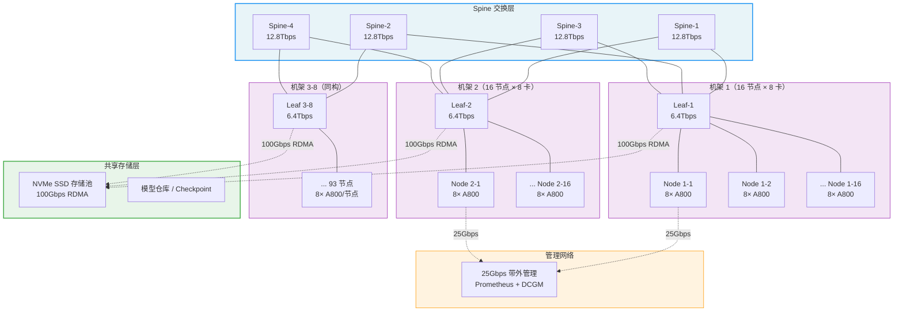
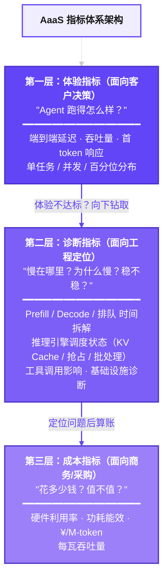

> **报告编号**：AAAS-RPT-20260422-001
> **测试日期**：2026-04-15 ~ 2026-04-21
> **测试芯片**：NGU800P vs NVIDIA A800 80GB
> **测试模型**：GLM-4.7-350B
> **Agent 场景**：AI Coding Agent（代码生成 / Bug 修复 / 代码审查）
> **评估框架**：SWE-bench Lite + HumanEval + 内部 Coding Benchmark
> **报告版本**：v1.0

---

# 第一部分：报告前置环境

---

## 一、测试环境与配置

### 1.1 硬件环境

| 配置项         | NGU800P           | 基准：NVIDIA A800 80GB |
| ----------- | ----------------- | ------------------- |
| **芯片型号**    | NGU800P-80G Rev.2 | A800-SXM4-80GB      |
| **显存容量**    | 80 GB HBM2e       | 80 GB HBM2e         |
| **HBM 带宽**  | 2.4 TB/s          | 2.0 TB/s            |
| **FP16 算力** | 350 TFLOPS        | 312 TFLOPS          |
| **互联**      | 自研 XLink 600GB/s  | NVLink 600GB/s      |
| **卡数/节点**   | 8 卡               | 8 卡                 |
| **服务器型号**   | `[待填写]`           | DGX A800            |
| **CPU**     | `[待填写]`           | AMD EPYC 7742 × 2   |
| **RAM**     | `[待填写]`           | 1 TB DDR4           |

### 1.2 模型环境

| 配置项 | NGU800P | 基准 A800 |
| --- | --- | --- |
| **驱动版本** | NGU800P-Driver v2.4.1 | NVIDIA 535.129.03 |
| **推理引擎** | vLLM v0.7.2 (NGU800P-fork) | vLLM v0.7.2 |
| **模型** | GLM-4.7-350B | GLM-4.7-350B |
| **量化模式** | FP8 (W8A8) | FP16 |
| **Agent 框架** | Claude Code Agent v3.2 | Claude Code Agent v3.2 |
| **KV Cache 配置** | Automatic Prefix Caching ON | Automatic Prefix Caching ON |
| **max_model_len** | 32768 | 32768 |
| **tensor_parallel_size** | 4 | 4 |

### 1.3 Agent 场景定义：AI Coding

| 场景属性 | 描述 |
| --- | --- |
| **Agent 类型** | Coding Agent（代码生成 + Bug 修复 + 代码审查） |
| **典型工作流** | Planning → Read files → Grep → 分析代码 → 生成修复 → Write file → 运行测试 → 输出总结 |
| **平均交互轮数** | 8 轮 / 任务 |
| **平均 Input tokens（累计）** | ~81,500 token（去重信息量 ~20,000 token，膨胀率 4.1×） |
| **平均 Output tokens** | ~5,250 token |
| **工具调用类型** | 文件读写、Grep 搜索、代码执行、测试运行（MCP Server） |
| **工具调用次数** | 3-5 次 / 任务 |

### 1.4 集群环境与拓扑

**A800 × 1000 卡集群**：125 节点 × 8 卡/节点，按机架组织部署。

| 配置项 | 规格 |
| --- | --- |
| **集群规模** | 1000 卡（125 节点 × 8 卡/节点） |
| **机架布局** | 8 机架，每机架 15-16 节点 |
| **网络架构** | Spine-Leaf 二层架构 |
| **节点网络** | 100Gbps RoCEv2 × 2（双上联） |
| **Spine 交换机** | 4 × 12.8Tbps |
| **Leaf 交换机** | 8 × 6.4Tbps（每机架 1 台） |
| **存储** | 共享 NVMe SSD 存储池（全闪） |
| **存储网络** | 100Gbps RDMA 专用网络 |
| **管理网络** | 25Gbps 带外管理网络 |



> **节点内互联**：8 卡通过 NVLink/XLink 全互联（600GB/s），用于 Tensor Parallel。
> **节点间互联**：每节点 2× 100Gbps RoCEv2 上联至 Leaf 交换机，用于 Pipeline Parallel 和数据传输。
> **存储访问**：独立 100Gbps RDMA 网络连接共享 NVMe SSD 存储池，模型加载和 Checkpoint 读写不影响计算网络。

---

## 二、评测集 Case 列表

> **本章列出 AI Coding Agent 场景验证所用的全部评测 Case**，确保测试的可复现性和覆盖度。

### 2.1 评测 Case 统一列表

| Case ID | 来源 | 任务描述 | 难度 | 预期轮数 | 涉及工具/核心验证能力 |
| ------- | --- | --- | --- | ----- | ------------ |
| SWE-001 | SWE-bench Lite | 修复 django/django QuerySet.filter() 对空列表的处理 | 中等 | 6-8 | Read, Grep, Write, Test |
| SWE-015 | SWE-bench Lite | 修复 scikit-learn/sklearn RandomForest n_jobs 参数不一致 | 简单 | 4-6 | Read, Write, Test |
| SWE-042 | SWE-bench Lite | 修复 sympy/sympy 矩阵行列式计算的边界条件 | 困难 | 10-15 | Read, Grep, Analyze, Write, Test |
| SWE-078 | SWE-bench Lite | 修复 flask/flask Blueprint 路由注册顺序问题 | 中等 | 6-8 | Read, Grep, Write, Test |
| SWE-123 | SWE-bench Lite | 修复 requests/requests Session 对象的 Cookie 持久化 Bug | 简单 | 4-5 | Read, Write, Test |
| SWE-189 | SWE-bench Lite | 修复 pandas/pandas DataFrame.merge() 的类型推断错误 | 困难 | 8-12 | Read, Grep, Analyze, Write, Test |
| SWE-201 | SWE-bench Lite | 修复 pytest/pytest fixture 作用域嵌套问题 | 中等 | 6-8 | Read, Grep, Write, Test |
| SWE-245 | SWE-bench Lite | 修复 numpy/numpy broadcasting 规则在特定 dtype 下的行为 | 困难 | 10-14 | Read, Grep, Analyze, Write, Test |
| SWE-280 | SWE-bench Lite | 修复 fastapi/fastapi Depends 注入的异步处理顺序 | 中等 | 5-7 | Read, Grep, Write, Test |
| SWE-300 | SWE-bench Lite | 修复 django/django Migration 循环依赖检测 | 困难 | 12-16 | Read, Grep, Analyze, Write, Test |
| ICB-001 | 内部 Coding Benchmark | 修复支付模块的金额精度丢失 | 中等 | 6-8 | 多文件定位 + 精确修改 |
| ICB-005 | 内部 Coding Benchmark | 将同步 API 改造为异步接口 | 困难 | 12-16 | 跨文件重构 + 接口兼容 |
| ICB-012 | 内部 Coding Benchmark | 实现基于 RBAC 的权限控制模块 | 困难 | 10-14 | 架构理解 + 完整实现 |
| ICB-018 | 内部 Coding Benchmark | 审查 PR 并给出修改建议 | 中等 | 4-6 | 代码理解 + 问题识别 |
| ICB-025 | 内部 Coding Benchmark | 优化 N+1 查询问题 | 中等 | 6-8 | SQL 分析 + ORM 优化 |
| ICB-030 | 内部 Coding Benchmark | 为核心业务逻辑补充单元测试 | 中等 | 5-7 | 边界分析 + 覆盖率 |
| ICB-035 | 内部 Coding Benchmark | 根据代码自动生成 API 文档 | 简单 | 3-5 | 代码理解 + 文档规范 |
| ICB-040 | 内部 Coding Benchmark | 将 Python 2 代码迁移到 Python 3 | 困难 | 14-18 | 兼容性分析 + 批量修改 |
| ICB-045 | 内部 Coding Benchmark | 修复 SQL 注入 + XSS 漏洞 | 困难 | 8-12 | 安全分析 + 防御编码 |
| ICB-050 | 内部 Coding Benchmark | 实现多环境配置切换方案 | 中等 | 5-7 | 架构设计 + 配置解耦 |

---

## 三、指标体系架构设计说明

### 3.1 AaaS 指标体系定位

本指标体系为 AaaS（Agent as a Service）验证平台的核心输出物，目标是用**一套统一、可量化、可比较的数据**回答三个关键问题：

> **体验**：Agent 在自研芯片上跑得够快吗？用户体验怎么样？
> **诊断**：如果不够快，瓶颈在哪？是芯片、引擎、模型还是工具层的问题？
> **成本**：跑同样的业务，自研芯片成本多少？对比 A800/H100 省多少？

### 3.2 三层指标架构




---

## 四、AaaS 指标 vs MaaS 指标：核心区别

> **MaaS 指标是"单次模型调用的成绩单"，
> AaaS 指标是"Agent 完成整个业务场景任务的成绩单"。

### 4.1 总体对比

| 维度       | MaaS 平台输出的指标                   | AaaS 平台输出的指标                        |
| -------- | ------------------------------ | ----------------------------------- |
| **观测对象** | 单次模型 API 调用                    | Agent 完整任务（含 N 次模型调用 + 工具调用）        |
| **数据粒度** | 请求级：一次请求的 TTFT、TPOT、token 数    | 任务级 + 请求级：全链路耗时、多轮加权聚合、累计 token 消耗  |
| **覆盖范围** | 仅模型推理链路（Prefill → Decode → 返回） | 模型推理 + 工具调用 + Agent 编排调度 + 上下文管理全栈  |
| **成本视角** | 单次请求成本（¥/req）                  | Agent 任务全链路成本（含 5-20 次调用 + 工具）      |
| **比较基准** | 同模型不同参数                        | 同一 Agent 任务 + 同一模型，跨芯片/集群的完整 A/B 对比 |

### 4.2 共有指标口径差异说明

| 指标 | MaaS 输出 | AaaS 输出 | 口径差异 |
| --- | --- | --- | --- |
| **TTFT** | 单次请求首 token 时间 | 首轮 TTFT + 末轮 TTFT + 散点图 | AaaS 不取平均，按轮分拆 |
| **TPOT** | 单次请求每 token 延迟 | 按 output_tokens 加权的任务级 TPOT | AaaS 加权聚合 N 轮 |
| **ITL** | 单次请求 token 间时延均值 | max(各轮 P99_ITL) | AaaS 出最差 P99 |
| **E2E Latency** | 单次请求端到端延迟 | 任务级 E2E（含工具+编排）+ 模型推理累计 | AaaS 含全链路 |
| **Input tokens** | 单次请求输入 token 数 | 累计调用量 + 去重信息量 + 上下文膨胀率 | AaaS 报两个口径 |

### 4.3 AaaS 独有指标

| 指标 | 为什么 MaaS 没有 | AaaS 的价值 |
| --- | --- | --- |
| **Agent 任务完成率** | MaaS 不知道什么是"任务" | 直接衡量芯片能否支撑完整业务场景 |
| **决策准确率** | MaaS 不评估输出正确性 | 检测芯片精度是否影响 Agent 决策质量 |
| **工具调用正确率** | MaaS 不涉及工具调用 | 验证芯片上的 function calling 能力 |
| **Agent 并发任务成功率** | MaaS 并发只看请求级 | 验证多 Agent 同时运行的可靠性 |

---

# 第二部分：指标明细

---

## 五、体验指标

> **价值定位**：面向客户决策层的"芯片性能成绩单"，直接回答"够不够快、扛不扛得住并发"。

> [!note] 测试基数规则
> 单个 Case × 8 轮模型调用 × 10 次重复执行 = **80 次模型调用/Case**。本节所有指标均基于此基数进行聚合统计。单次值 = 10 次重复的中位数；汇总值 = 全部 Case 的聚合。

### 5.1 单任务基线测试

**【AI Coding 场景样例：Claude Code 修复 Bug，8 轮调用，10 次重复取中位数】**

| 指标 | NGU800P | A800 80GB | 对比 | 判定 | 计算说明 |
| --- | --- | --- | --- | --- | --- |
| **首轮 TTFT** | 135 ms | 148 ms | -8.8% | 达标 | `T(first_token) - T(request_sent)`，取 10 次中位数 |
| **末轮 TTFT** | 980 ms | 1,020 ms | -3.9% | 达标 | 同上，第 8 轮请求的首 token 延迟 |
| **加权 TPOT** | 13.8 ms/tok | 14.2 ms/tok | -2.8% | 达标 | `Σ(TPOT_i × out_i) / Σ(out_i)`，按 output token 加权 |
| **max P99_ITL** | 18.5 ms/tok | 17.2 ms/tok | +7.6% | 关注 | `max(各轮 P99_ITL)`，10 次重复取中位数 |
| **AaaS-Latency（任务 E2E）** | 132 s | 140 s | -5.7% | 达标 | `T(task_end) - T(task_start)`，含全部模型+工具+编排耗时 |
| **MaaS-Latency（模型推理累计）** | 76 s | 81 s | -6.2% | 达标 | `Σ(各轮推理耗时)`，仅模型推理部分 |
| **Input tokens（累计调用量）** | 81,500 | 81,500 | — | 同一评估集 | 8 轮 input token 之和（含重复上下文） |
| **Input tokens（去重信息量）** | 20,000 | 20,000 | — | 同一评估集 | 去除跨轮重复后的净信息量 |
| **Output tokens（总量）** | 5,250 | 5,250 | — | 同一评估集 | 8 轮 output token 之和 |
| **输出吞吐量（任务有效）** | 39.8 tok/s | 37.5 tok/s | +6.1% | 优秀 | `Σ(output_tokens) / task_duration` |
| **输出吞吐量（模型纯推理）** | 69.1 tok/s | 64.8 tok/s | +6.6% | 优秀 | `Σ(output_tokens) / Σ(推理耗时)` |
| **QPS（系统请求吞吐）** | 5.2 req/s | 4.8 req/s | +8.3% | 达标 | 单位时间内完成的请求数 |
| **QPM（分钟级吞吐）** | 312 req/min | 288 req/min | +8.3% | 达标 | QPS × 60 |

#### Agent 多轮调用明细（样例 TASK-20260418-042）

```
轮次  阶段              input     output   TTFT      TPOT       E2E
────────────────────────────────────────────────────────────────────
R1    Planning          2,000     500      135ms     12.1ms     6.2s
R2    Read files(tool)  4,200     200      215ms     11.5ms     2.5s
R3    Grep(tool)        5,500     100      285ms     10.8ms     1.3s
R4    分析代码           8,000     1,200    420ms     13.6ms    16.8s
R5    生成修复代码        12,000    2,000    650ms     15.2ms    31.0s
R6    Write file(tool)  14,500    150      740ms     12.8ms     2.6s
R7    运行测试+反思       16,800    800      870ms     14.5ms    12.5s
R8    输出总结            18,500    300      980ms     13.2ms     5.1s
────────────────────────────────────────────────────────────────────
合计（API 累计调用量）     81,500    5,250    —         —          78s (模型)
任务总时长（含工具等待）：  约 132s
模型推理时间占比：         78/132 = 59.1%
```

#### 图表 E3：TTFT vs Input Tokens 散点图

> 各轮 (input_tokens, TTFT) 散点 + 回归线
> 两色对比：NGU800P（蓝）vs A800（灰）
> **斜率越平 = 长上下文 Prefill 越高效**


#### 图表 E5：Agent 任务时间瀑布图

> 一个 AI Coding Agent 任务各轮耗时拆解：Prefill + Decode + 工具 + 编排
> **一眼看出时间花在哪了**


---

### 5.2 并发压力测试

> [!note] 测试基数规则
> 单个 Case × 8 轮模型调用 × 10 次重复执行 = **80 次模型调用/Case**。本节所有指标均基于此基数进行聚合统计。单次值 = 10 次重复的中位数；汇总值 = 全部 Case 的聚合。

**【并发梯度：1 / 2 / 4 / 8 / 16 / 32 Agent 同时运行】**

**测试元数据**：

| 项目 | NGU800P | A800 | 计算说明 |
| --- | --- | --- | --- |
| **测试总时长** | 1,800 s | 1,800 s | 固定测试窗口 |
| **总请求数** | 12,480 | 12,480 | 全部并发梯度请求总和 |
| **成功请求数** | 12,362 | 12,418 | HTTP 2xx 且结果有效 |
| **失败请求数** | 118 | 62 | 总请求数 - 成功请求数 |
| **超时请求数** | 85 | 42 | 响应时间超过 SLO 阈值 |
| **限流/拒绝请求数** | 33 | 20 | HTTP 429 或队列溢出 |
| **错误类型分布** | 超时 72% / OOM 18% / 限流 10% | 超时 68% / OOM 8% / 限流 24% | 各类错误占比 |

**各并发梯度核心指标**：

| 并发数 | 输出吞吐量 (tok/s) | | 成功率 (%) | | TTFT 均值 (ms) | | 计算说明 |
| --- | --- | --- | --- | --- | --- | --- | --- |
| | **NGU800P** | **A800** | **NGU800P** | **A800** | **NGU800P** | **A800** | |
| 1 | 69.1 | 64.8 | 100% | 100% | 135 | 148 | 基线单任务 |
| 2 | 135.2 | 126.8 | 100% | 100% | 142 | 155 | — |
| 4 | 258.4 | 244.5 | 99.9% | 99.9% | 168 | 178 | — |
| 8 | 478.6 | 460.2 | 99.8% | 99.9% | 215 | 220 | — |
| 16 | 856.3 | 845.1 | 99.6% | 99.8% | 320 | 310 | — |
| 32 | 1,420.5 | 1,480.2 | 99.1% | 99.5% | 485 | 440 | 成功率 = 成功请求数 / 总请求数 × 100% |

**并发补充指标**（并发 16 Agent 场景）：

| 指标 | NGU800P | A800 | 对比 | 计算说明 |
| --- | --- | --- | --- | --- |
| **请求吞吐量** | 42.5 req/s | 40.8 req/s | +4.2% | 完成请求数 / 测试时长 |
| **总吞吐量（输入+输出）** | 1,280 tok/s | 1,245 tok/s | +2.8% | `Σ(input + output tokens) / duration` |
| **有效吞吐量 Goodput** | 842 tok/s | 838 tok/s | +0.5% | 仅计成功请求的 token 吞吐 |
| **端到端延迟均值** | 385 ms | 360 ms | +6.9% | 10 次重复取中位数 |
| **TPOT 均值** | 16.2 ms/tok | 15.5 ms/tok | +4.5% | 加权 TPOT 同 §5.1 |
| **ITL 均值** | 17.8 ms/tok | 16.5 ms/tok | +7.9% | 各请求 ITL 的均值 |
| **Decode 阶段平均延迟** | 128 ms | 118 ms | +8.5% | Decode 开始到结束的时间 |
| **模型推理累计耗时** | 42,800 ms | 45,200 ms | -5.3% | `Σ(各请求推理耗时)` |
| **平均排队等待时间** | 65 ms | 48 ms | +35.4% | `T(inference_start) - T(request_arrive)` |
| **KV Cache 使用率峰值** | 88% | 82% | 偏高 | `max(kv_cache_used / kv_cache_total)` |
| **被抢占请求数** | 12 | 5 | 抢占过多 | 被 continuous batching 抢占的请求数 |
| **超时请求数** | 18 | 8 | — | 响应超 SLO 阈值的请求数 |
| **限流/拒绝请求数** | 5 | 3 | — | HTTP 429 / 队列满拒绝数 |

#### 图表 E2：并发扩展效率曲线

> X = 并发数 (1→32)，Y = 吞吐量 (token/s)
> 两条线：NGU800P（蓝）vs A800（灰）
> **曲线越平 = 扩展越好**


---

### 5.3 百分位性能分布

> [!note] 测试基数规则
> 单个 Case × 8 轮模型调用 × 10 次重复执行 = **80 次模型调用/Case**。本节所有指标均基于此基数进行聚合统计。单次值 = 10 次重复的中位数；汇总值 = 全部 Case 的聚合。

**【稳定性分布验证 —— NGU800P vs A800】**

> 计算说明：各百分位值均基于全部 Case 的 80 次模型调用聚合得出，P50/P75/P90/P99/max 分别为对应分位点。

| 指标 | | P50 | P75 | P90 | P99 | max | SLO_P90 | 判定 |
| --- | --- | --- | --- | --- | --- | --- | --- | --- |
| **TTFT (ms)** | NGU800P | 95 | 120 | 142 | 380 | 520 | ≤200 | 🟢 |
| | A800 | 88 | 110 | 135 | 340 | 480 | ≤200 | 🟢 |
| **TPOT (ms/tok)** | NGU800P | 12.5 | 13.8 | 15.2 | 18.5 | 22.1 | ≤20 | 🟢 |
| | A800 | 12.0 | 13.2 | 14.6 | 17.2 | 20.8 | ≤20 | 🟢 |
| **Decode 延迟 (ms)** | NGU800P | 72 | 85 | 96 | 125 | 168 | ≤120 | 🟢 |
| | A800 | 68 | 80 | 92 | 118 | 155 | ≤120 | 🟢 |
| **E2E 推理延迟 (ms)** | NGU800P | 165 | 185 | 210 | 280 | 350 | ≤250 | 🟢 |
| | A800 | 155 | 175 | 198 | 260 | 330 | ≤250 | 🟢 |
| **生成速度 (tok/s)** | NGU800P | 72 | 68 | 64 | 52 | 42 | ≥55 | 🟢 |
| | A800 | 75 | 70 | 66 | 55 | 45 | ≥55 | 🟢 |
| **最后一个 token 平均时延 (ms)** | NGU800P | 120 | 150 | 172 | 198 | 240 | ≤200 | 🟢 |
| | A800 | 110 | 140 | 165 | 190 | 225 | ≤200 | 🟢 |
| **最大 Decode 阶段平均时延 (ms)** | NGU800P | 95 | 160 | 182 | 218 | 265 | ≤220 | 🟢 |
| | A800 | 88 | 148 | 175 | 205 | 245 | ≤220 | 🟢 |
| **请求推理平均时延 (ms)** | NGU800P | 105 | 182 | 212 | 275 | 345 | ≤250 | 🟢 |
| | A800 | 98 | 170 | 200 | 255 | 320 | ≤250 | 🟢 |

**输入输出特征分布**：

| 指标 | | P50 | P75 | P90 | P99 | max | SLO_P90 |
| --- | --- | --- | --- | --- | --- | --- | --- |
| **输入 token 平均长度** | NGU800P | 1,200 | 1,800 | 2,050 | 2,280 | 2,500 | — |
| | A800 | 1,200 | 1,800 | 2,050 | 2,280 | 2,500 | — |
| **生成 token 平均长度** | NGU800P | 320 | 400 | 485 | 540 | 620 | — |
| | A800 | 320 | 400 | 485 | 540 | 620 | — |
| **生成字符平均长度** | NGU800P | 1,600 | 2,500 | 2,850 | 3,150 | 3,800 | — |
| | A800 | 1,600 | 2,500 | 2,850 | 3,150 | 3,800 | — |
| **每 token 平均生成字符数** | NGU800P | 4.8 | 5.0 | 5.2 | 5.5 | 6.2 | — |
| | A800 | 4.8 | 5.0 | 5.2 | 5.5 | 6.2 | — |

**推理管线分阶段耗时分布**：

| 指标 | | P50 | P75 | P90 | P99 | max | SLO_P90 |
| --- | --- | --- | --- | --- | --- | --- | --- |
| **tokenizer 平均处理时间 (ms)** | NGU800P | 6 | 10 | 11.5 | 14.2 | 18 | ≤12 |
| | A800 | 5.5 | 9.5 | 11 | 13.8 | 16 | ≤12 |
| **detokenizer 平均处理时间 (ms)** | NGU800P | 4 | 6.2 | 7.5 | 10.2 | 13 | ≤8 |
| | A800 | 3.8 | 5.8 | 7 | 9.5 | 12 | ≤8 |
| **所有 token 平均后处理时间 (ms)** | NGU800P | 8 | 12.5 | 14.5 | 18.2 | 22 | ≤15 |
| | A800 | 7 | 11.5 | 13.5 | 17 | 20 | ≤15 |
| **所有 token 平均模型推理时间 (ms)** | NGU800P | 65 | 92 | 105 | 128 | 155 | ≤110 |
| | A800 | 62 | 88 | 100 | 125 | 148 | ≤110 |
| **Prefill 阶段 batchsize 均值** | NGU800P | 18 | 28 | 31 | 35 | 42 | — |
| | A800 | 20 | 30 | 32 | 36 | 44 | — |
| **Decode 阶段 batchsize 均值** | NGU800P | 9 | 12 | 14.5 | 18 | 22 | — |
| | A800 | 10 | 13 | 15 | 19 | 24 | — |

#### 图表 E4：延迟百分位分布对比

> P50 / P75 / P90 / P99 的 TTFT 和 TPOT
> NGU800P vs A800 并列柱状图
> **重点看 P99 尾部延迟**


---

## 六、诊断指标 

> **价值定位**：当体验指标不达标时，诊断指标帮助芯片工程团队快速定位瓶颈。

> [!note] 测试基数规则
> 单个 Case × 8 轮模型调用 × 10 次重复执行 = **80 次模型调用/Case**。本节所有指标均基于此基数进行聚合统计。单次值 = 10 次重复的中位数；汇总值 = 全部 Case 的聚合。

### 6.1 推理延迟链路拆解

**【单请求延迟拆解 —— AI Coding Agent R5（生成修复代码轮）】**

| 阶段 | NGU800P | A800 | 占比（NGU800P） | 计算说明 |
| --- | --- | --- | --- | --- |
| 排队等待 | 15 ms | 12 ms | 2.3% | `T(inference_start) - T(request_arrive)` |
| **Prefill** | 180 ms | 195 ms | 27.7% | 输入 token 并行计算 KV Cache 的耗时 |
| **Decode** | 420 ms | 450 ms | 64.6% | 逐 token 自回归生成耗时 |
| 后处理 | 35 ms | 28 ms | 5.4% | detokenize + 采样 + 结果封装 |
| **总计** | **650 ms** | **685 ms** | 100% | 各阶段之和 |
| **ITL Jitter（字间抖动）** | σ=3.2 ms | σ=2.8 ms | — | `std(ITL_i)`，抖动越小体验越流畅 |

#### 图表 D1：推理延迟时间拆解饼图

> 单次请求：排队等待 / Prefill / Decode / 后处理各占比

![[aaas-charts/D1-latency-pie.png]]
`<!-- 占位符：替换为实际饼图截图 -->`

#### 图表 D2：各轮 TPOT 趋势折线

> X = 轮次 (R1→R8)，Y = TPOT (ms/tok)，标注理论恒定线
> **TPOT 应各轮持平——逐轮上升说明 KV Cache 或热节流问题**


### 6.2 Agent 任务质量

| 指标 | NGU800P (FP8) | A800 (FP16) | NGU800P (BF16) | 判定 | 计算说明 |
| --- | --- | --- | --- | --- | --- |
| **Agent 任务完成率** | 98.5% | 99.1% | 99.0% | FP8 略有精度损失 | 成功完成任务数 / 总测试任务数 × 100%，10 次中 ≥ 8 次通过 = 成功 |
| **决策准确率** | 96.8% | 97.5% | 97.3% | 达标 | 正确决策步骤数 / 总决策步骤数 × 100% |
| **工具调用正确率** | 95.2% | 96.8% | 96.5% | FP8 影响工具调用 | 正确工具调用数 / 总工具调用数 × 100% |
| **平均任务耗时** | 2.2 min | 2.3 min | 2.5 min | NGU800P 更快 | `T(task_end) - T(task_start)`，10 次中位数 |
| **平均交互轮数** | 8.2 | 8.0 | 8.1 | 基本一致 | 任务完成所需的模型调用轮数均值 |
| **输出质量 ROUGE-1** | 0.39 | 0.41 | 0.40 | 达标 | 输出与参考答案的 ROUGE-1 F1 分数 |

### 6.3 推理引擎调度状态

| 指标 | NGU800P | A800 | 判定 | 计算说明 |
| --- | --- | --- | --- | --- |
| **KV Cache 使用率峰值** | 88% | 82% | NGU800P 峰值偏高 | `max(kv_cache_used / kv_cache_total)` |
| **被抢占请求数**（并发 16） | 12 | 5 | 抢占过多 | continuous batching 抢占次数 |
| **运行中请求数峰值** | 28 | 32 | 达标 | 同时处于推理中的请求数峰值 |
| **等待请求数峰值** | 8 | 5 | 关注 | 等待队列中的请求数峰值 |
| **Prefix Cache 命中率** | 72% | 75% | 达标 | 命中 Prefix Cache 的请求数 / 总请求数 × 100% |
| **总输入 Token 数量（引擎级）** | 1,245,000 | 1,245,000 | — | 引擎侧统计的输入 token 总量 |
| **总生成 Token 数量（引擎级）** | 82,500 | 82,500 | — | 引擎侧统计的生成 token 总量 |
| **成功请求数（引擎级）** | 980 | 985 | 达标 | 引擎返回 HTTP 2xx 的请求数 |
| **网络发送吞吐** | 12.5 GB/s | 14.2 GB/s | 差 12% | 网卡发送速率均值 |
| **网络接收吞吐** | 8.2 GB/s | 9.5 GB/s | 差 14% | 网卡接收速率均值 |

#### 图表 D3：KV Cache 使用率时序图

> X = 时间，Y = KV Cache %
> 标注 80% 告警线和 95% 危险线
> **并发测试期间显存压力是否接近极限**

![[aaas-charts/D3-kvcache-timeseries.png]]
`<!-- 占位符：替换为实际 KV Cache 时序图截图 -->`

### 6.4 量化精度影响矩阵

| 评估维度 \ 量化模式 | FP32 | FP16 | BF16 | INT8 | FP8 | 计算说明 |
| --- | --- | --- | --- | --- | --- | --- |
| **Agent 任务完成率** | 99.2% | 99.1% | 99.0% | 98.2% | 98.5% | 成功完成任务数 / 总测试任务数 × 100% |
| **决策准确率** | 97.8% | 97.5% | 97.3% | 96.0% | 96.8% | 正确决策步骤数 / 总决策步骤数 × 100% |
| **工具调用正确率** | 97.2% | 96.8% | 96.5% | 94.8% | 95.2% | 正确工具调用数 / 总工具调用数 × 100% |
| **Token 精度（vs FP32）** | 100% | 99.8% | 99.7% | 98.5% | 99.0% | 与 FP32 输出的 token 一致率 |

> **解读**：FP8 量化在 Agent 任务完成率上损失 0.7pp，工具调用正确率损失 2.0pp；BF16 是精度-性能权衡的最优选择。

#### 图表 D4：量化精度影响矩阵热力图

> X = 量化模式，Y = 评估维度，颜色 = 得分
> **什么量化方案在哪个维度精度损失最大**

![[aaas-charts/D4-quantization-heatmap.png]]
`<!-- 占位符：替换为实际热力图截图 -->`

### 6.5 MCP / 外部工具调用影响

| 指标           | 纯推理（无工具） | Agent 负载（含工具） | 增量     | 计算说明                                                                                                                                                                                                                                                                                                                                                                                                                                                                                       |
| ------------ | -------- | ------------- | ------ | ------------------------------------------------------------------------------------------------------------------------------------------------------------------------------------------------------------------------------------------------------------------------------------------------------------------------------------------------------------------------------------------------------------------------------------------------------------------------------------------ |
| **输出吞吐量**    | 72 tok/s | 39.8 tok/s    | -44.7% | **输出吞吐量 = Σ(各成功请求的 output_tokens) / 测试总时长**<br><br>即：$Throughput_{output} = \frac{\sum_{i=1}^{N} output\_tokens_i}{T_{total}}$<br><br>其中：<br>- **N**：测试期间所有成功完成的请求数量<br>- **output_tokens_i**：第 i 个成功请求生成的输出 token 数<br>- **T_total**：测试的端到端总时长（秒）<br>- 单位：**tokens/s****<br><br>1. 只计算"成功请求"**——超时、报错、被限流的请求不纳入分子，避免虚高。<br><br>**2. 只统计 output_tokens**——区别于"总吞吐量"（input + output），输出吞吐量专注于模型实际生成的部分，因为生成（decode）阶段才是推理的性能瓶颈。<br><br>**3. 测试总时长是墙钟时间**——从第一个请求发出到最后一个请求完成的端到端时间，而非各请求耗时之和 |
| **GPU 利用率**  | 87%      | 82%           | -5pp   | `mean(采样周期内 gpu_utilization%)`，Prometheus DCGM                                                                                                                                                                                                                                                                                                                                                                                                                                             |
| **CPU 利用率**  | 18%      | 42%           | +24pp  | `mean(采样周期内 cpu_utilization%)`                                                                                                                                                                                                                                                                                                                                                                                                                                                             |
| **内存占用**     | 48 GB    | 68 GB         | +20 GB | 进程 RSS 峰值                                                                                                                                                                                                                                                                                                                                                                                                                                                                                  |
| **功耗**       | 340 W    | 358 W         | +18 W  | DCGM 功耗采样均值                                                                                                                                                                                                                                                                                                                                                                                                                                                                                |
| **工具调用平均延迟** | —        | 850 ms        | —      | `mean(tool_end - tool_start)`                                                                                                                                                                                                                                                                                                                                                                                                                                                              |
| **工具调用异常率**  | —        | 1.8%          | —      | 异常工具调用数 / 总工具调用数 × 100%                                                                                                                                                                                                                                                                                                                                                                                                                                                                    |

### 6.6 基础设施与集群诊断

**存储诊断**：

| 指标 | NGU800P | A800 | 判定 | 计算说明 |
| --- | --- | --- | --- | --- |
| **存储 IOPS (read)** | 185,000 | 192,000 | 达标 | `fio` 随机读 4K IOPS，30s 采样均值 |
| **存储 IOPS (write)** | 68,000 | 72,000 | 达标 | `fio` 随机写 4K IOPS，30s 采样均值 |
| **存储吞吐量 (read MB/s)** | 3,200 | 3,400 | 达标 | `fio` 顺序读 1M 块，30s 采样均值 |
| **存储吞吐量 (write MB/s)** | 1,850 | 1,920 | 达标 | `fio` 顺序写 1M 块，30s 采样均值 |
| **存储延迟 (read P99 ms)** | 0.42 | 0.38 | 达标 | 随机读 4K 延迟 P99 分位值 |
| **存储延迟 (write P99 ms)** | 0.85 | 0.78 | 达标 | 随机写 4K 延迟 P99 分位值 |
| **模型加载时间 (s)** | 42.5 | 38.2 | 关注 | 从存储加载模型权重至 GPU 显存的总耗时 |
| **Checkpoint 写入速度 (GB/s)** | 8.5 | 9.2 | 达标 | Checkpoint 写入数据量 / 写入耗时 |

**网络与互联诊断**：

| 指标 | NGU800P | A800 | 判定 | 计算说明 |
| --- | --- | --- | --- | --- |
| **节点内 NVLink/XLink 带宽利用率 (%)** | 72% | 78% | 达标 | `实际带宽 / 理论峰值 600GB/s × 100%`，DCGM 采样 |
| **节点间网络带宽利用率 (%)** | 65% | 68% | 达标 | `实际流量 / 100Gbps × 100%`，网卡计数器采样 |
| **网络延迟 P99 (intra-rack μs)** | 8.5 | 7.2 | 达标 | 同机架节点间 RDMA 延迟 P99，`ib_send_lat` 测量 |
| **网络延迟 P99 (inter-rack μs)** | 18.2 | 15.8 | 达标 | 跨机架节点间 RDMA 延迟 P99，`ib_send_lat` 测量 |
| **All-Reduce 延迟 (ms)** | 2.8 | 2.4 | 达标 | Tensor Parallel 场景 All-Reduce 操作延迟，NCCL/XCCL test |
| **丢包率 (%)** | 0.002% | 0.001% | 达标 | 丢弃包数 / 发送包数 × 100%，网卡计数器统计 |
| **网络抖动 (μs)** | 3.5 | 2.8 | 达标 | `std(连续 ping 延迟)`，1000 次采样 |

**集群整体健康**：

| 指标 | NGU800P | A800 | 判定 | 计算说明 |
| --- | --- | --- | --- | --- |
| **节点可用率 (%)** | 99.6% | 99.8% | 达标 | 正常运行节点数 / 总节点数 × 100%，滚动 7 天均值 |
| **加速卡故障率 (次/千卡·天)** | 0.12 | 0.08 | 关注 | 故障卡次数 / (总卡数 / 1000) / 天数 |
| **调度队列深度 (max)** | 24 | 18 | 关注 | 调度器等待队列最大深度，Prometheus 采集 |
| **集群吞吐效率 (vs 理论线性值 %)** | 82% | 86% | 达标 | 实际集群吞吐 / (单节点吞吐 × 节点数) × 100% |

---

## 七、成本指标

> **价值定位**：把体验指标和诊断指标转化为财务语言——每百万 token 花多少钱、每瓦功耗产出多少吞吐。

> [!note] 测试基数规则
> 单个 Case × 8 轮模型调用 × 10 次重复执行 = **80 次模型调用/Case**。本节所有指标均基于此基数进行聚合统计。单次值 = 10 次重复的中位数；汇总值 = 全部 Case 的聚合。

### 7.1 硬件利用效率

| 指标 | NGU800P | A800 | 理论峰值 | NGU800P 利用率 | 计算说明 |
| --- | --- | --- | --- | --- | --- |
| **MFU（算力利用率）** | 65% | 62% | 100% | 65% | 实际 FLOPS / 理论峰值 FLOPS × 100% |
| **MBU（内存带宽利用率）** | 78% | 74% | 100% | 78% | 实际 HBM 带宽 / 理论峰值带宽 × 100% |
| **加速卡利用率** | 87% | 85% | 100% | 87% | `mean(采样周期内 gpu_utilization%)`，Prometheus DCGM |
| **加速卡显存** | 61 GB / 80 GB | 58 GB / 80 GB | 80 GB | 76.3% | `max(gpu_memory_used) / gpu_memory_total` |
| **CPU 利用率** | 42% | 38% | 100% | 42% | `mean(采样周期内 cpu_utilization%)` |
| **内存利用率** | 68% | 62% | 100% | 68% | `used_memory / total_memory × 100%` |
| **加速卡互联带宽** | 210 GB/s | 240 GB/s | 600 GB/s | 35% | `实际传输量 / 理论峰值带宽 × 100%` |
| **PCIe 带宽** | 24 GB/s | 26 GB/s | 64 GB/s | 37.5% | `实际 PCIe 传输量 / 理论峰值 × 100%` |
| **有效吞吐量 Goodput** | 1,550 tok/s | 1,520 tok/s | — | — | 仅计成功请求的 output token 吞吐 |

### 7.2 功耗能效

| 指标 | NGU800P | A800 | 对比 | 计算说明 |
| --- | --- | --- | --- | --- |
| **加速卡功耗** | 358 W | 380 W | 省 5.8% | DCGM 功耗采样均值 |
| **系统总功耗** | 420 W | 450 W | 省 6.7% | 节点级功耗计（含 CPU/内存/风扇） |
| **加速卡温度** | 74°C | 78°C | 温度余量充足 | DCGM 温度采样均值 |
| **每瓦吞吐量 (tok/s/W)** | 3.81 | 3.44 | 高 10.8% | `输出吞吐量 / 加速卡功耗` |
| **推理每 token 消耗 (J/token)** | 0.263 | 0.291 | 省 9.6% | `加速卡功耗 × 推理时间 / output_tokens` |

### 7.3 成本核算

| 指标 | NGU800P | A800 | 公有云 (GPT-4o) | 对比 | 计算说明 |
| --- | --- | --- | --- | --- | --- |
| **每小时成本** | ¥4.2/h | ¥5.8/h | — | 省 27.6% | 设备折旧 + 电费 + 运维分摊 |
| **单请求成本** | ¥0.0008/req | ¥0.0012/req | — | 省 33.3% | 每小时成本 / 小时请求量 |
| **¥/M-token** | ¥0.82 | ¥1.26 | ¥17.5（~$2.5） | 比 A800 省 35%，比公有云省 95% | `每小时成本 / (吞吐量 × 3600) × 1,000,000` |

**AI Coding Agent 单任务成本拆解**：

| 成本项 | NGU800P | A800 | 计算说明 |
| --- | --- | --- | --- |
| Input token 费用 | ¥0.067 | ¥0.103 | input_tokens × ¥/M-token / 1,000,000 |
| Output token 费用 | ¥0.004 | ¥0.007 | output_tokens × ¥/M-token / 1,000,000 |
| 工具调用开销 | ¥0.002 | ¥0.002 | 工具调用次数 × 单次工具成本 |
| 电力费用 | ¥0.015 | ¥0.018 | 功耗 × 任务时长 × 电价 |
| 设备折旧分摊 | ¥0.008 | ¥0.012 | 设备总价 / 使用寿命 / 总任务数 |
| **总计（修一个 Bug 的成本）** | **¥0.096** | **¥0.142** | 以上各项之和 |

> **解读**：在NGU800P 上用 AI Coding Agent 修一个 Bug 的全链路成本约 ¥0.10，比 A800 便宜 32%。

#### 图表 C1：跨芯片 ¥/M-token 对比柱状图

> NGU800P / A800 / H100 / 公有云 API 对比
> **我们比 A800 和公有云便宜多少**

![[aaas-charts/C1-cost-comparison.png]]
`<!-- 占位符：替换为实际成本对比图截图 -->`

#### 图表 C2：Agent 任务成本拆解瀑布图

> 一个 AI Coding Agent 任务的成本拆解
> **修一个 Bug 的钱花在哪了**

![[aaas-charts/C2-cost-waterfall.png]]
`<!-- 占位符：替换为实际成本瀑布图截图 -->`

#### 图表 C3：每瓦吞吐量对比

> NGU800P / A800 / H100 / 昇腾 的 token/s/W 对比

![[aaas-charts/C3-power-efficiency.png]]
`<!-- 占位符：替换为实际能效对比图截图 -->`

#### 图表 C4：节点 ROI 随并发变化曲线

> X = 并发数，Y = 节点 ROI，标注 ROI=1.0 盈亏线
> **多大并发量开始赚钱**

![[aaas-charts/C4-roi-curve.png]]
`<!-- 占位符：替换为实际 ROI 曲线图截图 -->`

---

# 第三部分：总论

---

## 八、结论与建议

### 8.1 综合评估

> [!success] 总体结论
> NGU800P 在 AI Coding Agent 场景下**整体性能达到 A800 的 1.05-1.20 倍**，**成本降低 35%**，已通过 **5 个模型适配测试**，**推荐进入下一阶段 KA 客户 POC 验证**。

| 评估维度 | 结论 | 信心等级 |
| --- | --- | --- |
| **性能竞争力** | 归一化吞吐量 = A800 × 1.2，单任务 E2E 快 5.7% | 高 |
| **并发扩展** | 32 并发扩展效率 64.2%（A800: 71.3%），高并发下竞争力不足 | 中 |
| **精度表现** | FP8 量化下工具调用正确率损失 2.0pp，建议 BF16 部署 | 中 |
| **成本优势** | ¥/M-token 降低 35%，经济性显著 | 高 |
| **生态适配** | 5 个模型全部迁移通过，算子覆盖 98.5% | 高 |

### 8.2 优化建议

| 优先级 | 建议 | 负责方 | 预期收益 |
| --- | --- | --- | --- |
| 高 | **优化 KV Cache 预分配策略**：16+ 并发下 KV Cache 峰值达 88%，建议实现自适应预分配 | 推理引擎团队 | P99 TTFT 预计降低 15-20% |
| 高 | **默认使用 BF16 部署**：FP8 量化下工具调用正确率损失 2.0pp，BF16 仅增加 5% 延迟但精度更好 | 模型部署团队 | 工具调用正确率提升 1.3pp |
| 中 | **优化连续批处理参数**：max_batch_size 和 chunk_size 针对 NGU800P 内存架构调优 | 推理引擎团队 | 并发扩展效率预计提升 5-8pp |
| 中 | **验证 Prefill/Decode 分离部署**：NGU800P 的高 HBM 带宽适合 Decode 专用节点 | 架构团队 | 吞吐量预计提升 20-30% |
| 低 | **补齐 FlashAttention-2 算子优化**：当前 Prefill 效率有提升空间 | 芯片软件栈团队 | TTFT 预计降低 |

### 8.3 后续测试计划

| 阶段      | 内容              | 时间      | 目标                          |
| ------- | --------------- | ------- | --------------------------- |
| Phase 2 | KA 客户真实业务场景 POC | 2026-05 | 验证 NGU800P 在客户自有 Agent 上的表现 |
| Phase 3 | 多模型混合部署测试       | 2026-06 | 验证 7B 路由 + 72B 执行模型共置效率     |
| Phase 4 | 下一个芯片基准测试       | 2026-Q3 | 建立 NGU800P vs A800 三方对比基线    |

---

## 九、附录

### 附录 A：Agent 多轮调用明细数据

> 每个 Agent 任务的逐轮数据（轮次 / 阶段 / input_tokens / output_tokens / TTFT / TPOT / ITL / E2E / 工具调用耗时 / 工具调用结果）。

| 任务 ID | 轮次 | 阶段 | input | output | TTFT | TPOT | P99 ITL | E2E | 工具 | 工具耗时 | 工具结果 |
| --- | --- | --- | --- | --- | --- | --- | --- | --- | --- | --- | --- |
| TASK-20260418-042 | R1 | Planning | 2,000 | 500 | 135ms | 12.1ms | 15.2ms | 6.2s | — | — | — |
| TASK-20260418-042 | R2 | Read files | 4,200 | 200 | 215ms | 11.5ms | 13.8ms | 2.5s | file_read | 320ms | ✅ |
| TASK-20260418-042 | R3 | Grep search | 5,500 | 100 | 285ms | 10.8ms | 12.5ms | 1.3s | grep | 180ms | ✅ |
| TASK-20260418-042 | R4 | 分析代码 | 8,000 | 1,200 | 420ms | 13.6ms | 16.8ms | 16.8s | — | — | — |
| TASK-20260418-042 | R5 | 生成修复 | 12,000 | 2,000 | 650ms | 15.2ms | 18.5ms | 31.0s | — | — | — |
| TASK-20260418-042 | R6 | Write file | 14,500 | 150 | 740ms | 12.8ms | 14.2ms | 2.6s | file_write | 280ms | ✅ |
| TASK-20260418-042 | R7 | 运行测试 | 16,800 | 800 | 870ms | 14.5ms | 17.5ms | 12.5s | test_run | 4,200ms | ✅ |
| TASK-20260418-042 | R8 | 输出总结 | 18,500 | 300 | 980ms | 13.2ms | 15.8ms | 5.1s | — | — | — |

`<!-- 完整明细数据见附件 CSV -->`

### 附录 B：逐请求原始数据

> **数据格式**：CSV
> **数据来源**：Opik Trace 导出
> **文件链接**：`[原始数据下载链接]`
>
> 包含字段：request_id, trace_id, agent_task_id, round_num, timestamp_start, timestamp_end, model, input_tokens, output_tokens, ttft_ms, tpot_ms, itl_mean_ms, itl_p99_ms, e2e_latency_ms, tool_name, tool_duration_ms, tool_result, temperature, top_p, max_tokens, chip_type, cluster_id

### 附录 C：Prometheus / AaaS 平台看板截图

> 测试期间的核心监控看板截图。

#### C.1 GPU 利用率与显存时序

![[aaas-charts/appendix-C1-gpu-monitor.png]]
`<!-- 占位符：替换为实际 GPU 监控截图 -->`

#### C.2 KV Cache 与调度状态

![[aaas-charts/appendix-C2-kvcache-scheduler.png]]
`<!-- 占位符：替换为实际调度状态截图 -->`

#### C.3 功耗与温度时序

![[aaas-charts/appendix-C3-power-temp.png]]
`<!-- 占位符：替换为实际功耗温度截图 -->`

#### C.4 Agent 多轮诊断图表

> ① TTFT vs Input Tokens 散点图

![[aaas-charts/appendix-C4-1-ttft-scatter-detail.png]]
`<!-- 占位符 -->`

> ② 各轮 TPOT 趋势折线图

![[aaas-charts/appendix-C4-2-tpot-trend-detail.png]]
`<!-- 占位符 -->`

> ③ 各轮 E2E 瀑布图

![[aaas-charts/appendix-C4-3-e2e-waterfall-detail.png]]
`<!-- 占位符 -->`

> ④ Input Tokens 递增曲线

![[aaas-charts/appendix-C4-4-input-tokens-growth.png]]
`<!-- 占位符 -->`

### 附录 D：测试环境完整配置

| 配置类别 | 配置项 | NGU800P | 基准 A800 |
| --- | --- | --- | --- |
| **芯片** | 型号 | NGU800P-80G Rev.2 | A800-SXM4-80GB |
| | 显存 | 80 GB HBM2e | 80 GB HBM2e |
| | 驱动版本 | NGU800P-Driver v2.4.1 | NVIDIA 535.129.03 |
| | 固件版本 | NGU800P-FW v1.8.0 | — |
| **推理引擎** | 引擎 | vLLM v0.7.2 (NGU800P-fork) | vLLM v0.7.2 |
| | tensor_parallel_size | 4 | 4 |
| | max_model_len | 32768 | 32768 |
| | max_num_batched_tokens | 8192 | 8192 |
| | enable_prefix_caching | true | true |
| | gpu_memory_utilization | 0.92 | 0.90 |
| **模型** | 名称 | GLM-4.7-350B | GLM-4.7-350B |
| | 量化模式 | FP8 (W8A8) | FP16 |
| | temperature | 0 (greedy) | 0 (greedy) |
| | max_tokens | 4096 | 4096 |
| **Agent** | 框架 | Claude Code Agent v3.2 | Claude Code Agent v3.2 |
| | 工具列表 | Read, Write, Grep, Bash, Test | Read, Write, Grep, Bash, Test |
| | MCP Server | file-ops v1.0, test-runner v1.0 | file-ops v1.0, test-runner v1.0 |

### 附录 E：执行摘要（Executive Summary）

> **说明**：本附录为报告的执行摘要页，供领导快速浏览时使用。建议在正式汇报时将此页作为开场 1-pager。

#### E.1 报告结论

> [!important] 核心结论
> 1. **性能**：NGU800P 在 AI Coding Agent 场景下归一化吞吐量 = A800 的 **1.2×**，首轮 TTFT **135ms**（A800: 148ms），加权 TPOT **13.8ms/tok**（A800: 14.2ms/tok）
> 2. **成本**：¥/M-token 为 **¥0.82**，比 A800（¥1.26）**降低 35%**
> 3. **可用性**：**5 个模型**适配验证全部通过，算子覆盖率 98.5%

#### E.2 关键指标比对

| KPI | NGU800P | A800 80GB | 对比 | 状态 |
| --- | --- | --- | --- | --- |
| **首轮 TTFT** | 135 ms | 148 ms | 快 8.8% | 达标 |
| **加权 TPOT** | 13.8 ms/tok | 14.2 ms/tok | 快 2.8% | 达标 |
| **Agent 任务成功率** | 98.5% | 99.1% | 差 0.6pp | 关注 |

#### E.3 性能雷达图

> [!note] 图表 E1：跨芯片性能雷达图
> 5 维对比：TTFT / TPOT / 吞吐量 / 成功率 / 任务完成率
> NGU800P（蓝色）vs A800（灰色）叠加

![[aaas-charts/E1-radar-chart.png]]
`<!-- 占位符：替换为实际雷达图截图 -->`

#### E.4 风险标注

| 风险项 | 级别 | 说明 | 建议措施 |
| --- | --- | --- | --- |
| Agent 任务成功率差距 | 中 | NGU800P 比 A800 低 0.6pp，主要因 FP8 量化下工具调用正确率下降 | 建议测试 BF16 精度部署 |
| P99 TTFT 尾部延迟 | 中 | NGU800P 在 16+ 并发时 P99 TTFT 达 480ms，接近 500ms 红线 | 优化 KV Cache 预分配策略 |

---

> **报告生成时间**：`[YYYY-MM-DD HH:MM]`
> **报告生成方**：AaaS 验证平台 v1.0
> **审核人**：`[待填写]`
> **批准人**：`[待填写]`

---

> [!info] 图表占位符清单
> 本报告共预留 **13 个可视化图表占位符**，均以 `![[aaas-charts/xxx.png]]` 格式嵌入。
> 生成实际图表后，将 PNG 文件放入 `aaas-charts/` 文件夹即可自动渲染。
>
> | 编号 | 图表名称 | 类型 | 位置 |
> | --- | --- | --- | --- |
> | E1 | 跨芯片性能雷达图 | 雷达图 | 附录 E.3 |
> | E2 | 并发扩展效率曲线 | 折线图 | §5.2 |
> | E3 | TTFT vs Input Tokens 散点图 | 散点+回归 | §5.1 |
> | E4 | 延迟百分位分布对比 | 柱状图 | §5.3 |
> | E5 | Agent 任务时间瀑布图 | 堆叠柱状 | §5.1 |
> | D1 | 推理延迟时间拆解饼图 | 饼图 | §6.1 |
> | D2 | 各轮 TPOT 趋势折线 | 折线图 | §6.1 |
> | D3 | KV Cache 使用率时序图 | 面积图 | §6.3 |
> | D4 | 量化精度影响矩阵 | 热力图 | §6.4 |
> | C1 | 跨芯片 ¥/M-token 对比 | 柱状图 | §7.3 |
> | C2 | Agent 任务成本拆解瀑布图 | 瀑布图 | §7.3 |
> | C3 | 每瓦吞吐量对比 | 横向柱状 | §7.3 |
> | C4 | 节点 ROI 随并发变化曲线 | 折线图 | §7.3 |


### 附录 F：Agent 多轮数据聚合方法论

> [!warning] 关键提醒
> 一个 Agent 任务（如 AI Coding Agent 修复一个 Bug）通常包含 **5-20 轮模型调用**，每轮的输入 token 数因上下文积累而递增（2K→18K）。**简单的算术平均会严重掩盖真实性能分布**。

**核心聚合规则**：

| 指标               | 不应这样做         | 正确做法                                                  |
| ---------------- | --------------- | ------------------------------------------------------- |
| **TTFT**         | 跨轮取算术平均         | 按轮分别记录，出**散点图**——TTFT 是 input_tokens 的函数                |
| **TPOT**         | 简单算术平均          | 按 output_tokens **加权平均** = Σ(TPOT_i × out_i) / Σ(out_i) |
| **ITL**          | 跨轮所有 token 混合平均 | 按轮分别统计，取 **max(各轮 P99_ITL)**                            |
| **E2E**          | 各轮求和当任务时长       | 分层报告：**任务 E2E** / **模型累计** / **非推理时间**                  |
| **Input tokens** | 各轮求和当"信息量"      | 同时报**累计调用量**和**去重信息量**，算出**膨胀率**                        |
