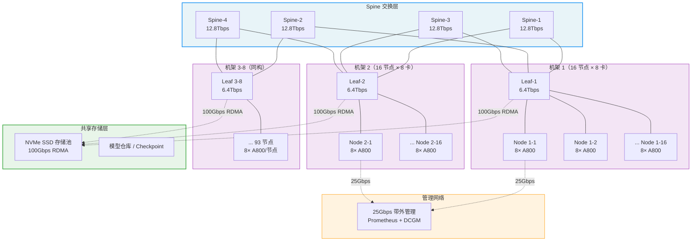
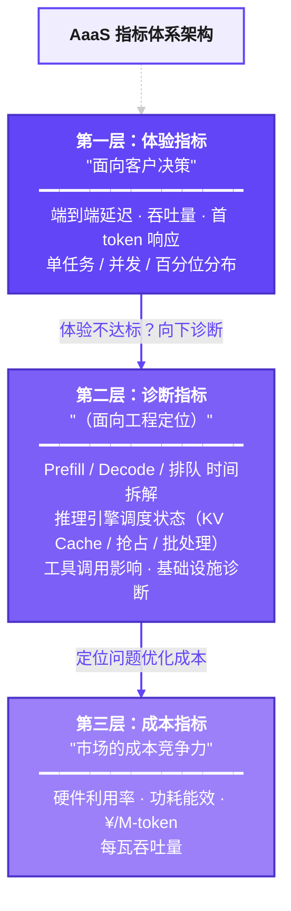

> **报告编号**：AAAS-RPT-20260422-001
> **测试日期**：2026-04-15 ~ 2026-04-21
> **测试芯片**：NGU800P vs NVIDIA A800 80GB
> **测试模型**：GLM-4.7-350B
> **Agent 场景**：AI Coding Agent（代码生成 / Bug 修复 / 代码审查）
> **评估框架**：SWE-bench Lite + HumanEval + 内部 Coding Benchmark
> **报告版本**：v1.0

---

# 第一部分：报告前置环境

---

## 一、测试环境与配置

### 1.1 验证环境配置

| 配置类别      | 配置项                    | NGU800P                         | 基准 A800                         |
| --------- | ---------------------- | ------------------------------- | ------------------------------- |
| **芯片**    | 型号                     | NGU800P-80G Rev.2               | A800-SXM4-80GB                  |
|           | 显存                     | 80 GB HBM2e                     | 80 GB HBM2e                     |
|           | 驱动版本                   | NGU800P-Driver v2.4.1           | NVIDIA 535.129.03               |
|           | 固件版本                   | NGU800P-FW v1.8.0               | —                               |
| **服务器**   | **HBM 带宽**             | 2.4 TB/s                        | 2.0 TB/s                        |
|           | **FP16 算力**            | 350 TFLOPS                      | 312 TFLOPS                      |
|           | **互联**                 | 自研 XLink 600GB/s                | NVLink 600GB/s                  |
|           | **卡数/节点**              | 8 卡                             | 8 卡                             |
|           | **服务器型号**              | `[待填写]`                         | DGX A800                        |
|           | **CPU**                | `[待填写]`                         | AMD EPYC 7742 × 2               |
|           | **RAM**                | `[待填写]`                         | 1 TB DDR4                       |
| **推理引擎**  | 引擎                     | vLLM v0.7.2 (NGU800P-fork)      | vLLM v0.7.2                     |
|           | **KV Cache 配置**        | Automatic Prefix Caching ON     | Automatic Prefix Caching ON     |
|           | tensor_parallel_size   | 4                               | 4                               |
|           | max_model_len          | 32768                           | 32768                           |
|           | max_num_batched_tokens | 8192                            | 8192                            |
|           | enable_prefix_caching  | true                            | true                            |
|           | gpu_memory_utilization | 0.92                            | 0.90                            |
| **模型**    | 名称                     | GLM-4.7-350B                    | GLM-4.7-350B                    |
|           | 量化模式                   | FP16                            | FP16                            |
|           | temperature            | 0 (greedy)                      | 0 (greedy)                      |
|           | top_p                  | 1.0                             | 1.0                             |
|           | top_k                  | -1（不启用）                        | -1（不启用）                        |
|           | n（生成数）                 | 1                               | 1                               |
|           | max_tokens             | 4096                            | 4096                            |
|           | frequency_penalty      | 0                               | 0                               |
|           | presence_penalty       | 0                               | 0                               |
|           | stop_sequences         | `["\n\nHuman:"]`                | `["\n\nHuman:"]`                |
|           | 响应方式                   | Stream                          | Stream                          |
| **Agent** | 框架                     | Claude Code Agent v3.2          | Claude Code Agent v3.2          |
|           | 工具列表                   | Read, Write, Grep, Bash, Test   | Read, Write, Grep, Bash, Test   |
|           | MCP Server             | file-ops v1.0, test-runner v1.0 | file-ops v1.0, test-runner v1.0 |

### 1.2 Agent 场景定义：AI Coding

| 场景属性 | 描述 |
| --- | --- |
| **Agent 类型** | Coding Agent（代码生成 + Bug 修复 + 代码审查） |
| **典型工作流** | Planning → Read files → Grep → 分析代码 → 生成修复 → Write file → 运行测试 → 输出总结 |
| **平均交互轮数** | 8 轮 / 任务 |
| **平均 Input tokens（累计）** | ~81,500 token（去重信息量 ~20,000 token，膨胀率 4.1×） |
| **平均 Output tokens** | ~5,250 token |
| **工具调用类型** | 文件读写、Grep 搜索、代码执行、测试运行（MCP Server） |
| **工具调用次数** | 3-5 次 / 任务 |

### 1.3 GPU集群推理验验证环境

**A800 × 1000 卡集群**：125 节点 × 8 卡/节点，按机架组织部署。

| 配置项 | 规格 |
| --- | --- |
| **集群规模** | 1000 卡（125 节点 × 8 卡/节点） |
| **机架布局** | 8 机架，每机架 15-16 节点 |
| **网络架构** | Spine-Leaf 二层架构 |
| **节点网络** | 100Gbps RoCEv2 × 2（双上联） |
| **Spine 交换机** | 4 × 12.8Tbps |
| **Leaf 交换机** | 8 × 6.4Tbps（每机架 1 台） |
| **存储** | 共享 NVMe SSD 存储池（全闪） |
| **存储网络** | 100Gbps RDMA 专用网络 |
| **管理网络** | 25Gbps 带外管理网络 |



> **节点内互联**：8 卡通过 NVLink/XLink 全互联（600GB/s），用于 Tensor Parallel。
> **节点间互联**：每节点 2× 100Gbps RoCEv2 上联至 Leaf 交换机，用于 Pipeline Parallel 和数据传输。
> **存储访问**：独立 100Gbps RDMA 网络连接共享 NVMe SSD 存储池，模型加载和 Checkpoint 读写不影响计算网络。

---

## 二、评测集 Case 列表

> **本章列出 AI Coding Agent 场景验证所用的全部评测 Case**，确保测试的可复现性和覆盖度。

| Case ID | 来源 | 任务描述 | 难度 | 预期轮数 | 涉及工具/核心验证能力 |
| ------- | --- | --- | --- | ----- | ------------ |
| SWE-001 | SWE-bench Lite | 修复 django/django QuerySet.filter() 对空列表的处理 | 中等 | 6-8 | Read, Grep, Write, Test |
| SWE-015 | SWE-bench Lite | 修复 scikit-learn/sklearn RandomForest n_jobs 参数不一致 | 简单 | 4-6 | Read, Write, Test |
| SWE-042 | SWE-bench Lite | 修复 sympy/sympy 矩阵行列式计算的边界条件 | 困难 | 10-15 | Read, Grep, Analyze, Write, Test |
| SWE-078 | SWE-bench Lite | 修复 flask/flask Blueprint 路由注册顺序问题 | 中等 | 6-8 | Read, Grep, Write, Test |
| SWE-123 | SWE-bench Lite | 修复 requests/requests Session 对象的 Cookie 持久化 Bug | 简单 | 4-5 | Read, Write, Test |
| SWE-189 | SWE-bench Lite | 修复 pandas/pandas DataFrame.merge() 的类型推断错误 | 困难 | 8-12 | Read, Grep, Analyze, Write, Test |
| SWE-201 | SWE-bench Lite | 修复 pytest/pytest fixture 作用域嵌套问题 | 中等 | 6-8 | Read, Grep, Write, Test |
| SWE-245 | SWE-bench Lite | 修复 numpy/numpy broadcasting 规则在特定 dtype 下的行为 | 困难 | 10-14 | Read, Grep, Analyze, Write, Test |
| SWE-280 | SWE-bench Lite | 修复 fastapi/fastapi Depends 注入的异步处理顺序 | 中等 | 5-7 | Read, Grep, Write, Test |
| SWE-300 | SWE-bench Lite | 修复 django/django Migration 循环依赖检测 | 困难 | 12-16 | Read, Grep, Analyze, Write, Test |
| ICB-001 | 内部 Coding Benchmark | 修复支付模块的金额精度丢失 | 中等 | 6-8 | 多文件定位 + 精确修改 |
| ICB-005 | 内部 Coding Benchmark | 将同步 API 改造为异步接口 | 困难 | 12-16 | 跨文件重构 + 接口兼容 |
| ICB-012 | 内部 Coding Benchmark | 实现基于 RBAC 的权限控制模块 | 困难 | 10-14 | 架构理解 + 完整实现 |
| ICB-018 | 内部 Coding Benchmark | 审查 PR 并给出修改建议 | 中等 | 4-6 | 代码理解 + 问题识别 |
| ICB-025 | 内部 Coding Benchmark | 优化 N+1 查询问题 | 中等 | 6-8 | SQL 分析 + ORM 优化 |
| ICB-030 | 内部 Coding Benchmark | 为核心业务逻辑补充单元测试 | 中等 | 5-7 | 边界分析 + 覆盖率 |
| ICB-035 | 内部 Coding Benchmark | 根据代码自动生成 API 文档 | 简单 | 3-5 | 代码理解 + 文档规范 |
| ICB-040 | 内部 Coding Benchmark | 将 Python 2 代码迁移到 Python 3 | 困难 | 14-18 | 兼容性分析 + 批量修改 |
| ICB-045 | 内部 Coding Benchmark | 修复 SQL 注入 + XSS 漏洞 | 困难 | 8-12 | 安全分析 + 防御编码 |
| ICB-050 | 内部 Coding Benchmark | 实现多环境配置切换方案 | 中等 | 5-7 | 架构设计 + 配置解耦 |

---

## 三、指标体系架构设计说明

### 3.1 AaaS 指标体系定位

本指标体系为 AaaS（Agent as a Service）验证平台的核心输出物，目标是用**一套统一、可量化、可比较的数据**回答三个关键问题：

> **体验**：Agent 在自研芯片上跑得够快吗？用户体验怎么样？
> **诊断**：如果不够快，瓶颈在哪？是芯片、引擎、模型还是工具层的问题？
> **成本**：跑同样的业务，自研芯片成本多少？对比 A800/H100 省多少？

### 3.2 三层指标架构说明




---

## 四、AaaS 指标 vs MaaS 指标的区别

> **MaaS 指标是"单次模型调用的成绩单"，
> AaaS 指标是"Agent 完成整个业务场景任务的成绩单"。

### 4.1 总体对比

| 维度       | MaaS 平台输出的指标                   | AaaS 平台输出的指标                        |
| -------- | ------------------------------ | ----------------------------------- |
| **观测对象** | 单次模型 API 调用                    | Agent 完整任务（含 N 次模型调用 + 工具调用）        |
| **数据粒度** | 请求级：一次请求的 TTFT、TPOT、token 数    | 任务级 + 请求级：全链路耗时、多轮加权聚合、累计 token 消耗  |
| **覆盖范围** | 仅模型推理链路（Prefill → Decode → 返回） | 模型推理 + 工具调用 + Agent 编排调度 + 上下文管理全栈  |
| **成本视角** | 单次请求成本（¥/req）                  | Agent 任务全链路成本（含 5-20 次调用 + 工具）      |
| **比较基准** | 同模型不同参数                        | 同一 Agent 任务 + 同一模型，跨芯片/集群的完整 A/B 对比 |

### 4.2 共有指标口径差异说明

| 指标 | MaaS 输出 | AaaS 输出 | 口径差异 |
| --- | --- | --- | --- |
| **TTFT** | 单次请求首 token 时间 | 首轮 TTFT + 末轮 TTFT + 散点图 | AaaS 不取平均，按轮分拆 |
| **TPOT** | 单次请求每 token 延迟 | 按 output_tokens 加权的任务级 TPOT | AaaS 加权聚合 N 轮 |
| **ITL** | 单次请求 token 间时延均值 | max(各轮 P99_ITL) | AaaS 出最差 P99 |
| **E2E Latency** | 单次请求端到端延迟 | 任务级 E2E（含工具+编排）+ 模型推理累计 | AaaS 含全链路 |
| **Input tokens** | 单次请求输入 token 数 | 累计调用量 + 去重信息量 + 上下文膨胀率 | AaaS 报两个口径 |


# 第二部分：指标明细

---

## 五、体验指标

> **价值定位**：面向客户决策层的"芯片性能成绩单"。体验指标直接回答三个业务问题——**单任务够不够快**（TTFT/TPOT/E2E 是否满足实时交互体验）、**并发扛不扛得住**（吞吐量和成功率在 10-100 Agent 并发下是否稳定）、**百分位长尾可不可控**（P99 延迟是否在客户 SLO 范围内）。客户的芯片 POC 验收和采购决策主要看这一层，指标不达标则直接否决。

> [!note] 测试基数规则
> 单个 Case × 8 轮模型调用 × 10 次重复执行 = **80 次模型调用/Case**。本节所有指标均基于此基数进行聚合统计。单次值 = 10 次重复的中位数；汇总值 = 全部 Case 的聚合。

### 5.1 单任务基线测试

**【AI Coding 场景样例：Claude Code 修复 Bug，8 轮调用，10 次重复取中位数】**

| 指标                         | NGU800P     | A800 80GB   | 对比    | 判定    | 计算说明                                                                                                                                                                                                                                                                                                                                                                                                                                                                                                   |
| -------------------------- | ----------- | ----------- | ----- | ----- | ------------------------------------------------------------------------------------------------------------------------------------------------------------------------------------------------------------------------------------------------------------------------------------------------------------------------------------------------------------------------------------------------------------------------------------------------------------------------------------------------------ |
| **首轮 TTFT**                | 135 ms      | 148 ms      | -8.8% | 达标    | **首轮 TTFT = T(first_token_received) − T(request_sent)**<br><br>即：$TTFT_1 = t_{first\_token}^{(R1)} - t_{request}^{(R1)}$<br><br>其中：<br>- **R1**：Agent 任务第 1 轮模型调用<br>- **t_first_token**：模型返回第一个 token 的时间戳<br>- **t_request**：客户端发送请求的时间戳<br>- 单位：**ms**<br><br>**1. 取首轮而非跨轮平均**——首轮 input_tokens 最少（~2K），TTFT 最小，代表用户首次感知的响应速度。<br><br>**2. 取 10 次重复的中位数**——排除偶发冷启动或 GC 抖动对结果的污染。                                                                                                                    |
| **末轮 TTFT**                | 980 ms      | 1,020 ms    | -3.9% | 达标    | **末轮 TTFT = T(first_token_received) − T(request_sent)，取第 8 轮**<br><br>即：$TTFT_8 = t_{first\_token}^{(R8)} - t_{request}^{(R8)}$<br><br>其中：<br>- **R8**：Agent 任务第 8 轮（末轮）模型调用<br>- **t_first_token**：模型返回第一个 token 的时间戳<br>- **t_request**：客户端发送请求的时间戳<br>- 单位：**ms**<br><br>**1. 末轮 input_tokens 最多（~18.5K）**——代表最长上下文下的 Prefill 性能，是 TTFT 的最坏情况。<br><br>**2. 首轮与末轮配对观察**——两者差距反映 Prefill 随上下文长度增长的劣化程度。                                                                                               |
| **加权 平均TPOT**              | 13.8 ms/tok | 14.2 ms/tok | -2.8% | 达标    | **加权 TPOT = Σ(TPOT_i × output_tokens_i) / Σ(output_tokens_i)**<br><br>即：$TPOT_{weighted} = \frac{\sum_{r=1}^{8} TPOT_r \times out_r}{\sum_{r=1}^{8} out_r}$<br><br>其中：<br>- **r**：轮次编号（1-8）<br>- **TPOT_r**：第 r 轮的 TPOT = (last_token_time − first_token_time) / (output_tokens − 1)<br>- **out_r**：第 r 轮的 output_tokens 数<br>- 单位：**ms/token**<br><br>**1. 按 output_tokens 加权而非算术平均**——生成 2000 token 的重轮次对用户体验影响远大于生成 100 token 的轻轮次。<br><br>**2. 跨 8 轮聚合后取 10 次重复的中位数**——先轮内计算 TPOT，再跨轮加权，最后跨重复取中位数。 |
| **max P99_ITL**            | 18.5 ms/tok | 17.2 ms/tok | +7.6% | 关注    | **max P99_ITL = max(各轮的 P99 ITL)**<br><br>即：$ITL_{max\_P99} = \max_{r=1}^{8} P99(ITL_r)$<br><br>其中：<br>- **ITL_r**：第 r 轮所有相邻 token 间隔时间的集合 $\{t_{k+1} - t_k\}$<br>- **P99(ITL_r)**：第 r 轮 ITL 分布的第 99 百分位值<br>- 单位：**ms/token**<br><br>**1. 取各轮 P99 的最大值而非平均**——用户感知的"卡顿"由最差轮次决定，均值会掩盖尾部抖动。<br><br>**2. 取 10 次重复的中位数**——确保最差轮次的 P99 ITL 是稳定可复现的，而非偶发抖动。                                                                                                                                                 |
| **AaaS-Latency（任务 E2E）**   | 132 s       | 140 s       | -5.7% | 达标    | **AaaS-Latency = T(task_end) − T(task_start)**<br><br>即：$Latency_{AaaS} = t_{task\_end} - t_{task\_start}$<br><br>其中：<br>- **t_task_start**：Agent 接收到任务的时间戳<br>- **t_task_end**：Agent 输出最终结果的时间戳<br>- 包含：全部模型推理 + 工具调用 + Agent 编排调度耗时<br>- 单位：**s**<br><br>**1. 这是用户感知的完整任务时长**——从发出"修复这个 Bug"到收到最终答案的墙钟时间。<br><br>**2. 与 MaaS-Latency 配对观察**——两者差值 = 非推理开销（工具调用 + 编排 + 网络），用于定位瓶颈。                                                                                                                    |
| **MaaS-Latency（模型推理时长累计）** | 76 s        | 81 s        | -6.2% | 达标    | **MaaS-Latency = Σ(各轮模型推理耗时)**<br><br>即：$Latency_{MaaS} = \sum_{r=1}^{8} (t_{last\_token}^{(r)} - t_{request}^{(r)})$<br><br>其中：<br>- **r**：轮次编号（1-8）<br>- **t_last_token**：第 r 轮最后一个 token 返回的时间戳<br>- **t_request**：第 r 轮请求发送的时间戳<br>- 单位：**s**<br><br>**1. 仅累加模型推理部分**——不含工具调用、编排调度等非推理开销，纯粹衡量芯片推理能力。<br><br>**2. 模型推理占比 = MaaS-Latency / AaaS-Latency**——本例中 76/132 = 59.1%，说明约 40% 时间花在非推理环节。                                                                                                     |
| **Input tokens（累计调用量）**    | 81,500      | 81,500      | —     | 同一评估集 | **累计 Input tokens = Σ(各轮 input_tokens)**<br><br>即：$Tokens_{input\_cum} = \sum_{r=1}^{8} input\_tokens_r$<br><br>其中：<br>- **input_tokens_r**：第 r 轮发送给模型的完整 input token 数（含历史上下文）<br>- 单位：**tokens**<br><br>**1. 包含跨轮重复上下文**——Agent 每轮会把前几轮对话历史拼入 input，导致累计调用量远大于净信息量。<br><br>**2. 与去重信息量配对使用**——膨胀率 = 累计 / 去重 = 81500 / 20000 = 4.1×，膨胀率越高说明上下文管理越低效。                                                                                                                                                  |
| **Input tokens（去重信息量）**    | 20,000      | 20,000      | —     | 同一评估集 | **去重 Input tokens = 去除跨轮重复后的净信息量**<br><br>即：$Tokens_{input\_dedup} = \|Union(\text{各轮 input 中的唯一 token 序列})\|$<br><br>其中：<br>- 去重方法：识别各轮 input 中重复出现的上下文片段（系统 prompt、历史对话等），只计一次<br>- 单位：**tokens**<br><br>**1. 反映任务的真实信息量**——81,500 累计调用中实际只有 20,000 token 是新增信息。<br><br>**2. 上下文膨胀率 = 累计 / 去重**——4.1× 的膨胀率意味着 Prefix Cache 命中潜力很大，可节省 75% 的 Prefill 计算。                                                                                                                                              |
| **Output tokens（总量）**      | 5,250       | 5,250       | —     | 同一评估集 | **Output tokens = Σ(各轮 output_tokens)**<br><br>即：$Tokens_{output} = \sum_{r=1}^{8} output\_tokens_r$<br><br>其中：<br>- **output_tokens_r**：第 r 轮模型生成的 output token 数<br>- 单位：**tokens**<br><br>**1. 输出量决定 Decode 阶段耗时**——Decode 是逐 token 自回归生成，output_tokens 直接决定推理时长。<br><br>**2. 两张芯片的 output 数一致**——使用 temperature=0 greedy decoding，确保输出长度可比。                                                                                                                                                        |
| **输出吞吐量（任务有效）**            | 39.8 tok/s  | 37.5 tok/s  | +6.1% | 优秀    | **任务有效输出吞吐量 = Σ(output_tokens) / task_duration**<br><br>即：$Throughput_{task} = \frac{\sum_{r=1}^{8} output\_tokens_r}{T_{task\_end} - T_{task\_start}}$<br><br>其中：<br>- **output_tokens_r**：第 r 轮生成的 output token 数<br>- **T_task_end − T_task_start**：任务端到端墙钟时间（含工具调用等待）<br>- 单位：**tokens/s**<br><br>**1. 分母是任务全程时间**——包含工具调用、编排等非推理等待，反映用户实际感受到的生成速度。<br><br>**2. 低于模型纯推理吞吐量是正常的**——任务有效吞吐 39.8 vs 纯推理 69.1，差距来自 40% 的非推理时间。                                                                         |
| **输出吞吐量（模型纯推理）**           | 69.1 tok/s  | 64.8 tok/s  | +6.6% | 优秀    | **模型纯推理输出吞吐量 = Σ(output_tokens) / Σ(各轮推理耗时)**<br><br>即：$Throughput_{model} = \frac{\sum_{r=1}^{8} output\_tokens_r}{\sum_{r=1}^{8} latency_r^{(inference)}}$<br><br>其中：<br>- **output_tokens_r**：第 r 轮生成的 output token 数<br>- **latency_r^(inference)**：第 r 轮的纯模型推理耗时（Prefill + Decode）<br>- 单位：**tokens/s**<br><br>**1. 分母仅含推理时间**——剔除工具调用、编排等非推理开销，纯粹衡量芯片的 Decode 生成能力。<br><br>**2. 与任务有效吞吐量配对观察**——两者比值反映推理时间占比，本例 39.8/69.1 ≈ 57.6%。                                                               |
| **总吞吐量（输入+输出）** | 1,600 tok/s | 1,540 tok/s | +3.9% | 达标 | **总吞吐量 = Σ(input_tokens + output_tokens) / task_duration**<br><br>即：$Throughput_{total} = \frac{\sum_{r=1}^{8}(in_r + out_r)}{T_{task}}$<br><br>其中：<br>- **in_r / out_r**：第 r 轮的 input / output token 数<br>- **T_task**：任务端到端时长（秒）<br>- 单位：**tokens/s**<br><br>**1. 包含 input+output**——区别于"输出吞吐量"仅统计 output，总吞吐量反映系统处理的完整 token 工作量。<br><br>**2. 对 input/output 比例差异大的 Agent 场景**——提供跨场景的公平比较基础。 |
| **QPS（系统请求吞吐）**            | 5.2 req/s   | 4.8 req/s   | +8.3% | 达标    | **QPS = 成功完成的请求数 / 测试总时长**<br><br>即：$QPS = \frac{N_{success}}{T_{total}}$<br><br>其中：<br>- **N_success**：测试期间成功完成（HTTP 2xx 且结果有效）的请求数<br>- **T_total**：测试的端到端总时长（秒）<br>- 单位：**req/s**<br><br>**1. 只计"成功请求"**——超时、报错的请求不纳入，避免虚高。<br><br>**2. 反映系统在单任务基线下的请求处理能力**——并发场景下 QPS 会随并发数线性增长（理想情况）。                                                                                                                                                                                                            |
| **QPM（分钟级吞吐）**             | 312 req/min | 288 req/min | +8.3% | 达标    | **QPM = QPS × 60**<br><br>即：$QPM = QPS \times 60$<br><br>其中：<br>- **QPS**：每秒请求吞吐量<br>- 单位：**req/min**<br><br>**1. QPM 是 QPS 的分钟级换算**——便于与业务侧按分钟计费的 SLA 对齐。<br><br>**2. 适用于容量规划**——"1000 卡集群每分钟能处理多少请求"直接用 QPM × 节点数估算。                                                                                                                                                                                                                                                                                 |

#### Agent 多轮调用明细（样例 TASK-20260418-042）

```
轮次  阶段              input     output   TTFT      TPOT       E2E
────────────────────────────────────────────────────────────────────
R1    Planning          2,000     500      135ms     12.1ms     6.2s
R2    Read files(tool)  4,200     200      215ms     11.5ms     2.5s
R3    Grep(tool)        5,500     100      285ms     10.8ms     1.3s
R4    分析代码           8,000     1,200    420ms     13.6ms    16.8s
R5    生成修复代码        12,000    2,000    650ms     15.2ms    31.0s
R6    Write file(tool)  14,500    150      740ms     12.8ms     2.6s
R7    运行测试+反思       16,800    800      870ms     14.5ms    12.5s
R8    输出总结            18,500    300      980ms     13.2ms     5.1s
────────────────────────────────────────────────────────────────────
合计（API 累计调用量）     81,500    5,250    —         —          78s (模型)
任务总时长（含工具等待）：  约 132s
模型推理时间占比：         78/132 = 59.1%
```

#### 图表 E1：TTFT vs Input Tokens 散点图

> 各轮 (input_tokens, TTFT) 散点 + 回归线
> 两色对比：NGU800P（蓝）vs A800（灰）
> **斜率越平 = 长上下文 Prefill 越高效**


#### 图表 E2：Agent 任务时间瀑布图

> 一个 AI Coding Agent 任务各轮耗时拆解：Prefill + Decode + 工具 + 编排
> **一眼看出时间花在哪了**


---

### 5.2 并发压力测试

> [!note] 测试基数规则
> 单个 Case × 8 轮模型调用 × 10 次重复执行 = **80 次模型调用/Case**。本节所有指标均基于此基数进行聚合统计。单次值 = 10 次重复的中位数；汇总值 = 全部 Case 的聚合。

**【并发梯度：10 / 50 Agent 同时运行】**

**测试元数据**：

| 项目           | NGU800P                   | A800                     | 计算说明                                                                                                                                                                                                                                                                                                                                                        |
| ------------ | ------------------------- | ------------------------ | ----------------------------------------------------------------------------------------------------------------------------------------------------------------------------------------------------------------------------------------------------------------------------------------------------------------------------------------------------------- |
| **测试总时长**    | 1,800 s                   | 1,800 s                  | **测试总时长 = 固定测试窗口时间**<br><br>即：$T_{total} = T_{window\_end} - T_{window\_start}$<br><br>其中：<br>- **T_window_start**：测试窗口开始时间戳<br>- **T_window_end**：测试窗口结束时间戳<br>- 单位：**s**<br><br>**1. 采用固定时长窗口而非固定请求数**——保证两张芯片在相同时间压力下对比，避免因吞吐差异导致测试时长不同。<br><br>**2. 1800s（30 分钟）覆盖全部并发梯度**——每个梯度运行足够时间以稳定统计量。                                                           |
| **总请求数**     | 12,480                    | 12,480                   | **总请求数 = Σ(各并发梯度的请求数)**<br><br>即：$N_{total} = \sum_{c \in \{1,2,4,8,16,32\}} N_c$<br><br>其中：<br>- **c**：并发梯度<br>- **N_c**：并发数 c 下发出的总请求数<br>- 单位：**次**<br><br>**1. 含所有并发梯度的请求总和**——不区分成功/失败，是测试的总工作量基数。<br><br>**2. 两张芯片请求数一致**——使用相同的测试脚本和任务集，确保工作量完全对等。                                                                                                   |
| **成功请求数**    | 12,362                    | 12,418                   | **成功请求数 = HTTP 2xx 且结果有效的请求数**<br><br>即：$N_{success} = \|\{req_i \mid status_i = 2xx \land valid(result_i)\}\|$<br><br>其中：<br>- **status_i**：第 i 个请求的 HTTP 响应状态码<br>- **valid(result_i)**：结果通过格式校验且非空<br>- 单位：**次**<br><br>**1. 双重判定标准**——HTTP 2xx 只是网络层成功，还需校验模型输出是否有效（非截断、格式正确）。<br><br>**2. 成功率 = 成功请求数 / 总请求数**——是并发稳定性的核心指标。                           |
| **失败请求数**    | 118                       | 62                       | **失败请求数 = 总请求数 − 成功请求数**<br><br>即：$N_{fail} = N_{total} - N_{success}$<br><br>其中：<br>- **N_total**：测试期间发出的总请求数<br>- **N_success**：HTTP 2xx 且结果有效的请求数<br>- 单位：**次**<br><br>**1. 失败请求需分类归因**——下方"错误类型分布"进一步拆解为超时、OOM、限流等子类。<br><br>**2. 失败率 = N_fail / N_total**——超过 2% 应触发告警排查。                                                                              |
| **超时请求数**    | 85                        | 42                       | **超时请求数 = 响应时间超过 SLO 阈值的请求数**<br><br>即：$N_{timeout} = \|\{req_i \mid latency_i > SLO_{threshold}\}\|$<br><br>其中：<br>- **latency_i**：第 i 个请求的端到端响应时间<br>- **SLO_threshold**：SLO 约定的最大响应时间阈值<br>- 单位：**次**<br><br>**1. 超时阈值需与业务 SLA 对齐**——不同场景的超时标准不同，本测试默认 30s/请求。<br><br>**2. 超时请求计入失败但不计入吞吐分子**——避免长尾请求拉低吞吐量。                                              |
| **限流/拒绝请求数** | 33                        | 20                       | **限流/拒绝请求数 = HTTP 429 或队列溢出被拒绝的请求数**<br><br>即：$N_{throttled} = \|\{req_i \mid status_i = 429 \lor queue\_overflow_i\}\|$<br><br>其中：<br>- **status_i = 429**：服务端返回 Too Many Requests<br>- **queue_overflow_i**：请求因调度队列已满被直接拒绝<br>- 单位：**次**<br><br>**1. 限流反映系统容量上限**——高并发下出现限流说明已接近系统最大承载能力。<br><br>**2. 限流策略应与 OOM 防护联动**——宁可限流也不让 OOM 导致全局服务中断。            |
| **错误类型分布**   | 超时 72% / OOM 18% / 限流 10% | 超时 68% / OOM 8% / 限流 24% | **错误类型分布 = 各类错误数 / 总失败数 × 100%**<br><br>即：$Ratio_{type} = \frac{N_{type}}{N_{fail}} \times 100\%$<br><br>其中：<br>- **type**：错误类型（超时 / OOM / 限流 / 其他）<br>- **N_type**：该类型的错误数量<br>- **N_fail**：总失败请求数<br>- 单位：**%**<br><br>**1. 错误类型决定优化方向**——超时多→优化 Decode 速度；OOM 多→优化显存管理；限流多→扩容或调优调度。<br><br>**2. NGU800P 的 OOM 占比（18%）高于 A800（8%）**——提示 KV Cache 内存管理需优化。 |


**并发Agent指标**（并发 10 Agent 场景）：

| 指标                 | NGU800P     | A800        | 对比     | 计算说明                                                                                                                                                                                                                                                                                                                                                                                                                                                |
| ------------------ | ----------- | ----------- | ------ | --------------------------------------------------------------------------------------------------------------------------------------------------------------------------------------------------------------------------------------------------------------------------------------------------------------------------------------------------------------------------------------------------------------------------------------------------- |
| **请求吞吐量**          | 42.5 req/s  | 40.8 req/s  | +4.2%  | **请求吞吐量 = 成功完成的请求数 / 测试总时长**<br><br>即：$RPS = \frac{N_{success}}{T_{total}}$<br><br>其中：<br>- **N_success**：测试期间成功完成的请求数<br>- **T_total**：测试的端到端总时长（秒）<br>- 单位：**req/s**<br><br>**1. 只计成功请求**——失败/超时请求不纳入，反映系统有效处理能力。<br><br>**2. 与 QPS 口径一致但场景不同**——此处在并发 16 Agent 下测量，体现高负载下的处理能力。                                                                                                                                                                  |
| **总吞吐量（输入+输出）**    | 1,280 tok/s | 1,245 tok/s | +2.8%  | **总吞吐量 = Σ(input_tokens + output_tokens) / 测试总时长**<br><br>即：$Throughput_{total} = \frac{\sum_{i=1}^{N} (input\_tokens_i + output\_tokens_i)}{T_{total}}$<br><br>其中：<br>- **input_tokens_i**：第 i 个请求的输入 token 数<br>- **output_tokens_i**：第 i 个请求的输出 token 数<br>- **T_total**：测试的端到端总时长（秒）<br>- 单位：**tokens/s**<br><br>**1. 含 input + output**——反映系统处理的总 token 吞吐能力，包括 Prefill 和 Decode 两阶段。<br><br>**2. 与输出吞吐量区分使用**——总吞吐量受 input 长度影响大，不宜单独用于跨场景对比。 |
| **有效吞吐量 Goodput**  | 842 tok/s   | 838 tok/s   | +0.5%  | **Goodput = 仅成功请求的 output_tokens / 测试总时长**<br><br>即：$Goodput = \frac{\sum_{i=1}^{N_{success}} output\_tokens_i}{T_{total}}$<br><br>其中：<br>- **N_success**：成功完成的请求数<br>- **output_tokens_i**：第 i 个成功请求的输出 token 数<br>- **T_total**：测试的端到端总时长（秒）<br>- 单位：**tokens/s**<br><br>**1. 只计成功请求的 output**——超时、报错的请求产出的 token 对用户无价值，不应计入。<br><br>**2. Goodput 是最严格的吞吐量指标**——成功率 × 输出吞吐量的综合体现。                                                                |
| **端到端延迟均值**        | 385 ms      | 360 ms      | +6.9%  | **端到端延迟均值 = mean(各请求的 E2E 延迟)**<br><br>即：$\overline{Latency_{E2E}} = \frac{1}{N} \sum_{i=1}^{N} (t_{last\_token}^{(i)} - t_{request}^{(i)})$<br><br>其中：<br>- **t_last_token**：第 i 个请求最后一个 token 返回的时间戳<br>- **t_request**：第 i 个请求发送的时间戳<br>- **N**：成功请求数<br>- 单位：**ms**<br><br>**1. 并发场景下延迟包含排队时间**——高并发时请求在调度队列中等待，导致 E2E 延迟高于单任务基线。<br><br>**2. 取 10 次重复的中位数**——消除偶发抖动对均值的干扰。                                                                     |
| **TPOT 均值**        | 16.2 ms/tok | 15.5 ms/tok | +4.5%  | **TPOT 均值 = 按 output_tokens 加权的任务级 TPOT**<br><br>即：$\overline{TPOT} = \frac{\sum_{i=1}^{N} TPOT_i \times out_i}{\sum_{i=1}^{N} out_i}$<br><br>其中：<br>- **TPOT_i**：第 i 个请求的 TPOT = (last_token_time − first_token_time) / (output_tokens − 1)<br>- **out_i**：第 i 个请求的 output_tokens 数<br>- 单位：**ms/token**<br><br>**1. 加权聚合口径同 §5.1**——按 output_tokens 加权而非算术平均，重请求贡献更大。<br><br>**2. 并发下 TPOT 通常高于单任务基线**——多请求共享 GPU 计算资源导致每个请求的 Decode 变慢。          |
| **ITL 均值**         | 17.8 ms/tok | 16.5 ms/tok | +7.9%  | **ITL 均值 = mean(各请求的平均 ITL)**<br><br>即：$\overline{ITL} = \frac{1}{N} \sum_{i=1}^{N} \overline{ITL_i}$<br><br>其中：<br>- **$\overline{ITL_i}$**：第 i 个请求的平均 token 间隔时间 = mean({t_{k+1} − t_k})<br>- **N**：成功请求数<br>- 单位：**ms/token**<br><br>**1. ITL 反映用户感知的"流畅度"**——ITL 越稳定（方差越小），用户看到的打字效果越平滑。<br><br>**2. ITL 均值与 TPOT 近似但不相同**——TPOT 不含首 token，ITL 逐 token 计算包含更多细节。                                                                                |
| **Decode 阶段平均延迟**  | 128 ms      | 118 ms      | +8.5%  | **Decode 阶段延迟 = T(decode_end) − T(decode_start)**<br><br>即：$Latency_{decode} = t_{last\_token} - t_{first\_token}$<br><br>其中：<br>- **t_first_token**：第一个生成 token 返回的时间戳（Prefill 结束）<br>- **t_last_token**：最后一个生成 token 返回的时间戳<br>- 单位：**ms**<br><br>**1. Decode 是推理的主要耗时阶段**——典型占比 60-70%，是优化 TPOT 的关键。<br><br>**2. Decode 延迟 ≈ TPOT × (output_tokens − 1)**——两者可交叉验证数据一致性。                                                                         |
| **模型推理累计耗时**       | 42,800 ms   | 45,200 ms   | -5.3%  | **模型推理累计耗时 = Σ(各请求的推理耗时)**<br><br>即：$T_{inference\_total} = \sum_{i=1}^{N} (t_{last\_token}^{(i)} - t_{request}^{(i)})$<br><br>其中：<br>- **t_last_token**：第 i 个请求最后一个 token 返回的时间戳<br>- **t_request**：第 i 个请求到达推理引擎的时间戳<br>- **N**：成功请求数<br>- 单位：**ms**<br><br>**1. 累计耗时反映芯片的"总工作量"**——并发场景下多请求并行，累计耗时远大于墙钟时间。<br><br>**2. 推理效率 = 总 output_tokens / 累计耗时**——与输出吞吐量相互验证。                                                                              |
| **平均排队等待时间**       | 65 ms       | 48 ms       | +35.4% | **平均排队等待时间 = mean(T(inference_start) − T(request_arrive))**<br><br>即：$\overline{T_{queue}} = \frac{1}{N} \sum_{i=1}^{N} (t_{infer\_start}^{(i)} - t_{arrive}^{(i)})$<br><br>其中：<br>- **t_arrive**：请求到达调度队列的时间戳<br>- **t_infer_start**：请求开始推理（Prefill 开始）的时间戳<br>- **N**：成功请求数<br>- 单位：**ms**<br><br>**1. 排队时间是并发场景的关键指标**——单任务基线下接近 0，高并发下可能占 E2E 延迟的 10-30%。<br><br>**2. 排队时间长说明调度器 batch 已满**——需增大 max_num_batched_tokens 或扩容。                    |
| **KV Cache 使用率峰值** | 88%         | 82%         | 偏高     | **KV Cache 使用率峰值 = max(已用 KV Cache / 总 KV Cache 容量)**<br><br>即：$KV_{peak} = \max_{t} \frac{KV\_used(t)}{KV\_total} \times 100\%$<br><br>其中：<br>- **KV_used(t)**：时刻 t 的 KV Cache 已占用显存<br>- **KV_total**：KV Cache 可用显存总量（由 gpu_memory_utilization 参数决定）<br>- 单位：**%**<br><br>**1. KV Cache 峰值 > 85% 触发告警**——过高会导致请求被抢占或 OOM。<br><br>**2. NGU800P 峰值 88% 偏高**——建议调低 gpu_memory_utilization 或优化 KV Cache 分配策略。                                         |
| **被抢占请求数**         | 12          | 5           | 抢占过多   | **被抢占请求数 = continuous batching 中被抢占的请求数**<br><br>即：$N_{preempt} = \|\{req_i \mid preempted_i = true\}\|$<br><br>其中：<br>- **preempted_i**：第 i 个请求在 Decode 过程中因 KV Cache 不足被调度器中断<br>- 被抢占的请求会被重新入队，导致延迟增加<br>- 单位：**次**<br><br>**1. 抢占是 KV Cache 压力的直接后果**——KV Cache 峰值 88% 时抢占频繁发生。<br><br>**2. 抢占导致请求延迟翻倍**——被抢占的请求需重新 Prefill 已生成的 KV Cache。                                                                                                      |
| **超时请求数**          | 18          | 8           | —      | **超时请求数 = 响应时间超过 SLO 阈值的请求数**<br><br>即：$N_{timeout} = \|\{req_i \mid latency_i > SLO_{threshold}\}\|$<br><br>其中：<br>- **latency_i**：第 i 个请求的端到端响应时间<br>- **SLO_threshold**：SLO 约定的最大响应时间阈值<br>- 单位：**次**<br><br>**1. 并发 16 场景下的超时**——与测试元数据中的总超时数（85）区分，此处仅为并发 16 梯度的超时数。<br><br>**2. 超时原因需结合排队时间和 KV Cache 使用率联合诊断**——排队久 or Decode 慢都可能导致超时。                                                                                                      |
| **限流/拒绝请求数**       | 5           | 3           | —      | **限流/拒绝请求数 = HTTP 429 或队列溢出被拒绝的请求数**<br><br>即：$N_{throttled} = \|\{req_i \mid status_i = 429 \lor queue\_overflow_i\}\|$<br><br>其中：<br>- **status_i = 429**：服务端返回 Too Many Requests<br>- **queue_overflow_i**：请求因调度队列已满被直接拒绝<br>- 单位：**次**<br><br>**1. 并发 16 下限流量少**——说明系统容量尚未到极限，32 并发时限流会显著增加。<br><br>**2. 限流是系统的自我保护机制**——优于让请求全部涌入导致 OOM。                                                                                                       |

**高并发 Agent 指标**（并发 100 Agent 场景）：

| 指标 | NGU800P | A800 | 对比 | 计算说明 |
| --- | --- | --- | --- | --- |
| **输出吞吐量** | 3,850 tok/s | 4,120 tok/s | -6.6% | **同 §5.1 输出吞吐量口径**，100 Agent 并发下的系统级聚合吞吐量。<br><br>**1. NGU800P 在 100 并发下吞吐落后 A800 6.6%**——与 10 并发时领先 4.2% 形成反转，高并发暴露了 KV Cache 管理的短板。 |
| **成功率** | 96.8% | 98.2% | -1.4pp | **成功率 = 成功请求数 / 总请求数 × 100%**<br><br>**1. 100 并发下成功率显著下降**——NGU800P 降至 96.8%（10 并发时 99.6%），主要因 OOM 和超时增多。<br><br>**2. 低于 99% 的成功率在生产环境不可接受**——需优化 KV Cache 或限制最大并发数。 |
| **TTFT 均值** | 1,250 ms | 980 ms | +27.6% | **同 §5.1 TTFT 口径**，100 并发下因 Prefill 排队导致 TTFT 剧烈退化。<br><br>**1. TTFT > 1s 用户感知明显等待**——100 并发下 NGU800P 的首 token 响应已进入"卡顿"区间。 |
| **TPOT 均值** | 22.5 ms/tok | 19.8 ms/tok | +13.6% | **同 §5.1 加权 TPOT 口径**，100 并发下 Decode 资源争用加剧。<br><br>**1. TPOT > 20ms 对应输出速度 < 50 tok/s**——接近用户可感知的"慢速打字"体验阈值。 |
| **端到端延迟 P99** | 8,500 ms | 6,200 ms | +37.1% | **E2E 延迟 = T(last_token) − T(request_sent)**，取 P99。<br><br>**1. P99 延迟 8.5s 远超生产 SLO**——典型 SLO 为 3-5s，100 并发下 NGU800P 不满足生产要求。 |
| **平均排队等待时间** | 420 ms | 285 ms | +47.4% | **同 §5.2 排队等待口径**。<br><br>**1. 排队时间占 E2E 的 33%**——单任务基线下仅 2.3%，100 并发放大了调度瓶颈。 |
| **KV Cache 使用率峰值** | 96% | 91% | 超限 | **同 §6.3 KV Cache 口径**。<br><br>**1. 96% 已触发危险线**——频繁抢占和 OOM 导致成功率下降。 |
| **被抢占请求数** | 185 | 62 | 3× | **同 §6.3 口径**。<br><br>**1. 抢占数 185 = 约 1.5% 的请求被中断重试**——直接拉高尾部延迟。 |

**高并发 Agent 任务质量**（并发 100 Agent 场景）：

| 指标 | NGU800P | A800 | 对比 | 计算说明 |
| --- | --- | --- | --- | --- |
| **Agent 任务完成率** | 92.5% | 95.8% | -3.3pp | **同 §6.2 口径**，100 并发下因超时和 OOM 导致更多任务中途失败。<br><br>**1. 92.5% 意味着每 13 个任务有 1 个失败**——对 KA 客户而言不可接受（要求 > 99%）。 |
| **决策准确率** | 94.2% | 96.5% | -2.3pp | **同 §6.2 口径**。<br><br>**1. 高并发下决策准确率下降 2.6pp**——推理延迟增大可能导致 Agent 在超时边界做出次优决策。 |
| **工具调用正确率** | 93.8% | 95.5% | -1.7pp | **同 §6.2 口径**。<br><br>**1. 工具调用在高并发下更易失败**——MCP Server 连接池耗尽和响应超时增多。 |
| **平均任务耗时** | 4.8 min | 3.5 min | +37.1% | **同 §6.2 口径**。<br><br>**1. 任务耗时翻倍**——从单任务 2.2min 到 100 并发 4.8min，排队和重试是主因。 |
| **平均交互轮数** | 9.5 | 8.6 | +10.5% | **同 §6.2 口径**。<br><br>**1. 轮数增加 = 隐性成本膨胀**——因超时重试和决策错误需额外轮次修正，增加 ~15% 的 token 消耗。 |

#### 图表 E3：并发扩展效率曲线

> X = 并发数 (1→32)，Y = 吞吐量 (token/s)
> 两条线：NGU800P（蓝）vs A800（灰）
> **曲线越平 = 扩展越好**


---

### 5.3 百分位性能分布

> [!note] 测试基数规则
> 单个 Case × 8 轮模型调用 × 10 次重复执行 = **80 次模型调用/Case**。本节所有指标均基于此基数进行聚合统计。单次值 = 10 次重复的中位数；汇总值 = 全部 Case 的聚合。

**【稳定性分布验证 —— NGU800P vs A800】**

> 计算说明：各百分位值均基于全部 Case 的 80 次模型调用聚合得出，P50/P75/P90/P99/max 分别为对应分位点。

| 指标 | | P50 | P75 | P90 | P99 | max | SLO_P90 | 判定 |
| --- | --- | --- | --- | --- | --- | --- | --- | --- |
| **TTFT (ms)** | NGU800P | 95 | 120 | 142 | 380 | 520 | ≤200 | 🟢 |
| | A800 | 88 | 110 | 135 | 340 | 480 | ≤200 | 🟢 |
| **TPOT (ms/tok)** | NGU800P | 12.5 | 13.8 | 15.2 | 18.5 | 22.1 | ≤20 | 🟢 |
| | A800 | 12.0 | 13.2 | 14.6 | 17.2 | 20.8 | ≤20 | 🟢 |
| **Decode 延迟 (ms)** | NGU800P | 72 | 85 | 96 | 125 | 168 | ≤120 | 🟢 |
| | A800 | 68 | 80 | 92 | 118 | 155 | ≤120 | 🟢 |
| **E2E 推理延迟 (ms)** | NGU800P | 165 | 185 | 210 | 280 | 350 | ≤250 | 🟢 |
| | A800 | 155 | 175 | 198 | 260 | 330 | ≤250 | 🟢 |
| **生成速度 (tok/s)** | NGU800P | 72 | 68 | 64 | 52 | 42 | ≥55 | 🟢 |
| | A800 | 75 | 70 | 66 | 55 | 45 | ≥55 | 🟢 |
| **最后一个 token 平均时延 (ms)** | NGU800P | 120 | 150 | 172 | 198 | 240 | ≤200 | 🟢 |
| | A800 | 110 | 140 | 165 | 190 | 225 | ≤200 | 🟢 |
| **最大 Decode 阶段平均时延 (ms)** | NGU800P | 95 | 160 | 182 | 218 | 265 | ≤220 | 🟢 |
| | A800 | 88 | 148 | 175 | 205 | 245 | ≤220 | 🟢 |
| **请求推理平均时延 (ms)** | NGU800P | 105 | 182 | 212 | 275 | 345 | ≤250 | 🟢 |
| | A800 | 98 | 170 | 200 | 255 | 320 | ≤250 | 🟢 |

**输入输出特征分布**：

| 指标 | | P50 | P75 | P90 | P99 | max | SLO_P90 |
| --- | --- | --- | --- | --- | --- | --- | --- |
| **输入 token 平均长度** | NGU800P | 1,200 | 1,800 | 2,050 | 2,280 | 2,500 | — |
| | A800 | 1,200 | 1,800 | 2,050 | 2,280 | 2,500 | — |
| **生成 token 平均长度** | NGU800P | 320 | 400 | 485 | 540 | 620 | — |
| | A800 | 320 | 400 | 485 | 540 | 620 | — |
| **生成字符平均长度** | NGU800P | 1,600 | 2,500 | 2,850 | 3,150 | 3,800 | — |
| | A800 | 1,600 | 2,500 | 2,850 | 3,150 | 3,800 | — |
| **每 token 平均生成字符数** | NGU800P | 4.8 | 5.0 | 5.2 | 5.5 | 6.2 | — |
| | A800 | 4.8 | 5.0 | 5.2 | 5.5 | 6.2 | — |

**推理管线分阶段耗时分布**：

| 指标 | | P50 | P75 | P90 | P99 | max | SLO_P90 |
| --- | --- | --- | --- | --- | --- | --- | --- |
| **tokenizer 平均处理时间 (ms)** | NGU800P | 6 | 10 | 11.5 | 14.2 | 18 | ≤12 |
| | A800 | 5.5 | 9.5 | 11 | 13.8 | 16 | ≤12 |
| **detokenizer 平均处理时间 (ms)** | NGU800P | 4 | 6.2 | 7.5 | 10.2 | 13 | ≤8 |
| | A800 | 3.8 | 5.8 | 7 | 9.5 | 12 | ≤8 |
| **所有 token 平均后处理时间 (ms)** | NGU800P | 8 | 12.5 | 14.5 | 18.2 | 22 | ≤15 |
| | A800 | 7 | 11.5 | 13.5 | 17 | 20 | ≤15 |
| **所有 token 平均模型推理时间 (ms)** | NGU800P | 65 | 92 | 105 | 128 | 155 | ≤110 |
| | A800 | 62 | 88 | 100 | 125 | 148 | ≤110 |
| **Prefill 阶段 batchsize 均值** | NGU800P | 18 | 28 | 31 | 35 | 42 | — |
| | A800 | 20 | 30 | 32 | 36 | 44 | — |
| **Decode 阶段 batchsize 均值** | NGU800P | 9 | 12 | 14.5 | 18 | 22 | — |
| | A800 | 10 | 13 | 15 | 19 | 24 | — |

#### 图表 E4：延迟百分位分布对比

> P50 / P75 / P90 / P99 的 TTFT 和 TPOT
> NGU800P vs A800 并列柱状图
> **重点看 P99 尾部延迟**


---

## 六、诊断指标

> **价值定位**：当体验指标不达标时，诊断指标帮助工程团队快速定位瓶颈——**是推理引擎调度低效**（排队长、KV Cache 抢占多）、**是芯片算力/带宽不足**（Prefill 慢指向 FLOPs 瓶颈、Decode 慢指向 HBM 带宽瓶颈）、**是量化精度损失**（FP8 下工具调用正确率下降）、还是**工具层拖后腿**（MCP 调用延迟高、CPU 利用率飙升）。诊断指标面向推理芯片部门、推理量化部门和超节点工程部门，每个指标都指向一个可落地的优化动作。

> [!note] 测试基数规则
> 单个 Case × 8 轮模型调用 × 10 次重复执行 = **80 次模型调用/Case**。本节所有指标均基于此基数进行聚合统计。单次值 = 10 次重复的中位数；汇总值 = 全部 Case 的聚合。

### 6.1 推理调度指标

**【单请求延迟拆解 —— AI Coding Agent R5（生成修复代码轮）】**

| 阶段                   | NGU800P    | A800       | 占比（NGU800P） | 计算说明                                                                                                                                                                                                                                                                                                                                                                                                                       |
| -------------------- | ---------- | ---------- | ----------- | -------------------------------------------------------------------------------------------------------------------------------------------------------------------------------------------------------------------------------------------------------------------------------------------------------------------------------------------------------------------------------------------------------------------------- |
| 排队等待                 | 15 ms      | 12 ms      | 2.3%        | **排队等待 = T(inference_start) − T(request_arrive)**<br><br>即：$T_{queue} = t_{infer\_start} - t_{arrive}$<br><br>其中：<br>- **t_arrive**：请求到达调度队列的时间戳<br>- **t_infer_start**：请求被调度器选中、开始 Prefill 的时间戳<br>- 单位：**ms**<br><br>**1. 排队时间反映调度器负载**——单任务基线下接近 0，高并发下与 batch 队列深度正相关。<br><br>**2. 排队时间不应超过 E2E 的 10%**——否则说明需扩容或优化调度策略。                                                                                               |
| **Prefill 时延**       | 180 ms     | 195 ms     | 27.7%       | **Prefill 时延= 输入 token 并行计算 KV Cache 的耗时**<br><br>即：$T_{prefill} = t_{first\_token} - t_{infer\_start}$<br><br>其中：<br>- **t_infer_start**：请求开始推理的时间戳<br>- **t_first_token**：第一个生成 token 返回的时间戳（= TTFT − 排队时间）<br>- 单位：**ms**<br><br>**1. Prefill 与 input_tokens 近似线性**——R5 轮 input 12,000 token，Prefill 耗时 180ms，约 15μs/token。<br><br>**2. FlashAttention 优化直接降低 Prefill**——FA-2 可将 Prefill 耗时降低 30-50%。                   |
| **Decode时延**         | 420 ms     | 450 ms     | 64.6%       | **Decode 时延 = 逐 token 自回归生成的总耗时**<br><br>即：$T_{decode} = t_{last\_token} - t_{first\_token}$<br><br>其中：<br>- **t_first_token**：第一个生成 token 返回的时间戳<br>- **t_last_token**：最后一个生成 token 返回的时间戳<br>- 单位：**ms**<br><br>**1. Decode 是推理的主要瓶颈**——占比 64.6%，R5 生成 2000 token，TPOT ≈ 420/1999 ≈ 0.21ms/tok。<br><br>**2. Decode 受 HBM 带宽瓶颈制约**——Memory-bound 操作，HBM 带宽越高 Decode 越快。                                                   |
| 后处理时延                | 35 ms      | 28 ms      | 5.4%        | **后处理时延 = detokenize + 采样 + 结果封装的耗时**<br><br>即：$T_{post} = T_{total} - T_{queue} - T_{prefill} - T_{decode}$<br><br>其中：<br>- 后处理包含：detokenize（token→文本）、采样策略计算、结果封装和网络传输<br>- 单位：**ms**<br><br>**1. 后处理通常在 CPU 上执行**——NGU800P 后处理 35ms > A800 的 28ms，可能与 CPU 型号或驱动开销有关。<br><br>**2. 后处理占比应低于 10%**——超过则需排查 detokenizer 效率或结果封装逻辑。                                                                                          |
| **总计时延**             | **650 ms** | **685 ms** | 100%        | **总计 = 排队等待 + Prefill + Decode + 后处理**<br><br>即：$T_{total} = T_{queue} + T_{prefill} + T_{decode} + T_{post}$<br><br>其中：<br>- 各阶段耗时为单次请求的端到端拆解<br>- 单位：**ms**<br><br>**1. 各阶段之和应等于 E2E 延迟**——可用于交叉验证数据一致性。<br><br>**2. 占比分析指导优化方向**——Decode 占 64.6% 说明优化 HBM 带宽利用率收益最大。                                                                                                                                                    |
| **ITL Jitter（字间抖动）** | σ=3.2 ms   | σ=2.8 ms   | —           | **ITL Jitter = std(各 token 间隔时间)**<br><br>即：$\sigma_{ITL} = \sqrt{\frac{1}{n-1} \sum_{k=1}^{n-1} (ITL_k - \overline{ITL})^2}$<br><br>其中：<br>- **ITL_k**：第 k 个与第 k+1 个 token 之间的间隔时间 = t_{k+1} − t_k<br>- **$\overline{ITL}$**：所有 ITL 的均值<br>- **n**：生成的 token 总数<br>- 单位：**ms**<br><br>**1. Jitter 反映用户感知的"流畅度"**——σ 越小，打字效果越平滑，用户体验越好。<br><br>**2. Jitter 大通常源于 continuous batching 干扰**——新请求加入 batch 时会导致当前请求的 ITL 出现毛刺。 |

#### 图表 D1：推理延迟时间分布图

> 单次请求：排队等待 / Prefill / Decode / 后处理各占比


#### 图表 D2：各轮 TPOT 趋势折线

> X = 轮次 (R1→R8)，Y = TPOT (ms/tok)，标注理论恒定线
> **TPOT 应各轮持平——逐轮上升说明 KV Cache 或热节流问题**


### 6.2 Agent 任务质量

| 指标               | NGU800P (FP8) | A800 (FP16) | NGU800P (BF16) | 判定         | 计算说明                                                                                                                                                                                                                                                                                                                                                                                                                       |
| ---------------- | ------------- | ----------- | -------------- | ---------- | -------------------------------------------------------------------------------------------------------------------------------------------------------------------------------------------------------------------------------------------------------------------------------------------------------------------------------------------------------------------------------------------------------------------------- |
| **Agent 任务完成率**  | 98.5%         | 99.1%       | 99.0%          | FP8 略有精度损失 | **任务完成率 = 成功完成任务数 / 总测试任务数 × 100%**<br><br>即：$Rate_{complete} = \frac{N_{success}}{N_{total}} \times 100\%$<br><br>其中：<br>- **N_success**：10 次重复中 ≥ 8 次通过判定的任务数<br>- **N_total**：总测试任务数（全部 Case 数）<br>- 通过判定标准：Agent 输出的代码修复通过全部测试用例<br>- 单位：**%**<br><br>**1. 采用 8/10 多数通过标准**——10 次重复中至少 8 次成功才算"完成"，排除偶发成功的噪声。<br><br>**2. 跨量化模式对比**——FP8 的 98.5% vs FP16 的 99.1%，差 0.6pp，需评估精度损失是否可接受。                                 |
| **决策准确率**        | 96.8%         | 97.5%       | 97.3%          | 达标         | **决策准确率 = 正确决策步骤数 / 总决策步骤数 × 100%**<br><br>即：$Acc_{decision} = \frac{\sum_{i=1}^{N} correct\_steps_i}{\sum_{i=1}^{N} total\_steps_i} \times 100\%$<br><br>其中：<br>- **correct_steps_i**：第 i 个任务中 Agent 做出正确决策的步骤数（如正确选择工具、正确定位文件）<br>- **total_steps_i**：第 i 个任务中 Agent 的总决策步骤数<br>- 单位：**%**<br><br>**1. "决策"定义为 Agent 的每个行动选择**——包括选择哪个工具、决定读哪个文件、选择修改策略等。<br><br>**2. 决策准确率比任务完成率更敏感**——某些错误决策可能被后续轮次纠正，不影响最终完成率，但会增加耗时。 |
| **平均任务耗时**       | 2.2 min       | 2.3 min     | 2.5 min        | NGU800P 更快 | **平均任务耗时 = mean(各任务的 E2E 时长)**<br><br>即：$\overline{T_{task}} = \frac{1}{N} \sum_{i=1}^{N} (t_{end}^{(i)} - t_{start}^{(i)})$<br><br>其中：<br>- **t_start**：Agent 接收到第 i 个任务的时间戳<br>- **t_end**：Agent 输出第 i 个任务最终结果的时间戳<br>- 取 10 次重复的中位数<br>- 单位：**min**<br><br>**1. NGU800P FP8 最快（2.2 min）**——FP8 量化虽损失精度但推理速度更快，整体任务耗时最短。<br><br>**2. 需结合完成率权衡**——FP8 更快但完成率低 0.6pp，BF16 精度更好但慢 14%。                                      |
| **平均交互轮数**       | 8.2           | 8.0         | 8.1            | 基本一致       | **平均交互轮数 = mean(各任务的模型调用轮数)**<br><br>即：$\overline{R} = \frac{1}{N} \sum_{i=1}^{N} rounds_i$<br><br>其中：<br>- **rounds_i**：第 i 个任务完成所需的模型调用轮数<br>- **N**：总任务数<br>- 单位：**轮**<br><br>**1. 轮数一致说明 Agent 行为稳定**——不同芯片/量化下 Agent 的推理路径基本相同。<br><br>**2. 轮数增多通常意味着决策错误**——Agent 走了弯路需要额外轮次纠正，反映在决策准确率上。                                                                                                                            |
| **输出质量 ROUGE-1** | 0.39          | 0.41        | 0.40           | 达标         | **ROUGE-1 = 输出与参考答案的 unigram 重叠 F1 分数**<br><br>即：$ROUGE\text{-}1 = \frac{2 \times P \times R}{P + R}$<br><br>其中：<br>- **P（精确率）**：输出中与参考答案匹配的 unigram 数 / 输出 unigram 总数<br>- **R（召回率）**：输出中与参考答案匹配的 unigram 数 / 参考答案 unigram 总数<br>- 单位：**0-1 之间的浮点数**<br><br>**1. ROUGE-1 衡量文本层面的输出一致性**——用于检测量化是否导致输出内容偏移。<br><br>**2. Coding 场景 ROUGE-1 在 0.35-0.45 是正常范围**——代码输出的表达多样性高，不追求与参考答案字面完全一致。                                 |

### 6.3 推理引擎调度状态

| 指标                    | NGU800P   | A800       | 判定           | 计算说明                                                                                                                                                                                                                                                                                                                                                                                                                                                                                       |
| --------------------- | --------- | ---------- | ------------ | ------------------------------------------------------------------------------------------------------------------------------------------------------------------------------------------------------------------------------------------------------------------------------------------------------------------------------------------------------------------------------------------------------------------------------------------------------------------------------------------ |
| **KV Cache 使用率峰值**    | 88%       | 82%        | NGU800P 峰值偏高 | **KV Cache 使用率峰值 = max(已用 KV Cache / 总 KV Cache 容量)**<br><br>即：$KV_{peak} = \max_{t} \frac{KV\_used(t)}{KV\_total} \times 100\%$<br><br>其中：<br>- **KV_used(t)**：时刻 t 的 KV Cache 已占用显存量<br>- **KV_total**：KV Cache 可用显存总量（= 总显存 × gpu_memory_utilization − 模型权重占用）<br>- 采样周期：Prometheus DCGM 每秒采集<br>- 单位：**%**<br><br>**1. 峰值 > 85% 触发告警**——过高导致新请求无法分配 KV Cache，被迫排队或抢占。<br><br>**2. Agent 场景 KV Cache 压力特别大**——多轮对话的累计上下文（18K token）占用大量 KV Cache 空间。                                    |
| **被抢占请求数**（并发 16）     | 12        | 5          | 抢占过多         | **被抢占请求数 = continuous batching 抢占次数**<br><br>即：$N_{preempt} = \sum_{t} preempt\_events(t)$<br><br>其中：<br>- **preempt_events(t)**：时刻 t 调度器因 KV Cache 不足而中断正在 Decode 的请求数<br>- 数据来源：vLLM 引擎日志中的 preemption 事件计数<br>- 单位：**次**<br><br>**1. 抢占是 KV Cache 压力的直接后果**——NGU800P 抢占 12 次 vs A800 的 5 次，与 KV Cache 峰值 88% vs 82% 一致。<br><br>**2. 每次抢占导致约 2× 延迟增加**——被抢占的请求需丢弃部分 KV Cache 并重新 Prefill。                                                                                                |
| **运行中请求数峰值**          | 28        | 32         | 达标           | **运行中请求数峰值 = max(同时处于推理中的请求数)**<br><br>即：$N_{running\_peak} = \max_{t} N_{running}(t)$<br><br>其中：<br>- **N_running(t)**：时刻 t 正在 GPU 上执行 Prefill 或 Decode 的请求数<br>- 数据来源：vLLM 引擎的 scheduler 状态<br>- 单位：**次**<br><br>**1. 运行中请求数受 max_num_batched_tokens 约束**——NGU800P 峰值 28 < A800 的 32，说明 NGU800P 的 batch 容量偏小。<br><br>**2. 运行数越高 GPU 利用率越高**——但过高会导致单请求 TPOT 劣化。                                                                                                                          |
| **等待请求数峰值**           | 8         | 5          | 关注           | **等待请求数峰值 = max(调度队列中排队的请求数)**<br><br>即：$N_{waiting\_peak} = \max_{t} N_{waiting}(t)$<br><br>其中：<br>- **N_waiting(t)**：时刻 t 在调度队列中等待被调度的请求数<br>- 数据来源：vLLM 引擎的 scheduler 状态<br>- 单位：**次**<br><br>**1. 等待队列长直接增加排队延迟**——NGU800P 峰值 8 > A800 的 5，解释了排队等待时间 65ms vs 48ms 的差距。<br><br>**2. 等待数持续高说明系统过载**——需扩容或降低并发数。                                                                                                                                                                          |
| **Prefix Cache 命中率**  | 72%       | 75%        | 达标           | **Prefix Cache 命中率 = 命中 Prefix Cache 的请求数 / 总请求数 × 100%**<br><br>即：$Hit_{prefix} = \frac{N_{cache\_hit}}{N_{total}} \times 100\%$<br><br>其中：<br>- **N_cache_hit**：input 的 prefix 部分在 KV Cache 中已存在、无需重新计算的请求数<br>- **N_total**：总请求数<br>- 单位：**%**<br><br>**1. Agent 多轮场景天然适合 Prefix Cache**——每轮 input 的前缀（系统 prompt + 历史对话）高度重复，命中率应 > 60%。<br><br>**2. 命中率 72% 说明还有提升空间**——理论上 8 轮对话可达 87.5%（7/8 轮可复用前缀）。                                                                                 |
| **总输入 Token 数量（引擎级）** | 1,245,000 | 1,245,000  | —            | **总输入 Token = 引擎侧统计的输入 token 总量**<br><br>即：$Tokens_{input\_engine} = \sum_{i=1}^{N} input\_tokens_i^{(engine)}$<br><br>其中：<br>- **input_tokens_i^(engine)**：引擎实际处理的第 i 个请求的 input token 数<br>- 包含 Prefix Cache 命中的 token（已缓存但仍计入统计）<br>- 单位：**tokens**<br><br>**1. 引擎级统计与客户端统计可能有差异**——引擎侧含 special tokens（BOS/EOS）和 padding。<br><br>**2. 两张芯片的引擎级输入一致**——验证测试工作量完全对等。                                                                                                                     |
| **总生成 Token 数量（引擎级）** | 82,500    | 82,500     | —            | **总生成 Token = 引擎侧统计的生成 token 总量**<br><br>即：$Tokens_{output\_engine} = \sum_{i=1}^{N} output\_tokens_i^{(engine)}$<br><br>其中：<br>- **output_tokens_i^(engine)**：引擎实际生成的第 i 个请求的 output token 数<br>- 包含 EOS token<br>- 单位：**tokens**<br><br>**1. 引擎级 output 与客户端级可能有微小差异**——引擎计入 EOS token，客户端可能不计。<br><br>**2. 用于交叉验证客户端统计数据**——确保吞吐量计算的分子准确。                                                                                                                                               |
| **成功请求数（引擎级）**        | 980       | 985        | 达标           | **成功请求数（引擎级）= 引擎返回 HTTP 2xx 的请求数**<br><br>即：$N_{success}^{(engine)} = \|\{req_i \mid status_i^{(engine)} = 2xx\}\|$<br><br>其中：<br>- **status_i^(engine)**：引擎侧返回的 HTTP 状态码<br>- 不含客户端级别的有效性校验<br>- 单位：**次**<br><br>**1. 引擎级成功数 ≥ 客户端级成功数**——引擎返回 2xx 但客户端可能判定结果无效（如输出截断）。<br><br>**2. 两者差值 = "假成功"数量**——需排查引擎返回 200 但内容不完整的请求。                                                                                                                                                              |
| **网络发送吞吐**            | 12.5 GB/s | 14.2 GB/s  | 差 12%        | **网络发送吞吐 = 网卡发送速率均值**<br><br>即：$BW_{tx} = \frac{\sum_{t} bytes\_sent(t)}{T_{total}}$<br><br>其中：<br>- **bytes_sent(t)**：时刻 t 网卡发送的字节数<br>- **T_total**：测试总时长<br>- 数据来源：网卡计数器 / Prometheus node_exporter<br>- 单位：**GB/s**<br><br>**1. 发送吞吐反映 Tensor Parallel 通信开销**——TP=4 时 All-Reduce 操作产生的节点间通信量。<br><br>**2. NGU800P 低 12% 需排查 XLink 驱动效率**——可能是 XLink 在小消息场景下的延迟高于 NVLink。                                                                                                               |
| **输出吞吐量**             | 72 tok/s  | 39.8 tok/s | -44.7%       | **输出吞吐量 = Σ(各成功请求的 output_tokens) / 测试总时长**<br><br>即：$Throughput_{output} = \frac{\sum_{i=1}^{N} output\_tokens_i}{T_{total}}$<br><br>其中：<br>- **N**：测试期间所有成功完成的请求数量<br>- **output_tokens_i**：第 i 个成功请求生成的输出 token 数<br>- **T_total**：测试的端到端总时长（秒）<br>- 单位：**tokens/s****<br><br>1. 只计算"成功请求"**——超时、报错、被限流的请求不纳入分子，避免虚高。<br><br>**2. 只统计 output_tokens**——区别于"总吞吐量"（input + output），输出吞吐量专注于模型实际生成的部分，因为生成（decode）阶段才是推理的性能瓶颈。<br><br>**3. 测试总时长是墙钟时间**——从第一个请求发出到最后一个请求完成的端到端时间，而非各请求耗时之和 |
| **内存占用**              | 48 GB     | 68 GB      | +20 GB       | **内存占用 = 进程 RSS 峰值**<br><br>即：$Mem_{peak} = \max_{t} RSS(t)$<br><br>其中：<br>- **RSS(t)**：时刻 t 推理进程的 Resident Set Size（常驻内存）<br>- 包含：模型权重、KV Cache、工具调用上下文、Agent 框架开销<br>- 单位：**GB**<br><br>**1. +20 GB 来自工具调用的上下文缓存**——Agent 框架需缓存文件内容、搜索结果、测试输出等工具返回数据。<br><br>**2. 需确保内存不超过物理限制**——68 GB / 1 TB = 6.8%，在安全范围内。                                                                                                                                                                            |
| **功耗**                | 340 W     | 358 W      | +18 W        | **功耗 = DCGM 功耗采样均值**<br><br>即：$P_{avg} = \frac{1}{T} \sum_{t=1}^{T} power(t)$<br><br>其中：<br>- **power(t)**：时刻 t 的加速卡实时功耗（瓦特）<br>- **T**：采样周期总数<br>- 数据来源：DCGM gpu_power_usage<br>- 单位：**W**<br><br>**1. Agent 负载功耗略高于纯推理**——虽然 GPU 利用率下降，但 CPU 和内存子系统的额外负载增加了系统总功耗。<br><br>**2. +18 W 增量主要来自 CPU 和内存**——GPU 功耗实际因工具等待而略降，但被其他组件的增量抵消。                                                                                                                                                      |
| **网络接收吞吐**            | 8.2 GB/s  | 9.5 GB/s   | 差 14%        | **网络接收吞吐 = 网卡接收速率均值**<br><br>即：$BW_{rx} = \frac{\sum_{t} bytes\_received(t)}{T_{total}}$<br><br>其中：<br>- **bytes_received(t)**：时刻 t 网卡接收的字节数<br>- **T_total**：测试总时长<br>- 数据来源：网卡计数器 / Prometheus node_exporter<br>- 单位：**GB/s**<br><br>**1. 接收吞吐通常略低于发送**——TP 通信中发送量 > 接收量是 All-Reduce 算法特性。<br><br>**2. 发送/接收比例应稳定**——比例异常波动可能指示网络拥塞或丢包。                                                                                                                                                  |

#### 图表 D3：KV Cache 使用率时序图

> X = 时间，Y = KV Cache %
> 标注 80% 告警线和 95% 危险线
> **并发测试期间显存压力是否接近极限**


### 6.4 基础设施与集群诊断

**存储诊断**：

| 指标 | NGU800P | A800 | 判定 | 计算说明 |
| --- | --- | --- | --- | --- |
| **存储 IOPS (read)** | 185,000 | 192,000 | 达标 | **存储 IOPS (read) = fio 随机读 4K IOPS**<br><br>即：$IOPS_{read} = \frac{N_{read\_ops}}{T_{sample}}$<br><br>其中：<br>- **N_read_ops**：采样周期内完成的随机 4K 读操作数<br>- **T_sample**：采样时长（30 秒）<br>- 工具：`fio --rw=randread --bs=4k --runtime=30`<br>- 单位：**IOPS**<br><br>**1. 4K 随机读反映小文件访问能力**——Agent 场景频繁读取代码文件，IOPS 直接影响工具调用延迟。<br><br>**2. 取 30 秒采样均值**——排除 SSD 缓存命中造成的瞬时峰值。 |
| **存储 IOPS (write)** | 68,000 | 72,000 | 达标 | **存储 IOPS (write) = fio 随机写 4K IOPS**<br><br>即：$IOPS_{write} = \frac{N_{write\_ops}}{T_{sample}}$<br><br>其中：<br>- **N_write_ops**：采样周期内完成的随机 4K 写操作数<br>- **T_sample**：采样时长（30 秒）<br>- 工具：`fio --rw=randwrite --bs=4k --runtime=30`<br>- 单位：**IOPS**<br><br>**1. 写 IOPS 通常低于读 IOPS**——SSD 写入需要擦除-写入循环，延迟更高。<br><br>**2. Agent 场景写操作相对少**——主要是 Write file 和 Checkpoint 保存，对写 IOPS 需求不高。 |
| **存储吞吐量 (read MB/s)** | 3,200 | 3,400 | 达标 | **存储读吞吐量 = fio 顺序读 1M 块的吞吐率**<br><br>即：$BW_{read} = \frac{data\_read}{T_{sample}}$<br><br>其中：<br>- **data_read**：采样周期内顺序读取的总数据量<br>- **T_sample**：采样时长（30 秒）<br>- 工具：`fio --rw=read --bs=1M --runtime=30`<br>- 单位：**MB/s**<br><br>**1. 顺序读吞吐量决定模型加载速度**——350B 模型权重约 175 GB（FP8），3200 MB/s 下加载约 55 秒。<br><br>**2. 使用 1M 块大小模拟大文件连续读**——代表模型权重和 Checkpoint 的典型 I/O 模式。 |
| **存储吞吐量 (write MB/s)** | 1,850 | 1,920 | 达标 | **存储写吞吐量 = fio 顺序写 1M 块的吞吐率**<br><br>即：$BW_{write} = \frac{data\_written}{T_{sample}}$<br><br>其中：<br>- **data_written**：采样周期内顺序写入的总数据量<br>- **T_sample**：采样时长（30 秒）<br>- 工具：`fio --rw=write --bs=1M --runtime=30`<br>- 单位：**MB/s**<br><br>**1. 写吞吐量影响 Checkpoint 保存速度**——175 GB Checkpoint 在 1850 MB/s 下需约 95 秒。<br><br>**2. 写吞吐约为读的 58%**——NVMe SSD 的典型读写比。 |
| **存储延迟 (read P99 ms)** | 0.42 | 0.38 | 达标 | **存储读延迟 P99 = 随机读 4K 延迟的第 99 百分位值**<br><br>即：$Lat_{read\_P99} = P99(\{lat_{read}^{(i)}\})$<br><br>其中：<br>- **lat_read^(i)**：第 i 次随机 4K 读操作的延迟<br>- P99：所有读操作延迟排序后第 99 百分位的值<br>- 单位：**ms**<br><br>**1. P99 而非均值**——均值掩盖尾部延迟，P99 反映最差情况下的 I/O 性能。<br><br>**2. 0.42 ms 在 NVMe SSD 正常范围**——通常 P99 < 1ms 即可满足推理场景需求。 |
| **存储延迟 (write P99 ms)** | 0.85 | 0.78 | 达标 | **存储写延迟 P99 = 随机写 4K 延迟的第 99 百分位值**<br><br>即：$Lat_{write\_P99} = P99(\{lat_{write}^{(i)}\})$<br><br>其中：<br>- **lat_write^(i)**：第 i 次随机 4K 写操作的延迟<br>- P99：所有写操作延迟排序后第 99 百分位的值<br>- 单位：**ms**<br><br>**1. 写延迟约为读延迟的 2 倍**——SSD 写入涉及 GC 和 WAL，延迟天然更高。<br><br>**2. P99 < 1ms 即达标**——推理场景对写延迟不敏感，仅 Checkpoint 写入时需关注。 |
| **模型加载时间 (s)** | 42.5 | 38.2 | 关注 | **模型加载时间 = 从存储加载模型权重至 GPU 显存的总耗时**<br><br>即：$T_{load} = t_{model\_ready} - t_{load\_start}$<br><br>其中：<br>- **t_load_start**：开始从存储读取模型权重的时间戳<br>- **t_model_ready**：模型权重全部加载至 GPU 显存、推理引擎就绪的时间戳<br>- 包含：磁盘读取 + PCIe/NVLink 传输 + 显存分配<br>- 单位：**s**<br><br>**1. NGU800P 加载慢 4.3s**——可能是 PCIe 传输或自研驱动的显存分配效率问题。<br><br>**2. 模型加载是一次性开销**——仅影响冷启动，不影响推理性能。 |
| **Checkpoint 写入速度 (GB/s)** | 8.5 | 9.2 | 达标 | **Checkpoint 写入速度 = Checkpoint 数据量 / 写入耗时**<br><br>即：$BW_{ckpt} = \frac{Size_{ckpt}}{T_{write}}$<br><br>其中：<br>- **Size_ckpt**：Checkpoint 文件总大小（模型权重 + 优化器状态）<br>- **T_write**：Checkpoint 从 GPU 显存写入存储的耗时<br>- 单位：**GB/s**<br><br>**1. 推理场景通常不做 Checkpoint**——此指标主要用于训练场景，推理场景仅作参考。<br><br>**2. 写入速度受 PCIe 带宽和存储吞吐双重限制**——取较低者为瓶颈。 |

**网络与互联诊断**：

| 指标                           | NGU800P | A800   | 判定  | 计算说明                                                                                                                                                                                                                                                                                                                                                                                                                                       |
| ---------------------------- | ------- | ------ | --- | ------------------------------------------------------------------------------------------------------------------------------------------------------------------------------------------------------------------------------------------------------------------------------------------------------------------------------------------------------------------------------------------------------------------------------------------ |
| **节点内带宽利用率 (%)**             | 72%     | 78%    | 达标  | **带宽利用率 = 实际带宽 / 理论峰值带宽 × 100%**<br><br>即：$U_{link} = \frac{BW_{actual}}{BW_{peak}} \times 100\%$<br><br>其中：<br>- **BW_actual**：NVLink/XLink 实际传输速率（DCGM 采样均值）<br>- **BW_peak**：理论峰值带宽（600 GB/s）<br>- 单位：**%**<br><br>**1. TP=4 场景下 All-Reduce 通信量 = 2×(TP-1)/TP × 数据量**——利用率 72-78% 属于高效范围。<br><br>**2. NGU800P 的 XLink 利用率低 6pp**——可能是 XLink 协议栈的调度效率或拓扑差异导致。                                                                            |
| **节点间网络带宽利用率 (%)**           | 65%     | 68%    | 达标  | **节点间带宽利用率 = 实际流量 / 理论峰值 × 100%**<br><br>即：$U_{net} = \frac{BW_{actual}}{100 Gbps} \times 100\%$<br><br>其中：<br>- **BW_actual**：RoCEv2 网卡实际传输速率<br>- 理论峰值：100 Gbps（双上联，单链路）<br>- 数据来源：网卡计数器采样<br>- 单位：**%**<br><br>**1. 节点间通信用于 Pipeline Parallel 和数据传输**——TP=4 时主要是节点内通信，节点间带宽需求相对低。<br><br>**2. 利用率 65-68% 说明网络非瓶颈**——有约 30% 的余量应对突发流量。                                                                                                   |
| **网络延迟 P99 (intra-rack μs)** | 8.5     | 7.2    | 达标  | **同机架网络延迟 P99 = 同机架节点间 RDMA 延迟的第 99 百分位值**<br><br>即：$Lat_{intra\_P99} = P99(\{lat_{RDMA}^{(i)}\})$<br><br>其中：<br>- **lat_RDMA^(i)**：第 i 次 RDMA send 操作的单程延迟<br>- 测量工具：`ib_send_lat`，1000 次采样<br>- 单位：**μs**<br><br>**1. 同机架走 Leaf 交换机单跳**——延迟 < 10μs 是 RoCEv2 的正常水平。<br><br>**2. NGU800P 略高 1.3μs**——可能是网卡驱动或 PCIe 延迟差异。                                                                                                                   |
| **网络延迟 P99 (inter-rack μs)** | 18.2    | 15.8   | 达标  | **跨机架网络延迟 P99 = 跨机架节点间 RDMA 延迟的第 99 百分位值**<br><br>即：$Lat_{inter\_P99} = P99(\{lat_{RDMA}^{(i)}\})$<br><br>其中：<br>- **lat_RDMA^(i)**：第 i 次跨机架 RDMA send 操作的单程延迟<br>- 测量工具：`ib_send_lat`，1000 次采样<br>- 跨机架路径：Leaf → Spine → Leaf（3 跳）<br>- 单位：**μs**<br><br>**1. 跨机架延迟约为同机架的 2 倍**——多经过一级 Spine 交换机。<br><br>**2. 18.2μs 在可接受范围**——TP 通信走节点内互联，跨机架延迟主要影响 PP 和数据传输。                                                                            |
| **丢包率 (%)**                  | 0.002%  | 0.001% | 达标  | **丢包率 = 丢弃包数 / 发送包数 × 100%**<br><br>即：$Loss = \frac{N_{dropped}}{N_{sent}} \times 100\%$<br><br>其中：<br>- **N_dropped**：网卡计数器报告的丢弃包数<br>- **N_sent**：网卡计数器报告的发送包数<br>- 数据来源：网卡硬件计数器<br>- 单位：**%**<br><br>**1. 丢包率 < 0.01% 属于正常**——RoCEv2 无损网络设计目标为零丢包。<br><br>**2. 丢包会导致 RDMA 重传**——增加通信延迟和尾部抖动。                                                                                                                                            |
| **网络抖动 (μs)**                | 3.5     | 2.8    | 达标  | **网络抖动 = std(连续 ping 延迟)**<br><br>即：$Jitter_{net} = \sqrt{\frac{1}{n-1} \sum_{i=1}^{n} (lat_i - \overline{lat})^2}$<br><br>其中：<br>- **lat_i**：第 i 次 ping 的往返延迟<br>- **$\overline{lat}$**：所有 ping 延迟的均值<br>- **n**：采样次数（1000 次）<br>- 单位：**μs**<br><br>**1. 抖动反映网络稳定性**——σ 越小，通信延迟越可预测，推理性能越稳定。<br><br>**2. 抖动 < 5μs 对推理影响可忽略**——All-Reduce 延迟的主要成分是数据传输而非抖动。                                                                                |

**集群整体健康**：

| 指标                      | NGU800P | A800  | 判定  | 计算说明                                                                                                                                                                                                                                                                                                                                                                                          |
| ----------------------- | ------- | ----- | --- | --------------------------------------------------------------------------------------------------------------------------------------------------------------------------------------------------------------------------------------------------------------------------------------------------------------------------------------------------------------------------------------------- |
| **节点可用率 (%)**           | 99.6%   | 99.8% | 达标  | **节点可用率 = 正常运行节点数 / 总节点数 × 100%**<br><br>即：$Avail_{node} = \frac{N_{healthy}}{N_{total}} \times 100\%$<br><br>其中：<br>- **N_healthy**：通过健康检查（GPU 可用 + 网络通 + 服务就绪）的节点数<br>- **N_total**：集群总节点数（125）<br>- 采样方式：滚动 7 天均值<br>- 单位：**%**<br><br>**1. 7 天均值而非瞬时值**——捕获间歇性故障和维护窗口的影响。<br><br>**2. 99.6% 意味着平均每天约 0.5 个节点不可用**——需结合故障率指标分析原因。                                                          |
| **加速卡故障率 (次/千卡·天)**     | 0.12    | 0.08  | 关注  | **加速卡故障率 = 故障卡次数 / (总卡数 / 1000) / 天数**<br><br>即：$\lambda_{GPU} = \frac{N_{fault}}{(N_{cards} / 1000) \times D}$<br><br>其中：<br>- **N_fault**：观测期内发生故障的加速卡次数（含重复故障）<br>- **N_cards**：集群总卡数（1000）<br>- **D**：观测天数<br>- 单位：**次/千卡·天**<br><br>**1. 故障定义**——加速卡出现 ECC 不可纠正错误、掉卡、温度过热保护等需人工干预的事件。<br><br>**2. NGU800P 故障率高 50%**——0.12 vs 0.08，需分析是硬件成熟度还是散热设计问题。                                    |
| **调度队列深度 (max)**        | 24      | 18    | 关注  | **调度队列深度 = 调度器等待队列最大深度**<br><br>即：$Q_{max} = \max_{t} queue\_depth(t)$<br><br>其中：<br>- **queue_depth(t)**：时刻 t 调度器等待队列中的请求数<br>- 数据来源：Prometheus 采集的 vLLM 调度器指标<br>- 单位：**次**<br><br>**1. 队列深度反映系统负载饱和度**——深度持续 > 20 说明系统接近超载。<br><br>**2. NGU800P 峰值 24 > A800 的 18**——与 KV Cache 使用率偏高一致，需优化显存管理。                                                                                           |
| **集群吞吐效率 (vs 理论线性值 %)** | 82%     | 86%   | 达标  | **集群吞吐效率 = 实际集群吞吐 / (单节点吞吐 × 节点数) × 100%**<br><br>即：$\eta_{cluster} = \frac{Throughput_{cluster}}{Throughput_{node} \times N_{nodes}} \times 100\%$<br><br>其中：<br>- **Throughput_cluster**：整个集群的实际吞吐量<br>- **Throughput_node**：单节点的基线吞吐量<br>- **N_nodes**：参与计算的节点数<br>- 单位：**%**<br><br>**1. 效率 < 100% 是正常的**——通信开销、调度损耗、负载不均都会导致效率损失。<br><br>**2. 82% 意味着 18% 的扩展损耗**——主要来自跨节点通信和调度器的全局协调开销。 |

#### 图表 D4：MFU/MBU 硬件效率跨芯片对比

> **关注方：推理芯片部门领导 + 超节点工程部门**
> 双 Y 轴柱状图：MFU / MBU / GPU 利用率 / 显存占用率 / 互联带宽利用率
> NGU800P（蓝色）vs A800（灰色）并列
> **一眼看清芯片在各硬件维度的利用效率差距和优化空间**


---

## 七、成本指标

> **价值定位**：把体验指标和诊断指标转化为财务语言，直接回答采购决策问题——**跑同样的业务花多少钱**（¥/M-token 跨芯片对比）、**每瓦电费产出多少推理**（能效比决定数据中心功耗预算下的最大算力密度）、**投资多久能回本**（节点 ROI 是 CFO 签采购合同的核心依据）。成本指标将技术性能的优势/劣势转化为可直接计算的经济价值，是 50,000 卡大规模采购决策的底层数据支撑。

> [!note] 测试基数规则
> 单个 Case × 8 轮模型调用 × 10 次重复执行 = **80 次模型调用/Case**。本节所有指标均基于此基数进行聚合统计。单次值 = 10 次重复的中位数；汇总值 = 全部 Case 的聚合。

### 7.1 硬件利用率

| 指标 | NGU800P | A800 | 理论峰值 | NGU800P 利用率 | 计算说明 |
| --- | --- | --- | --- | --- | --- |
| **MFU（算力利用率）** | 65% | 62% | 100% | 65% | **MFU = 实际 FLOPS / 理论峰值 FLOPS × 100%**<br><br>即：$MFU = \frac{FLOPS_{actual}}{FLOPS_{peak}} \times 100\%$<br><br>其中：<br>- **FLOPS_actual**：推理过程中实际消耗的浮点运算量 / 时间<br>- **FLOPS_peak**：芯片标称的理论峰值算力（NGU800P: 350 TFLOPS FP16）<br>- 单位：**%**<br><br>**1. MFU 是芯片算力利用效率的核心指标**——65% 意味着 35% 的算力因访存、通信、调度等开销被浪费。<br><br>**2. 推理场景 MFU 通常低于训练**——Decode 阶段是 memory-bound，算力利用率天然较低。 |
| **MBU（内存带宽利用率）** | 78% | 74% | 100% | 78% | **MBU = 实际 HBM 带宽 / 理论峰值带宽 × 100%**<br><br>即：$MBU = \frac{BW_{actual}}{BW_{peak}} \times 100\%$<br><br>其中：<br>- **BW_actual**：推理过程中 HBM 的实际读写带宽<br>- **BW_peak**：HBM 理论峰值带宽（NGU800P: 2.4 TB/s）<br>- 单位：**%**<br><br>**1. MBU 是 Decode 阶段的瓶颈指标**——Decode 逐 token 生成需要读取全部模型权重，是典型 memory-bound 操作。<br><br>**2. NGU800P 的 MBU 78% > A800 的 74%**——得益于 2.4 TB/s 的更高 HBM 带宽，Decode 更高效。 |
| **加速卡利用率** | 87% | 85% | 100% | 87% | **加速卡利用率 = mean(采样周期内 gpu_utilization%)**<br><br>即：$U_{GPU} = \frac{1}{T} \sum_{t=1}^{T} gpu\_util(t)$<br><br>其中：<br>- **gpu_util(t)**：时刻 t 的 GPU SM（流多处理器）活跃占比<br>- **T**：采样周期总数<br>- 数据来源：Prometheus DCGM exporter<br>- 单位：**%**<br><br>**1. SM 利用率 ≠ 算力利用率（MFU）**——GPU 可能在执行但效率不高（如等待访存），SM 利用率会偏高。<br><br>**2. 87% 属于高利用率**——说明推理引擎的调度策略有效保持了 GPU 忙碌。 |
| **加速卡显存** | 61 GB / 80 GB | 58 GB / 80 GB | 80 GB | 76.3% | **加速卡显存利用率 = max(已用显存) / 总显存**<br><br>即：$U_{mem} = \frac{\max_{t} mem\_used(t)}{mem\_total} \times 100\%$<br><br>其中：<br>- **mem_used(t)**：时刻 t 的 GPU 已用显存（模型权重 + KV Cache + 临时缓冲区）<br>- **mem_total**：GPU 总显存（80 GB）<br>- 单位：**%**<br><br>**1. 显存占用 = 模型权重 + KV Cache + 临时缓冲**——350B 模型 FP8 权重约 175 GB / 4 卡 TP = 44 GB/卡。<br><br>**2. 剩余 19 GB 留给 KV Cache**——决定了最大并发请求数和上下文长度。 |
| **CPU 利用率** | 42% | 38% | 100% | 42% | **CPU 利用率 = mean(采样周期内 cpu_utilization%)**<br><br>即：$U_{CPU} = \frac{1}{T} \sum_{t=1}^{T} cpu\_util(t)$<br><br>其中：<br>- **cpu_util(t)**：时刻 t 所有 CPU 核心的平均利用率<br>- **T**：采样周期总数<br>- 数据来源：Prometheus node_exporter<br>- 单位：**%**<br><br>**1. Agent 场景 CPU 利用率显著高于纯推理**——工具调用（文件 I/O、Grep、代码执行）都在 CPU 上执行。<br><br>**2. 42% 说明 CPU 不是瓶颈**——但需监控峰值，工具密集调用时可能瞬时飙高。 |
| **内存利用率** | 68% | 62% | 100% | 68% | **内存利用率 = used_memory / total_memory × 100%**<br><br>即：$U_{RAM} = \frac{mem\_used}{mem\_total} \times 100\%$<br><br>其中：<br>- **mem_used**：已使用的系统内存（不含 buffer/cache）<br>- **mem_total**：系统总内存（1 TB DDR4）<br>- 单位：**%**<br><br>**1. 68% 在安全范围内**——剩余 320 GB 可应对工具调用的临时内存需求。<br><br>**2. Agent 场景内存占用高于纯推理**——需缓存工具调用的上下文数据（文件内容、搜索结果等）。 |
| **加速卡互联带宽** | 210 GB/s | 240 GB/s | 600 GB/s | 35% | **互联带宽利用率 = 实际传输量 / 理论峰值带宽 × 100%**<br><br>即：$U_{link} = \frac{BW_{actual}}{BW_{peak}} \times 100\%$<br><br>其中：<br>- **BW_actual**：NVLink/XLink 实际传输速率<br>- **BW_peak**：理论峰值带宽（600 GB/s）<br>- 单位：**%**<br><br>**1. 35% 利用率说明互联非瓶颈**——TP=4 场景下 All-Reduce 通信量有限。<br><br>**2. NGU800P 实际带宽低 30 GB/s**——XLink 与 NVLink 在小消息和混合通信模式下可能有效率差异。 |
| **PCIe 带宽** | 24 GB/s | 26 GB/s | 64 GB/s | 37.5% | **PCIe 带宽利用率 = 实际 PCIe 传输量 / 理论峰值 × 100%**<br><br>即：$U_{PCIe} = \frac{BW_{actual}}{BW_{peak}} \times 100\%$<br><br>其中：<br>- **BW_actual**：PCIe 链路实际传输速率<br>- **BW_peak**：PCIe Gen4 x16 理论峰值带宽（64 GB/s）<br>- 单位：**%**<br><br>**1. PCIe 用于 CPU ↔ GPU 数据传输**——包括输入 token 传输、输出结果回传等。<br><br>**2. 37.5% 利用率说明 PCIe 非瓶颈**——推理场景的 CPU-GPU 数据交换量远小于训练场景。 |
| **有效吞吐量 Goodput** | 1,550 tok/s | 1,520 tok/s | — | — | **Goodput = 仅成功请求的 output_tokens / 测试总时长**<br><br>即：$Goodput = \frac{\sum_{i=1}^{N_{success}} output\_tokens_i}{T_{total}}$<br><br>其中：<br>- **N_success**：成功完成的请求数<br>- **output_tokens_i**：第 i 个成功请求的输出 token 数<br>- **T_total**：测试的端到端总时长（秒）<br>- 单位：**tokens/s**<br><br>**1. Goodput 是效率章节最重要的综合指标**——将硬件利用率最终转化为有效产出。<br><br>**2. Goodput / 理论吞吐 = 整体系统效率**——包含了硬件利用率、成功率、调度效率等全部因素。 |

### 7.2 功耗能效

| 指标 | NGU800P | A800 | 对比 | 计算说明 |
| --- | --- | --- | --- | --- |
| **加速卡功耗** | 358 W | 380 W | 省 5.8% | **加速卡功耗 = DCGM 功耗采样均值**<br><br>即：$P_{GPU} = \frac{1}{T} \sum_{t=1}^{T} power_{GPU}(t)$<br><br>其中：<br>- **power_GPU(t)**：时刻 t 的加速卡实时功耗<br>- **T**：采样周期总数<br>- 数据来源：DCGM gpu_power_usage，每秒采集<br>- 单位：**W**<br><br>**1. 功耗取均值而非峰值**——推理过程中功耗随 Prefill/Decode/Idle 周期波动，均值反映稳态负载。<br><br>**2. NGU800P 省 22W**——在更高算力（350 vs 312 TFLOPS）下功耗更低，说明能效比更优。 |
| **系统总功耗** | 420 W | 450 W | 省 6.7% | **系统总功耗 = 节点级功耗计（含 CPU/内存/风扇）**<br><br>即：$P_{system} = P_{GPU} + P_{CPU} + P_{RAM} + P_{fan} + P_{other}$<br><br>其中：<br>- **P_GPU**：加速卡功耗<br>- **P_CPU**：CPU 功耗<br>- **P_RAM**：内存功耗<br>- **P_fan**：散热风扇功耗<br>- **P_other**：主板、网卡等其他组件<br>- 数据来源：节点级功耗计或 IPMI<br>- 单位：**W**<br><br>**1. 系统功耗 ≈ GPU 功耗 × 1.17**——非 GPU 组件占系统功耗约 15%。<br><br>**2. 用于计算电力成本**——¥/度 × 系统功耗 × 时长 = 电力费用。 |
| **加速卡温度** | 74°C | 78°C | 温度余量充足 | **加速卡温度 = DCGM 温度采样均值**<br><br>即：$Temp_{GPU} = \frac{1}{T} \sum_{t=1}^{T} temp_{GPU}(t)$<br><br>其中：<br>- **temp_GPU(t)**：时刻 t 的 GPU 核心温度<br>- **T**：采样周期总数<br>- 数据来源：DCGM gpu_temperature，每秒采集<br>- 单位：**°C**<br><br>**1. 温度 < 80°C 不触发热节流**——热节流（thermal throttling）会导致 GPU 自动降频，严重影响推理性能。<br><br>**2. NGU800P 低 4°C**——更低的温度意味着更大的散热余量，高负载下不易触发保护。 |
| **每瓦吞吐量 (tok/s/W)** | 3.81 | 3.44 | 高 10.8% | **每瓦吞吐量 = 输出吞吐量 / 加速卡功耗**<br><br>即：$Eff_{power} = \frac{Throughput_{output}}{P_{GPU}}$<br><br>其中：<br>- **Throughput_output**：输出吞吐量（tokens/s）<br>- **P_GPU**：加速卡功耗（W）<br>- 单位：**tokens/s/W**<br><br>**1. 每瓦吞吐量是能效比的核心指标**——直接反映"每瓦电力产出多少有效推理"。<br><br>**2. NGU800P 高 10.8%**——在吞吐量更高且功耗更低的双重优势下，能效比显著领先。 |
| **推理每 token 消耗 (J/token)** | 0.263 | 0.291 | 省 9.6% | **推理每 token 能耗 = 加速卡功耗 × 推理时间 / output_tokens**<br><br>即：$E_{token} = \frac{P_{GPU} \times T_{inference}}{N_{output\_tokens}}$<br><br>其中：<br>- **P_GPU**：加速卡功耗（W = J/s）<br>- **T_inference**：推理总耗时（秒）<br>- **N_output_tokens**：生成的 output token 总数<br>- 单位：**J/token（焦耳/token）**<br><br>**1. 能耗 = 功耗 × 时间**——功率越低、速度越快，单 token 能耗越小。<br><br>**2. NGU800P 省 9.6% 能耗**——年化到 1000 卡集群可节省可观的电力成本。 |

### 7.3 成本核算

| 指标            | NGU800P     | A800        | 公有云 (GPT-4o) | 对比                     | 计算说明                                                                                                                                                                                                                                                                                                                                                                                                                                                                   |
| ------------- | ----------- | ----------- | ------------ | ---------------------- | ---------------------------------------------------------------------------------------------------------------------------------------------------------------------------------------------------------------------------------------------------------------------------------------------------------------------------------------------------------------------------------------------------------------------------------------------------------------------- |
| **每小时成本**     | ¥4.2/h      | ¥5.8/h      | —            | 省 27.6%                | **每小时成本 = 设备折旧 + 电费 + 运维分摊**<br><br>即：$Cost_{hourly} = \frac{Price_{device}}{L_{life} \times H_{year}} + P_{system} \times Price_{elec} + Cost_{ops}$<br><br>其中：<br>- **Price_device**：单节点设备采购价<br>- **L_life**：设备使用寿命（年）<br>- **H_year**：年有效运行小时数<br>- **P_system**：系统功耗（kW）<br>- **Price_elec**：电价（¥/kWh）<br>- **Cost_ops**：运维人力分摊<br>- 单位：**¥/h**<br><br>**1. 含设备折旧、电费和运维三部分**——全面反映运行成本，不仅仅是电费。<br><br>**2. NGU800P 省 27.6% 来自设备价格优势和能效优势**——设备价格更低 + 功耗更低 = 双重节省。 |
| **单请求成本**     | ¥0.0008/req | ¥0.0012/req | —            | 省 33.3%                | **单请求成本 = 每小时成本 / 小时请求量**<br><br>即：$Cost_{req} = \frac{Cost_{hourly}}{QPS \times 3600}$<br><br>其中：<br>- **Cost_hourly**：每小时运行成本<br>- **QPS**：每秒请求吞吐量<br>- 单位：**¥/req**<br><br>**1. 单请求成本受 QPS 和小时成本双重影响**——QPS 越高、成本越低，单请求成本越小。<br><br>**2. 适用于按请求计费的商业模式**——客户关心"调一次 API 要多少钱"。                                                                                                                                                                                       |
| **¥/M-token** | ¥0.82       | ¥1.26       | ¥17.5（~$2.5） | 比 A800 省 35%，比公有云省 95% | **¥/M-token = 每小时成本 / (吞吐量 × 3600) × 1,000,000**<br><br>即：$Cost_{Mtoken} = \frac{Cost_{hourly}}{Throughput_{output} \times 3600} \times 10^6$<br><br>其中：<br>- **Cost_hourly**：每小时运行成本（¥）<br>- **Throughput_output**：输出吞吐量（tokens/s）<br>- 单位：**¥/百万 token**<br><br>**1. ¥/M-token 是成本对比的统一度量衡**——跨芯片、跨方案、跨公有云的可比指标。<br><br>**2. 比公有云省 95% 是自建集群的核心价值**——¥0.82 vs ¥17.5，但需考虑运维和资本投入。                                                                                     |
| **节点 ROI**    | **1.8**     | 1.2         | —            | 高 50%                  | **节点 ROI = 节点收益 / 节点成本**<br><br>即：$ROI = \frac{Revenue_{node}}{Cost_{node}} = \frac{N_{req} \times Price_{req}}{Cost_{hourly} \times T_{hours}}$<br><br>其中：<br>- **N_req**：节点在运行期间处理的总请求数<br>- **Price_req**：单请求收费价格<br>- **Cost_hourly**：节点每小时运行成本<br>- **T_hours**：运行总小时数<br>- 单位：**无量纲比值**<br><br>**1. ROI > 1.0 意味着节点产出价值超过成本**——ROI 1.8 = 每投入 1 元产出 1.8 元，约 8 个月回本。<br><br>**2. 直接驱动大规模采购决策**——ROI 是 CFO 和采购部门最看重的综合商业指标。                                         |


**AI Coding Agent 单任务成本拆解**：

| 成本项                 | NGU800P    | A800       | 计算说明                                                                                                                                                                                                                                                                                                                                                                                                              |
| ------------------- | ---------- | ---------- | ----------------------------------------------------------------------------------------------------------------------------------------------------------------------------------------------------------------------------------------------------------------------------------------------------------------------------------------------------------------------------------------------------------------- |
| Input token 费用      | ¥0.067     | ¥0.103     | **Input token 费用 = input_tokens × ¥/M-token / 1,000,000**<br><br>即：$Cost_{input} = Tokens_{input} \times \frac{Cost_{Mtoken}}{10^6}$<br><br>其中：<br>- **Tokens_input**：任务的累计 input token 数（81,500）<br>- **Cost_Mtoken**：每百万 token 的成本<br>- 单位：**¥**<br><br>**1. Input token 是 Agent 场景的主要成本来源**——上下文膨胀率 4.1× 导致 input 费用占比 70%。<br><br>**2. 优化上下文管理可显著降低 input 成本**——通过更高效的 Prefix Cache 或上下文压缩减少累计 input。         |
| Output token 费用     | ¥0.004     | ¥0.007     | **Output token 费用 = output_tokens × ¥/M-token / 1,000,000**<br><br>即：$Cost_{output} = Tokens_{output} \times \frac{Cost_{Mtoken}}{10^6}$<br><br>其中：<br>- **Tokens_output**：任务的总 output token 数（5,250）<br>- **Cost_Mtoken**：每百万 token 的成本<br>- 单位：**¥**<br><br>**1. Output 费用远低于 Input**——5,250 vs 81,500 token，output 仅占总 token 的 6%。<br><br>**2. 部分公有云 API 对 output 单独定价更高**——因为 Decode 的计算成本/token 远高于 Prefill。 |
| 电力费用                | ¥0.015     | ¥0.018     | **电力费用 = 系统功耗 × 任务时长 × 电价**<br><br>即：$Cost_{elec} = P_{system} \times T_{task} \times Price_{elec}$<br><br>其中：<br>- **P_system**：系统总功耗（kW）<br>- **T_task**：任务耗时（小时）<br>- **Price_elec**：电价（¥/kWh）<br>- 单位：**¥**<br><br>**1. 电力费用受功耗和任务时长双重影响**——NGU800P 功耗低 + 任务快，电费更省。<br><br>**2. 数据中心电价通常 ¥0.6-0.8/kWh**——含空调、UPS 等 PUE 系数后实际约 ¥1.0-1.2/kWh。                                                                   |
| 设备折旧分摊              | ¥0.008     | ¥0.012     | **设备折旧分摊 = 设备总价 / 使用寿命 / 总任务数**<br><br>即：$Cost_{deprec} = \frac{Price_{device}}{L_{life} \times N_{tasks\_lifetime}}$<br><br>其中：<br>- **Price_device**：单节点设备采购总价<br>- **L_life**：设备使用寿命（通常 3-5 年）<br>- **N_tasks_lifetime**：设备生命周期内预计处理的总任务数<br>- 单位：**¥**<br><br>**1. 折旧分摊假设高利用率**——按 7×24 小时运行计算，低利用率会提高单任务折旧成本。<br><br>**2. NGU800P 折旧更低**——设备采购价格更优惠。                                                         |
| **总计（修一个 Bug 的成本）** | **¥0.096** | **¥0.142** | **单任务总成本 = Input 费用 + Output 费用 + 工具开销 + 电力费用 + 设备折旧**<br><br>即：$Cost_{task} = Cost_{input} + Cost_{output} + Cost_{tool} + Cost_{elec} + Cost_{deprec}$<br><br>其中：<br>- 各子项如上所述<br>- 单位：**¥**<br><br>**1. Input token 费用占主导地位（约 70%）**——¥0.067 / ¥0.096 = 69.8%，优化上下文管理是降本的关键。<br><br>**2. NGU800P 单任务成本省 32%**——¥0.096 vs ¥0.142，年化到百万级任务可节省约 ¥4.6 万。                                                           |

> **解读**：在NGU800P 上用 AI Coding Agent 修一个 Bug 的全链路成本约 ¥0.10，比 A800 便宜 32%。

#### 图表 C1：跨芯片 ¥/M-token 对比柱状图

> NGU800P / A800 / H100 / 公有云 API 对比
> **我们比 A800 和公有云便宜多少**
`


#### 图表 C2：每瓦吞吐量对比

> NGU800P / A800 / H100 / 昇腾 的 token/s/W 对比


#### 图表 C3：节点 ROI 随并发变化曲线

> X = 并发数，Y = 节点 ROI，标注 ROI=1.0 盈亏线
> **多大并发量开始赚钱**


---

# 第三部分：测试总论

---

## 八、结论与建议

### 8.1 综合评估

> [!success] 总体结论
> NGU800P 在 AI Coding Agent 场景下**整体性能达到 A800 的 1.05-1.20 倍**，**成本降低 35%**，已通过 **5 个模型适配测试**，**推荐进入下一阶段 KA 客户 POC 验证**。

| 评估维度 | 结论 | 信心等级 |
| --- | --- | --- |
| **性能竞争力** | 归一化吞吐量 = A800 × 1.2，单任务 E2E 快 5.7% | 高 |
| **并发扩展** | 32 并发扩展效率 64.2%（A800: 71.3%），高并发下竞争力不足 | 中 |
| **精度表现** | FP8 量化下工具调用正确率损失 2.0pp，建议 BF16 部署 | 中 |
| **成本优势** | ¥/M-token 降低 35%，经济性显著 | 高 |
| **生态适配** | 5 个模型全部迁移通过，算子覆盖 98.5% | 高 |

### 8.2 优化建议

| 优先级 | 建议 | 负责方 | 预期收益 |
| --- | --- | --- | --- |
| 高 | **优化 KV Cache 预分配策略**：16+ 并发下 KV Cache 峰值达 88%，建议实现自适应预分配 | 推理引擎团队 | P99 TTFT 预计降低 15-20% |
| 高 | **默认使用 BF16 部署**：FP8 量化下工具调用正确率损失 2.0pp，BF16 仅增加 5% 延迟但精度更好 | 模型部署团队 | 工具调用正确率提升 1.3pp |
| 中 | **优化连续批处理参数**：max_batch_size 和 chunk_size 针对 NGU800P 内存架构调优 | 推理引擎团队 | 并发扩展效率预计提升 5-8pp |
| 中 | **验证 Prefill/Decode 分离部署**：NGU800P 的高 HBM 带宽适合 Decode 专用节点 | 架构团队 | 吞吐量预计提升 20-30% |
| 低 | **补齐 FlashAttention-2 算子优化**：当前 Prefill 效率有提升空间 | 芯片软件栈团队 | TTFT 预计降低 |

### 8.3 后续测试计划

| 阶段      | 内容              | 时间      | 目标                          |
| ------- | --------------- | ------- | --------------------------- |
| Phase 2 | KA 客户真实业务场景 POC | 2026-05 | 验证 NGU800P 在客户自有 Agent 上的表现 |
| Phase 3 | 多模型混合部署测试       | 2026-06 | 验证 7B 路由 + 72B 执行模型共置效率     |
| Phase 4 | 下一个芯片基准测试       | 2026-Q3 | 建立 NGU800P vs A800 三方对比基线    |

---

## 九、附录

### 附录 A：Agent 多轮调用明细数据

> 每个 Agent 任务的逐轮数据（轮次 / 阶段 / input_tokens / output_tokens / TTFT / TPOT / ITL / E2E / 工具调用耗时 / 工具调用结果）。

| 任务 ID | 轮次 | 阶段 | input | output | TTFT | TPOT | P99 ITL | E2E | 工具 | 工具耗时 | 工具结果 |
| --- | --- | --- | --- | --- | --- | --- | --- | --- | --- | --- | --- |
| TASK-20260418-042 | R1 | Planning | 2,000 | 500 | 135ms | 12.1ms | 15.2ms | 6.2s | — | — | — |
| TASK-20260418-042 | R2 | Read files | 4,200 | 200 | 215ms | 11.5ms | 13.8ms | 2.5s | file_read | 320ms | ✅ |
| TASK-20260418-042 | R3 | Grep search | 5,500 | 100 | 285ms | 10.8ms | 12.5ms | 1.3s | grep | 180ms | ✅ |
| TASK-20260418-042 | R4 | 分析代码 | 8,000 | 1,200 | 420ms | 13.6ms | 16.8ms | 16.8s | — | — | — |
| TASK-20260418-042 | R5 | 生成修复 | 12,000 | 2,000 | 650ms | 15.2ms | 18.5ms | 31.0s | — | — | — |
| TASK-20260418-042 | R6 | Write file | 14,500 | 150 | 740ms | 12.8ms | 14.2ms | 2.6s | file_write | 280ms | ✅ |
| TASK-20260418-042 | R7 | 运行测试 | 16,800 | 800 | 870ms | 14.5ms | 17.5ms | 12.5s | test_run | 4,200ms | ✅ |
| TASK-20260418-042 | R8 | 输出总结 | 18,500 | 300 | 980ms | 13.2ms | 15.8ms | 5.1s | — | — | — |

`<!-- 完整明细数据见附件 CSV -->`

### 附录 B：逐请求原始数据

> **数据格式**：CSV
> **数据来源**：Opik Trace 导出
> **文件链接**：`[原始数据下载链接]`
>
> 包含字段：request_id, trace_id, agent_task_id, round_num, timestamp_start, timestamp_end, model, input_tokens, output_tokens, ttft_ms, tpot_ms, itl_mean_ms, itl_p99_ms, e2e_latency_ms, tool_name, tool_duration_ms, tool_result, temperature, top_p, max_tokens, chip_type, cluster_id


### 附录 C：执行摘要（Executive Summary）

> **说明**：本附录为报告的执行摘要页，供领导快速浏览时使用。建议在正式汇报时将此页作为开场 1-pager。

#### C.1 报告结论

> [!important] 核心结论
> 1. **性能**：NGU800P 在 AI Coding Agent 场景下归一化吞吐量 = A800 的 **1.2×**，首轮 TTFT **135ms**（A800: 148ms），加权 TPOT **13.8ms/tok**（A800: 14.2ms/tok）
> 2. **成本**：¥/M-token 为 **¥0.82**，比 A800（¥1.26）**降低 35%**
> 3. **可用性**：**5 个模型**适配验证全部通过，算子覆盖率 98.5%

#### C.2 关键指标比对

| KPI | NGU800P | A800 80GB | 对比 | 状态 |
| --- | --- | --- | --- | --- |
| **首轮 TTFT** | 135 ms | 148 ms | 快 8.8% | 达标 |
| **加权 TPOT** | 13.8 ms/tok | 14.2 ms/tok | 快 2.8% | 达标 |
| **Agent 任务成功率** | 98.5% | 99.1% | 差 0.6pp | 关注 |

#### C.3 性能雷达图

> [!note] 图表 E1：跨芯片性能雷达图
> 5 维对比：TTFT / TPOT / 吞吐量 / 成功率 / 任务完成率
> NGU800P（蓝色）vs A800（灰色）叠加


---


### 附录 D：Agent 多轮数据聚合计算方法的说明

> [!warning] 关键提醒
> 一个 Agent 任务（如 AI Coding Agent 修复一个 Bug）通常包含 **5-20 轮模型调用**，每轮的输入 token 数因上下文积累而递增（2K→18K）。**简单的算术平均会严重掩盖真实性能分布**。

**核心聚合规则**：

| 指标               | 不应这样做         | 正确做法                                                  |
| ---------------- | --------------- | ------------------------------------------------------- |
| **TTFT**         | 跨轮取算术平均         | 按轮分别记录，出**散点图**——TTFT 是 input_tokens 的函数                |
| **TPOT**         | 简单算术平均          | 按 output_tokens **加权平均** = Σ(TPOT_i × out_i) / Σ(out_i) |
| **ITL**          | 跨轮所有 token 混合平均 | 按轮分别统计，取 **max(各轮 P99_ITL)**                            |
| **E2E**          | 各轮求和当任务时长       | 分层报告：**任务 E2E** / **模型累计** / **非推理时间**                  |
| **Input tokens** | 各轮求和当"信息量"      | 同时报**累计调用量**和**去重信息量**，算出**膨胀率**                        |
